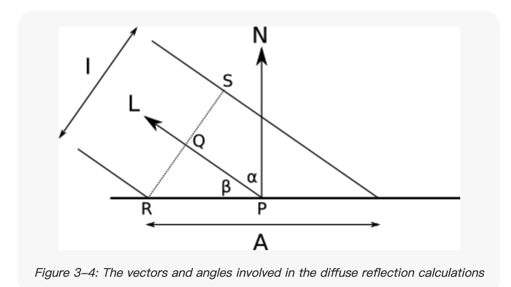

# Computer Graphics from scratch

> 新开一坑，开始看 [computer graphics from scratch](https://gabrielgambetta.com/computer-graphics-from-scratch/00-introduction.html) 这本书
>
> 开坑时间：2021.03.09 20:01:39
>
> 我读这本书的*目的*：和 games101 课程并行吧，读的时候已经学到 raytracing 了，感觉这本书相较于 games101（偏原理）之外会更加的使用（？只是感觉上光栅化算法会讲的比较多一点），再从别的角度继续续学习图形学～！

## Intro

作者说本书会比较简单通俗易懂的讲述图形学，但是图形学涵盖的概念太多了，可以装下一个图书馆

本书只包含两个内容：_Raytracing_ and _Rasterization_，光线追踪和光栅化

### 章节概览

- Chapter 1: Introductory Concepts

- _Part I: Raytracing_

- Chapter 2: Basic Raytracing
- Chapter 3: Light
- Chapter 4: Shadows and Reflections
- Chapter 5: Extending the Raytracer

- _Part II: Rasterization_

- Chapter 6: Lines
- Chapter 7: Filled Triangles
- Chapter 8: Shaded Triangles
- Chapter 9: Perspective Projection
- Chapter 10: Describing and Rendering a Scene
- Chapter 11: Clipping
- Chapter 12: Hidden Surface Removal
- Chapter 13: Shading
- Chapter 14: Textures
- Chapter 15: Extending the Rasterizer
- Appendix: Linear Algebra

那就开始吧

## CP1 Introductory Concepts

> `canvas.PutPixel(x, y, color)` 搞定这个函数的内容

### 坐标系（画布）

从 2D 的画布（canvas）说起，本书用的坐标系还是 human-readable 的，原点（origin）在屏幕的正中心，x 轴向右，y 轴向上，所以我们定义的画布坐标 C(x, y) 需要转换为真正计算机屏幕坐标（origin 在左上角，y 轴向下）：

- Screen~x~ = C~width~ / 2 + C~x~
- Screen~y~ = C~height~ / 2 - C~y~

### 颜色模型

_光 -> 眼 -> 感光细胞感受波长 -> 视神经信号 -> color_

_infrared 红外线_

_ultraviolet 紫外线_

#### Subtractive Color Model

减色模型？还是[了解一下](https://www.xrite.com/blog/additive-subtractive-color-models)吧

additive and subtractive systems of color reproduction.

两个系统都是由少数个（3 个）主色混合构成完整色域

- additive primaries：
  - 红绿蓝
  - Combining two pure additive primaries produces a **subtractive primary.**
    - 红 + 绿 -> 黄 yellow <=> blue
    - 绿 + 蓝 -> cyan <=> red
    - 红 + 蓝 -> 品红 magenta <=> green
  - 屏幕大多都是 additive color，从黑色开始增加红绿蓝混合出所有颜色
- subtractive primaries：
  - CMY and CMYK
  - 这些主色被用在打印机，**必须和光进行反射作用**（复印纸之类的白色底片）
  - **吸收**对应的主色（上面的 <=>），分解为两个 additive 主色，显示最终的混合色，所以叫 subtractive
    - （其实吸收色彩这一点很关键，正是吸收了某些个波长的颜色，才反射出其他的颜色，人眼对感知到的各个颜色求和，得到了最终的 color，就好比一个事物展示的某个特性，并且把其他属性给屏蔽了）
  - 第四个颜色 black -> K（B 已经是 Blue 了），neutralize images and graphics and adds density to the shadows.

书中提到的减色模型，主色居然是红黄蓝（其实不用太在意，书中也说明了应该是 CMY）

拿粉笔/蜡笔来举例，白色的纸上涂上“黄色” -> 光线 -> 白纸 -> 白光 -> yellow 吸收掉一部分颜色 -> 呈现黄色（_subtract_ a bunch of wavelengths from the original white light.）

**三个 subtractive 混合得到 black，减去了所有的颜色**

#### Additive Color Model

paper 和 screen 的区别：

- paper 不 emit 光线，而反射光
- screen emit 光线

With paper, we start with white light and _subtract_ the wavelengths we don’t want; with a screen, we start with no light and _add_ the wavelengths we want.

那就是我们熟悉的 _RGB color model_

**三个 additive 主色混合得到 white 所有颜色的加和**

最后，忘记上面的细节吧，完全可以把颜色当作是物体表面的纹理/材质特征，而不是什么波长。

### Color Depth and Representation

自然界颜色是连续的，设备上我们只能离散的去控制色彩，8 bit 每个主色，3 通道，共 2^24 个颜色

也有 _R5G6B5_ 的格式，green 多 1 bit 是因为人眼对绿光更敏感

### The scene

前面讲了画布（2D），现在来看场景（3D）

## CP2 Basic Raytracing

### 记一些概念/定义/术语（games101 也有）

- camera position：三维坐标系的原点，视角方向为 Z+，up 方向 Y+，右方向 X+
- viewport：视角平面，垂直于 Z，距离相机的距离为 d
- field of view（FOV）：当 VW = VH = d = 1 的时候，FOV 为 53 度（大概就是 arctan(0.5)），画面会比较好，不会扭曲

### 画布 to viewport

> 画布可以理解为真实的电脑显示屏窗口
>
> viewport 则是现实世界我们能看到的范围（可以想象是在窗内向外看）

当我们真实写程序的时候，用的都是 canvas 上的坐标，需要转换到真实的 viewport 上才能于物体计算

V~x~ = C~x~ _ (V~w~ / C~w~), V~y~ = C~y~ _ (V~h~ / C~h~)

当然 viewport 也是在 scene 中的，需要加上 V~z~ = d

### 光线追踪

#### 光线方程

- Eye ray：
  - 想象我们的光线是从 camera 方向出发，hit 到物体
  - P = O + t(V - O) = O + tD（注意都是向量哈）
  - t 可以是某个量（时间）

#### 球面方程

物体是球体，球心在 C，半径为 r

球上的点满足 |P - C|^2 = r^2 => (P - C) dot (P - C) = r^2

#### 球面与光线的交点

上面两个等式带进去，最后能得到关于 t 的**二次方程**，解开它，得到的 t 可以带回 P 的光线方程，得到交点

关于 t 的情况

| _t_ < 0     | Behind the camera                                    |     |
| ----------- | ---------------------------------------------------- | --- |
| 0 ≤ _t_ ≤ 1 | Between the camera and the projection plane/viewport |     |
| _t_ > 1     | In front of the projection plane/viewport            |     |

_games101 有详细的过程 这里不赘述了_

**书中写的伪代码非常值得一读，很有启发性**

ok，这一章其实也就简单的用**球体物体**作为光追的基本算法介绍，数学基础，挺好的，本质上就是和物体表面（之后会都是三角形）求交点，以及求他们的颜色、纹理、透明度等等（就复杂了）

## CP3 Light

> 光线模型，所谓模型我理解就是能用数学语言（或者其他定量/定性的方式）去抽象描述一个事物

会介绍三种光线模型：

- 点光源 point light
- 有向光 directional light
- 环境光 ambient light

本章会讲述光线如何与表面相互作用，包括漫反射和镜面反射

### 一些假设

- 用的都是白光，强度用 i 表示（当然模拟真实的光也不难，用三个通道表示就行了，这里只是简化）
- 不考虑环境的问题而导致光强在远处减弱

### 光源

#### 点光源

从一个 point 发出的光，这个点就是他的 _position_，每个方向上的光强一样，所以又叫 _omnidirectional lights_，所以定义一个点光源就可以：

- position（a vector）
- intensity（a vector also）

物体表面的某点 P 接受到的光源 Q 可以：

- P - Q（Q 是固定的，P 是可以变的，可以把这里的 Q 直接当成是 camera）

#### 有向光

为啥定义一个有向光？不是什么光都像灯泡一样全方向有强度，比如太阳，就需要定义他在非常远的距离之外了

定义：

- a fixed _direction_
- intensity

#### 环境光

上面两种光当然不能满足我们模拟现实的需求。根据 CP1 的光模型我们知道，表面材质会吸收光，并且反射出一部分光，同样会 hit 到其他物体，所以，需要把每个物体都对待成 light source。_全局光照 global illumination 就是这个玩意_

当然本文不会做的那么复杂，而是引入 ambient light，会在任何地方产生光

- 只有 intensity（所以在 games101 HW03 的作业中只是简单的乘了一个系数就求和了）

### 光与点交互

- matte 不光滑的物体（会漫反射）（主要 focus 这一类）
- shiny 光亮的物体

### 漫反射

比如看一面墙，不论在哪个角度去看，颜色都是一样的，意味着漫反射（diffuse reflection）不会随着视角位置变化而变化

但是实际上物体表面还是会收到光照角度的影响，如书中图 3-3，角度大的情况表面收到的光肯定就少了。

#### 数学模型

我们用数学来表达这种情况，书上的这个思路还是很妙的：（其实就是 lambert's cosine law）

1. 假定光线是有宽度的（width，实际就是光强 I），当光与物体表面的角度越大，光强的面积/宽度也越大，那么那宽度以内的点接受到的强度就少了（可以理解是光强被大面积给平分了 I / A）
2. 所以物体收到的光强就是 I / A，主要就是求 A



3. 看这个 3-4 图：RS 是宽度 I，那么 A 其实就是和 alpha 角度有 cos 关系了
4. I / A = cosa，cosa 很好求，用法向量 N 和光线方向 L 做一个标准化之后的点乘就行
5. 完事了，记得还要处理 cosa 小于零的时候，直接当成是 0，角度太大了

和 games101 course7 的漫反射模型基本没差别，那边只是加了一个光线与距离/半径平方成反比（这本书假设光都一样强度），还有个漫反射系数

巧了，今天的[影视飓风视频](https://www.bilibili.com/video/BV1tf4y147qn)也讲了光强的平方反比

#### 最终的漫反射方程

- I~p~ = I~A(ambient)~ + sum(I~i~ _ (N _ L~i~) / |N||L~i~|)（L~i~ 每一束光的方向向量）（注意 cos < 0 的不被 sum）

#### 球面的法向量

怎么求？其实很明显是从球心射出的，N = P - C，然后做一下 normalized

#### 渲染漫反射

看书上这段伪代码，便于理解非常好

```json
light {
    type = ambient
    intensity = 0.2
}
light {
    type = point
    intensity = 0.6
    position = (2, 1, 0)
}
light {
    type = directional
    intensity = 0.2
    direction = (1, 4, 4)
}
// 三种光强度之和为 1，说明最理想情况下所有光都 100% 作用了，也不会过曝

ComputeLighting(P, N) {
    i = 0.0
    for light in scene.Lights {
        if light.type == ambient {
           ❶i += light.intensity
        } else {
            if light.type == point {
               ❷L = light.position - P // 理解 games101 作业里的代码了 做了一部 方向的转换
            } else {
               ❸L = light.direction
            }

            n_dot_l = dot(N, L)
           ❹if n_dot_l > 0 {
               ❺i += light.intensity * n_dot_l/(length(N) * length(L)) // 这个 length 就是 2 范数。。向量的 length
            }
        }
    }
    return i
}
```

### 镜面反射

_specular_ 一词源于拉丁文 _speculum_ mirror 的意思

The “shininess” of the object is what determines how rapidly the reflected light decreases as you move away from R⃗. 解释一下这句话：入射角 = 出射角，越是 shiny 的物体表面，出射角的偏差就越小，所以一旦 move away 一点点，就没有反射光了。

#### 数学建模

还是可以参考 games101 的光照模型，还记得那个半程向量么，光线、出射角、视角（view vector）。

- 半程向量与表面法向量的夹角 == 出射角与视角的夹角，这个夹角越是接近 0，那么光强反射的就越多。
- cos 函数，能够满足，从 90 度 -> 0 的能量递增，而且简单
- **shininess** 来描述**镜面反射的能力（角度变化越快，光强变化也越快）**，可以用 power 来做，在 (cos(a)) ^ s，这个 s（specular） 越大，得到的曲线就越陡峭，反射能力就越集中（变化一点角度就没有反光了），越 shiny，其实也就是高光部分越小

挺好的，能够理解 games101 的那些公式了！

Since the model is not based on physical reality, the values of ss can only be determined by trial and error—essentially, tweaking the values until they look “right.” **For a physically based model, you can look into bi-directional reflectance functions (BDRFs).** 咳咳

书上用的是 view 和出射角的夹角，个人感觉还是半程向量会更加简单方便一点

最后在结合伪代码理解一下 raytracing 的基本原理：

```json
ComputeLighting(P, N, V, s) {
    i = 0.0
    for light in scene.Lights {
        if light.type == ambient {
            i += light.intensity
        } else {
            if light.type == point {
                L = light.position - P
            } else {
                L = light.direction
            }

            // Diffuse
            n_dot_l = dot(N, L)
            if n_dot_l > 0 {
                i += light.intensity * n_dot_l/(length(N) * length(L))
            }

            // Specular
         ❶ if s != -1 {
                R = 2 * N * dot(N, L) - L
                r_dot_v = dot(R, V)
             ❷ if r_dot_v > 0 {
                    i += light.intensity * pow(r_dot_v/(length(R) * length(V)), s)
                }
            }
        }
    }
    return i
}

TraceRay(O, D, t_min, t_max) {
    closest_t = inf
    closest_sphere = NULL
    for sphere in scene.Spheres {
        t1, t2 = IntersectRaySphere(O, D, sphere)
        if t1 in [t_min, t_max] and t1 < closest_t {
            closest_t = t1
            closest_sphere = sphere
        }
        if t2 in [t_min, t_max] and t2 < closest_t {
            closest_t = t2
            closest_sphere = sphere
        }
    }
    if closest_sphere == NULL {
        return BACKGROUND_COLOR
    }

    P = O + closest_t * D  // Compute intersection
    N = P - closest_sphere.center  // Compute sphere normal at intersection
    N = N / length(N)
		// D 就是 eye ray 方向，在镜面反射计算的时候是反向的（从物体表面出发）
 ❶ return closest_sphere.color * ComputeLighting(P, N, -D, closest_sphere.specular)
}
```

### 本章小结

将光线分成三种去建模：环境光、电光源、有向光

物体表面两种材质：matte、shiny

光线如何与表面进行交互，得到光的强度，最后和 color 相乘

## CP4 Shadows and Reflections

> 渲染更加真实，前面的章节用数学建模了光线和物体表面的交互，这一章来处理光线的另外两种交互：物体的阴影投射和物体之间的反射。

### Shadows

阴影就是光在照射到物体的路途中被其他物体遮挡了。于是我们从物体表面往光源（有向光 L）去看（cast）

我们可以重新利用之前写过的 TraceRay 这个方法，复用一下：

- 不从 camer（O）开始，而是从物体表面的点 P
- 光线方向变为 L
- 不考虑在物体背后的光，所以 t 的范围最小是 0
- 有向光处在无限远，t~max~ = +inf

这样我们能够从某点 P 出发，算出会不会有物体挡住光，如果有，得到的两个 t>0，但我们认为距离 P 很远的物体，其实挡不住很多光，于是限定 t~max~ = 1 来停止光线的传播（换句话说也就是从 P 出发，P + tL，t>1 距离的物体不会对 P 产生 shadow）

还有一个边界情况，如果我们的 t~min~ = 0，P 本身也就会对自己产生 shadow 了。。。所以此时 t in [ksi, 1]，ksi 取一个非常接近 0 的数

看一下伪代码：

1. 抽离出计算*光最近接触物体*这个函数
2. 在计算光线追踪的时候，多计算一步从 P 出发，光线方向的*最近接触物体*
3. 如果有说明被遮挡了，就不计算光线了，直接下一轮循环

```json
// 1
ClosestIntersection(O, D, t_min, t_max) {
    closest_t = inf
    closest_sphere = NULL
    for sphere in scene.Spheres {
        t1, t2 = IntersectRaySphere(O, D, sphere)
        if t1 in [t_min, t_max] and t1 < closest_t {
            closest_t = t1
            closest_sphere = sphere
        }
        if t2 in [t_min, t_max] and t2 < closest_t {
            closest_t = t2
            closest_sphere = sphere
        }
    }
    return closest_sphere, closest_t
}
// 2
TraceRay(O, D, t_min, t_max) {
    closest_sphere, closest_t = ClosestIntersection(O, D, t_min, t_max)
    if closest_sphere == NULL {
        return BACKGROUND_COLOR
    }
    P = O + closest_t * D
    N = P - closest_sphere.center
    N = N / length(N)
    return closest_sphere.color * ComputeLighting(P, N, -D, closest_sphere.specular)
}
ComputeLighting(P, N, V, s) {
    i = 0.0
    for light in scene.Lights {
        if light.type == ambient {
            i += light.intensity
        } else {
            if light.type == point {
                L = light.position - P
                t_max = 1
            } else {
                L = light.direction
                t_max = inf
            }

            // 3 Shadow check 这里给的 ksi 0.001
         ❶ shadow_sphere, shadow_t = ClosestIntersection(P, L, 0.001, t_max)
            if shadow_sphere != NULL {
                continue // 直接跳过
            }

            // Diffuse
            n_dot_l = dot(N, L)
            if n_dot_l > 0 {
                i += light.intensity * n_dot_l / (length(N) * length(L))
            }

            // Specular
            if s != -1 {
                R = 2 * N * dot(N, L) - L
                r_dot_v = dot(R, V)
                if r_dot_v > 0 {
                    i += light.intensity * pow(r_dot_v / (length(R) * length(V)), s)
                }
            }
        }
    }
    return i
}
```

### Reflections

物体表面是 glossy 或者 specular 的也会反射光，从物体表面的某个方向出发，找到这个角度来的光线和颜色，traceray！好了，就是递归的光追了。

- 注意递归的终止条件（回顾）：
  - 光线 hit 到不反光物质
  - 光线没有 hit 物体
- 同样可以控制递归的次数（也就是光线弹射的次数）
- Russian Roulette！（from games101，这本书暂未提及）

书上给物体表面设置了要给 reflectiveness in [0, 1]，表示反射光的概率（可以理解是材质属性）

看伪代码吧

```json
TraceRay(O, D, t_min, t_max, recursion_depth) {
    closest_sphere, closest_t = ClosestIntersection(O, D, t_min, t_max)

    if closest_sphere == NULL {
        return BACKGROUND_COLOR
    }

    // Compute local color
    P = O + closest_t * D
    N = P - closest_sphere.center
    N = N / length(N)
    local_color = closest_sphere.color * ComputeLighting(P, N, -D, closest_sphere.specular)

    // If we hit the recursion limit or the object is not reflective, we're done
 ❶ r = closest_sphere.reflective
    if recursion_depth <= 0 or r <= 0 {
        return local_color
    }

    // Compute the reflected color
    R = ReflectRay(-D, N)
 ❷ reflected_color = TraceRay(P, R, 0.001, inf, recursion_depth - 1) // 递归 depth--

   ❸return local_color * (1 - r) + reflected_color * r
}
```

### 本章小结

场景 part 的光线交互，更加真实了，下一章继续扩展光追（从球形物体到复杂物体）

- 阴影 shadow：光线被遮挡，就没有强度了
- 反射 reflection：物体之间的反射光，递归光追

## CP5 Extending the Raytracer

> 这一章做一个总结，包含之前没有谈到的话题：placing the camera anywhere in the scene, performance optimizations, primitives other than spheres, modeling objects using constructive solid geometry, supporting transparent surfaces, and supersampling.

### Arbitrary Camera Positioning

之前我们的相机都是固定在 Z+ 方向的原点 O，往 Z- 方向看去，上方向是 Y+。

现在我们需要在任何一个点放置 camera，视角和投影平面（窗口）相对位置都是不变的，比如我们的视角变化矩阵（旋转、平移...）R，作用在视线方向 D 即可

### Performance optimization

> 性能优化的一些方法，光追太慢了，渲染的快才强

#### Parallelization

#### Caching immutable variables

#### Shadow optimizations

当一个点的光线被物体遮挡而产生阴影的时候，可能附近的点也会是阴影 => _shadow coherence_

- 可以检查这个点最近的点是否在阴影中（被物体 a 遮挡），如果是，直接计算这个点与 a 是否有交集
- 如果有，就是阴影
- 如果没有，再去计算与其他物体的交集

#### Spatial structure

每个物体，每个表面点去计算太慢了，分块、分层级去遍历

分割空间结构，找 bounding volume/sphere

- _bounding volume hierarchy_（书里只是提了一嘴，详细看 games101）

#### subsampling

降采样？想到了 DLSS（降采样渲染之后用 DL 做超采样复原）

书上的意思是如果知道了两个点的光命中同一个物体，那么中间的点（水平、垂直方向）也会命中，直接跳过求交集，直接算颜色就行。可能会失真，miss 掉很小的物体

### Supporting Other Primitives

其他的几何元（primitive），比如三角面，计算光线和三角平面的交点

1. 计算和三角形所在平面的交点（平面的表示方式：法向量和一个点）
2. 判断这个交点是否在这个三角形内部（三角形重心坐标 or 求叉积）

### Constructive Solid Geometry

> 可以理解是组合的集合体，利用布尔运算求交、并、差

在光追中，两个物体交集的部分，可以通过两个物体光线线段（时间 tmax tmin）的 set（集合）操作来做

### Transparency

#### Refraction

折射问题，比如当光从空气进入水中（密度不同）

物体表面材质的折射率？_refraction index_

Snell’s Law：

- sin(α1) / sin(α2) = n2 / n1
- a1，a2 分别是穿过表面前后的**光线和法线的夹角**
- n1，n2 分别是表面外层和内层的 refraction index

### Supersampling

像素点上一条光线 -> 超采样 -> 多条光线

### 本章小结

让画面更接近真实物理世界的一些方法。

## CP6 Lines

> 开始光栅化
>
> 如何画线、画面，balabalabala
>
> part1 部分讲了光追，书上的算法都是比较简单易懂的，问题就来了：计算代价太大，做不到实时光追的效果
>
> 光追的思想：从相机出发看 canvas，解决每个像素上“_Which object of the scene is visible here?_”
>
> 光栅化的思想：“_In which parts of the canvas will this object be visible?_” 翻译成人话，要解决每一个物体在画布上的哪些地方可见（从物体的角度出发
