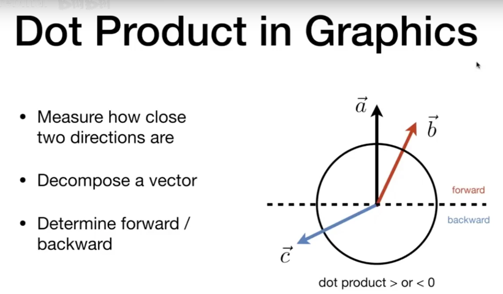
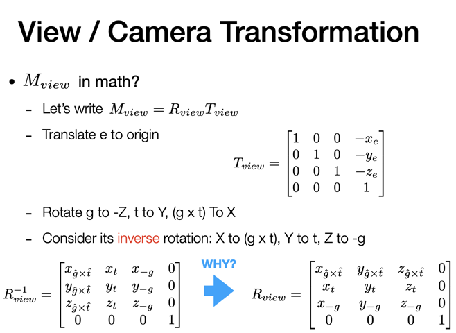
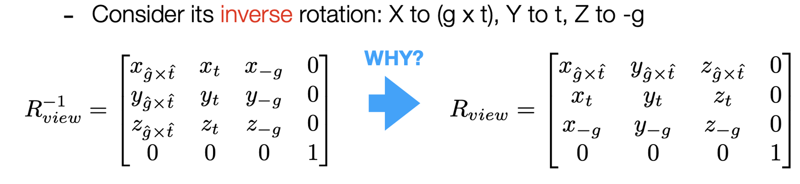
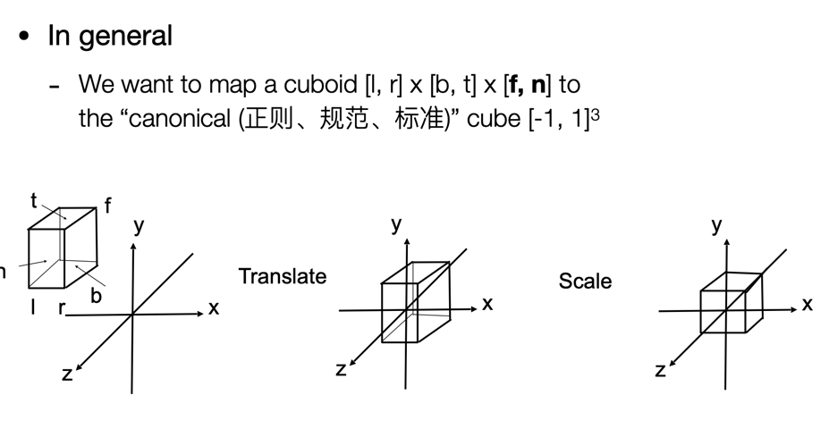
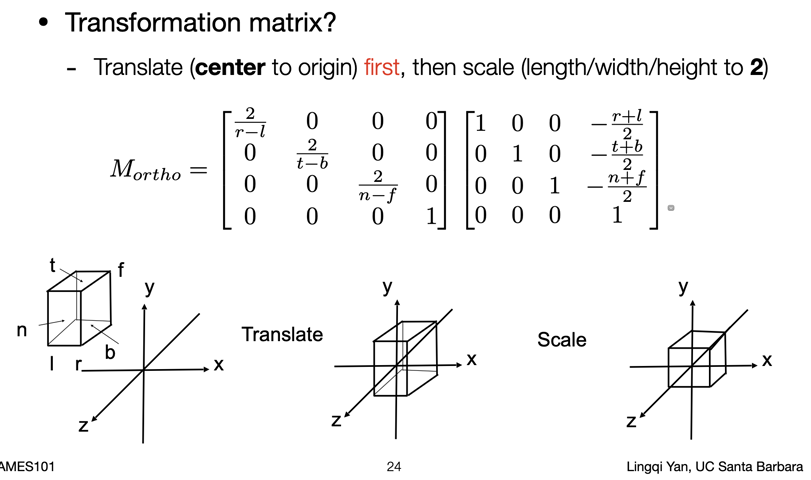
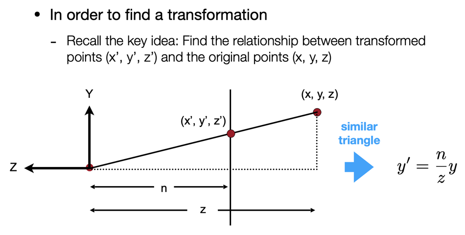
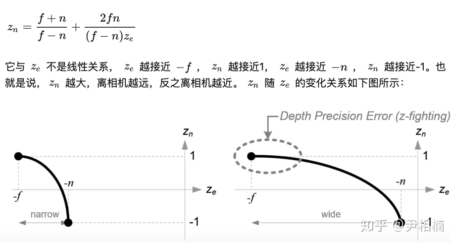

# 现代计算机图形学入门

> 来自 games101 课程（[b 站视频](https://www.bilibili.com/video/BV1X7411F744)）
>
> 课程主页：https://sites.cs.ucsb.edu/~lingqi/teaching/games101.html

## 简介

### 什么是图形学

合成、操作、视觉信息

### 图形学的应用

游戏：画面亮不亮 => 全局光照，卡通的画风如何体现？

special effects & render

电影：阿凡达

设计：CAD，CG，照片，模拟，渲染

可视化

VR、AR、XR...

模拟

GUI

字体 typography

### 为什么学

- 创造真实世界的物体

- 理解真实世界的方法

### 和计算机视觉的差别


model 和 image

## Course1 Intro

### general

光栅化：opengl（API）

曲线、切面

光线追踪（ray tracing）

动画 & 模拟

### Rasterization

光栅化，将三维形体显示在屏幕上

实时（30 fps） v.s. 离线

### Curves and meshes

作业:

- 小作业
- 大作业
- 语言 ：CPP

## Course2 Review of linear algebra

图形学的基础学科：

- 数学
  - 线性代数（最重要咯）
  - 微积分
  - 统计学
- 物理：
  - 光学
  - 力学
- 信号处理
- 数值分析
- 美学
- ...

### 向量

方向

长度（范数）=> 提供单位向量

#### 计算

- 点乘：

  - 求方向间的夹角！

  - 求某个方向上的投影，perpendicular，分解向量（垂直、平行）

  - 计算向量的接近程度

  - 决定向量处于某个向量的方向（正、负）

    

- 叉乘：

  - 右手螺旋法则，新的向量垂直与两个向量组成的平面

  - 建立三维空间的直角坐标系

    

  - **可以表示为矩阵形式**

  - 判定左/右，内/外

    

    不知道这个 p 点在什么位置的时候，计算与每个边的叉乘

    $AB \times AP, BC \times BP, CA \times CP $

#### 直角坐标系


分解任意的 p 向量

### 矩阵

忘了挺多了，反正在图形学里最多就 3 维吧

向量的点乘和叉乘都可以写成矩阵的形式（上面）

## Course3 Transform

### general

变换学习能做什么

- **Modeling**，模型变换：rotate、translation、scaling
- **Viewing**，视角变换：project

2D 变换

homogenous coordinates

### 变换矩阵

#### Scale

完了要写矩阵了，latex 语法都忘记了。。

是一个对角矩阵，对角线元素是缩放因子，自行脑补

#### Reflection matrix

反射矩阵

e.g.沿着 y 轴翻折

```python
[-1, 0],
[0 , 1]
```

#### Shear matrix

切变矩阵，点只有在水平方向发生了位移


水平方向上移动了多少呢？

看图，y 为 1 的时候移动了 a，那么就是`a * y + x`

```python
[1, a],[x]
[0, 1] [y]
```

#### Rotate

默认按照原点，逆时针旋转

```python
[cosa, -sina],
[sina, cosa]
```

反正就是找变换前后的坐标对应关系即可，找特殊点`(0, 1),(1, 0)`即可（因为必然是符合条件的）

旋转`-a`角度的时候，带入矩阵，得到的是$R^{T}$

同样在定义上 $R_{-\theta} = R_{\theta}^{-1} = R_{\theta}^{T}$ 是一个正交矩阵

**记住这个结论**

### 齐次坐标 Homogenous coordinates

#### transition

平移


```haskell
x' = x + tx
y' = y + ty
```

不能写成单纯的矩阵乘法


不再是线性变换了！？有没有一个统一的方法表示各种变换呢？

引入齐次坐标（是一个 tradeoff 吗？）

_不就是升维嘛_


升维之后增加的是 1 还是 0 呢？

- 向量：增加 0，**保持他的平移不变形**，同时保证其加点/向量的操作是正确的：
  - 加点：点在向量方向上移动，得到点（第三维度还是 1）
  - 向量：第三维不变，还是 0
- 点：增加 1


点 + 点 = 中点，（w 为 2）。多个点之和，应该是他们围城平面的中心（？）

#### affine transform

仿射变换


老生常谈了，就是线性变换 + 一个常量偏差（注意是 2D 的）

用其次坐标写成矩阵相乘，最后一行`0 0 1`


可以结合平移起来一起用，统一起来了！tradeoff 就是点多了一个维度，矩阵多了两个平移的 offset（只需要多存这两个）

### Inverse transform

逆变换，乘以对应变换的逆矩阵即可$A^{-1}Ax = x$

### Composing transform

就是多个矩阵，乘起来呗？变换的**顺序**很重要！因为：$BA \neq AB$！


### Decomposing Complex Transform

之前提过，旋转只能沿着原点进行，那么我们想让他沿着任意的点进行旋转呢？

简单：1.将目标点平移到原点（-c 方向） -> 2.旋转 -> 3.平移回去（逆变换，c 方向）


### 3D transform

三维哦，类比二维，也可以引入齐次坐标


三维空间中的点之和，为这个几何体的中心（？）

#### 仿射变换


a - i 的这个`3 * 3`的矩阵就是线性变换，还是**先线性变换再平移**

## Course4 Transform

### general

- 3D 变换

- viewing transformation *观测*变换
  - 视图变换（View/Camera transformation）
  - 投影变换（Projection transformation）
    - 正交变换（Orthogonal transformation）
    - 透视变换（Perspective transformation）

### 3D transform

上节课提到了，在二维上的扩展

#### 缩放 & 平移


#### 旋转

先从简单的绕着某一个轴旋转看（旋转方向为逆时针，逆着旋转轴的正方向看），也就是一个方向上的坐标不变，在另外两个方向上应用旋转矩阵，从矩阵看就很清晰了

**_注意：_**绕 y 轴的旋转，由于 $\vec{y} = \vec{z} \times \vec{x}$，所以旋转矩阵的方向是反的。真实旋转方向是逆时针（从负 y 方向看）

复杂的旋转怎么看？分解成绕轴的旋转


_欧拉角_，飞机的三个旋转可以分别称为 roll, pitch, yaw

任意的旋转都能写成矩阵，同时可分解成三个轴方向的旋转


罗德里格斯旋转公式：绕着任意一个轴（向量/方向，默认过原点的方向）旋转`a`角度

绕着任意一个点旋转呢？（不过原点）肯定先 translate 过去，然后旋转完 translate 回去（老样子）

**注意看 $\mathrm{N}$ 这个矩阵，像不像叉乘的那个矩阵？**

### view/camera transform

我们为什么要学视图变换？将三维场景变换到二维，能展示在屏幕上

定义相机/视角的位置、方向（看的方向、向上方向：相机的旋转方向）


标准位置：默认相机放在原点，向上方向为`y`轴方向，往`-z`方向看


#### 观测矩阵

当我们的相机在：

- 某一个点 $\vec{e}$ 的位置
- 向上方向为 $\hat{t}$
- 观察方向为 $\hat{g}$

需要得到他的数学观测矩阵 $\mathrm{M_{view}}$，怎么做？变换到标准位置




先将`e`点平移到原点，再旋转：

- g -> -Z 方向，t -> Y，将 $\vec{g} \times \vec{t}$ 的方向旋转到 X 方向

明显是将 X Y Z 三个轴旋转到那三个方向会更加简单，所以反过来写这个变换



这个 $R_{view}^{-1}$ 可以作用在三个轴试一试 $e.g. (1, 0, 0, (0))^{T}$ 可以得到 $\vec{g} \times \vec{t}$

_所以得到的旋转逆矩阵就是这样了，那么如何得到正变换呢？_

之前我们得到的结论 $R_{-\theta} = R_{\theta}^{-1} = R_{\theta}^{T}$ 就很有用了！

可以得到 $R_{view}$

#### 结论


所以这个相机变换到底是什么呢？当视角发生变换的时候，我们能看见的物体也发生了变换，当视角经过**位置、观测方向、向上方向**的变换，将这个变换矩阵应用到图像之后，也就完成了物体的视角变换！

相机永不动，物体在动；相机/视角移动，物体也要动

#### Q & A

向上方向？

- 可以想象就是人的头顶方向，我们歪着脑袋的时候看世界就是偏的，此时的向上方向也就偏离了 Y 轴。也可以理解为是方向盘的正中。这个方向规定了相机是如何旋转的。

### Projection transformation

#### 两种投影方式

- orthogonal projection（正交）

  - 不会给人一种近大远小的现象
  - 工程制图！

- perspective projection（透视）
  - 平行线不再平行，延长两条平行线会交汇在一个点
  - 更像人的视角
  - 一叶障目


透视投影更像是将远处的物体都透视到一个近的、小的面上（相机在一个点上）

正交投影则是相机在无限远的地方

#### orthogonal projection

比较简单


简单来看，扔掉 Z 坐标即可，缩放和移动到`[-1, 1]3`

这个平移和缩放的做法，正规一点来看



定义一个 cuboid，中心移动到原点，在缩放

`[left, right] [b, t] [far, near]` 离我们（相加）越近，在 Z 轴越大

用数学的方式去写矩阵，先平移，再缩放



还是比较直观的

但是在变换缩放到标准立方体之后，物体确实被拉伸了，不过之后还会做一次 viewport 变换还会拉伸。

#### perspective projection

近大远小

欧氏几何


回忆一下齐次坐标的定义，升维之后乘一个 k 之后还是表达那个点，先记住这个 $(xz, yz, z^{2}, z \neq 0)$

_如何将一个物体透视投影呢_


frustum: 截头锥体

将远处的大平面**挤压**回 cuboid，再正交投影一下

- 近平面永远不变
- 远平面 Z 不变、中心点不变



看一下侧视图，开始对 $(x, y, z)$ 进行挤压，注意 Z 不变，寻找相似三角形关系来挤压 y

同样物体的每一个点都可以通过相似三角形来挤压！

通过俯视图可以看出 $x^{'} = \frac {n} {z} x$

利用齐次坐标，都乘一个 z


所以，这个透视投影的矩阵，作用在 $(x, y, z, 1)^{T}$ 之后得到的向量的三个值我们都知道了


所以矩阵怎么来？可以确定 1 2 4 行了！

至于 z 怎么变？

- 近平面的 z 不变

  

- 远平面的 z 不变（取一个中心点）

  

  这个 $(0, 0, f)$ 就是远平面上的中点

解这个方程组，很简单的


最后在做正交投影，结合起来就是 $M_{presp}$

透视投影还可以看[知乎](https://zhuanlan.zhihu.com/p/152280876)这篇。

> 透视投影矩阵可以把视锥中，在 near clipping plane 到 far clipping plane 之间的任何一个点 (x, y, z)，映射到 NDC(normalized device coordinates)。

挤压 -> 正交投影

同时注意 z 的问题：在物体近、远平面之间的点，z 在挤压的过程中是如何变化的呢？变远还是变近？线性？





z 方向的映射关系图：


最后说一下对 MVP 的理解

- M：描述物体是如何出现在世界中的，translate、rotate、scale
- V：描述 camera 的位置，好比人走到了和物体的一个相对的位置上
- P：将 camera 看到的物体投射在视平面上（2 D），好比人去看这个物体

都是对 point 坐标进行的线性变换，注意要按照这个顺序自然的对 point 作用，P _ V _ M \* point
