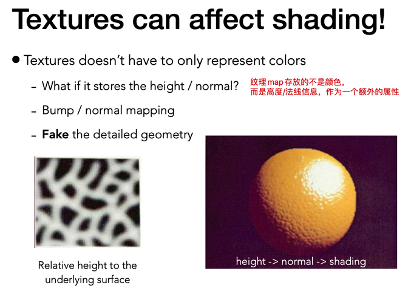
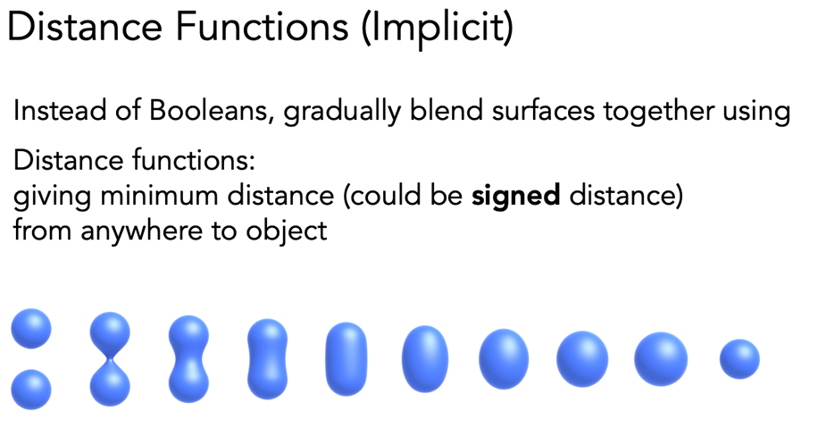
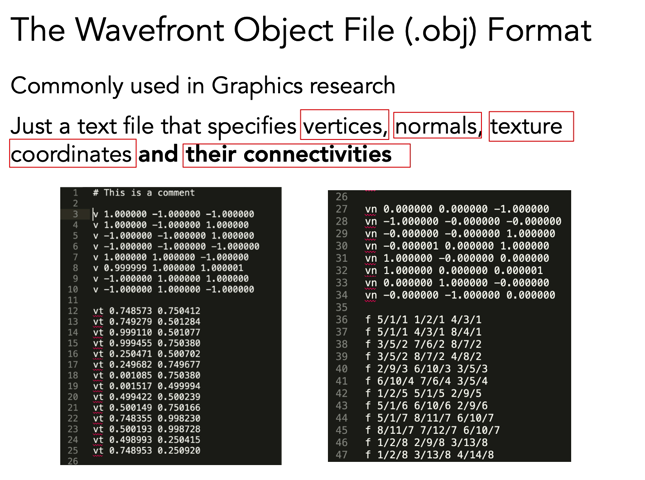
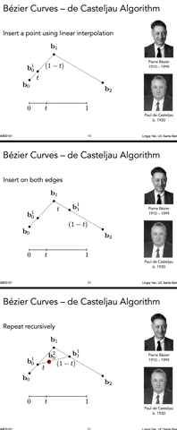
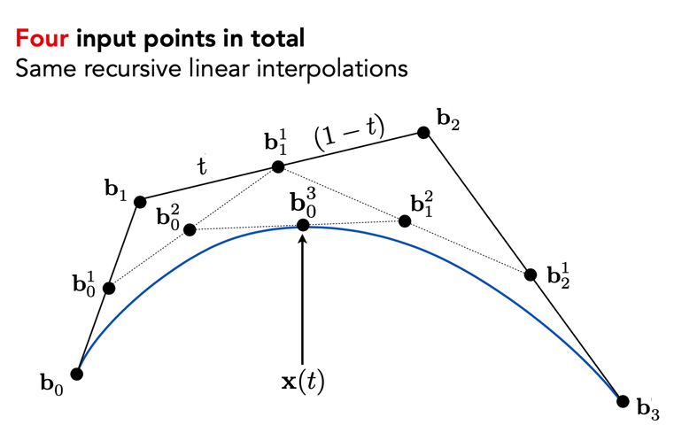
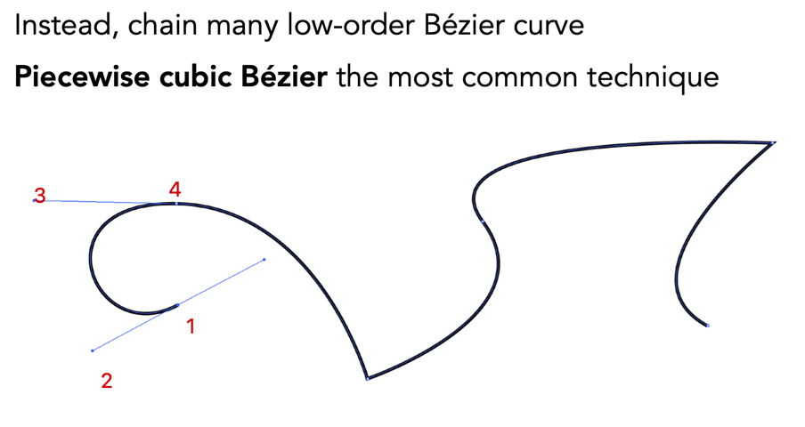
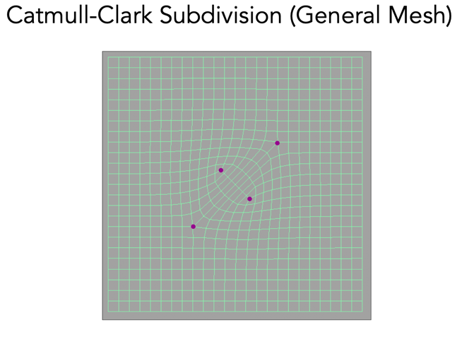
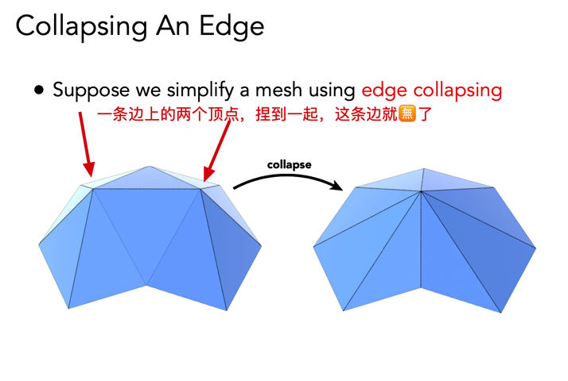
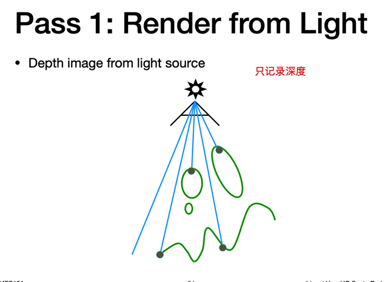
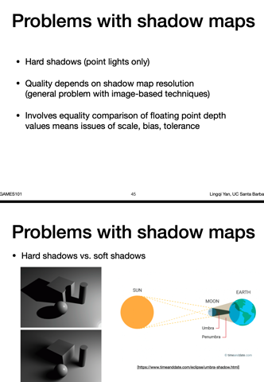

## Course10 Geometry 1 intro

### general

课程过半

- 纹理的应用（收尾）
- Geometry

### application of shading

什么是纹理：memory + range query(mipmap filtering)，其实就是一块数据（图片）可以做任何的查询（来得到最终的纹理效果）

这个数据其实就是一个 **map**

#### enviroment map & lighting

- 表示环境光，无限远处（enviroment map）

#### spherical map

- 用球面记录环境光（spherical map），球面展开，会有扭曲

#### Cube map

解决上面球体贴图的一些问题

用一个立方体来映射球面上的环境光，展开像 🎲 一样

#### 法线贴图（凹凸贴图）

凹凸贴图 bump mapping，定义任何点的任何属性，不仅是颜色！比如高度（相对高度）

通过一个复杂的纹理来改变几何图形的表面，但不改变几何体本身（坐标不变）

改变了几何体表面三角形内部点的高度（相对高度），从而改变这个点的法线信息（或者直接给出法线），使得光线和法线夹角改变，最终计算出的 shading 颜色也不一样了（有明亮暗之差），这样就显得有凹凸感。实际上几何体并没有改变。

其实就是一种扰动 perturbation

**在不增加三角形的情况下增加物体细节**，节省计算！

如何计算被 perturb 之后的法线方向（向量）呢

先从 flatland（一维函数）的情况看

- 初始平面的法线为 $(0, 1)$
- 用 step 为 1 作差分得到 dp 就是切线
- 求他的垂直，旋转 90 度即可，最后做一个归一化

在 3D 情况

_`c*`代表纹理影响系数_

- 在局部坐标系，认为局部的法线为 $(0, 0, 1)$！最后还会变换到世界坐标，切线空间 -> 世界空间

法线贴图的问题：

- 边缘问题处理的不好
- 自己凸起的部分无法投影在自己身上（毕竟没有改变几何体本身）

#### 位移贴图

Displacement mapping

真的会做顶点的位移，而不是改变法线

需要三角形粒度比较细，要跟得上纹理的变化

DirectX：当然也可以先不管粒度，在做位移贴图的时候检查是否需要将大的三角形拆分成小的三角形然后再去做位移贴图。动态的曲面细分 dynamic tessellation

#### 三维噪声

在三维空间中定义一个噪声函数，产生三维纹理

Perlin noise

#### 预计算

环境光遮蔽，相当于是一个纹理 mask，计算好细节，写进纹理（0/1），最后乘以 shading 结果

#### 3D 纹理 体积渲染

---

### Geometry

大概要开始画曲线/面啦

画衣服啊，曲面啊，水花啊，城市啊，皮毛啊......

fiber -> polymide -> thread

几何分类 implicit & explicit，不同方式表示几何体

#### implicit representation

把点做归类，用点的坐标关系式来表示这个几何体，比如球体

更通用的时候定义一个 $f(x, y, z) = 0$

**缺点**

下面是一个 torus

采样比较难，我们可能知道这个函数的空间图像长啥样，但是计算机并不知道，要一个个去尝试。。

**好处**

判断一个点是否在一个面/几何体上，比较方便

#### explicit representation

- 直接将点表示出来
- 参数映射的方式，从二维空间映射

比如

采样方便：只需要给定 $u, v$ 即可获得在三维空间的点

判断内外：困难，无法正向计算推断是否在几何体内部

_所以选择不同的表示方法，适合不同的计算场景_

#### 其他不同的表示方法

- Algebraic surface

  
  代数表示方法非常的不直观

- Constructive Solid Geometry

  

  通过简单的布尔运算形成复杂的几何体

- Distance Functions

  

  定义一个距离函数，空间中的任意一个点到几何体的最小距离（正负 -> 内外）

  空间中所有点到这个几何体表面的最小距离 => 这个几何体在空间中的补集 => 表面算是一个零界面 => 距离为 0 的就是表面上的点，负数的是表面内部的点（signed 有向的）

  将两个几何体的各自的距离函数进行 blending 融合，然后再恢复这样的变换，

  

  将下面的距离函数进行 blend，就可以得到一个边界在中间的状态，和直接对图像进行 blend 的结果相比会好很多！

  **blend** 到底是啥方法？应该就是做了个平均！

  为什么有这个距离函数，做一些物体融合（比如水滴）的效果

  课件中还提到了：[raymarching sdf](https://iquilezles.org/www/articles/raymarchingdf/raymarchingdf.htm) 之后可以去看看

- Level set method

  

  每一个距离连一条线 => 等高线

- Fractals

  分形，自相似，自己的某个部分和自己一样（递归），例如雪花

  

### 总结一下

几何体的表示方法，隐式表示的优劣，显式的留到下节课说吧

## Course11 Geometry Curves and Surfaces

### general

- Explicit geometry 说完
- Curves
  - Bezier curves
  - De Casteljau algorithm
  - B-splines, etc.
- Surfaces
  - Bezier surfaces
  - Triangles & quads

### Explicit geometry

#### Point Cloud

点云，不用表面去表示，用所有的点去表示，密度够大就行 list of points

三维扫描一般都得到的是点云。

如何将得到的点云转化成三角形面（多边形面/网格），是目前研究很多的

#### Polyon Mesh

多边形面

如何描述一个物体

- v: vertex，这里有 8 个顶点
- vn: normals，一个立方体有 6 个朝向，这里有八个 vn，可能是机器生成出来有冗余
- vt: 纹理坐标，这里有 12 个
- f: face，顶点的连接关系，数字是 index of v/vt/vn

### Curves

#### 贝塞尔曲线

ohhhh Bezier Curves

用一系列的 handle 去控制这条曲线

起始点和终点：P0 和 P3

_如何画一条贝塞尔曲线 —— De Casteljau algorithm_

三个控制点生成的叫做：quadratic Bazier

- 假定从起点到终点是一条路径，画这条线就是走完 0-1 这段时间，那么只要找出每一个 t 时刻，曲线所在的空间位置即可

- 对于 quadratic Bazier，将三个点的线段上都找到 t 时刻的位置（按比例）

  

  于是就找到了曲线上的一个点了，将 t 从 0 走到 1 就画完了

- 有点递归的感觉，每一段找到 t 分点，然后一直找到只有一个线段

_四个点的 Cubic Bézier Curve – de Casteljau_

reduce 到 quadratic Bezier

**_代数表达式如何得到，四个点 + 时间 t_**

我们定义时间 t 是从 b0 开始的所以

$b_{0}^{1} = (1- t) b_{0} + tb_{0}$

带入多次，展开

注意看系数其实就是 $(1 - t + t)^{2}$ 的展开，同样可以推广到 3、4...n 个点。

n 个控制点的多项式

recall：二项分布 $C_{n}^{i}t^{i} (1 - t)^{n - i}$

这个代数表达式有什么好处：可以不局限于二维平面的点，可以扩展到三维空间，替换向量就可以了

也是对称的，因为组合数 $C_{n}^{i} == C_{n}^{n-i}$

**性质**

- $b'(0), b'(1)$ 是起点/终点的切线方向
- 凸包性质：外围点就是这几个控制点

#### Piecewise Bézier Curves

piece-wise 分段的贝塞尔曲线

*为什么要分段呢？*高阶的（控制点多的）贝塞尔曲线太不容易控制了，动一个点，整个曲线都会变化

逐段定义贝塞尔曲线（一般用 4 个 handler）

有一个 [demo](http://math.hws.edu/eck/cs424/notes2013/canvas/bezier.html) 可以体验一下

<iframe src="http://math.hws.edu/eck/cs424/notes2013/canvas/bezier.html" height="400"/>

**连续性？**

拐点的导数，方向，大小都要一样才算是比较光滑

- c0 连续：一段的终点是另一段起点 $a_{n} = b_{0}$

- c1 连续：c0 基础上，切线一致 $a_{n} = b_{0} = \frac {1} {2} (a_{n-1} + b_{0})$

  

  一阶导数的连续

- c2 连续等等还有标准来满足工业界

#### B-splines

spline 样条？

- a continuous curve constructed so as to pass through a given set of points and have a certain number of continuous derivatives.

- In short, a curve under control

B-splines

- Short for basis splines
- Require more information than Bezier curves
- Satisfy all important properties that Bézier curves have (i.e. **superset**)
- 极其复杂。。。。极函数非常复杂

further learning：传送门 - [清华大学](https://www.bilibili.com/video/BV13441127CH?p=1)

### Surfaces

开个头

#### Bazier surfaces

可以想象是在三维空间中，两个方向上的贝塞尔曲线

有 4 条贝塞尔曲线，16 个控制点，四个线上的四个点作为新的控制点生成新的贝塞尔曲线，妙啊。

两个时间 t，两个方向

### mesh operating

- 细分：拆分成多个三角形，让细节更丰富
- 简化:
- 正规化：把三角形的面积、形状统一化

## Course12 Geometry 3

### general

- 接上节课的 mesh operating 展开讲

### mesh operating

#### mesh subdivision

上采样，感觉是提高分辨率

#### mesh simplification

简化

可能会丢失图形细节

#### mesh regularization

mesh 都归一化为正三角形，来提高图形质量

### subdivision

细分，让表面的三角形更多，目的是为了改变原有的形状（比如增加纹理）

#### loop subdivision

**loop 只是发明这个算法的人的名字，不是 循环**

- 分出新的三角形
- 调整新三角形的位置（区分新、旧三角形面）来形成图形

更新新顶点

更新旧顶点

- 相信一部分自己的原始位置
- 由周围连接的老顶点的位置影响

#### Catmull-Clark Subdivision (General Mesh)

图灵奖得主之一 Catmull

loop 的细分一定要是三角形面，这个 CC 算法可以对于**一般的网格**

先来一些定义：

- 非四面 non-quad face：非**四边形**的面
- 奇异点 Extraordinary vertex：度不为四的点

如何细分：肯定要增加点了

- 在每个面上加个顶点
- 在每个边上取中点
- 连接所有的新顶点

**_这个图漏画了个中点啊啊啊，三角形的中点。。_**

分析一下上面的两个概念所带来的性质：

- 引入了更多的奇异点（紫色）
- 奇异点的度
- 非四边形面都消失了。。

可以发现，之前的非四边形面都被一个新的奇异点给替代了（增加奇异点），做第一次的之后就不会再有非四边形面了，增加了*非四边形面数*个奇异点。

多次之后

当然还要调整点的位置（目前公式会用就可以）

不同情况下选择不同复杂程度的模型（多少个面）来表示物体（比如越远的时候不需要那么多面，切换的时候怎么做到平滑呢）

下面就看看网格简化怎么做

### simplification

#### edge collapse

具体做法不是那么容易

- 哪些边可以 collapse

二次误差度量 quadric error metrics

用一维简化的来看看

- 某些边需要被 collpase，顶点不要了，用另一个顶点来替代
- 这个新的顶点在何处？平均五个点试试，好像效果不太好
- 用上面三个点平均试试？效果也不太好
- **用凸优化的想法，希望这个新的点到原本的几个面的距离的平方和最小**。所以这样 collpase 某一条边之后，可以对原本的每个面影响都最小

问题来了，我不知道先 collpase 哪个边

- 先做最小二次误差的边，依次做（数据结构：优先队列/堆）
- collpase 边之后会对其他边有影响，需要更新其他受影响的边
- 其实是一个贪心算法

### before 光线追踪

在光栅化中的阴影问题咋搞？着色的过程只考虑单个点（光源光线，纹理，角度）而不考虑物体本身甚至是其他物体对其的遮挡

#### shadow mapping

必然会有走样的问题产生

**关键点：这个点即然不在阴影中，必然是能被摄像机视角和光线所“看到”的**

阴影边界：被电光源看到与否（非 0 即 1），这个叫**硬阴影**，当然也有软阴影

从光源的视角做一遍 shading

记录 z-buffer 即可，接着从 camera 视角去看

从 eye 看到的点，投影回光源所看到的图，得到的距离并不一致，就是不可见点

整个操作进行了两次投影（光源 + camera），通过深度来判断是否可见

存在的问题：

- 两趟 mapping 意味着开销也挺大的
- mapping 出来的分辨率（感觉主要是光源的）也会随着场景需要的不同导致走样问题
- 数值计算，精度问题也存在

这个算法还是非常的主流！

光栅化的思想来解决全局的问题（光照，阴影）

**软阴影**，有渐变，不是非 0 即 1（umbra 本影 penumbra 半影），需要光源有一定的大小（右图的太阳）

下一个主题：光线追踪！
