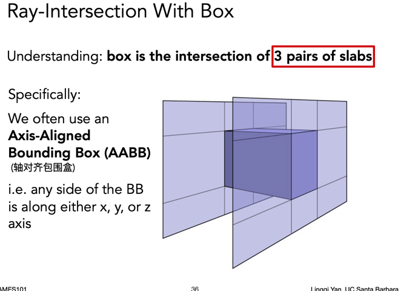
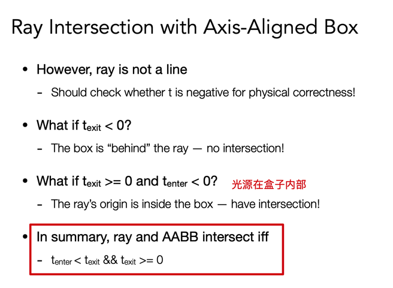
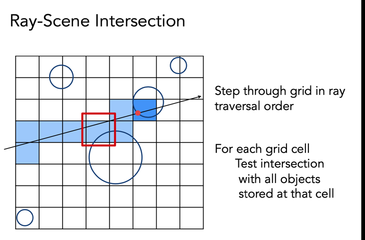
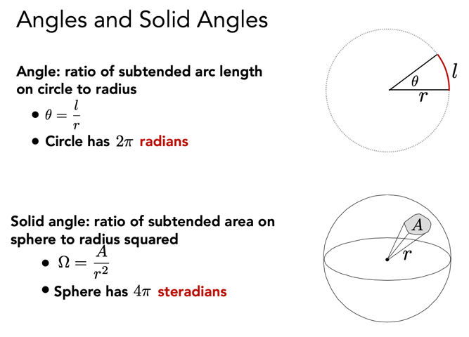
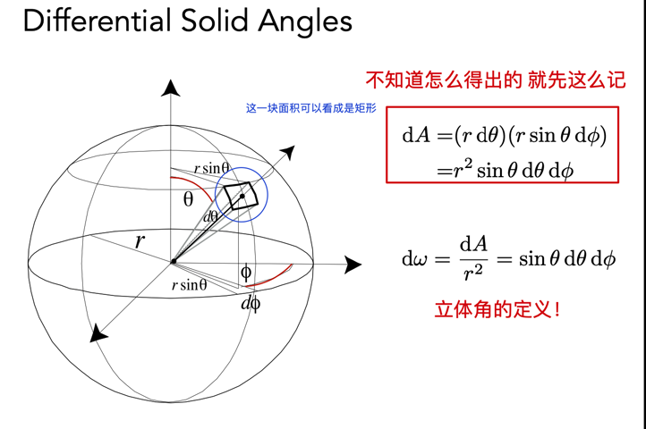
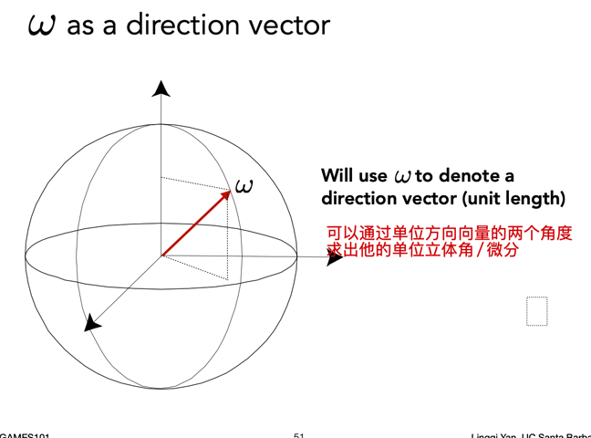
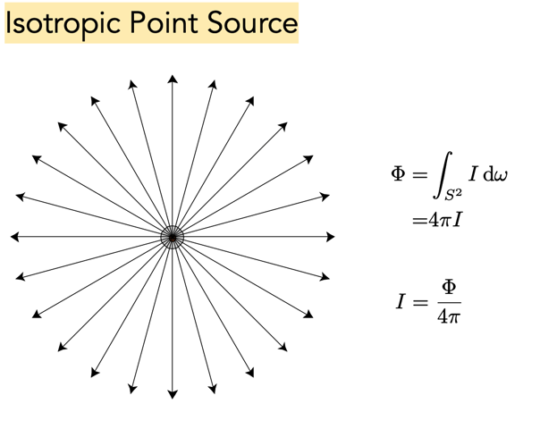

## Course13 Ray tracing 1

> 光线追踪～
>
> whitted style？

### general

- basic theorem

### Why ray tracing

光栅化（rasterizing）：

- 全局效果处理不好
  - 软阴影：shadow mapping
  - 光线会反射一次以上的场景
    - glossy reflection：不是那么光滑的镜面，有高光
    - 间接光照
- 画质不太行
- 速度快，real-time

光线追踪（ray tracing）：

- 准确度高，速度慢，offline 的渲染
- 电影、视频的渲染，一帧就好几十万个 CPU 时间

**_质量和速度的 tradeoff_**

### Light rays

> 光线是肾摸？

在 CG 中的三个假设：

- 直线传播
- 光线不会发生碰撞

**_当你凝视深渊，深渊也凝视着你_**

历史：

1968 Appel

eye ray -> object -> shadow ray（判定可见性） -> shading

### Recursive (Whitted-Style) Ray Tracing

递归。就是在任何一个点可以继续传播光线，着色也会发生变化

内部二次弹射的光线的值，都加给最初的 primary ray

就是模拟光线不断的弹射

### Ray-surface intersection

> 光线和表面的交点怎么算？

光源 O

光的方向 d

t 时间的光线位置： O + td

#### 隐式表面

例如球的定义：隐函数表示

解方程求时间 t

所有的隐式表达的物体都能通过解函数的方式求光线的交点 O + td

有意思的属性：

- 物体/图形内的一个点发出的光线（射线）与物体边界的交点一定是奇数个，反之是偶数个

#### 显式物体（三角形面求交点）

> 一个个三角形面求交点？太慢了吧
>
> 1 个交点或者 0 个交点，忽略光线和平面完美平行的情况

可以这么拆分交点的问题：

1. 和三角形所在平面求交点（如何定义平面？）
2. 判断交点是否在三角形内部（好做）

**定义平面**

一个方向（法线） + 一个点（好像很熟悉，感觉大学教过啊-\_-）

写成一个函数来表达

接着判断这个点是否在三角形内，能不能优化一下，一次性解？

求解 t, b1, b2 三个未知量，下面那个定义的乱七八糟的方程组是一个 法则，反正能写出第一个等式的时候就用下面的这个方法来求解就完事了

- 求解得到 t，判定是光线
- **得到 b1, b2，判定是重心坐标，非负，且 (1 - b1 - b2) 也是 非负，就能判定点在三角形内部！**

### Accelerating Ray-Surface Intersection 加速！

> 为啥要加速？每个光线要和一个个的三角形求交点，还有多次弹射，也太慢了

#### Bounding Volumes

> 哦！这里是 volumne 的出现了，类似于 bounding box，不过这是立体的，包围盒/体

_用一个**体**去包围一个物体，如果一个光线连 bounding volume 都碰不到，那盒子里面的所有点肯定都碰不到！Object is fully contained in the volume. If it doesn’t hit the volume, it doesn’t hit the object_

通常我们用长方体作为包围盒，那么长方体是什么呢？（卧槽，简单又复杂的问题。。。）

- 可以**理解**是三个 opposite surface 形成的交集

我们通常用 AABB，是和三个轴对齐的包围盒

接着我们就可以看光线如何于 AABB 求交点了

#### Ray Intersection with Axis-Aligned Box

先看二维的 bounding box（两个对 slab 围城的交集）

分别看两个对面，和光线相遇的分别的 tmin 和 tmax，也就是进入和离开的时间点，可以求两个线段的交集，为什么呢。

在三维的情况看：

最后，当 t~enter~ < t~exit~ 就说明光线在盒子里呆了一段时间啦（很好理解），就是光线会照到盒子！

结论

OK 基本上就是这么个回事了

最后看看几个前面提出的问题：

1. 为什么用 AABB 呢

下节课，继续加速，和其他方法，以及如何使用 AABB

## Course14 Ray tracing 2

### general

- acceleration 继续讲完
  - AABB to accelerate ray tracing
    - uniform grid
    - spatial partition
- ## radiometry 辐射度量学

GTC news:

- DLSS：deep learning super sample 的升级版，见课件 pdf
- 全局光照：从离线 -> 实时的技术

离线 -> 实时，光栅化的价值依旧在

后面的课不容易了

### AABB with uniform gird

1. 找到 AABB（轴对齐包围盒）
2. 内部继续等分（uniform）成格子
3. 找到和物体重叠（表面重叠）的格子

接着开始做光线投射，光线遇到盒子，可能会和物体相交，此时再去计算交点

可以简单判定，当前光线的下一个命中的格子，要不就是上方，要不就是右边（二维）

#### 格子方案的加速效果如何

格子不能太稀疏，也不能太密集

启发式的结论（多次实验）：常数 x 物体数量

#### 存在的问题

前人尝试的方法，目前看来用的不多，但技术还是存在

### spatial partition

空间划分

简单理解一下这些个 tree：

- Oct-Tree：（2 的 D 次方）
  - 在 2D 平面下看其实只有四叉，但是到 3D 空间中就是 8 叉了，可以想象哈
  - 切分到什么时候就不切了？比如：2D 来看，切分完之后发现有三个叉都没有达到目标（与物体相交）就没必要切分了，剪枝。当然还有其他的标准
- **KD-Tree**：（和空间维度没有关系）
  - 沿着某个轴就砍一刀，每次划分的轴不会重复（循环交替）
  - 类似二叉树
- BSP-Tree：
  - 不是沿着轴砍
  - 高维不好计算

#### KD-Tree preprocessing

如图想象一下空间被这么 KD-Tree 的划分了，每个点都属于一个字空间（叶子结点），我们需要知道每个 point 的信息（如何划分，物体）

_本质也是一个二叉树_

**data structure of the point in KD-Tree** :

- 非叶子结点（被分隔）
  - 沿着哪一个轴分隔？x/y/z
  - 分割点（轴上的）
  - children（两个）
  - **没有物体信息**
- 每个叶子结点的字空间
  - **list of objects**

当光线投射的时候，就是遍历这颗树的时候，逐层个 AABB 进行相交，如果不是叶子结点，啥也不做，进入叶子结点去计算和判断

**难点：一个 AABB 很难判断和一个三角形有交点，很难写这个判断，近十年这个算法也不用了**，同时一个物体可能会同时存在多个叶节点里面，不太好

### Object partitions & Bounding volume hierarchy

不从空间角度去划分了，而是从物体出发，Bounding volume hierarchy（BVH）

1. 还是一棵树（层级结构 hierarchy）
2. 按照物体分成两堆，重新求字空间的 BBox/Volume，能够保证每个三角形（几何结构）只会出现在一个 BB 内
3. BB 还是有相交的可能，如何划分，很有讲究（怎么有点像我之前做的层级聚类啊。。。）

#### 如何划分一个节点

让树左右两边接近平衡

找中间的物体，排序问题：沿着某个轴进行排序，或者直接找中位数，**因为**，~~有这么一个公式，是中间数，近似过去的！~~，不对不对不对，有这么一个算法，就是快速选择算法，找到 n 个中第 i 个，算法学过的哈，也是快排的子方法（O(n)）

#### Data Structure for BVHs

Internal nodes store

- Bounding box

- Children: pointers to child nodes

Leaf nodes store

- Bounding box
- List of objects

Nodes represent subset of primitives in scene

- All objects in subtree

伪代码看算法，递归遍历

空间划分和物体划分的比较：两者最终还是划分成了层级关系的包围盒

空间划分：

- 每个子空间（BB）之间不会有交集
- 物体可能会存在多个字空间中

物体划分：

- 字空间可能会存在交集

好了，到这里，光线追踪的加速模型就结束了

### radiometry

> 辐射度量学！国内不会讲，虽然我也没上过

#### Motivation 是什么

我们可以看到之前的 phong 的光照模型并没有讲到光的强度值的单位是啥，whitted 风格也不是很高级 hh

#### Radiant Energy & Flux(Power)

Radiant Energy:

- def: 电磁辐射的能量
- `Q[J = Joule]`

Radiant Flux:

- Radiant flux (power) is the energy emitted, reflected, transmitted or received, **per unit time.** 某一个单位时间的强度
- 单位：瓦特 or lumen（lm）
- 
- 也可以理解为单位时间光子通过一个感光器的数量

**我们需要度量光**

- 物体/光源发出的强度：Radiant intensity
- 光照射在物体表面的强度：irradiance
- 光线传播过程中如何度量：radiance

#### Radiant intensity

def：The radiant (luminous) intensity is the power per **unit solid angle** (?) emitted by a point light source.

第一个公式：w 是立体角，每单位立体角的能量

单位：W/sr 或者 lm/sr => cd candela 还是一个标准单位

##### 立体角

**这个单位 solid angle 立体角是啥呢**

先看角度 angle：

- 在一个圆中，圆心角的定义可以是 `弧长 / 半径`，并且和弧长也随着半径扩大而扩大
- 如果说周长是 `2 * PI * R` 那么一个圆周角就是 `2PI` radians，酷

那么所谓的立体角其实就是角度在 3D 空间中的拓展：

- 既然升维了，弧长升级成弧面，立体角就定义为 `弧面面积 / R^2`（其实是球上的一个锥）
- 那么一个球面的面积是 `4 * PI * R^2`，立体角就有 `4PI` steradians（stereo-radians 吧）

就是空间中的一个角

求光线强度，先求 dw 立体角的微分（单位立体角）

其实解释的通这个面积怎么算，但是就是圆弧 `l = dx * r` 这个怎么来的，我给忘了

验证：可以用单位球面的立体角做积分，求的一个球的立体角就是 4PI

##### Isotropic Point Source

iso-tropic point source，*均回归线*的点光源？=> **均匀辐射**的点光源（这里的 tropic 可以理解是太阳辐射地球表面产生的热量）

妙的很，手写了一下，

#### 举个例子:bulb:

方向性的光强 => 引入了单位立体角

确实有点难呀
