## Course15 Raytracing 3

> Light transport & global illumination

### general

- Radiometry 继续（准确的定义光的物理模型）
- Light transport 光线传播
  - 反射方程
  - 渲染方程
- global illumination 全局光照
- 简单的概率论。。之后会用到

### 回顾辐射度量学

- 光的流（power/flux，单位时间上的能量）
- 光的强度（单位立体角上的 flux Intensity）
- 微分立体角：角度在三维空间的扩展，定义方向的两个角，在各自方向上极小的变化

和 sin(t) 还是有关系的！

### Irradiance

定义：the power **per unit area** incident on a surface point.（和入射光线相垂直的面积大小，需要投影）是不是很熟悉，那就是 Lambert’s Cosine Law

单位：和面积相关那就是 W / m^2 或者 lm / m^2 => lux

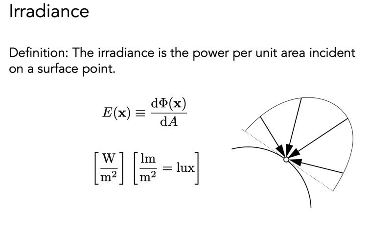

#### Lambert’s Cosine Law

在 phong shading 那块也讲过，为什么需要用 cos 一下，其实就是投影

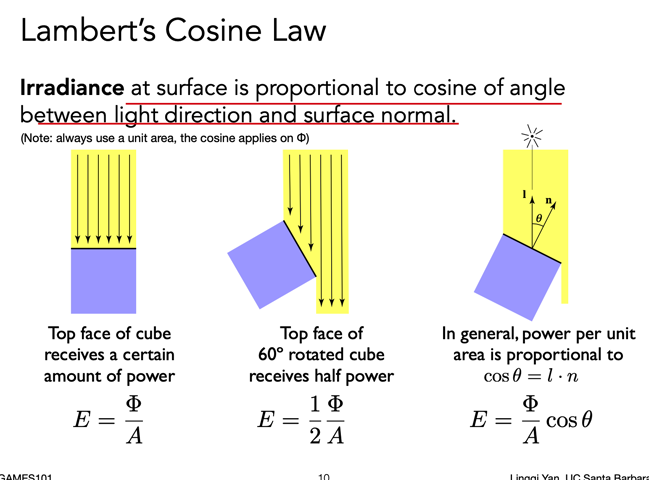

这也和为啥我们有冬季和夏季有关哈哈哈，有夹角。

#### 半径平方衰减

根据 irradiance 的定义，单位光照面积上，所以有下图公式

**衰减的不是 intensity 而是 irradiance**

_angular_

### Radiance

**为了描述光线的属性（传播过程中）**，和路径追踪有关！

Radiance is the fundamental field quantity that describes the distribution of light in an environment

好复杂啊。。

**_cos(t) accounts for projected surface area_**

一个单位面积上，会有法向量与光线存在夹角，那就有立体角 => 单位立体角 + 单位面积上的能量

可以结合 irradiance & intensity，这俩分别缺的那个微分补上就行了呀

So

- Radiance: Irradiance per solid angle
- Radiance: Intensity per projected unit area

### Incident Radiance

_Incident radiance is the irradiance per unit solid angle arriving at the surface._

可以理解为 irradiance 是一块面积上任何方向（立体角）的强度之和（积分），我们现在关注一个单位立体角上的强度（微分），就是 Radiance，换句话说是一个光线沿着某一个方向到达表面的强度

### Exiting Radiance

可以理解为光线从某一个方向（立体角）过来之后，投射到表面，并且离开所发出（emit）的能量

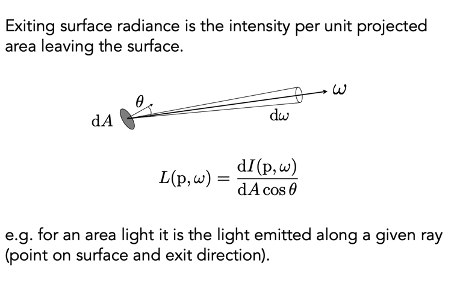

很小的面，很小的范围，两部分考虑

### Irradiance v.s. Radiance

Irradiance：某个区域收到的所有的能量（差个方向性）

Radiance：某个区域，某个方向进来收到的能量

那么将方向求积分（求和）不就是 irradiance 了！**所以下面将两个能量联系了起来**

注意只有半球

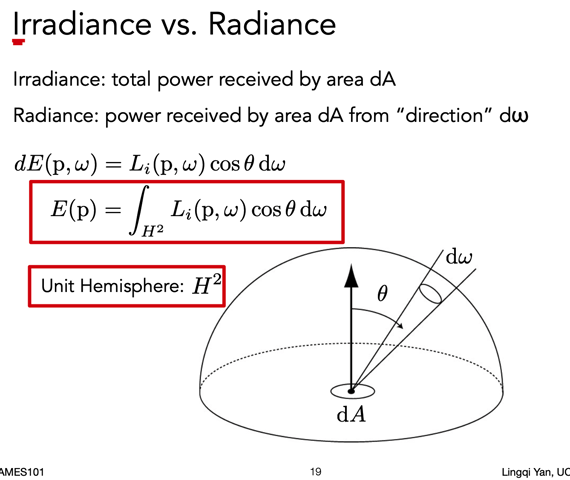

### BRDF

**Bidirectional Reflectance Distribution Function 描述了光线和物体是如何作用的（材质）**

这个函数是啥呢，理解一下反射到底是什么：

- 漫反射的物体，光线射入，四面八方都会反射
- 镜面反射，只会反射一个方向
- 有没有什么方法能够描述这样的情况呢：从一个方向进来的光线能量会从不同的反射方向出去分散能量？这就是 BRDF

也可以理解光线是 hit -> 物体 absorb -> 物体 emit

所以可以分解为两个过程：

1. incoming 吸收：radiance -> 结合立体角 -> irradiance
2. exiting 辐射：BRDF

**_从 dA 这块小区域得到的 irradiance（和面积有关，立体角无关）如何从各个方向/某个方向再出去所产生的能力是多少，BRDF 来描述这个如何分配到各个立体角，其实也就是一个比例值_**

单位是 1/sr，steradian 的倒数

### 反射方程

BRDF 告诉我们，某一个入射角度的光对出射角度的光有多少贡献，那么我们把所有方向（立体角）的光给求和（积分），就能知道出射角度（eye position）能看到的光有多强了

递归定义。。。其他物体也会反射光（暂时只考虑光线弹射一次。。）

### 渲染方程

The Rendering Equation

物体自己会发光怎么办呢

把发光 emit 的给加上，两个部分组成，这样就比较完备了

解释下半球：从下面的光线打上来的肯定是 0 了

**前面那么多概念就是为了这个最终的渲染方程**，是 CG 的祭奠，论文名就叫 _the rendering equation_

物体的材质如何定义：

- diffuse
- glossy（光滑的）
- specular（镜面，和 glossy 还有点区别）

结合课件 & 再看几遍[视频](https://www.bilibili.com/video/BV1X7411F744?p=15) 去理解渲染方程 -> 多次弹射光照 -> 全局光照 -> 光追和光栅化的区别

全局光照必定会收敛

如何去解这个渲染方程就是关键，后面路径追踪会讲

### 概率论 review

略

## Course16 Raytracing 4

> Monte Carlo Path Tracing 蒙特卡洛路径追踪
>
> 真实渲染
>
> 正确的解出渲染方程

### general

- Monte Carlo Integration
- path tracing 路径追踪

上节课的全局光照其实已经讲了，就是 BRDF

回顾渲染方程，概率（连续随机变量）

### Monte Carlo Integration

蒙特卡洛积分 wow

#### why

解决什么问题？给任何一个函数某个范围内的**定积分**

但是不方便用解析式积分，数值方法求出一个数值

#### what & how

estimate the integral of a function by averaging **random samples of the function’s value**.

随机采样的方法

可以看到其实是一个离散的了？

理解一下这个蒙特卡洛积分：

1. 定积分可以看成是某个范围内，分成无数个小的矩形面积求和，矩形面积 = dx \* f(x)
2. 某个采样点 x 在函数上的矩形面积，他的宽（dx 部分）其实可以用概率密度去定量，概率是 p(x) 表示它出现的可能，那么它真正出现的次数就是 1/px 了，也就是宽所占的比例，高还是 f(x)
3. 将每个采样点的面积求一个平均就完事了
4. 采样点越多，和真实的积分差距就越小
5. 连续 -> 离散

一个简单好用的结论

### path tracing

和 whitted style ray tracing 有什么区别呢

- whitted style ray tracing：
  - 只有镜面反射（specular）
  - 漫反射就停了
  - 真的是对的么？不够真实
- 路径追踪：一种激进的改进光追的**算法**

#### 光追的问题

glossy 表面的材质

漫反射 diffuse

康奈尔 box 模型，广泛的测试全局光照效果

#### 渲染方程

再看一眼，我们关注的两个难点

1. 积分，半球范围 -> 蒙特卡洛
2. 递归的计算

看个简单的计算例子

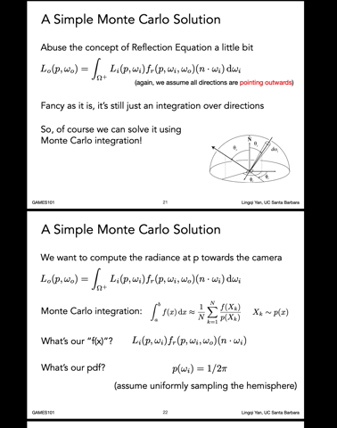

1. 求 slice 1 这个简单的蒙特卡洛积分
2. 对半球的角度（立体角）进行采样
   1. 怎么采样？简单的在半球里均匀采样 p(w) = 1 / 2PI
   2. 怎么来的。。半球对应的立体角 2PI，半球立体角 p 积分为 1

可以得到我们的 radiance，并且得到一个简单的算法

啊哈这就是 path tracing 的直接光照

当然我们要考虑间接光照

#### global illumination

Q 将光也反射给了 P，贡献了光照，仿佛就是在 P 点看 Q 点的光照

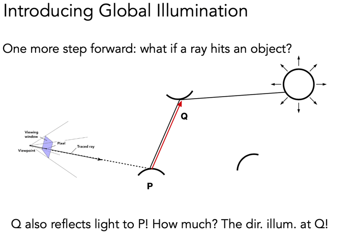

所以从 P 出发的某个角度如果也 hit 到了物体 Q，那就求这个物体 Q 的这个角度的光源

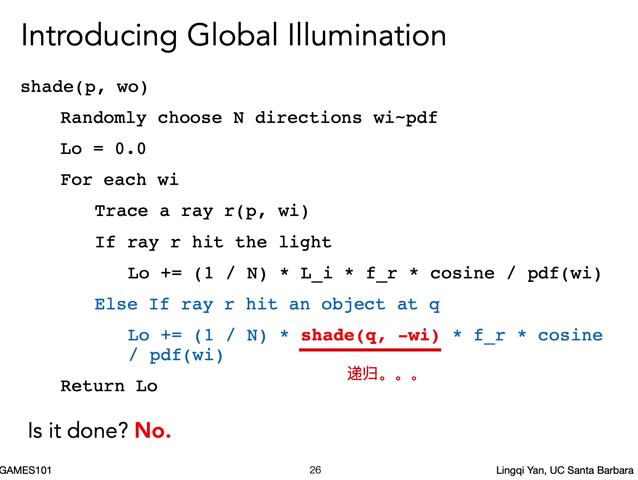

问题来了，光线太多了

当 N = 1 的时候，光线不会爆炸，也就是蒙特卡洛的采样点为 1

This is Path Tracing

噪声可能会很大呀，穿过一个像素的路径可以有很多，我们求个平均就行，连接 eye -> light

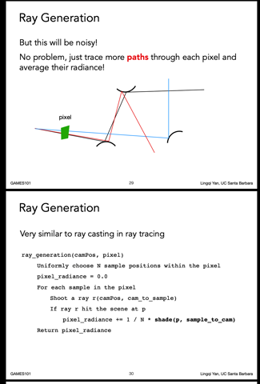

我们再从一个像素点出发，去看路径追踪

1. 从相机位置 camPos 要去看屏幕上的某个像素 pixel
2. 对像素范围内进行 N 个采样（N 条 eye ray）
3. 计算每个击中物体采样得到的 radiance（`shade(p, sample_to_cam)` 物体表面的光从采样点到相机的光线角度）
4. 然后求一个平均，就能得到 pixel_radiance 了

我们的目标是渲染一个像素嘛，从像素出发来解决问题就很棒！

慢着，还有个问题，刚才 shade 算法还是个递归的，他的停止条件？

- 光线弹射次数上限？能量损失，但真实情况就是会无数次。tradeoff

### Russian Roulette

俄罗斯轮盘赌，左轮枪，放入子弹转转转，轮流打自己

一定的概率/条件，停止弹射（递归），最终我们希望光线的值还是我们预期的 Lo

1. 自定义一定的概率 p 去发射一条 ray，那么不发射 ray 的概率就是 1-p
2. p 概率下，发出的光线得到的结果 Lo 去除 p（可以理解和上面的蒙特卡洛是一样的，求一个占比） => Lo / p
3. 1 - p 的概率下，得到的就是 0
4. 我们可以得到最后的 **Expection** = sum(p _ x) = (1 - p) _ 0 + p \* (Lo / p) = Lo（妙啊）

所以可以通过这样的概率性弹射，来解决计算量过大的问题（递归）但是也能保证质量（但还是会有 noise）

- 会不会运气差到 1 个像素上每个 sample 都在第一次就 0 了呢。。应该能避免的，比如限制必须直接光照，或者限制的到达一定的 bounce 数之后再进行 RR

到此为止，path tracing 就没毛病了！

### 遗留的问题

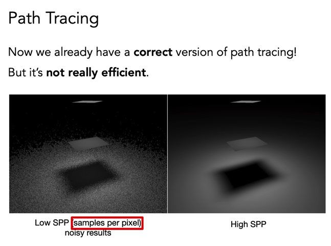

samples per pixel，采样少就快啊，但是有噪声，并且采样的光线可能会被浪费

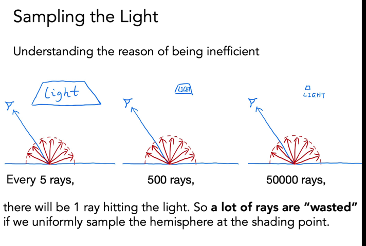

光源越小，需要采样的光线就可能需要很多才能打到 light，我们之前用均匀的 PDF 采样（概率分布）

采样问题

_蒙特卡洛的要求：在 x 上采样，在 x 上积分_

在光源上采样，把渲染方程写成在光源表面上的积分 dA，找到 dw 和 dA 的关系就行了

1. 将光源转向点，cos(t')
2. 投影面积
3. 求立体角 dw = S / r^2

我们可以再修改一下算法：

1. 光源直接对物体的贡献，上面改写的渲染方程，不用 RR（直接光）
2. 其他间接光，用 RR

最后一个小问题：

直接光照被挡住的情况。。。

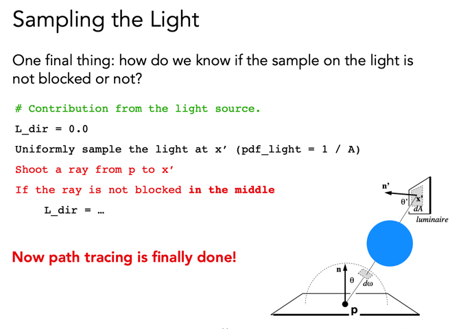

一些 note

点光源不好处理（没有 dA）可以建议做成小面积光

已经是 PHOTO-REALISTIC，可以看 Cornell box 的[网站](http://www.graphics.cornell.edu/online/box/compare.html)

外话

Ray tracing：其实就是光线传播方法的大集合（path tracing、单向/双向 PT、光子映射...）

生成一张图：Rasterization or Ray-tracing

### 没教的东西

- 半球的均匀采样？
- 重要性采样
- 随机数的好坏
- pixel reconstruction filter，像素采样的卷积
- radiance 到 pixel 的 gamma 变化，曲线

路漫漫其修远兮，fear the science
