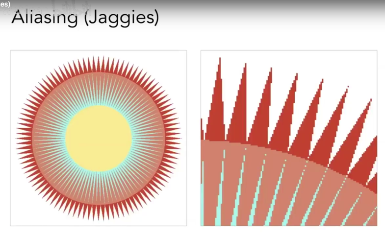
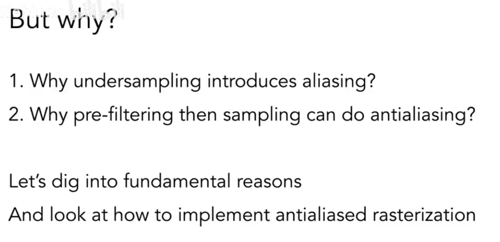
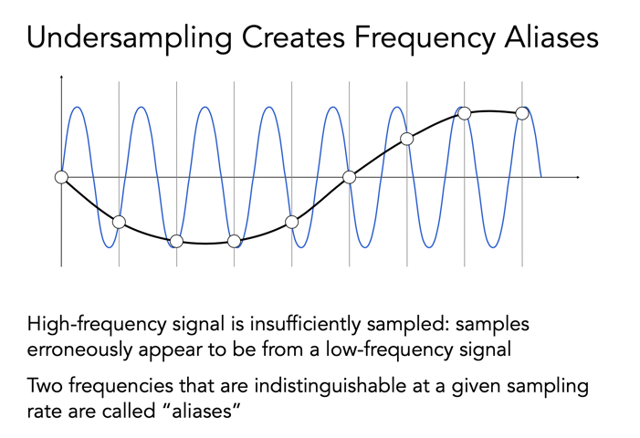
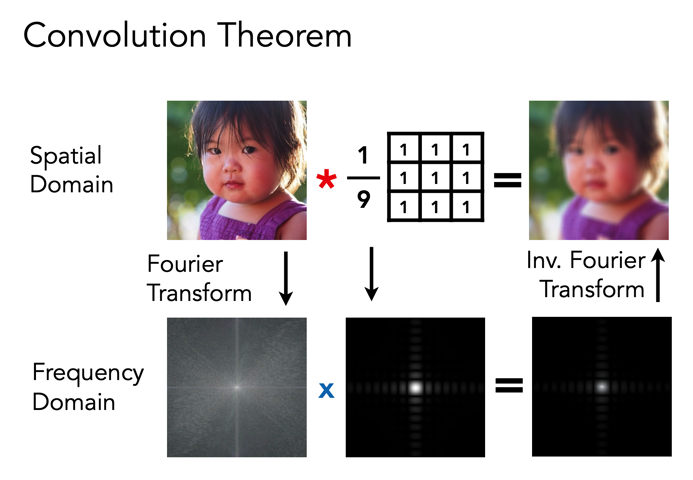
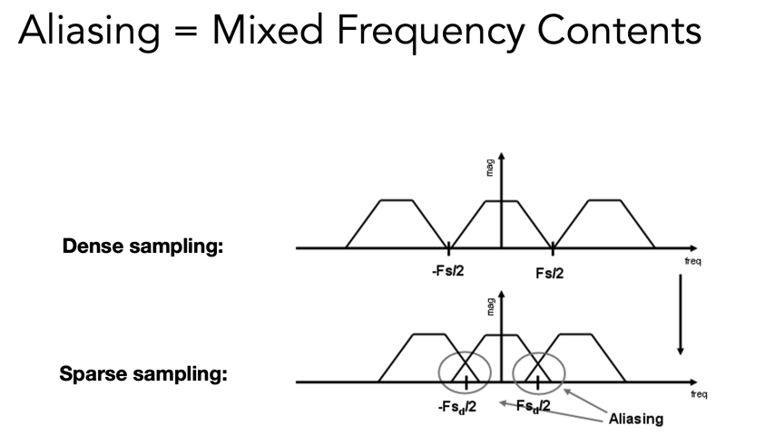

## Course5 Rasterization 1 - Triangles

光栅化

### general

- 观测矩阵之后的操作
  - viewport transformaion
- 光栅化

### 视口变换

#### 回顾

上节课讲到，视图变换（正交投影、透视投影）是将物体在三维世界中的位置信息经过变换之后，通过一个 camera（也就是我们观看者的视角），投影在一个二维平面上（标准立方体 $[-1, 1]^{3}$ 的空间中。

- 正交投影：观看者视角处于无限远的位置，或者忽视物体的深度
- 透视投影：人类的自然视角，保持近大远小，近平面和远平面保持不变，将物体**压缩**到标准立方体中（首先压缩到和近平面一样大的立方体，再经过正交变换），此时我们看到的压缩的二维画面就有*近大远小*的感觉了！

#### 定义视锥体

- 六个值可以定义一个正交投影的立方体

  x 轴的覆盖：左 & 右

  y 轴的覆盖：上 & 下

  z 轴的覆盖：远 & 近

- 视锥

  

  - Aspect ratio：宽高比，`-Z`方向看过去的（X 和 Y 的比）
  - field of view(fovY)：Y 轴的 fov（垂直方向），视角，能够看的的角度的范围（比如人眼的视角范围）

_如何将视锥的 fovY 和宽高比转换到具体的坐标 l, r, b, t_


通过三角形的正切，找到 fovY 角度与**近平面**坐标的关系，通过宽高比也可以得到 t 和 r 了


经过 MVP 的步骤之后得到了标准立方体，我们要把这个立方体画在哪里呢？**屏幕上**（window 上）

### 光栅化

#### 屏幕

可以抽象为

- 一个二维的数组（像素组成）
- 分辨率：像素的多少
- 典型的光栅成像设备（raster，德语中屏幕的意思）

rasterization：画到屏幕上的过程

定义一下屏幕空间


这里的原点是和直角坐标系一样的

1. 标准空间先不考虑 Z 轴，做 X、Y 的缩放，同时移动到中心（w/2, h/2）

   

2. 光栅化到**像素**

   - display 设备

     - 示波器

       

       隔行扫描：第一幅图画单数行，第二幅图画偶数行（工作量减少一半），人眼的动画产生：视觉暂留的效应，每帧之间的时间间隔很短嘛，感觉不出。在视频压缩中会有应用。缺点：会产生画面撕裂（高速运动的画面不太适合）

     - 显存的 Frame Buffer

     - 平板的显示设备 LCD 液晶显示屏

       

     - LED Light Emitting Diode 发光二极管

     - Electrophoretics 电泳成像，kindle 的屏幕，刷新率很低（改变黑白，耗时比较大）

#### 三角形

triangle meshes

_为什么用三角形呢_


_判断一个像素和一个三角形的位置关系_


简单的做法：采样（离散化），连续 -> 离散

可以通过像素的中心去采样，可以定义一个指示函数判断是否在三角形中

```
I = (t, x, y)
```


_盲猜一波 inside 函数：像素点的中心，在三个顶点的组成的线段的其中两个线段的一侧、剩余线段的另一侧？_


其实还是用到了向量的方向性

分别判断 $Q$ 是否在 $\vec{ P_{0}P_{1} }$ $\vec{ P_{1}P_{2} }$ $\vec{ P_{2}P_{0} }$ 的同一侧，通过叉积得到的结果向量的 Z 方向是否满足都是同号（左侧为例，Z 都是正的，指向屏幕外）

#### Inside a triangle

用叉积

在边界的情况：**不作处理** or 特殊处理

覆盖全屏幕像素点去画三角形？没必要，只考虑 bounding box


锯齿、走样是光栅化的一个大问题，**采样**率，信噪比

因为物理像素总是有大小的



## Course6 Rasterization 2 - Antialiasing and Z-buffering

### general

- ## Antialiasing 反走样
- Visibility/Occlusion 可见性/遮挡

### 反走样

锯齿 jaggy 走样 aliasing

#### 采样

is ubiquitous in CG


摩尔纹

去掉 odd 行和 odd 列之后，再次放大


本质：信号变化太快了，采样速度跟不上

信号处理：频率

**先滤波**

blur 一下


效果会好！但是为什么呢？



为什么先滤波之后再采样就可以做到反走样

来看看频域的分析

#### 频域

虽然之前研究过一些频域的东西，但是忘的差不多了。。还是回顾一下


傅立叶级数：正弦余弦的线性组合无限逼近一个周期函数

傅立叶变换：


可以通过傅立叶变换/逆变换进行采样/恢复


采样采的不好（欠采样、过采样）就会走样



两个频率不同的信号被采样之后无法区分 -> 走样

#### 滤波

Filtering = Getting rid of certain frequency contents

所以我们需要在频率域做这些事情，可以用傅立叶变换


高通（去掉低频的）滤波，得到了边界（颜色突变非常大的，信号的高频，变化大）


**滤波 = 卷积 = 平均**


时域的卷积 <=> 频域的乘积（回忆数字图像处理，可以推导的）



采样：重复频域的内容


采样的密度决定了频谱重复的间隔，**就好比采样时像素中心间隔特别大，所以走样也会越厉害**



所以有一个什么采样公式来着！

#### 如何反走样


高频的部分砍掉，让混叠不发生


_操作一下_


对每一个像素点都做一个平均，计算还挺麻烦的

#### MSAA

Antialiasing By Supersampling 一种超/过采样的方式？

Multisample anti-aliasing

将一个像素点再分割成多个像素点，对这些像素点计算是否在三角形的 inside，然后再做平均


可以通过计算超采样之后的**覆盖率**，绘制最后的图像


通过 MSAA 来近似**模糊的效果**（覆盖率），之后才是采样，格子可以是同一个颜色

妙啊

#### no free lunch

牺牲了什么？

多采样点 -> 多计算量

_真正在工业界也不会简单的平均分成多少个点，而会考虑不同分布的点以及这些点可能还会被临近的像素点复用_

其他抗锯齿方案：

- FXAA(Fast approximate antialiasing)：找到锯齿的边界（匹配），快速替换（图像层面），非常快
- TAA(Temporal AA)：复用上一帧的信息

超/上采样：

- 低 -> 高分辨率
- DLSS：Deep learning（猜测细节，补充）
