## Course7 Surface Shading (Illumination, shading and graphics pipelines)

### general

- 可见性、遮挡（visibility occlusion）

  - Z-buffering 深度缓存

- 光照、着色、图形管线（？）

### Visibility/occlusion（光栅化）

多个物体的情况下有前后关系，可见性也不一样

#### 画家算法

最远的物体先渲染，由远及近渲染

有问题：环形遮挡？物体比如一个环，近景和背景都存在，如下图

#### Z-buffering

算法思路：

这里的 Z，其实取了一个绝对值来看

同步生成一个 frame buffer 和一个 depth buffer

算法流程：

结合脑补简单易懂

其实并没有排序哈

三角形的渲染顺序：基本上不会有两个完全相同的 depth（浮点数的相等比较几乎不会出现），但是实际操作中还是可能会有这样的情况

### 着色

shading not shadow

MVP -> Viewport transform -> rasterization -> **shading** -> ...

_颜色随着光照发生变化、阴影......_

给物体应用一种材质（颜色、纹理？）

#### Blinn-Phong Reflectance Model

Blinn-Phong 反射模型

- 高光
- 漫反射
- 外围光源（间接光照）：其他物体反射出的光线

定义一些方向

这些方向都是单位向量

只需要在表面反射光哦，表面参数/属性：

- 颜色
- 亮度（**和材质有关**，和光的亮度无关）

_不考虑阴影_

#### 漫反射

diffuse reflection

物体表面吸收到多少光照能量呢？为什么会有一年四季，春夏秋冬（夏季太阳直射）

Lambert's 余弦定律

直射的时候 `cos0 = 1` 得到全部能量

光源的能量

点光源：

- 同一半径的能量是一样的（球壳）
- 能量守恒：球壳表面积随着半径越来越大，在某一点的能量也随之减小，$4 \pi \times I = 4 \pi r^{2} \times I'$
- 不同半径能量强度与 $\frac{1}{r^{2}}$ 成正比

最终能量的计算

- 光源的距离：$r$
- 光线的夹角余弦：$\vec{l} \cdot \vec{n}$，注意这里需要标准化求 cos，负数情况没有物理意义（角度大于 180 的情况自行脑补方向），_表面法线 $\vec{n}$_
- 漫反射能量吸收系数：$k_{d} \in [0, 1]$，如果是 1（越大）的情况说明完全吸收，没有能量被反射出去，这简直就是黑洞啊

**注意：漫反射的方向是全方向的所以和视线的 $\vec{v}$ 完全没有关系**

目前这个模型只是简单的漫反射模型

## Course8 Shading 2 (Shading, pipeline and Texture mapping)

### general

- 说完 Blinn-Phong reflection model
  - 镜面（specular）和环境光（ambient）
- shading frequency 着色频率
- graphics pipeline 图形管线（？）

### Specular term(Billn-Phong)

高光（接近镜面反射的方向）

Billn-Phong，叫他“不灵冯”模型吧，做了一个假设

**观测方向非常接近于高光（镜面）方向，意味着半程向量（half vector）非常接近于法线方向**

因为入射角和出射角相等嘛。**所以只需要判断 half vector 是否和法线方向接近，就可以判断是否是高光亮度了**

**half vector：**就是 $\vec{v}$ 和 $\vec{l}$ 的角平分线，也是非常好求的 $\vec{v} + \vec{l}$ 然后在做一个归一化到单位向量即可

**判断向量方向接近：**做点乘（已经是单位向量了），接近于 1 就相近，接近于 0 就远

最终的高光颜色（需要被 shade 的）

注意到计算方向相近的点乘的这个 p 次方，原因也很简单，单独的 $cos$ 函数对于角度的容忍度还是很大的

通常在不灵冯中 p 为 100 - 200

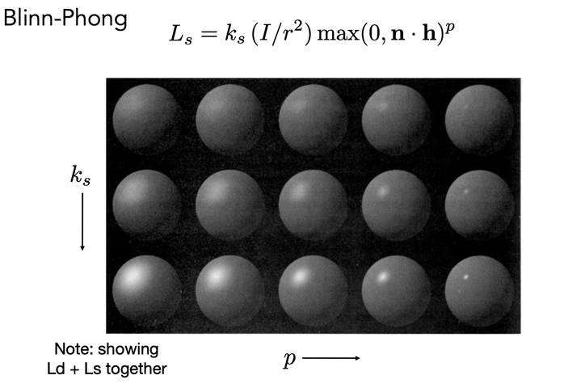

### ambient term

不灵冯假设任何一个点接收到的环境光都是一样的。。（不然就太复杂了）

$L_{a} = k_{a}I_{a}$ 是一个常数

#### 作用

- Add constant color to account for disregarded illumination and fill in black shadows 提亮肤色 hhh
- This is approximate / fake!
- 复杂的需要全局光照的知识，比较难

### 不灵冯

### 着色频率

多少个像素点被涂色（涂同一种颜色）

#### Flat shading

Shade each triangle

对每一个三角形平面进行着色（每个平面内部的颜色都是一样的）

- 直接求三角形的法线（两个边做个叉积即可）
- 根据三个方向计算出一个 shading 的结果作为这个三角面的颜色

#### Gouraud shading

Shade each vertex（顶点）

- 一个平面（三角形/四边形）的顶点求法线

- 顶点着色

- 内部的点进行差值（平滑）

#### Phong shading

Shade each pixel

- 顶点求法线
- 内部的点法线通过差值得到
- 每个点着色
- Not the Blinn-Phong Reflectance Model 也是他发明的而已

这三种渲染方法还是取决于模型是如何的

#### 顶点的法线

_如何求一个平面的顶点的法线_

最好的方法就是在这个顶点原本所在的（underlying 的）几何体上求 norm vector

当然没那么理想的情况，目前大家用的就是：

**认为顶点被多个平面（三角形）所共用，这些三角形面的法线的平均就是这个顶点的法线，需要加权平均，这个权就是三角形的面积占比**

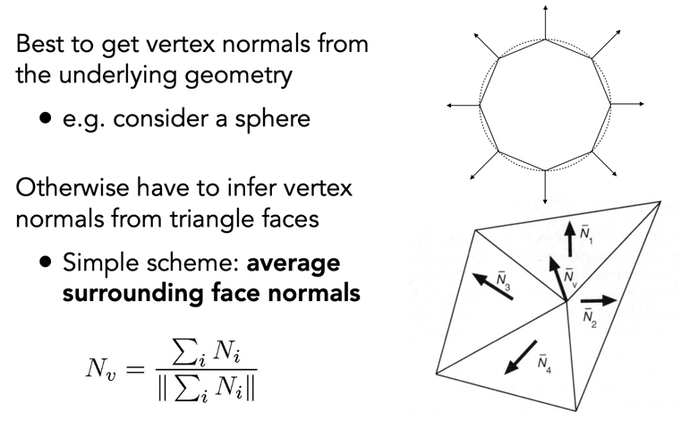

*三角形法线好算的*咋算来着？我忘了。cao，叉乘一下就出来了。。。

#### 每个像素的法线

_顶点的法线知道了，如何平滑的过度平面内部每个像素的法线_

Barycentric interpolation 重心插值法

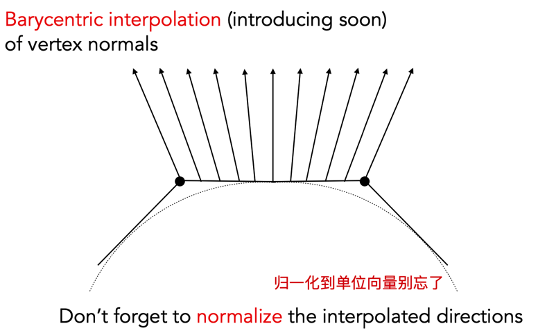

### Graphics pipeline

real time rendering

#### pipeline

就是一个流水线嘛，图形 -> 画面展示的过程

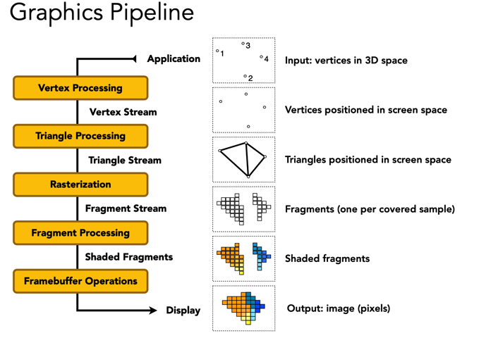

定义一个几何体，需要定义三角形所有的顶点就行了

同时，shading 的过程要根据 shading frequency 来决定

- phong shading 要等到所有像素点都产生才开始计算
- Gouraud shading 可以在第一个 vertex processing 的时候就开始计算，最后做一个平滑插值即可

GPU 的这套渲染流程都是写死的，但是在某些环节是可编程的，实时渲染界就在做如何渲染的代码，控制如何渲染和着色。这部分叫做 Shader program

#### Shader program

- Program vertex and fragment processing stages
- Describe operation on a single vertex (or fragment)

相当于是处理顶点或者像素的时候的一个通用的 function/handler

内部实现了一个像素的颜色是如何计算得到的

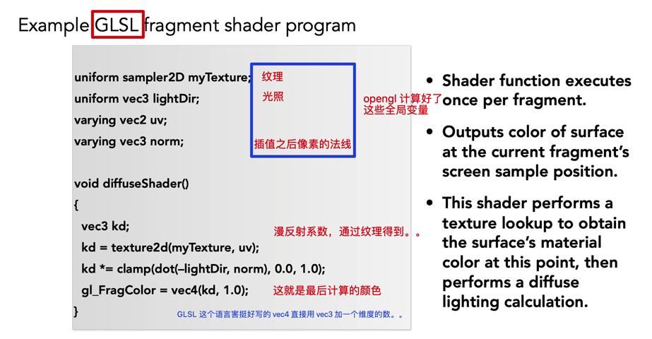

补：uv 这个坐标其实就是这个点在 texture map 上的坐标，获取对应坐标的 kd

**着色器 shader 千变万化**

推荐网站 [shadertoy](https://www.shadertoy.com/)

这个 [nail shader](https://www.shadertoy.com/view/ld3Gz2) 还会动，是个非常厉害的作品

### Texture mapping

纹理映射：一个三角形上的图案/纹理如何画

物体上任意个点的不同属性，漫反射系数？吸收多少光来改变纹理

纹理和材质没啥区别，不同的材质就是不同的纹理，纹理可以认为是视觉上的不同花纹，本质上是物体表面的点的属性

#### 三维物体二维展开

扒皮地球仪，画贴图

二维展开之后的图像如何与三维的几何体的点做一个一一映射呢？

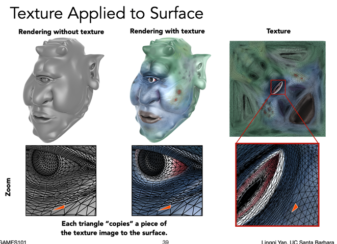

如何得到这个贴图呢？

- 艺术家去画
- 自动化生成，paramterization，展开后的三角形的扭曲尽可能的小

纹理上的坐标

约定俗成 u 和 v 都在 `[0, 1]` 之间，三角形的每一个顶点都对应一个 $(u, v)$

可以多次贴图（红色，绿色表示坐标的范围）

这些纹理贴图都能重复使用（铺瓷砖 tiling），如何生成？也需要算法（比如 wang tiling）

#### 三角形内部坐标插值

二维纹理坐标 -> 三角形顶点 -> 三角形内部点的纹理？

下节课说。。。重心坐标。。

## Course9 Shading 3 Texture mapping

### general

- 重心坐标

- 纹理映射，着色的最后部分了
- 纹理其他应用

### Barycentric coordinates

三角形内部的**插值**

在顶点我们得到了值，希望在内部能够有平滑的**过渡**

插值什么呢，插什么值呢？坐标、颜色、法向量......都能插！

#### 重心坐标

定义在一个三角形上的，三个顶点的线性任意组合 $(x, y) = \alpha A + \beta B + \gamma C, \alpha + \beta + \gamma = 1$ 这三个数 $\alpha , \beta  , \gamma$ 作为这个 (x, y) 点的一个描述，也就是一个重心坐标

$(\alpha , \beta  , \gamma)$ 其实也就两个数，自由度为 2，在三角形内部的点，这三个数都是非负的

任意一点的重心坐标可通过面积比算出

通过 A 点对*对面* $A_{A}$ 这个三角形可以算出 阿尔法。应该是可以推导出来的，但我不会。。

所以三角形的重心，可以分成等面积的三部分

公式

**说实话不太能看得懂**

直接用就完事了

_知乎[这篇](https://zhuanlan.zhihu.com/p/58199366)讲了面积公式的推导和重心坐标的应用，挺好_

#### 插值

既然任意一个点都可以用线性组合来表示，那么三角形的各种属性都需要用这个重心坐标来插值

**投影下是会变的（没有投影不变性）**

意味着：三维空间的点在投影到二维平面上之后，这个点的重心坐标是会变的，所以要先在三维空间中计算插值，再进行投影，不然就失真了（可以这样理解吧）——深度问题

### Texture

简单应用纹理的做法

1. 通过坐标 (x, y) 得到纹理的坐标 (u, v)
2. 在纹理空间进行采样 texture.sample(u, v) 得到纹理颜色
3. 根据漫反射系数将 color 设置到像素点上

很简单，但有什么问题？纹理的大小（texture magnitude）

一个纹理上的多个像素叫 texel...

#### 小纹理怎么办

#### 双线性插值

Bilinear interpolation

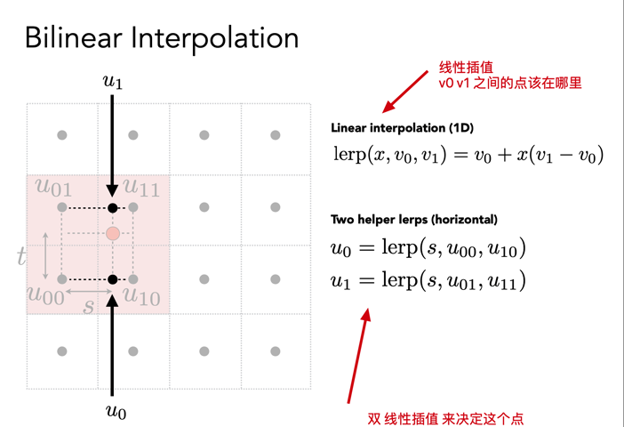

得到两个黑点的插值，再插值一次，得到红点的值

这样参考了周围四个点，做了两趟插值（水平、竖直）

#### Bicubic

双向 三次方插值？

16 个周围元素，计算量也大

图形学的 trade-off：提高计算量得到高质量 -> 降低/优化计算量同时保证高质量

#### 纹理大了怎么办

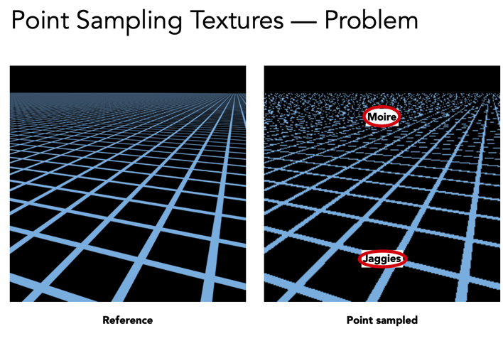

摩尔纹 + 锯齿，走样问题。之前的超采样好吗？一个像素点覆盖了很多纹理信息的时候（比较高频），通过增加采样点的方式（也用高频）来跟上信号变化的速度。但是计算量太大了！

_这个图说实话没看懂。。_

- 应该是降采样（缩小图像）会让一个像素覆盖的 texture 变多？反之为上采样

避免采样，得到一片区域的平均值

**_算法问题 Point query v.s. Range query_**

- Point query
  - 给一个点，得到他的值
- Range query
  - 给一片区域，得到他内部的平均值/最大值/最小值

### Mipmap

Allowing (fast, approx., square) range queries

快、但不准确的，**仅在正方形上的**范围查询

_mip 拉丁文来的，表示小空间、小东西_

怎么有点感觉是图像处理的那个 image pyramid？

多了多少额外空间？每 4 个像素融合一下，级数求和：1 + 1/4 + 1/16 + 1/64 + ... = 4/3（$S = \frac {a_{0}} {1 - q}$），所以仅仅多了 1/3 的空间

几何理解：

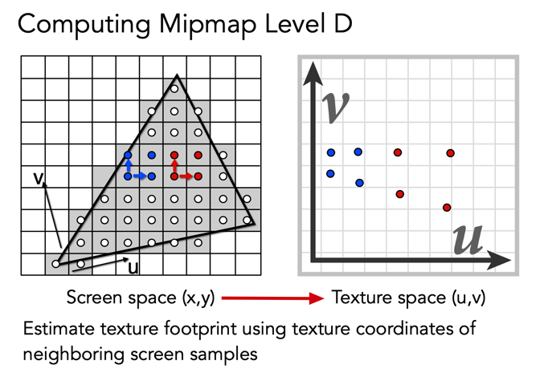

简单来看，就取到两个点最大的距离作为近似值

接着要查询得到正方形区域内的平均值

- 如果这个近似正方形的边长是 1 \* 1，那么只需要在原图上找像素的纹理值即可
- 如果是 4 \* 4，那么就去第二层的 mipmap 上找像素点！
- 以此类推，所以有 $D = log_{2}L$ 这个公式来得到 D

可视化：

颜色越深，层级越小，说明像素点覆盖的纹理越少，应该从最原始的图去找

可以发现并不连续，因为 `D <- [1, 2, 3, 4..]`

做插值！

#### 三线性插值

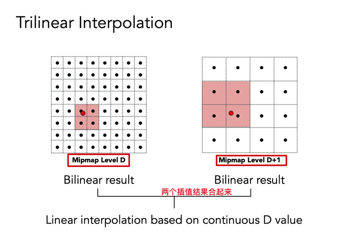

最后做一个层与层之间的插值：理解起来其实不难，就是两个红点之间，根据`(D, D+1)`内的连续数值进行插值 $lerp(x, D_{x}, D_{1x}) = D_{x} + x(D_{1x} - D_{x})$

$$
v_1(1-x_d)(1-y_d)(1-z_d)+v_2(1-x_d)y_d(1-z_d)+v_3(1-x_d)(1-y_d)z_d+v_4(1-x_d)y_dz_d+v_5x_d(1-y_d)(1-z_d)+v_6x_dy_d(1-z_d)+v_7x_d(1-y_d)z_d+v_8x_dy_dz_d
$$

现在就能有过渡了！

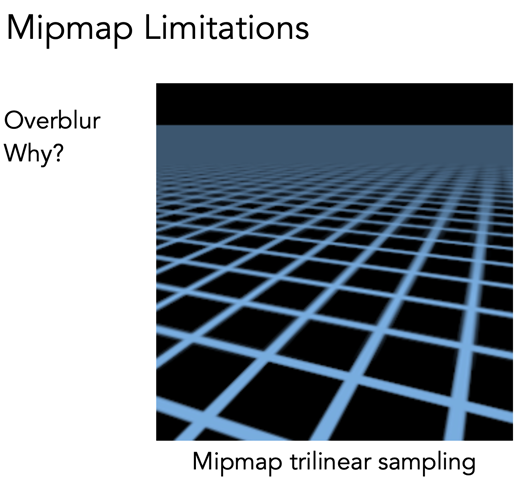

结果还是会 overblur，为什么，因为他只能近似方块查询

### Anisotropic Filtering

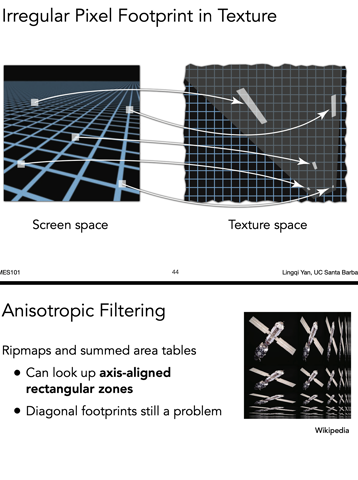

为什么 mipmap 不够好，因为图像真实的纹理空间在做变换的时候其实是被各种压缩了，正方形是特殊的矩形嘛。上图，用正方形的一个区域，在纹理空间内其实是一个很大的长方形区域，这样做一个平均就会导致 overblur 了。

**各向异性过滤**：

- 这个卫星图很有意思，mipmap 其实只做了对角线的部分
- 总共的开销是原来的三倍，多了两个方向压缩的图
- 多少多少 x，2x，4x，显存开销比较大

还有 EWA：多次查询

**这两个之后还要自己看看的！**
