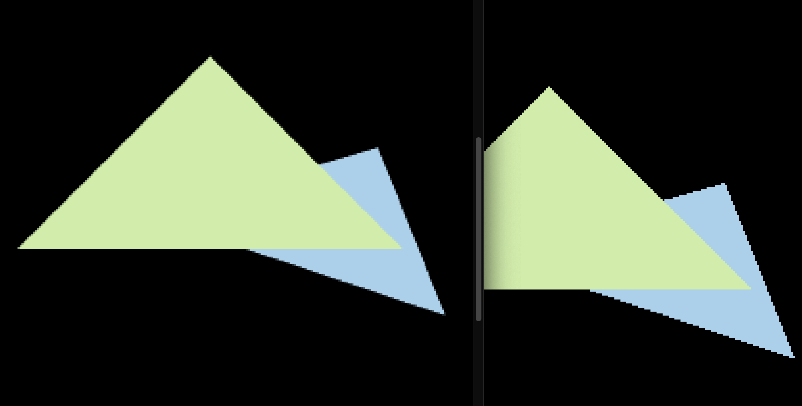

# Games101 作业

> 作业发布论坛：http://games-cn.org/forums/topic/allhw/

## 0

### general

- 熟悉 cpp。已经熟悉了
- 熟悉 Cmake，makefile。很重要
- 安装第三方 cpp 向量计算库 [Eigen](http://eigen.tuxfamily.org/index.php?title=Main_Page)
- 用虚拟机 virtual box。感觉不太想用，直接装在自己 mac 上吧。

### Eigen

#### 安装

参考 [stackoverflow](https://stackoverflow.com/questions/35658420/installing-eigen-on-mac-os-x-for-xcode) 的教程安装了

`brew install eigen`

Home-brew 下载在了`/usr/local/Cellar/eigen/3.3.7`

#### cmake

可以参考[官网](https://eigen.tuxfamily.org/dox/TopicCMakeGuide.html)的`CMakeLists.txt`来写

课程给的少了一行`target_link_libraries (Transformation Eigen3::Eigen)`加上去就好了，然后将引入的头文件的`eigen3`前缀给去掉，就行了。。。

_略坑_

#### vscode

但是如果直接用 vscode 的 coderunner 插件跑，是需要完整的`<eigen3/Eigen>`的路径。。。挺麻烦的

**好吧，还是配置了一下 vscode 的 c++tool**

需要在 includePaths 中加入 eigen3 所在的路径

`/usr/local/Cellar/**`

或者精确到` "/usr/local/Cellar/eigen/3.3.7/include/eigen3"`

这样就可以和 cmake 保持一致了。。。。好累。。。。

看教程的时候发现还有一个方法：

将 eigen 文件夹软连接到`/usr/local/include/`下面就行了。。。。。发现居然也有了。。

```bash
lrwxr-xr-x    33 koyote 31 5  0:07    c++ -> ../Cellar/gcc/9.3.0_1/include/c++
lrwxr-xr-x    36 koyote 27 10 16:00   eigen3 -> ../Cellar/eigen/3.3.7/include/eigen3
```

所以只需要在`c_cpp_properties.json`的 includePath 加上`/usr/local/include`即可，但是这样和 cmake 又冲突了。晕

#### 折中的办法

1. 软连接`ln -s /usr/local/Cellar/eigen/3.3.7/include/eigen3/Eigen /usr/local/include`直接把 Eigen 文件夹 ln 到`/usr/local/include`
2. vscode 配置 includePath `/usr/local/include`
3. `CMakeLists.txt`中加入`target_link_libraries (Transformation Eigen3::Eigen)`
4. 所有代码中导入路径都以`Eigen`开头来满足所有场景
5. `eigen3/`开头的路径现在也能满足运行

存在风险：只用了 Eigen 这个路径，到时候如果`eigen3/Other`这样的情况就不太妙了（估计不会出现。。）

#### 一切皆 Matrix

```c++
Matrix<typename Scalar, int RowsAtCompileTime, int ColsAtCompileTime>
// 类型 行 列
```

`typedef Matrix<float, 4, 4> Matrix4f;`

`typedef Matrix<float, 3, 1> Vector3f;`

`typedef Matrix<int, 1, 2> RowVector2i;`

#### 动态类型

可以不用在编译的时候确定类型！

`typedef Matrix<int, Dynamic, 1> VectorXi;`

`typedef Matrix<double, Dynamic, Dynamic> MatrixXd;`

#### 矩阵/向量计算

`v.dot`点积

`v.cross`**叉积**(给忘了，自己手写的。。。。)

`v.transpose()`转置

`v.conjugation()`共轭

```c++
#include <cmath>
#include <Eigen/Core>
#include <Eigen/Dense>
// Eigen/Dense header file defines all member functions
// for the MatrixXd type and related types
#include <iostream>

using namespace std;
using namespace Eigen;

using Eigen::MatrixXd;
// X dimensional double-typed matrix

double angle2radian(const double &ang)
{
    return ang * M_PI / 180;
}

double cosAng(const double &ang)
{
    return cos(angle2radian(ang));
}

double sinAng(const double &ang)
{
    return sin(angle2radian(ang));
}

Matrix2d rotateMat(const double &ang)
{
    Matrix2d mat;
    mat << cosAng(ang), -sinAng(ang), cosAng(ang), sinAng(ang);
    return mat;
}

Matrix3d translateMat(const double &dx, const double &dy, const double ang = 0)
{
    Matrix3d mat;
    mat << cosAng(ang), -sinAng(ang), dx, cosAng(ang), sinAng(ang), dy, 0, 0, 1;
    return mat;
}

void task()
{

    // 给定一个点 P =(2,1), 将该点绕原点先逆时针旋转 45◦，
    // 再平移 (1,2), 计算出 变换后点的坐标(要求用齐次坐标进行计算)。
    Vector2d P(2, 1); // 数据类型必须一样！
    cout << "rotate 45" << endl;
    cout << rotateMat(45) * P << endl;
    // cout << P.homogeneous() << endl; // homogeneous 是 append 1 的
    cout << translateMat(1, 2, 45) * P.homogeneous() << endl;
}
```

`cwiseProduct` multiplying two arrays coefficient-wise，也就是对应系数去与矩阵相乘

```cpp
#include <Eigen/Dense>
#include <iostream>

using namespace Eigen;
using namespace std;

int main()
{
  MatrixXf m(2,2);
  MatrixXf n(2,2);
  MatrixXf result(2,2);

  m << 1,2,
       3,4;
  n << 5,6,
       7,8;

  result = m * n;
  cout << "-- Matrix m*n: --" << endl << result << endl << endl;
  result = m.array() * n.array();
  cout << "-- Array m*n: --" << endl << result << endl << endl;
  result = m.cwiseProduct(n);
  cout << "-- With cwiseProduct: --" << endl << result << endl << endl;
  result = m.array() + 4;
  cout << "-- Array m + 4: --" << endl << result << endl << endl;
}
```

## 1

### Opencv on mac

`brew install opencv`

然后发现 brew 在`/usr/local/include`中软连接的还是`opencv/opencv4`这个路径，代码中一般都是导入`opencv2`这个前缀，那就多做一步

` ln -s /usr/local/Cellar/opencv/4.5.1_2/include/opencv4/opencv2 /usr/local/include`

如果某一天发现软连接失效了，那就是某次安装依赖的时候悄悄升级了 opencv，重新去原路径看一眼版本，重新连接一下就行

## 2

### SSAA

super sample anti-alias 通过超采样来消除锯齿

思路：

1. 采样：的时候直接扩大四个采样点，也就是 1 _ 1 => 2 _ 2
   1. 由于整个采样区域都翻倍了，相当于是每一帧画布都是两倍的数据量
2. 着色：计算出在三角形内部之后，更新超采样的 z-buffer
3. 渲染：用超采样的 frame buffer 做 2 _ 2 => 1 _ 1 的融合（直接平均）

效果：左为 ssaa


