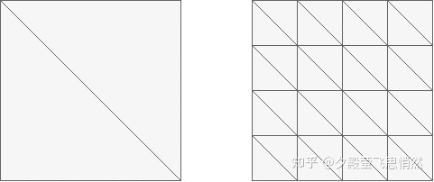
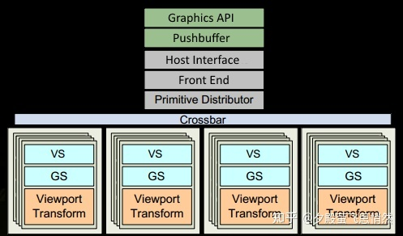
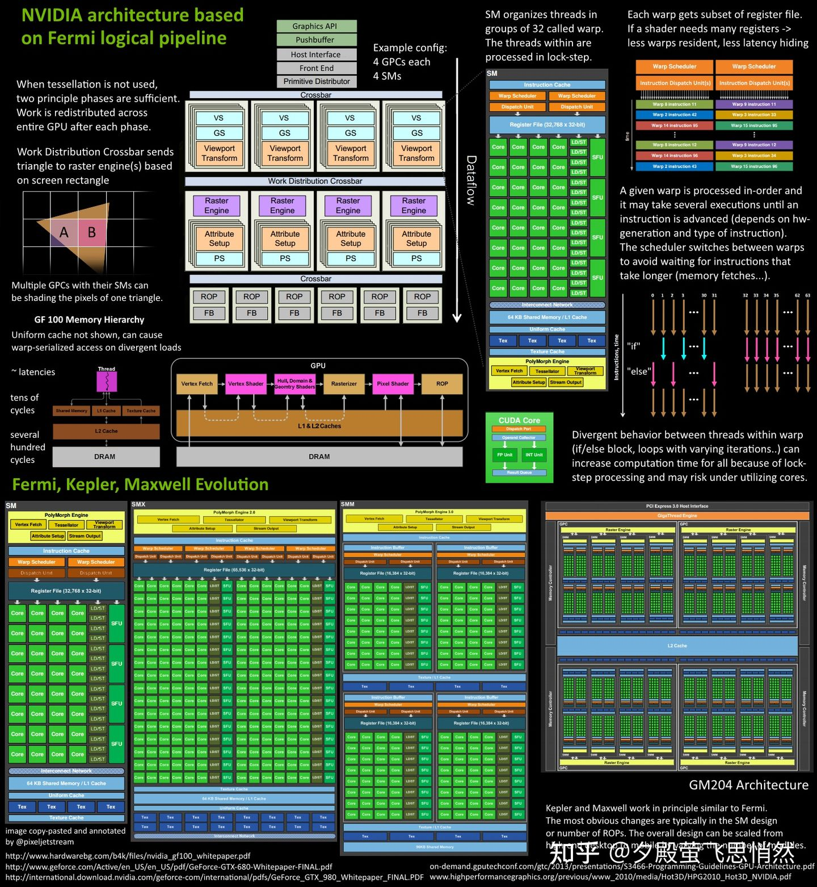

## intro

图形学就是绘制图像（2D），本质其实就是计算出每个像素点的颜色，每个像素可以放大放大放大成一个窗口，从这个窗口（viewport）看到的场景（3D）的颜色之和其实就是这个像素的颜色。通常有两种算法去计算像素的颜色（生成图像）

### 光栅化 rasterization

将三维场景的物体通过投影等变换（玩矩阵）到 viewport，相当于是把场景给拍扁到二维平面，拍扁之后其实三维场景中的多个点可以同时表示在图像上的同一位置，此时用深度信息/测试留下距离视角近的（当然就看得到）。

### 光线追踪 raytracing

不用将场景拍扁，而是从相机位置发出一条条光线，遇到物体就记录他的信息（颜色）。光线当然会在场景中反复弹射，因此计算量会十分巨大，需要硬件的支持

[On ray casting, ray tracing, ray marching and the like](http://www.hugi.scene.org/online/hugi37/hugi%2037%20-%20coding%20adok%20on%20ray%20casting,%20ray%20tracing,%20ray%20marching%20and%20the%20like.htm)

> 这篇讲了这三个名词到底分别对应了啥：
>
> - 起源的名词还是 ray casting，后两个都是他的变形
> - ray tracing 比较复杂，包含了光的反射的漫反射
> - ray marching 也叫 sphere tracing，是解决无**法通过解析式表达的物体**与光线的交点问题
>
> 还讲了 ray marching & sphere tracing 的概念和算法思路
>
> Ray marching also has the advantage over traditional ray casting that you need not have analytic formulas of the objects in the 3d scene. You may also use it with **volumetric data**, like a set of voxels. This is the technique that is used in 3d reconstruction of CT scans in clinical radiology, for instance.

## GPU

[知乎这篇讲 GPU 渲染管线的架构](https://zhuanlan.zhihu.com/p/61949898)

> 非常不错，很清晰的讲了图像被渲染过程中 GPU 的功能和设计，能够带来对图形学 GPU 的全景感知

### [深入 GPU 硬件架构及运行机制](https://zhuanlan.zhihu.com/p/357112957)

> - 理解 GPU 其物理结构和运行机制，GPU 由黑盒变白盒。
> - 更易找出渲染瓶颈，写出高效率 shader 代码。
> - 紧跟时代潮流，了解最前沿渲染技术！
> - 技多不压身！

#### 带着问题

1. GPU 是如何与 CPU 协调工作的？
2. GPU 也有缓存机制吗？有几层？它们的速度差异多少？
3. GPU 的渲染流程有哪些阶段？它们的功能分别是什么？
4. Early-Z 技术是什么？发生在哪个阶段？这个阶段还会发生什么？会产生什么问题？如何解决？
5. SIMD 和 SIMT 是什么？它们的好处是什么？co-issue 呢？
6. GPU 是并行处理的么？若是，硬件层是如何设计和实现的？
7. GPC、TPC、SM 是什么？Warp 又是什么？它们和 Core、Thread 之间的关系如何？
8. 顶点着色器（VS）和像素着色器（PS）可以是同一处理单元吗？为什么？
9. 像素着色器（PS）的最小处理单位是 1 像素吗？为什么？会带来什么影响？
10. Shader 中的 if、for 等语句会降低渲染效率吗？为什么？
11. 如下图，渲染相同面积的图形，三角形数量少（左）的还是数量多（右）的效率更快？为什么？

12. GPU Context 是什么？有什么作用？
13. 造成渲染瓶颈的问题很可能有哪些？该如何避免或优化它们？

#### GPU

> Graphic Processing Unit
>
> 和显卡的区别！除了 GPU 还有扇热器、通讯元件、与主板和显示器连接的各类插槽。

**功能**

- 图形绘制
- 物理模拟
- 海量计算（CUDA）
- AI 计算

**结构**（过于抽象）

共性组成：

- GPC：Graphics Processing Cluster
- TPC：Texture/Processor Cluster，纹理处理簇
- Thread
- SM、SMX、SMM：Stream Multiprocessor，流多处理器
- Warp
- SP
- Core
- ALU：Arithmetic Logic Unit
- FPU：Float processing unit，浮点计算单元
- SFU：Special function units，执行特殊数学运算（sin、cos、log 等）
- ROP：render output unit，渲染输入单元
- Load/Store Unit
- L1 Cache
- L2 Cache
- Memory
- Register File

程序员编写的 shader 是在 SM 上完成的。每个 SM 包含许多为**线程执行**数学运算的 Core（核心）。

GPCs -> SMs + 光栅化引擎 ->

先从这个图简单来看数据流在单个 **SM** 的处理流程：

1. Polymorph engine：多边形引擎，负责属性装配（attribute Setup）、顶点拉取(Vertex Fetch)、曲面细分、栅格化（这个模块可以理解专门处理顶点相关的东西）
2. 指令缓存：
3. Warp Schedulers：模块的打包调度（32 个线程为一组的线程束），打包后交付 dispatch unit 分发给计算单元
4. 128 KB 寄存器
5. Core：运算核心，也叫流处理器 SP
6. LD/ST（load/store）：加载和存储数据
7. SFU：来处理特殊运算
8. Interconnect Network：内部链接网络
9. 64 KB 共享内存/L1 缓存
10. Uniform cache：全局内存缓存
11. Tex：纹理处理单元

**GPU 逻辑管线**

1.

Fermi 架构的运行机制总览图：

**shader 运行机制**
