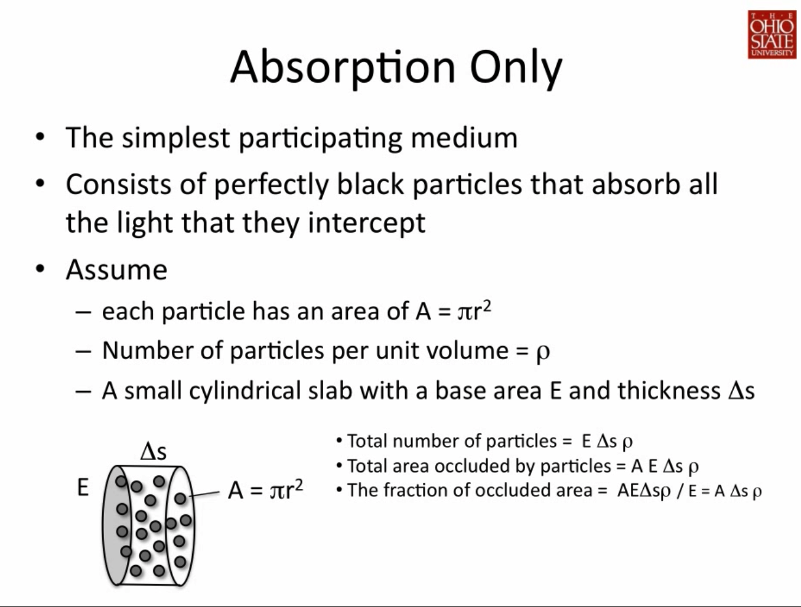
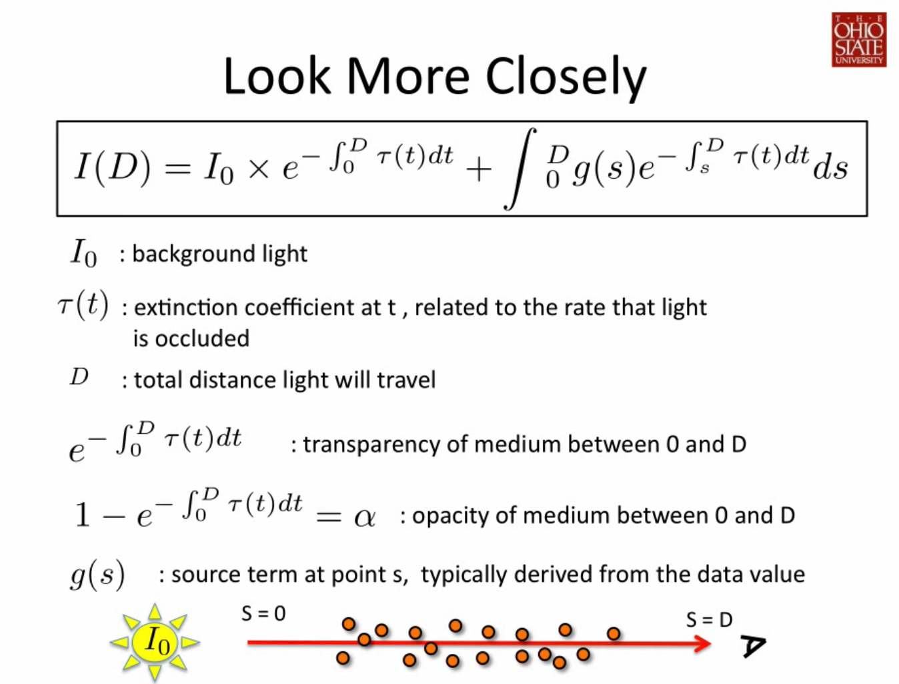
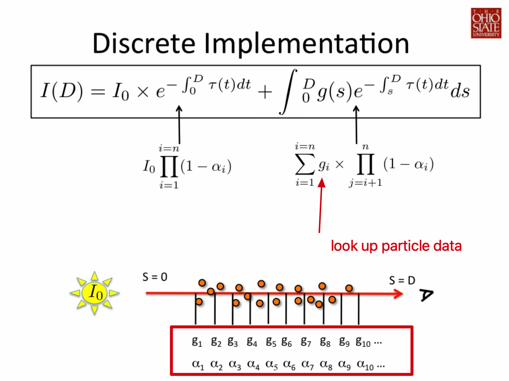

## 视频学习 direct volume rendering

> 来自油管：https://www.youtube.com/watch?v=IqIvK6EiBz8
>
> 论文在这：
>
> - https://ieeexplore.ieee.org/abstract/document/468400
> - https://www.docin.com/p-88690661.html

### 光照模型：

1. 光到 voxel（particle）经过吸收/反射的量，也就是透明度 alpha 或者 transpancy
   1. 公式推导
   2. 积分离散化
2. eye ray 到 particle 能得到的颜色（ray casting）
   1. shading：phong 模型
   2. classfication：transfer function
   3. blending
3. GPU 渲染管线
   1.

### 直接体绘制

- 输入：三维物体的体表达方式（voxel）
- 输出：一张二维图像

voxel -> 三维坐标空间 -> 材质、属性 -> f(coord)=> scalar -> transfer function

-> 坐标空间离散 -> 插值

direct volume rendering：

- ray casting
  - 普通 ray casting/ray tracing：求光线和三角面（图元）的交点
  - voxel 基础图元模型（没有基础的多边形）
    - **抽象成一个很小的圆柱体/面**，体内有很多个 voxel/particle
      - 圆柱面积为 $E$（可以同时理解为光线的截面积），厚度为 $\Delta s$
      - 其中粒子的密度为 $\rho$，$\rho(s)$
      - 光线到 voxel 面的距离为 $s$
    - 每个 voxel/particle 都抽象成小球
      - 每个小球在圆柱面上的投影面积 $A = \pi r^2$
- 从 image plane 出发的光线得到的颜色值（到达 voxel 的）
  - 光强
  - 颜色值
  - 材质（建模）
    - 吸收光
    - 发射光
    - 吸收发射光

### 光照模型

#### Absorption-only

E => S

s => d

黑洞粒子，吸收光，在圆柱面上遮挡光线，所以需要算出光线遇到黑洞粒子之后被遮挡了多少，也就是光线吸收率

算出在 $E$ 面积上的 volume，有多少个粒子即可

圆柱体积：$E \Delta s$

粒子个数：$ \rho E \Delta s$

粒子在圆柱面投影的面积：$\rho E \Delta s A$

粒子在圆柱面投影的面积所占圆柱面积的比例（除以圆柱面积）：$\rho\Delta s A$

当 $\Delta s$ 趋近于 0 的时候，可以近似为光线被这个圆柱面遮挡的情况，遮挡率就是面积比例，最终到达该黑洞粒子 voxel 的光线微分方程（光线被这个小圆柱面吸收的光线）：

$$
\frac{dI}{ds} = -\rho(s)AI(s) = -\tau(s)I(s)
$$

这里的 s 就是光线射线方向的长度，$\Delta s$ 其实也是这个方向上的微分，负号表示吸收，$\tau(s)$ 是 extinction coefficient 定义了被遮挡的比例，$\rho(s)$ 表示在 s 距离上的粒子密度（其实也是一个属性吧，能查表拿到）

解这个方程得到：

$$
I(s) = I_0e^{-\int_0^s\tau(t)dt}
$$

$I_0$ 是背景光？距离为 0 时产生的光强？这个背景光可以理解为没有这些粒子遮挡的时候看到的光强，从背景光的方向射入眼睛，途径距离长度 s 的粒子遮挡，遮挡率就是在 0-s 距离的体可见度

$e^{-\int_0^s\tau(t)dt}$ 这个求出来的积分值就是在 0-s 距离物体的可见度（opacity），用 1 减去这个值就是 alpha 了，_alpha = 1（颜色给满了）=> non-opaque => opacity = 0（毫不透光）_

$\tau(t)$ 每个距离微分上的 extinction coefficient，好吧有道词典居然能翻译出来“消光系数”，其实是每个 voxel 对应的一个属性，可以通过 transfer function 查表拿到，可以像是一个灰度 volume map，每个坐标在不同区间得到的 $\tau$ 不一样，更一般的情况，对应的 transfer function 是一个连续变化的函数

#### Emission-only

体介质中的粒子还有可能通过散射、自发光等情况**给光路上的光线增加强度**。

假定每个粒子在单位面积上发出的光的投影在圆柱面上的面积为 $C$

粒子在圆柱面投影的面积：$\rho E \Delta s A$

在圆柱面上贡献的光强为：$\rho E \Delta s AC$

除以面积 $E$ 得到贡献率：$\rho \Delta s AC$

得到光线所在 s 位置的微分方程：

$$
\frac{dI}{ds} = \rho(s)AC(s) = \tau(s)C(s) = g(s)
$$

$g(s)$ 被称为 source term 在 s 位置的属性。btw 这个方程太好解了：

$$
I(s) = I_0 + \int_0^sg(t)dt
$$

#### Absorption plus emission

真实情况是吸收和发射光会同时发生

$$
\frac{dI}{ds} = g(s) - \tau(s)I(s)
$$

最终得到：

$$
I(D) = I_0e^{-\int_0^D\tau(t)dt} + \int_0^Dg(s)e^{-\int_s^D\tau(t)dt}ds
$$

- 体边缘（近背景光的边） s = 0，人眼位置 s = D
- 第一部分：背景光在 D 距离上被吸收之后还剩余的光
- 第二部分：一个求和（积分），从体边缘开始，每个粒子的发出的光 $g(s)$（source term）被 s-D 距离上的粒子遮挡后求和，就是 0-D 距离上发光贡献的总和。

#### Calculation method

直接体绘制就是求出这个值，近似的方法（离散化）黎曼积分近似

$$
\int_a^bh(x)dx\approx\sum_{i = 1}^nh(x_i)\Delta x
$$

把 0-D 分成 n 份采样，$\Delta x = D/n$，每个 $x_i = 0 + i\Delta x$

可以近似

$$
e^{-\int_0^D\tau(t)dt} \approx exp(-\sum_{i = 1}^n\tau(i\Delta x)\Delta x) = \prod_{i = 1}^nexp(\tau(i\Delta x)\Delta x) = \prod_{i = 1}^nt_i
$$

$t_i$ 可以理解为第 i 段的透明度，也就是 $(1 - \alpha_i)$

第二部分近似：

$$
\sum_{i = 1}^ng_i \prod_{j = i + 1}^n(1 - \alpha_j)
$$

最终：

$$
I(D) = I_0 \prod_{i = 1}^nt_i + \sum_{i = 1}^ng_i \prod_{j = i + 1}^nt_j = g_n + t_n(g_{n-1} + t_{n-1}(g_{n-2} + ... + t_2 (g_1 + t_1I_0) + ...)))
$$

至于这个怎么得到滴，展开累乘，先提取出 $t_n$ 再 $t_{n-1}$，以此类推，规律就是从内到外，每个 $T(i) = t_i(g_{i-1} + T(i-1) )$

计算方式两种：

- back-to-front
  - I = I0
  - for loop
    - I = t[i] \* I + g[i]
- front-to-back
  - I = 0
  - T = 1
  - i = n
  - While T > small_threshold && i >= 1
    - I = T \* I + g[i]
    - T = T \* t[i] // 累成 ti
    - --i

#### Scattering and Shading

- Voxel volume ->
- f(coord)=>scalar ->
- transfer function => color or alpha or... ->
-
