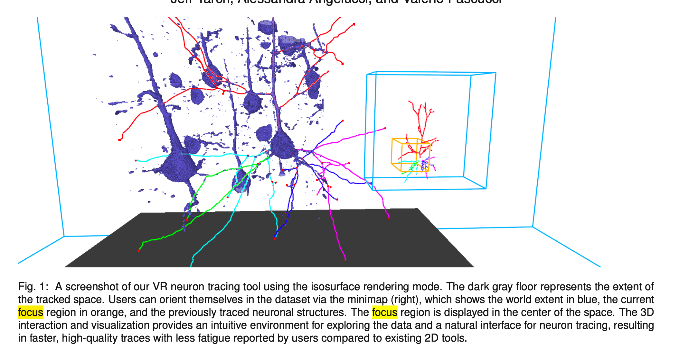
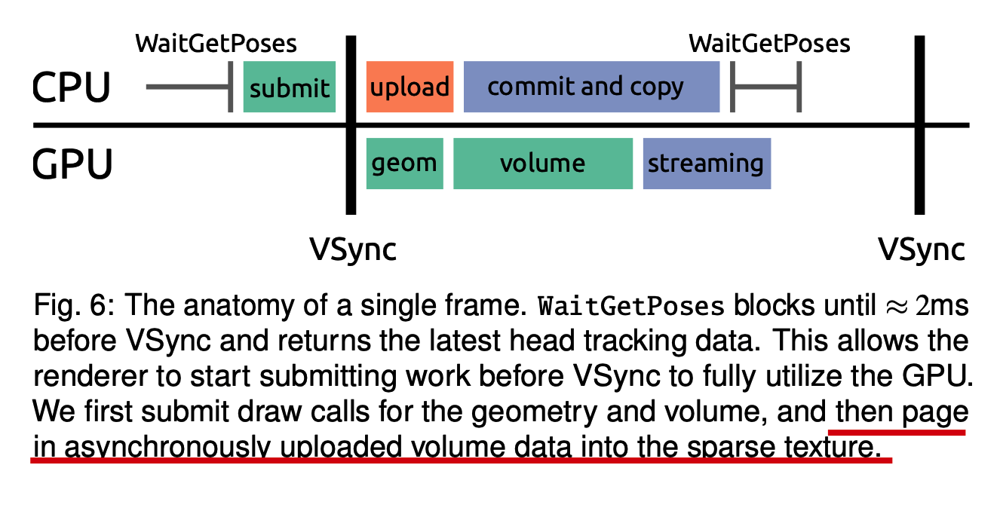

# A Virtual Reality Visualization Tool for Neuron Tracing

> 神经追溯？neuron tracing 在 VR 场景的这么一个方案

_搞清楚在计算机渲染的过程，CPU 和 GPU 分别干了什么事情？_

一个连接组学的神经（元）跟踪任务

任务的困难和挑战：

- 海量的数据集大小 terabytes
- 神经元重建，人工 & 半自动

## 背景

### Neuron Tracing Workflow

> 目标：神经元被可视化，通过人工的方式去标记它们之间的连接性

- 往脑部注入病毒蛋白（应该是无毒无害的吧），能够在 MRI scanner 下得到更高的分辨率
- 被采集为 2D 的图片切片，堆叠起来，可以用于脑补结构分析等等
- 由于大量的 noisy，通过人力去做 tracing 的标记工作，NeuroLucida 软件
  - 难度大：分支变化快、交错复杂

### Why in VR

- **能够在 3D 空间中，更好的给手工标记的人理解模型，traceing task 更加便捷和准确**

VR

VR 的问题：设备和系统太昂贵了，购买和维护成本很高

## 设计思路

> 搞了半天，本文只是设计了一个消费级的 VR 可视化系统，用于神经元科研
>
> the goal of investigating consumer-grade VR tech- nology for scientific visualization
>
> VR 系统：
>
> - 硬件设备，交互方式
> - 软件算法：visualization，volume rendering...
> -

### 技术调研

VR 系统的设备和交互方式

## Rendering

> 直接看怎么 render 的

满足以下几个条件：

- 高刷新率，避免让用用户产生眩晕感，达到 90 fps -> 11ms 渲染一张图
- 高分辨率，超采样，翻倍的 pixel 渲染

对比：桌面应用渲染：低帧率，加载数据和计算的间歇时间是可以容忍的

GPU 是 pipeline 的工作机制，所以一次 command 的提交并不会立即执行，会放到一个 queue 中缓存着（感觉前端框架也是借鉴这样的机制？）

Vlachos 的论文建议说在 **VSync** 之前的 2ms 去提交 draw 操作

_什么是 [VSync](https://www.digitaltrends.com/computing/what-is-vsync/)？_

Vertical-sync: GPU 同步数据的技术，同步什么？当显示器（monitor）的刷新率跟不上真实的 fps，会出现撕裂没对齐的效果，叫做 [tearing](https://en.wikipedia.org/wiki/Screen_tearing)

[double buffering and page flipping](https://en.wikipedia.org/wiki/Multiple_buffering#Double_buffering_in_computer_graphics)

Streamlining rendering performance requires **pushing all non- rendering or non-critical work onto background threads** and strictly budgeting work on the render thread.

看一下下图，一帧图被渲染的流程

_下摘自论文_

1. First, wait until ≈ 2ms before VSync by calling WaitGetPoses from the OpenVR SDK (left side of CPU in picture above :arrow_up: ), which obtains the most recent head position.
2. After returning from this function, we submit all rendering work to the GPU. Opaque geometry, e.g., the wands and tracings, is rendered first (1ms).
3. Next, the volume is rendered with ray-marching to display a volumetric or implicit **isosurface** representation (4ms).
4. After submitting the rendering work, _we start the asynchronous volume data upload based upon the user’s focus region_, and once the rendering finishes, we copy it into the sparse texture (2ms). 异步的 upload 到哪里去呢？
5. This time budget leaves a buffer of 3ms to prevent unpredictable interferences that could cause dropped frames.

_isosurface？_

### 数据流/格式

两层缓存系统：可以大幅减少硬盘的访问频率

1. 加载和缓存硬盘的数据到 RAM
2. The caching system lets the tool keep **the current focus region and a small neighborhood resident on the GPU**, while **a substantial history is cached in RAM**

The first-level cache takes page requests and immediately returns a future [6], which can be used to retrieve the page data. In case the page is not available in the cache, a worker thread will be responsible for loading the data from disk while the requester can asynchronously check for completion and retrieve the page.

The second-level cache pushes **page queries** to a set of worker threads, which request the page from the first-level cache and copy the data into persistently mapped **pixel buffer objects (PBOs)**. By uploading via persistently mapped PBOs, we take advantage of asynchronous data transfers via the GPU’s copy engines, thereby **overlapping rendering work with data transfers**. 在从内存上传到 opengl 内存的过程，是异步的，能够并行（交错）做其他数据转移的操作

_pixel buffer object_: a buffer object is used for asynchronous _pixel transfer_ operations（来自 [opengl 解释](https://www.khronos.org/opengl/wiki/Pixel_Buffer_Object)）

_pixel transfer_: 将内存中的 pixel（unformatted，pack 数据）转移（uploading）到 opengl 内存（unpack 过程 uploading），或者反之 downloading（来自 [opengl](https://www.khronos.org/opengl/wiki/Pixel_Transfer)）

所用的技术也是 VSync 和上面提到的 double buffering 和 page flipping 吧？（存疑）

### Volume rendering

> 这里的 volume rendering 是怎么做的呢？

#### Step into the volume

在 VR 场景，我们会走到数据内部（step into the data）

- 观测到的数据会 vibrate？或者移动的很轻微，就可以想象是很小的视角变化带来的画面变化
- eye ray 在数据内部的偏移量会采样到不同的位置
  - 可以通过超采样/增加采样率去解决
  - 但是在 VR 中的开销太大了。。
- 这个问题类似：At its core, the issue is similar to ensuring correct ray sampling across subvolumes in distributed volume rendering [28].

这里的解决方案：

To ensure **consistent sampling** of the data when inside the volume, we begin sampling at the sample point nearest to the **clipping plane**, ==based on starting the ray from its entry point into the volume bounds.== **This approach corrects only for translation, but we found it sufficient in practice.**

- consistent sampling：为了解决数据内部 eye ray 的 offset 的吧
- clipping plane：是什么呢？
- 高亮的做法：如何理解？
- 只在 translation 的过程中有效，但已经足够了

#### gradient shading

_眼压和图像展示的 depth cues 还有关？_

深度信息不容易获取，弱光线和使用透明转换函数（transparent transfer function）的时候

-> 导致不能准确的定位魔杖（画神经元轨迹的设备）在神经元内部的位置

- 全局光照、阴影能解决深度信息的准确性，但是还是在 VR 中不能保证很高的 fps，内存消耗也很大

所以在只有 gradient shading 的操作下，尽可能的保障 fps 和画质（其实就是加强深度信息的获取）

- switch to an implicit **isosurface mode**, with **Phong shading** and **ambient occlusion** [19]
- **front faces**：半透明的渲染，能够让用户看到画笔和轨迹的位置（在神经元中）
- **back faces**：完全不透明的渲染，这样就能很好的获取深度信息了
  - 问题是这两种 faces 是啥意思呢。。

#### Noise

噪音处理：we de-noise the data by **filtering out objects less than 11 voxels in size before uploading the page** to the GPU by finding small connected components.

#### Performance

- 和所需要被渲染的光线（就是被画的 pixel）直接挂钩
- 设备的分辨率要求比较高，但是只要是两眼中间的部分高就行了？

In the periphery, due to lens distortion and the properties of the human vision system, it is possible to render at much lower resolutions (e.g., using the NV clip space w scaling extension) with little to no perceived difference.

在外围的图像可以不那么高分辨率

## 后文

后面就是讲产品如何记录和评估可靠性的实验

以及评估的结果，和收到的体验者反馈（追踪路径、引导、渲染三个方面）

未来的一些改进措施

- A combined rendering mode [23]
- render performance 的提升，为了更好的用户体验
- 软件开源了？

全文的结论
