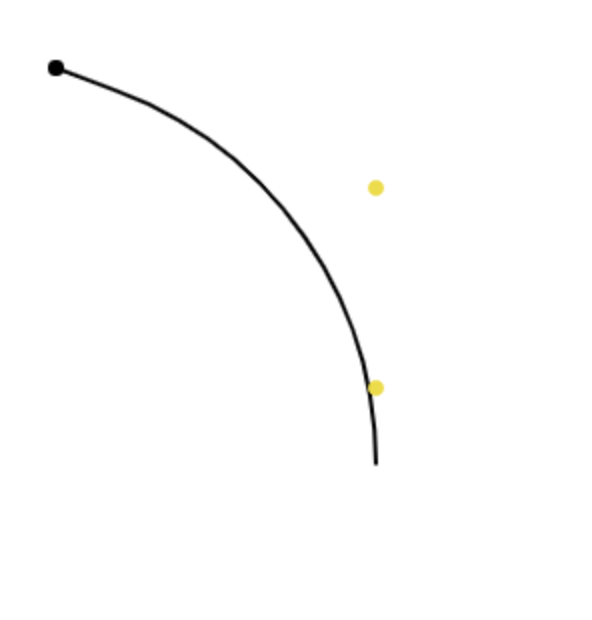

# canvas 入门

## 前期准备

canvas 标签基本使用

```html
<canvas id="canvas" width="150" height="150"></canvas>
```

有宽高属性，如果不设置，默认宽高为 300px \* 150px

当然 css 也可以设置各种属性，但是如果在渲染的时候出现扭曲，还是建议在标签上设置宽高。

**fallbcak 内容**

如果浏览器不支持`canvas`标签，可以设置降级的内容，浏览器会直接读取里面的内容，而会忽视掉`canvas`这个容器标签

内容可以用一张图片来替代最好

```html
<canvas id="stockGraph" width="150" height="150">
  your browser doesn't support canvas!
</canvas>
```

**一定需要关闭标签**

不然后续的内容都会被认为是 fallback 的，就不展示了！`<canvas id="foo" ...></canvas>`

**渲染上下文**

这个标签元素提供了一个固定尺寸的画画平面，对外暴露了一个或多个渲染上下文（rendering contexts），这个上下文就好比是操控图像元素的一个接口，我们通过这个接口人告诉我们像画的内容，他在 canvas 上帮我们画。

主要我们用到 2d 的绘图，当然其他的上下文也有 3d 的（webgl）

canvas 初始是空白的，有一个`getContext()`方法来获取，指明那个 2d 的接口人[`CanvasRenderingContext2D`](https://developer.mozilla.org/en-US/docs/Web/API/CanvasRenderingContext2D)

```js
const canvas = document.getElementById("canvas");
const ctx = canvas.getContext("2d");
```

**查看兼容性**

```js
var canvas = document.getElementById("tutorial");

if (canvas.getContext) {
  var ctx = canvas.getContext("2d");
  // drawing code here
} else {
  // canvas-unsupported code here
}
```

**绘图网格**

毕竟也是基于像素画图，通常 canvas 上一个坐标就对应着一个 pixel

上下文的原点也是 canvas 画布的左上角

存在像素转换的问题，参考 devicePixelRatio 的问题，之后会详谈

## 动手画图

不像 SVG，canvas 这个画家只**接受两种原始图形：长方形和路径**（多个点连成的线）

Ps svg 还没学呢。。。

### Rectangles

`fillRect(x, y, width, height)`: 涂满一个长方形区域

`strokeRect(x, y, width, height)`: 画长方形的轮廓

`clearRect(x, y, width, height)`: 清空一块长方形区域，让他变得透明

### Paths

一连串的点组成，用线连接

步骤：

1. create a path
2. draw into path
3. stroke or fill the path

**方法**

`beginPath()`: 开始构造一条路径，开始之后由路径的各种方法来画

Path methods

`closePath()`: 封闭这条路径

`stroke()`: 画路径轮廓，如果需要封闭的话要 closePath

`fill()`: 填充封闭路径

第一步总是调用`beginPath`，内部会用一个 list 来保存子路径，每次调用的时候 list 都会被重置，开始画路径的第一条指令都是`moveTo()`

#### 移动

`moveTo(x, y)`: 让画笔到某个位置

```js
const smile = (ctx) => {
  ctx.beginPath();
  ctx.arc(75, 75, 50, 0, Math.PI * 2, true); // Outer circle
  ctx.moveTo(110, 75);
  ctx.arc(75, 75, 35, 0, Math.PI, false); // Mouth (clockwise)
  ctx.moveTo(65, 65);
  ctx.arc(60, 65, 5, 0, Math.PI * 2, true); // Left eye
  ctx.moveTo(95, 65);
  ctx.arc(90, 65, 5, 0, Math.PI * 2, true); // Right eye
  ctx.stroke();
};
```

#### 直线

`lineTo(x, y)`: 从当前画笔的位置移动，并一根线到目标点

#### 圆弧

`arc(x, y, radius, startAngle, endAngle, anticlockwise: boolean)`:

- 在 x，y 的位置画弧线
- 半径
- 开始的角度（弧度制），和学习三角函数的坐标轴是一样的
- 结束的角度
- 是否是逆时针画
- **画点可以通过半径给的小一点，然后 fill()**

#### 弧线

`arcTo(x1, y1, x2, y2, radius)`:

1. 首先 moveTo 一个起始点位 p0
2. 然后 arcTo(p1, p2, radius)，这里 p1，p2 代替坐标了
3. 然后 stroke

这样就能画一条弧线，这条弧线是从 p0 到 p2，途中偏向 p1 的趋势，实际上这条弧线是和直线 `p0p1`，直线`p1p2`相切的

**注意：**

- 半径如果给的过大，就偏了。。
- 半径如果给 0，就和 lineTo(p1)没区别

```js
const arcTo = (ctx) => {
  // p0 (20, 20) p1 (100, 50) p2 (100, 100)
  // 画 arc
  ctx.beginPath();
  ctx.moveTo(20, 20);
  ctx.arcTo(100, 50, 100, 100, 100);
  ctx.stroke();
  // 画 p0
  ctx.beginPath();
  ctx.fillStyle = "#000";
  ctx.arc(20, 20, 2, 0, 2 * Math.PI);
  ctx.fill();
  // 画 p1 和 p2
  ctx.beginPath();
  ctx.fillStyle = "#eedd12";
  ctx.arc(100, 50, 2, 0, 2 * Math.PI);
  ctx.arc(100, 100, 2, 0, 2 * Math.PI);
  ctx.fill();
};
```



#### Bezier 曲线

硬核 but 有趣的东西来了
