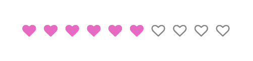
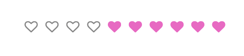

# 3 行核心 CSS 代码实现 rate 组件

> 来自文章：[3 行核心 CSS 代码的 rate 评分组件，秀到你怀疑人生](https://mp.weixin.qq.com/s/FE3IuNu66VxLDgHCHWIRVA)
>
> 自己实现了一下，代码：html/3_CSS_lines_rate/3_CSS_lines_rate.html

## TL;DR

最终效果：



需要准备的事情：

1. 寻找 icon 字体

个人认为的核心 CSS 代码：

1. ` -webkit-appearance: none;`：让 input radio 的样式消失
2. `el1~el2` CSS 选择器：让一个元素被选中能使后续的所有兄弟元素被选择
3. `flex-direction: row-reverse;`：flex 布局的逆序

可以提升的：

1. 只实现了 UI 效果，具体的数据逻辑层为实现
2. 字体能不能换成 svg 呢
3. 选中，hover 的其他效果（比如放大）就自己加啦

## 物料准备

首先去搞定评价星星 icon 的字体文件生成对应的 font-family

1. 推荐在 [fontello](https://fontello.com/) 这个网站上选择 icon 直接下载（同时选择多个 icon，以便不时之需）

2. 下载一个空的 :heart_decoration: 和一个满的 :purple_heart:

3. 将下载后的 css 文件直接引入 html 即可

   ```html
   <link rel="stylesheet" href="./fontello-6af5bc49/css/fontello.css" />
   ```

4. 在 css 文件中找到对应的 content，和 `@font-family` 定义的 font family

   ```css
   .icon-heart-empty:before {
     content: "\e800";
   } /* '' */
   .icon-heart:before {
     content: "\e801";
   } /* '' */
   ```

## Html

rate :heart: dom 结构：数量任意了

用 radio 获取用户点击

```html
<div class="rate-content">
  <input type="radio" name="rate" />
  <input type="radio" name="rate" />
  <input type="radio" name="rate" />
  <input type="radio" name="rate" />
  <input type="radio" name="rate" />
</div>
```

## CSS

去掉 radio 默认的样式，稍后换上我们准备好的字体

```css
.rate-content input[name="rate"] {
  -webkit-appearance: none;
  border: none;
  outline: none;
  cursor: pointer;
  font-family: "fontello";
}
.rate-content input[name="rate"]::after {
  content: var(--non-selected-content);
  color: var(--basic);
}
```

当然前面需要定义颜色和选中的内容

```css
:root {
  /*高亮颜色*/
  --main: #ee84ce;
  /*默认颜色*/
  --basic: #999;
  /* 选中内容 */
  --selected-content: "\e801";
  --non-selected-content: "\e800";
}
```

实现选中以及 hover 之后改变为满的爱心，**包括选中元素后面的所有具有相同父元素的元素**，这里用到了 `el1~el2` 选择器

```css
.rate-content input[name='rate']:checked::after,
.rate-content input[name='rate']:hover::after,
/* 选择有相同父元素 checked 之后的所有 input */
.rate-content input[name='rate']:hover ~ input[name='rate']::after,
.rate-content input[name='rate']:checked ~ input[name='rate']::after {
  content: var(--selected-content);
  color: var(--main);
  transition: all 0.4s ease;
}
```



最后，因为 `~` 选择器是选择了**后面的所有元素**，需要做一个逆序就可以让他正过来啦

```css
.rate-content {
  display: flex;
  flex-direction: row-reverse;
  justify-content: center;
}
```


## TODO

- 可以封装成 react 代码组件，配置化更高，返回评价数量，颜色渐变
- 尝试用 svg，而不是 font
