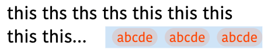
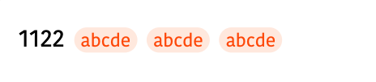

# 多行文本展开

> 高级技巧，CSS 实现
>
> 参考文章：
>
> - [1. 展开文本](https://zhuanlan.zhihu.com/p/373359523)
> - [2. 小图标跟随文本且多行省略](https://blog.csdn.net/java_wzh123/article/details/124322590)

## 最终效果





文字表述：文本最后跟随的尾部元素，文本可以进行多行省略

## 实现思路

_纯 CSS 实现，能满足 99% 的场景_

1. 文本多行截断省略，比较常见了

```less
// less mixin
.text-multi-ellipsis(@lines:2) {
  overflow: hidden;
  text-overflow: ellipsis;
  overflow-wrap: break-word;
  display: -webkit-box;
  -webkit-line-clamp: @lines;
  -webkit-box-orient: vertical;
}
```

2. 尾部元素通过 float 占位：
   1. float 并没有过时！
   2. float 能够让其他元素形成包裹

```html
<div class="text">
  <span class="end">t</span>
  text text text text text
</div>
```

```less
.end {
  float: right;
}
```

3. 让尾部元素跑到 `...` 的旁边，移动这个元素，这里通过第二个 float 把尾部的 float 顶下去
   1. 如果先看了上面第一篇文档，text 容器如果是自动宽高的话其实不需要 flex，也能让为元素的 height 100% 生效

```less
// 让文本的容器中再多一个 float
.text {
  &::before {
    content: "";
    float: right;
    width: 0;
    height: calc(100% - 尾部高度);
  }
}
// 同时让尾部元素 clear both 让他在前一个 float 下面 这样通过前一个 float 来控制他的位置！
.end {
  float: left;
  clear: both;
}
```

4. 到这多行的尾部已经实现，但是单行的时候，尾部还是 float 在尾部位置，不太满足紧跟的需求
5. 于是第二篇文章的思路是：

   1. 在多放一个紧跟着的元素，然后通过 text 容器的 after 伪元素来遮挡 float 元素

6. 这样能够解决大部分场景，但是尾部元素长度较长/大的情况就 hold 不住了（换行之后，after 不能遮挡到换行之后的内容了）

**“1% 的情况”使用 JS（我这里觉得 CSS 已经到头了，不得不让 JS 介入）：**

7. 判断是否展示尾部 float 的元素：如果是两行就展示，一行就不展示
8. 判断两行：计算 text 内容的高度，和单行文字的高度，如果前者大，就认为是展示多行了
   1. 单行文字高度：用零宽字符来做计算～

## 兼容性

以上方案其实是存在兼容性的，比如在安卓/IOS 的 webview 中，`display: -webkit-box` 其实会影响伪元素的高度，导致没办法通过伪元素来控制尾部元素的位置，所以需要手动的控制 overflow

```less
// 设置 line height 和 max-height
line-height: @titleLineHeight;
max-height: @line * @titleLineHeight;
overflow: hidden;
```

截断的 `...` 只能通过尾部元素的伪元素来实现了

```less
&::before {
  content: "...";
  position: absolute;
  font-size: 15px;
  left: 3px;
  color: @titleColor;
}
```

但是这样就会导致 `...` 有的时候会和文字分的很开

所以又再次使用 js 来做溢出的判断：

- 文案内容 + 尾部文案长度 整体判断是否溢出：
  - 元素的 scrollHeight > clientHeight 即溢出
- 溢出了，则用 float 的元素
- 无溢出，则直接跟随文案展示即可

最后 dom 结构长这样（react）

```tsx
<div
  ref={textContainerRef}
  className={`content__main__title ${
    !label_list?.length && tagShowMode ? "content__main__title--no-tags" : ""
  }`}
>
  {tagShowMode === "float" ? renderTagGroup(true) : null}
  {title}
  {/* 需要整体长度来判断是否行溢出了 */}
  {!tagShowMode ? <span className="hidden">{tagContent}</span> : null}
  {tagShowMode === "inline" || !tagShowMode ? renderTagGroup() : null}
</div>
```

## 总结

这种混排模式确实很复杂了，也是搜索了半天才找到解决方法，好评！

利用 float 的思路确实很厉害，学到了，利用第二个 float 来控制第一个 float 位置的想法也很牛！
