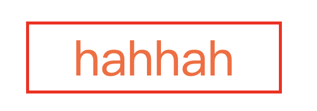
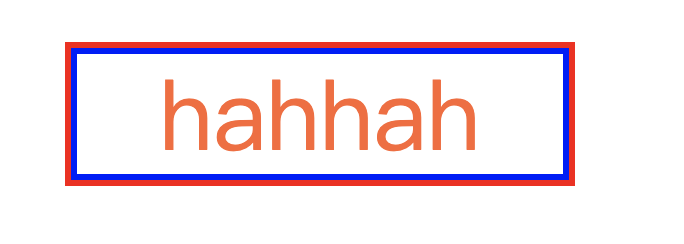
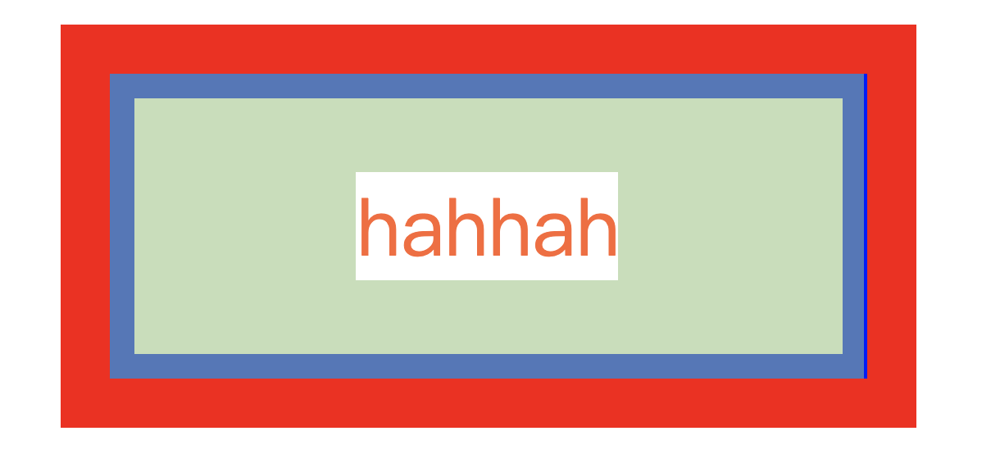

# 积累 CSS 各种技巧

## _一些 links 收藏_

> https://github.com/AllThingsSmitty/css-protips
>
> https://markodenic.com/css-tips/
>
> [45 个 CSS 形状](https://segmentfault.com/a/1190000018922732)

## CSS 希望 height 100% 但外层仅用了 min-height

此时 height 不会生效

[stackoverflow 给出了答案](https://stackoverflow.com/questions/6995581/css-100-height-of-container-with-min-height)

外层用 `position: relative`，内层 absolute 定位即可。

或者用 `min-height: inherit;` 也行。

## 修改滚动条样式

```css
div::-webkit-scrollbar {
  display: none;
}
```

- `div::-webkit-scrollbar` 滚动条整体部分
- `div::-webkit-scrollbar-thumb` 滚动条里面的小方块，能向上向下移动（或往左往右移动，取决于是垂直滚动条还是水平滚动条
- `div::-webkit-scrollbar-track` 滚动条的轨道（里面装有 `Thumb`
- `div::-webkit-scrollbar-button` 滚动条的轨道的两端按钮，允许通过点击微调小方块的位置
- `div::-webkit-scrollbar-track-piece` 内层轨道，滚动条中间部分（除去
- `div::-webkit-scrollbar-corner` 边角，即两个滚动条的交汇处
- `div::-webkit-resizer` 两个滚动条的交汇处上用于通过拖动调整元素大小的小控件注意此方案有兼容性问题，一般需要隐藏滚动条时我都是用一个色块通过定位盖上去，或者将子级元素调大，父级元素使用 `overflow-hidden` 截掉滚动条部分。暴力且直接。

## 隐藏页面元素

- `display-none`: 元素不存在，从 `dom` 中删除
- `opacity-0`: 元素透明度将为 0，但元素仍然存在，绑定的事件仍旧有效仍可触发执行。
- `visibility-hidden`：元素隐藏，但元素仍旧存在，页面中无法触发该元素的事件。
- 同样在 html tag 直接用 `hidden` 属性也等同于 `display: none` 的效果

### CSS3 background-color: currentColor

> [张鑫旭文章](https://www.zhangxinxu.com/wordpress/2014/10/currentcolor-css3-powerful-css-keyword/)
>
> 以及在看 [antfu 纯 css 图标](https://antfu.me/posts/icons-in-pure-css-zh)中看到对于单色图标可以用 mask 图片，用 `background-color: currentColor` 来实现跟随上下文颜色。

顾名思意就是“当前颜色”，准确讲应该是“当前的文字颜色”

凡事需要使用颜色值的地方，都可以使用`currentColor`替换，比方说背景色 – `background-color`, 渐变色 – `gradient`, 盒阴影 – `box-shadow`, SVG 的填充色 – `fill`等等。很灵活，很好用！

`::hover` 状态同时改变 icon 的背景色（随着 hover 状态下的文字颜色变化）

图文合一

和 `inherit` 的[区别](https://stackoverflow.com/questions/65591442/whats-the-difference-between-color-inherit-vs-color-currentcolor)？

- `inherit` 只是继承父元素上相同属性的值
- `currentColor` 是可以跟随最近的颜色，可以跨属性，比如取 border/background 的颜色

## 干掉点击 div 的效果（H5）

```css
div,
a,
img {
  -webkit-tap-highlight-color: transparent;
  -webkit-user-select: none;
  user-select: none;
}
```

## 一行 CSS 实现全站中文简繁转换

> from [张鑫旭](https://www.zhangxinxu.com/wordpress/2021/01/css-simplified-traditional-chinese/)

`font-variant-east-asian: traditional;`

当然有些网站的字体是没有繁体的，可以查看[小 tips: 使用 JS 检测用户是否安装某 font-family 字体](https://www.zhangxinxu.com/wordpress/2018/02/js-detect-suppot-font-family/)

```js
var isSupportFontFamily = function (f) {
  if (typeof f != "string") {
    return false;
  }
  var h = "Arial";
  if (f.toLowerCase() == h.toLowerCase()) {
    return true;
  }
  var e = "a";
  var d = 100;
  var a = 100,
    i = 100;
  var c = document.createElement("canvas");
  var b = c.getContext("2d");
  c.width = a;
  c.height = i;
  b.textAlign = "center";
  b.fillStyle = "black";
  b.textBaseline = "middle";
  var g = function (j) {
    b.clearRect(0, 0, a, i);
    b.font = d + "px " + j + ", " + h;
    b.fillText(e, a / 2, i / 2);
    var k = b.getImageData(0, 0, a, i).data;
    return [].slice.call(k).filter(function (l) {
      return l != 0;
    });
  };
  return g(h).join("") !== g(f).join("");
};
```

使用

```js
isSupportFontFamily(fontFamily);
```

本质：传统的简体变繁体是通过改变文字本身字符内容实现的，例如起点中文网这里的繁体，`font-variant-east-asian` 属性实现的繁体效果则原始的字符还是简体中文，只是视觉呈现的是繁体而已

## 【Flex 布局】titlebar 两侧元素动态宽度 中间元素居中

搜了一下 [stackoverflow](https://stackoverflow.com/questions/32378953/keep-the-middle-item-centered-when-side-items-have-different-widths)

上面的回答挺好的

- first 和 last child 都用 `flex: 1` 即 grow，shrink 的比例都是 1，basis 为 0，撑满两边
- 在右边的 box 继续是个 flex box 用 flex-end 让元素 float 到右边即可

## Intrinsic Ratio Boxes

真正的 ratio box

高度给 0，用 padding-bottom 百分比撑起高度

```css
.container {
  height: 0;
  padding-bottom: 20%;
  position: relative;
}

.container div {
  border: 2px dashed #ddd;
  height: 100%;
  left: 0;
  position: absolute;
  top: 0;
  width: 100%;
}
```

等于 20% 的 width，酷，用到了这个反人类的设计

## 空 a 标签处理

用伪元素给空的 a 标签加上 href 中的内容

```css
a[href]:empty::before {
  content: attr(href);
}
```

选择有 href 的 a 标签并且是空的标签，加上伪元素，取 href 属性

## 挂掉的图片

用伪元素处理添加挂掉的提示。。。

## `::selection`伪元素

选中文字后的[伪元素](https://developer.mozilla.org/en-US/docs/Web/CSS/Pseudo-elements)，定义他的样式，让文字选中变得更加美丽。

可以定义的样式属性：

- [`color`](https://developer.mozilla.org/en-US/docs/Web/CSS/color)
- [`background-color`](https://developer.mozilla.org/en-US/docs/Web/CSS/background-color)（注意，可以用`background`属性，但是只会渲染颜色，`image`不起作用的，感觉是浏览器觉得太费劲了）
- [`cursor`](https://developer.mozilla.org/en-US/docs/Web/CSS/cursor)
- [`text-shadow`](https://developer.mozilla.org/en-US/docs/Web/CSS/text-shadow)
- [`outline`](https://developer.mozilla.org/en-US/docs/Web/CSS/outline)

但是实际看下来只有`color`，`background`，`text-shadow`属性是比较有用的

看个[例子](https://css-tricks.com/almanac/selectors/s/selection/#fancy-selection)，文字阴影

```scss
@import "compass/css3";

$selection-bg: #d7624e;
@function shadow($s-color, $s-start, $s-width) {
  $output: "";
  $a: $s-start;
  $x: $a;
  $y: $a;
  $i: 0.0025em;
  $s-size: $s-width + $s-start;
  @while $x <= ($s-size + $i) {
    $output: $output + "#{$x} #{$y} 0 #{$s-color}";
    @if ($s-size + 0) >= $x {
      $output: $output + ", ";
    }
    $y: $y + $i;
    $x: $x + $i;
  }
  @return unquote($output);
}

body {
  font-family: "Source Sans Pro", Arial, sans-serif;
  line-height: 1.45;
  background: #e0dccc;
  color: #333;
}
.container {
  max-width: 600px;
  margin: 0 auto;
  padding: 1em;
}
// h1 选中后会有叠影的效果
h1 {
  font-size: 3.5em;
  font-style: italic;
  text-transform: uppercase;
  letter-spacing: -0.075em;
  margin-bottom: 0.25em;
  line-height: 1.2;
  &::selection {
    @include text-shadow(shadow($selection-bg, 0, 0.1em));
  }
}

p {
  margin-bottom: 1.3em;
  &::selection {
    background: $selection-bg;
    color: white;
  }
}
```

主要是 SCSS 写的那个 shadow 函数，他最终生成了一堆字符串作为`text-shadow`的值，这一堆字符串的内容就是一条条 shadow 的属性，然后用`,`连接，也就是很多个阴影组合。

但是那么多阴影有什么用，一开始我也看的挺懵逼的，但是发现每个阴影在 x y 方向上是递进的，原来单单的阴影只有文字粗细的，需要多个叠加才会产生粗体的效果！

```scss
// 定义一个函数 接受阴影的颜色、开始的位置（偏移）、阴影的粗细
@function shadow($s-color, $s-start, $s-width) {
  // 定义一个输出的变量
  $output: "";
  $a: $s-start;
  $x: $a;
  $y: $a;
  $i: 0.0025em; // 步长
  $s-size: $s-width + $s-start; // 终点
  // 用循环去构造输出的字符串
  @while $x <= ($s-size + $i) {
    $output: $output + "#{$x} #{$y} 0 #{$s-color}";
    @if ($s-size + 0) >= $x {
      $output: $output + ", ";
    }
    // 递增偏移
    $y: $y + $i;
    $x: $x + $i;
  }
  @return unquote($output);
}
```

That's cool.

## 用伪元素给文字加边框



比如这个边框我们可以用

```css
.container {
  color: #f63;
  border: 1px solid red;
  padding: 0 15px;
  /* position: relative; */
}
```

同时，我们可以用`::after`伪元素来画这个边框

```css
.container {
  color: #f63;
  border: 1px solid red;
  padding: 0 15px;
  position: relative;
}
.container::after {
  content: "";
  position: absolute;
  border: 1px solid blue;
  top: 0;
  left: 0;
  right: 0;
  bottom: 0;
}
```



可以看到这个伪元素的边框小了一圈

下面解释一下为什么，我们不妨将 padding 值和 border 都放大一点，看的明显

```css
.container {
  color: #f63;
  border: 10px solid red;
  padding: 20px 50px;
  position: relative;
}
.container::before {
  content: "";
  position: absolute;
  border: 5px solid blue;
  top: 0;
  left: 0;
  right: 0;
  bottom: 0;
}
```



下面绿色面积是 padding ，注意蓝色边框也被 padding 所覆盖了

常规 div 的 border 是在 padding 外的。

而伪元素通过 absolute 位置和上下左右都给 0 的定位，将伪元素在**父元素的 box 内部**的四个角撑起来了， box 内部就是 padding 的部分。

所以也可以看出定位的起始位置，是 padding 的位置。

### 小结

用什么方法比较好呢？肉眼上差距其实不大，都行吧。。。

## 超链接下划线

hover 的时候下面出现从左到右的下划线，用伪元素来做！

html:

```html
<a href="#">
  <span style="font-weight: 400;">example</span>
</a>
```

css: 结合注释看

```css
a {
  color: #2dc9bc;
  text-decoration: none;
  background-color: transparent;
  transition: all 0.3s;
  /* 这一步非常重要 */
  display: inline-block;
}
/* 这里做一个伪元素 作为下划线  */
a::after {
  content: "";
  /* 下划线的高度 应该说粗细 */
  height: 2px;
  /* 只有在 hover 的时候才出现 所以一开始的宽度为0 */
  width: 0;
  background: #2dc9bc;
  margin: 0;
  /* 这也非常关键 block 独占一行 填充父元素宽度 */
  display: block;
  /* 给一个变换过渡 出现的不会那么生硬 */
  transition: all 0.5s;
}
a:hover {
  /* 让 hover 状态过渡-离开 的时间比下面的短一点 */
  transition: all 0.3s;
}
/* 让伪元素有 hover 状态 width 拉满 */
a:hover::after {
  /* 注意要在父元素内部才可以 a 是父元素 */
  width: 100%;
}
```

这里其实涉及到元素 display 的知识点，复习一下

- inline（行内元素）:
  1. 使元素变成行内元素，拥有行内元素的特性，即可以与其他行内元素共享一行，不会独占一行.
  2. **不能更改元素的 height，width 的值，大小由内容撑开.**
  3. 可以使用 padding 上下左右都有效，margin 只有 left 和 right 产生边距效果，但是 top 和 bottom 就不行.
- block（块级元素）:
  1. 使元素变成块级元素，独占一行，在不设置自己的宽度的情况下，块级元素会默认填满父级元素的宽度.
  2. _能够改变元素的 height，width 的值._
  3. **可以设置 padding，margin 的各个属性值，top，left，bottom，right 都能够产生边距效果.**
- inline-block（融合行内于块级）:

1. 结合了 inline 与 block 的一些特点，结合了上述 inline 的第 1 个特点和 block 的第 2,3 个特点.

这里解决的点：伪元素（下划线）的宽度如何获取

这里让 a 标签（行内元素）变成了`inline-block`，给了他宽度，所以伪元素就可以得到 block 元素的宽度限制了

记录一下：[text-underline-offset](https://developer.mozilla.org/en-US/docs/Web/CSS/text-underline-offset)，能够实现原生 css 下划线和文字的间距

## 数字宽度不一致

导致后边的文字不能对齐、数字列表也不好看，也就是数字**不是等宽**的（1 比较窄）

解决方法：利用 CSS 这个属性 [font-variant-numeric](https://developer.mozilla.org/en-US/docs/Web/CSS/font-variant-numeric)

> The **`font-variant-numeric`** CSS property controls the usage of alternate glyphs for numbers, fractions, and ordinal markers.

数字、分数和标记符都能通过这个属性来控制（numeric）

## 数字等宽

**`font-variant-numeric: tabular-nums`**

### 值

```less
font-variant-numeric: normal;
font-variant-numeric: ordinal;
font-variant-numeric: slashed-zero; // 0 中间有 slash
font-variant-numeric: lining-nums; /* <numeric-figure-values> */
font-variant-numeric: oldstyle-nums; /* <numeric-figure-values> */
font-variant-numeric: proportional-nums; /* <numeric-spacing-values> */
font-variant-numeric: tabular-nums; /* <numeric-spacing-values> */ // 字符间空格的值 tabular 表格的 这个就是等宽数字
font-variant-numeric: diagonal-fractions; /* <numeric-fraction-values> */
font-variant-numeric: stacked-fractions; /* <numeric-fraction-values> */
font-variant-numeric: oldstyle-nums stacked-fractions;

/* Global values */
font-variant-numeric: inherit;
font-variant-numeric: initial;
font-variant-numeric: unset;
```

#### ordinal

序数词，就是 1^st^

可以不用 html 的元素

```html
<p class="ordinal">1st, 2nd, 3rd, 4th, 5th</p>
```

```less
/*
This example uses the Source Sans Pro OpenType font, developed by Adobe
and used here under the terms of the SIL Open Font License, Version 1.1:
http://scripts.sil.org/cms/scripts/page.php?item_id=OFL_web
*/
// 这个字体是支持的
@font-face {
  font-family: "Source Sans Pro";
  font-style: normal;
  font-weight: 400;
  src: url("https://mdn.mozillademos.org/files/15757/SourceSansPro-Regular.otf")
    format("opentype");
}

.ordinal {
  font-variant-numeric: ordinal;
  font-family: "Source Sans Pro";
}
```

#### `<numeric-figure-values>`

控制数字的 figure

- `lining-nums`：数字的底部都在一个基线上
- `oldstyle-nums`：旧风格，`3, 4, 7, 9`会在基线下面一点

#### `<numeric-spacing-values>`

控制数字的宽度

- `proportional-nums`：数字的大小（宽度）不同
- `tabular-nums`：相同的 size 了，allowing them to be easily aligned like in tables

#### `<numeric-fraction-values>`

控制分数的样子（小数点，除号`/`）

- `diagonal-fractions`：如果是`3/4`就会将 3 往上一点，4 往下一点，注意如果是`.`的话，小数点两侧的数字都在上方
- `stacked-fractions`：就是正常的

## 选择 li 前/后 n 个元素

用 `:nth-child(n)` 选择器

`:nth-child(an + b)` 可以指定选择的间隔

注意这个 n 是从 0 开始递增，如果只是 n + b，会选择从第 b 个（包含）之后的 child

当 a 为 -1，n 只有在第一次 0 的时候会选择，所以只会选择前 b 个元素

```css
li:nth-child(-n + 2) {
  color: red;
}
```

## 文字截断`...`

### 单行

下面这四个属性必须有才可。。。并且只能截断第一行

```css
p {
  width: 100px;
  white-space: nowrap;
  overflow: hidden;
  text-overflow: ellipsis;
}
```

### 指定行数

```css
p {
  display: -webkit-box;
  -webkit-box-orient: vertical;
  /* Change the line bellow to see the magic!! */
  -webkit-line-clamp: 3;
  overflow: hidden;
}
```

## 顺滑滚动

```css
html {
  scroll-behavior: smooth;
}
```

## 透明图片的轮廓 shadow

用滤镜就可以哦

```css
.drop-shadow {
  filter: drop-shadow(2px 4px 8px #585858);
}
```

## 可以让所有元素都 resize

可以和 `<textarea>` 一样哦

```css
.resize {
  resize: both;
}
```

## 空内容的元素选择器

```css
.box:empty {
  background: #fff;
}
```

## 伪元素的 content

> [参考文章](https://juejin.cn/post/6844903917348732936)

### 拼接 content

```css
// 不能使用 + 连接符，也可以不需要空格，这里只是为了区分
content: "我支持" attr(xx);
count: "我的掘金头像：" url("xxxxx");
content: "计数器的值为：" counter(xx);
```

### 重点关注下 `counter` 函数

`counter-reset` & `counter-increment`：

```css
counter-reset: count1 0; // 声明一个计数器count1，并从0开始计算
counter-reset: count2 1; // 声明一个计数器count2，并从1开始计算
counter-reset: count3 0 count4 0 count5 0; // 声明多个计数器
counter-increment: count 2; // 使count自增2，当前count的值为2
counter-increment: count -2; // 使count自增-2，当前count的值为-2
```

可以理解为 css 属性的覆盖

### 给目录加章节计数

TODO 还没实践，挺妙的！

```scss
// 章节
.section {
  counter-reset: section 0; // 外层计数器

  h1 {
    &::before {
      counter-increment: section 1; // 自增1
      content: "Section" counter(section) ". ";
    }
  }

  // 子章节
  .subsection {
    counter-reset: subsection 0; // 内层计数器

    h2 {
      &::before {
        counter-increment: subsection 1; // 自增1
        content: counter(section) "." counter(subsection); // 计数器是有作用域的，这里可以访问外层计数器
      }
    }
  }
}
```

### 面包屑 & 分隔符

巧用伪元素来实现

```html
<ul>
  <li>首页</li>
  <li>商品</li>
  <li>详情</li>
</ul>
```

```css
ul {
  display: flex;
  font-weight: bold;

  li {
    &:not(:last-child) {
      margin-right: 5px;

      &::after {
        content: "\276D";
        margin-left: 5px;
      }
    }
  }
}
```

摘抄最后一句话：`content`始终都需要配合`before`跟`after`伪元素使用，主要是显示一些`额外`的信息，更多案例需要大家去挖掘，只要脑洞大

## 最后一个元素自动去尾部

容器宽/高足够的情况下，巧用 `margin-xxx: auto`
