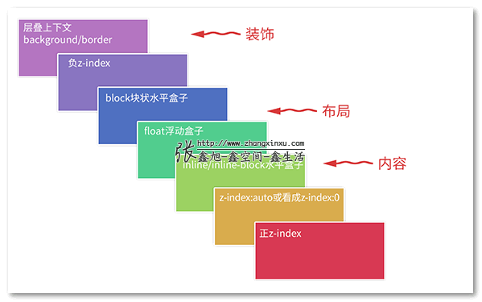

# 层叠上下文

> 参考来自张鑫旭大佬的[文章](https://www.zhangxinxu.com/wordpress/2016/01/understand-css-stacking-context-order-z-index/)

## 是什么？

说大白话就是页面元素出现在人面前的前后关系

如果当元素出现重叠的时候，搞清楚层叠顺序就能让我们快速清除重叠的原因了



下面这两个是层叠领域的黄金准则。当元素发生层叠的时候，其覆盖关系遵循下面 2 个准则：

1. **谁大谁上：**当具有明显的层叠水平标示的时候，如识别的 z-index 值，在同一个层叠上下文领域，层叠水平值大的那一个覆盖小的那一个。通俗讲就是官大的压死官小的。
2. **后来居上：**当元素的层叠水平一致、层叠顺序相同的时候，在 DOM 流中处于后面的元素会覆盖前面的元素。

## 层叠上下文

所谓上下文就是从某个节点开始的元素树，该树中的节点元素所在的区域就满足上面的规则

个人理解和 BFC 其实差不多，在 CSS3 之后，也能通过某些属性来触发层叠上下文：

- 页面根元素 `<html>`
- z-index 为数值的**定位元素**——_传统层叠上下文_
- 其他 CSS3 属性

### 传统层叠上下文

来个张大佬的例子：

```html
<div style="position:relative; z-index:auto;">
   <-- 横妹子 -->
</div>
<div style="position:relative; z-index:auto;">
   <-- 竖妹子 -->
</div>
```

此时两个容器 div 都不是层叠上下文，所以两个图片会根据 z-index 来排序
