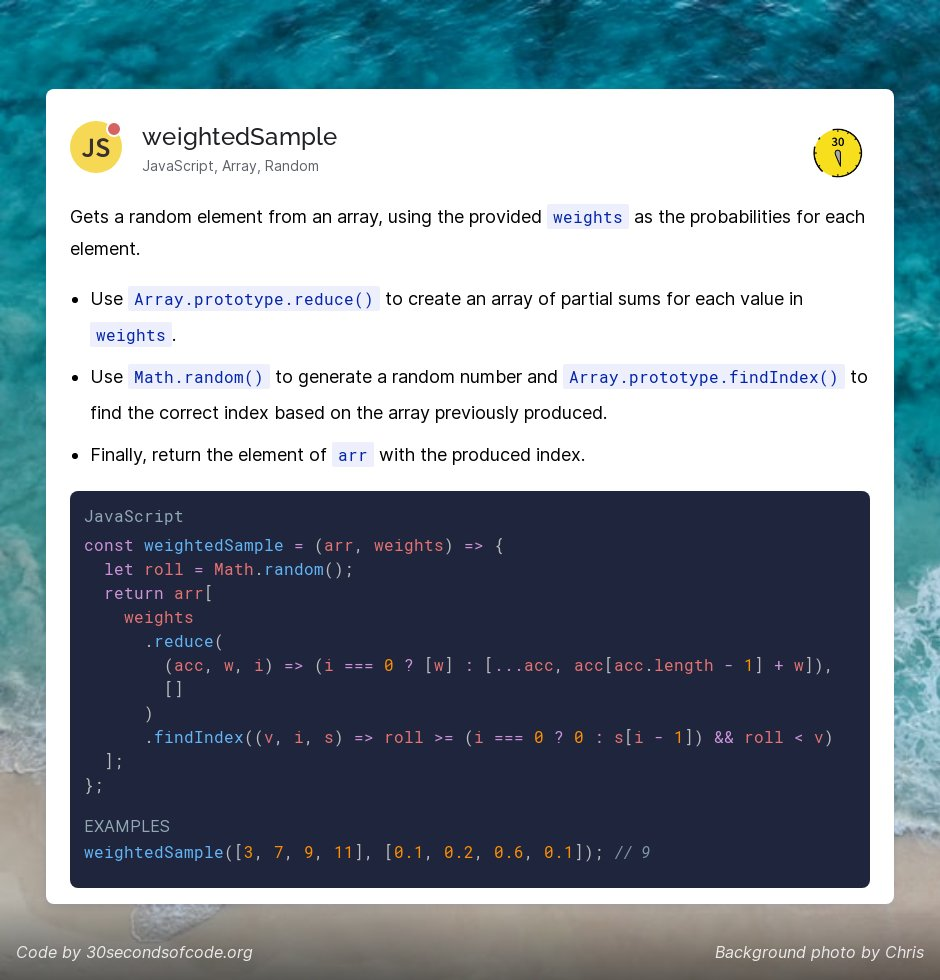
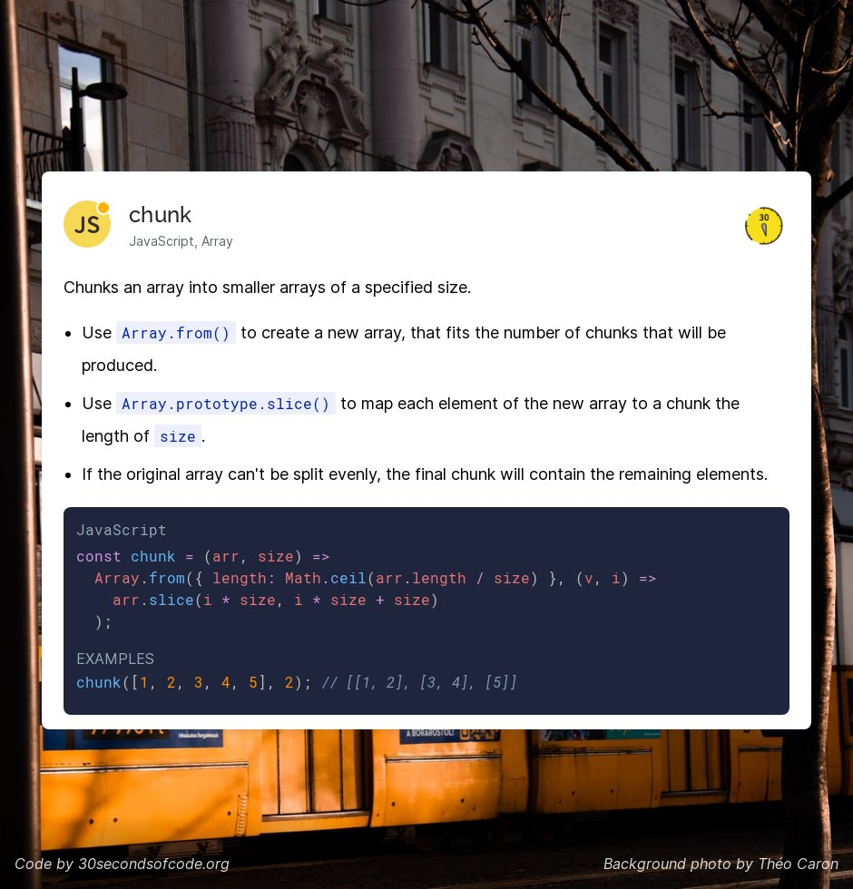
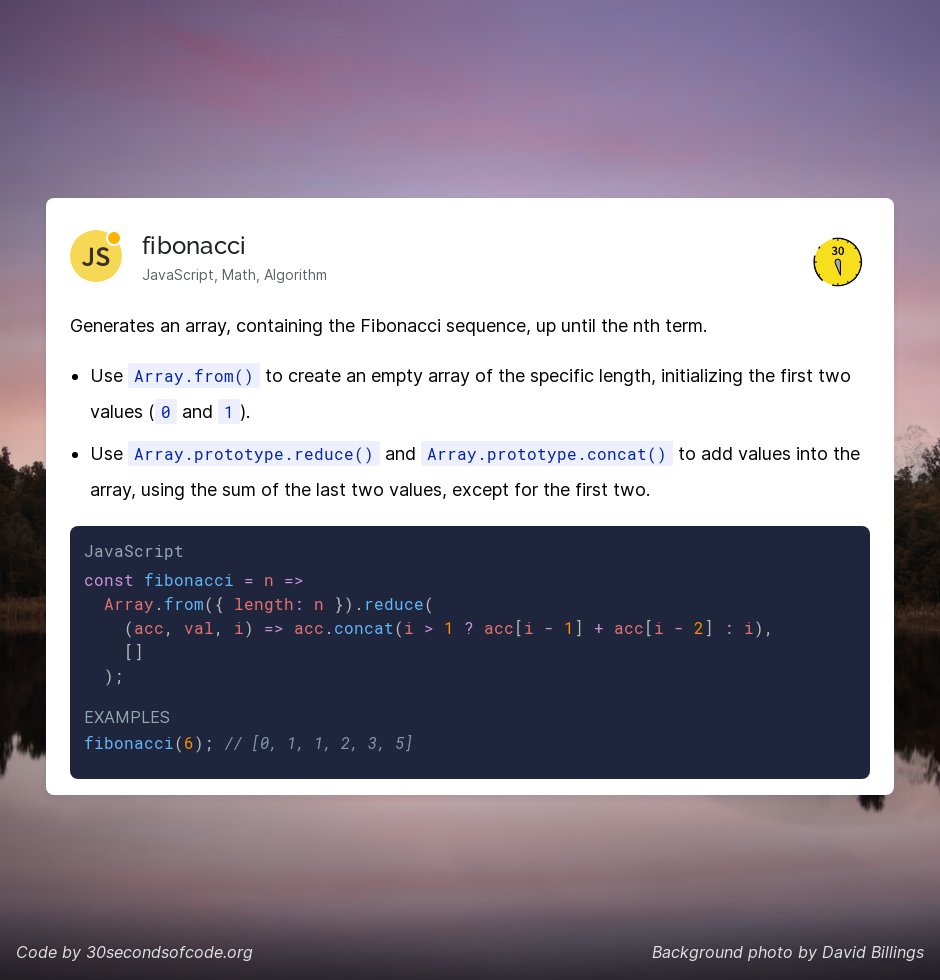

### Weighted sample



```js
const weightedSample = (arr, weights) => {
  const roll = Math.random();
  return arr[
    weights
      .reduce(
        (acc, w, i) => (i === 0 ? [w] : [...acc, acc[acc.length - 1] + w]), // acc last one -> the former one
        []
      )
      .findIndex((v, i, s) => roll >= (i === 0 ? 0 : s[i - 1]) && roll < v) // v_n <= Prob < v_n+1
  ];
};
const res = weightedSample([4, 2, 6, 7], [1, 0, 0, 0]);
console.log(res);
```

### chunk



```js
const chunk = (arr, size) =>
  Array.from({ length: Math.ceil(arr.length / size) }, (_, i) =>
    arr.slice(i * size, i * size + size)
  );
const res2 = chunk([1, 2, 3, 4, 5, 6, 7], 3);
console.log(res2);
// [ [ 1, 2, 3 ], [ 4, 5, 6 ], [ 7 ] ]
```

### Fibonacci


