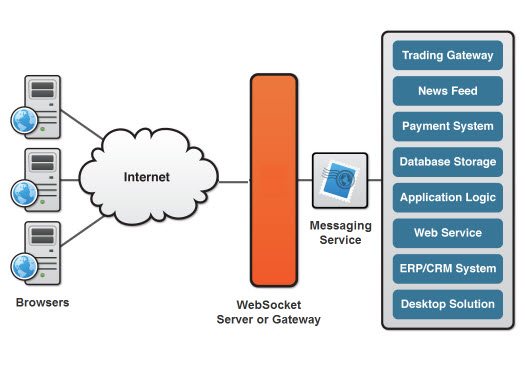

# Websocket

参考：[官网](http://websocket.org/)（墙了），[阮一峰老师的文章](http://www.ruanyifeng.com/blog/2017/05/websocket.html)，[MDN](https://developer.mozilla.org/en-US/docs/Web/API/WebSocket)

[toc]

## 背景：

HTTP 协议不够用吗？确实如此，只能由客户端发起请求，服务端只能被动接受请求，返回结果。

这样单向的请求注定了服务器如果有连续状态发生变化了（比如某个地图资源更新了），无法主动告知客户端，只能通过客户端的轮询。最典型的就是聊天室场景。轮询的效率非常低，也很浪费资源，当然也可以用长链接，总之这些方案要解决**实时性场景**都不太行。

## 简介

WebSocket 也是一种协议，在 2008 年诞生，2011 年成为国际标准，所有浏览器支持。

最大特点：

- 服务器可以主动向客户端推送，真正的双向平等对话
- 降低服务器的压力

其他特点：

- 基于 TCP
- 与 HTTP 协议良好兼容，默认端口也是 80 和 443，握手阶段采用 HTTP ？能通过各种 HTTP 代理服务器
- 数据格式轻量，性能小，通信高效
- 文本、二进制都可
- **没有同源限制，可与任意服务器通信**
- 协议标识`ws`（加密为`wss`），服务器地址就是 URL，例如`ws://example.com:80/some/path`


## 简单的 demo

```html
<script>
  const ws = new WebSocket("wss://echo.websocket.org");
  // 连接建立的回调
  ws.onopen = (e) => {
    console.log("connect open ...");
    ws.send("hello ws");
    console.log(e);
  };

  ws.onmessage = (e) => {
    console.log(`receive message: ${e.data}`);
    // 收完就关。。
    ws.close();
    console.log(e);
  };

  ws.onclose = (e) => {
    console.log(e);
    console.log("close");
  };
</script>
```

## 属性

`WebSocket.readyState` **状态常量**

- CONNECTING: 0，正在连接
- OPEN: 1，连接成功，可以通信
- CLOSEING: 2，正在关闭
- CLOSED: 3，关闭 or 连接失败

`WebSocket.onopen` 连接成功后的 callback 函数，可以用 `addEventListener`方法

`WebSocket.onclose` 连接关闭的 callback

```js
bubbles: false
cancelBubble: false
cancelable: false
code: 1005
composed: false
currentTarget: WebSocket {url: "wss://echo.websocket.org/", readyState: 3, bufferedAmount: 0, onerror: null, onopen: ƒ, …}
defaultPrevented: false
eventPhase: 0
isTrusted: true
path: []
reason: ""
returnValue: true
srcElement: WebSocket {url: "wss://echo.websocket.org/", readyState: 3, bufferedAmount: 0, onerror: null, onopen: ƒ, …}
target: WebSocket {url: "wss://echo.websocket.org/", readyState: 3, bufferedAmount: 0, onerror: null, onopen: ƒ, …}
timeStamp: 7022.464999987278
type: "close"
wasClean: true
__proto__: CloseEvent
```

`WebSocket.onmessage` 接收到服务器数据后的 callback ，注意，服务器数据可能是文本，也可能是二进制数据（`blob`对象或`Arraybuffer`对象）。

```javascript
ws.onmessage = function (event) {
  if (typeof event.data === String) {
    console.log("Received data string");
  }

  if (event.data instanceof ArrayBuffer) {
    var buffer = event.data;
    console.log("Received arraybuffer");
  }
  if (event.data instanceof Blob) {
    var buffer = event.data;
    console.log("Received Blob");
  }
};
```

Message Event 大致属性如下：

```js
bubbles: false
cancelBubble: false
cancelable: false
composed: false
currentTarget: WebSocket {url: "wss://echo.websocket.org/", readyState: 3, bufferedAmount: 0, onerror: null, onopen: ƒ, …}
data: "hello ws"
defaultPrevented: false
eventPhase: 0
isTrusted: true
lastEventId: ""
origin: "wss://echo.websocket.org"
path: []
ports: []
returnValue: true
source: null
srcElement: WebSocket {url: "wss://echo.websocket.org/", readyState: 3, bufferedAmount: 0, onerror: null, onopen: ƒ, …}
target: WebSocket {url: "wss://echo.websocket.org/", readyState: 3, bufferedAmount: 0, onerror: null, onopen: ƒ, …}
timeStamp: 6619.11999998847
type: "message"
userActivation: null
__proto__: MessageEvent
```

除了动态判断收到的数据类型，也可以使用`binaryType`属性，查看指定收到的二进制数据类型。

```javascript
// 收到的是 blob 数据
ws.binaryType = "blob";
ws.onmessage = function (e) {
  console.log(e.data.size);
};

// 收到的是 ArrayBuffer 数据
ws.binaryType = "arraybuffer";
ws.onmessage = function (e) {
  console.log(e.data.byteLength);
};
```

`WebSocket.send(String | Blob | ArrayBuffer)`

`WebSocket.bufferedAmount`只读属性，查看在`send()`队列中还没有被传输到网络中的**字节数**，全部发送后 reset 到 0

`WebSocket.onerror`发生错误的 callback

## 赋能服务端推送

服务器的实现可以分为服务器和网关



> One of the more unique features WebSockets provide is its ability to traverse firewalls and proxies, a problem area for many applications.

Comet-style applications: 用 Comet 技术（类似长连接），也就是延迟一个 HTTP 请求服务端返回信息的时机，直到有新内容更变了服务端才返回响应，然后客户端立即发送新的请求，维持这样的长链接，通常都是在前端用 JS 实现的。

对于一些有特定间隔的变化轮询是一个很好的坚决方案，只要客户端设定时间轮询就行了，但是在大多数的实时场景中，数据都是不可预测的，而且在变化频率比较低情况下，客户端需要发送很多不必要的请求。

streaming: 流方式，浏览器发送一个完整的请求，客户端在一定时间段内只返回并且维护一个响应，这个响应在信息变化的时候被更新，服务端不会关闭这个完整响应。但是由于 HTTP 防火墙、代理服务器会缓存响应，增加了信息传输的等待时间，所以也降级成长轮询了。

也有很多实现双工连接的方法，比如维护两个连接，但是其中需要同步协调的复杂度太大了。简单来说， HTTP 没有设计成实时、全双工的。 Comet 应用也很复杂。

**在不支持 WebSocket 的浏览器上：Kaazing WebSocket Gateway makes HTML5 WebSocket code work in all the browsers today.**

## WebSocket 协议

协议连接的开始和 HTTP 连接一样，这样能确保是个完全**后向兼容**的（有些浏览器/服务器不支持 WebSocket 可以回退到 HTTP）。所以 WebSocket 协议升级到 HTTP 的时候需要一次升级（握手）

客户端发送请求：（省略了很多头内容）

```fallback
GET ws://echo.websocket.org/?encoding=text HTTP/1.1
Origin: http://websocket.org
Cookie: __utma=99as
Connection: Upgrade
Host: echo.websocket.org
Sec-WebSocket-Key: uRovscZjNol/umbTt5uKmw==
Upgrade: websocket
Sec-WebSocket-Version: 13
```

注意 `Connection`和`Upgrade`，表明这个 HTTP 协议要升级到 WebSocket。

- `Sec-WebSocket-Version`表示协议版本
- `Sec-WebSocket-Key`与服务端响应的`Sec-WebSocket-Accept`是配套的，提供基本的防护，比如恶意的连接，或者无意的连接。

服务端响应同意升级：

```
HTTP/1.1 101 WebSocket Protocol Handshake
Date: Fri, 10 Feb 2012 17:38:18 GMT
Connection: Upgrade
Server: Kaazing Gateway
Upgrade: WebSocket
Access-Control-Allow-Origin: http://websocket.org
Access-Control-Allow-Credentials: true
Sec-WebSocket-Accept: rLHCkw/SKsO9GAH/ZSFhBATDKrU=
Access-Control-Allow-Headers: content-type
```

**Sec-WebSocket-Accept 的计算**：根据客户端请求首部的`Sec-WebSocket-Key`计算出来。计算公式为：

1. 将`Sec-WebSocket-Key`跟`258EAFA5-E914-47DA-95CA-C5AB0DC85B11`拼接。
2. 通过 SHA1 计算出摘要，并转成 base64 字符串。

验证一下：

NodeJS 实现

```js
const crypto = require("crypto");
const magic = "258EAFA5-E914-47DA-95CA-C5AB0DC85B11";
const secWebSocketKey = "5r+6Y3+R8T56oZow/24HdA==";

let secWebSocketAccept = crypto
  .createHash("sha1")
  .update(secWebSocketKey + magic)
  .digest("base64");

console.log(secWebSocketAccept);
// JqyAewJNS3LXOuT7VfSQQC/Mtt4=
```

Py 实现

```python
import hashlib
import base64

sec_socket_key = '5r+6Y3+R8T56oZow/24HdA=='
magic = '258EAFA5-E914-47DA-95CA-C5AB0DC85B11'

sec_socket_accept = base64.b64encode(
    hashlib.sha1(
        f'{sec_socket_key}{magic}'.encode('utf8')
    ).digest()
).decode()

print(sec_socket_accept)
# JqyAewJNS3LXOuT7VfSQQC/Mtt4=
```

酷，为啥要用这个魔法字符串呢。。。

详细的数据帧格式啥的可以看[知乎这篇](https://zhuanlan.zhihu.com/p/32739737)

## 后端实现 TODO

### Node.js

express：https://blog.csdn.net/feng98ren/article/details/86240287
