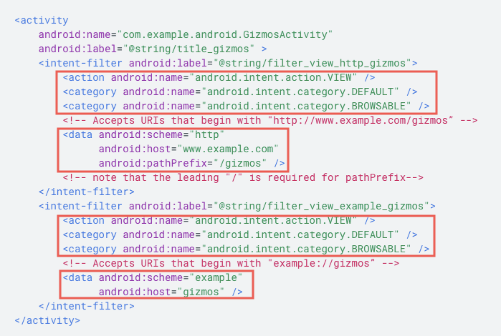

# 移动端拉起 App

> UG 回流、广告投放等场景都会用到的唤起 App 技术，比如日常我们是如何从别人分享的微信网页打开那些 App 的呢

### URL scheme

类似于 `wx://` 这样的链接，叫 scheme

### Deeplink 广告追踪技术（[维基百科](https://en.wikipedia.org/wiki/Mobile_deep_linking)）

DeepLink 用到的核心技术就是：URL SCHEMES，不论是 IOS 还是 Android。所谓 deep，在移动端应用的场景，我理解就是能通过 URI 指定这个 link 能打开 App 中某个页面，好比 web 世界的 URL

点击浏览器或 app 中，第三方应用的分享或广告链接，如果用户已经安装，则直接吊起 app 并打开目标页。（或者直接在浏览器地址栏中，输入 url scheme，也能调起 app）

这里移动端系统（IOS/Android/...）就好比是浏览器，会去定位系统中是否有这个 App 注册的 scheme，同时移动端浏览器如果识别非 http 的 URL，也会抛回给系统处理 scheme

### Deferred Deeplink

可以先判断用户是否已经安装了 App 应用，如果没有则先引导至 App 应用商店中下载 App， 在用户安装 App 后跳转到指定 App 页面 Deeplink 中

1. An app store to open (Google Play/iOS or Windows App Store depending on the user's device) to enable the user to install the app
2. Once the app is installed, the link is invoked with its original URL and parameters so that the newly installed app can handle the invocation.

deferred deeplink 找到目标页的思路：

- session/cookies
- 模糊匹配：尽可能的收集跟设备相关的信息，作为一个集合进行匹配

#### deeplink 的基本原理和实现（以 android 为例）

点击网页中的 deeplink 唤起 App，android 系统的处理顺序是：

- 首先判断用户是否设置了默认打开的应用
- 如果只有一个 available 的应用，直接打开
- 如果有多个 available 应用，用户需要从弹出框里选择

Deeplink 的核心思想是 android 的隐式启动，通过 manifest 中的 action、category、data 的配合启动指定类型的 activity。

（1）add intent filters

下面这个例子表示 “example://gizmos” 和 “http://www.example.com/gizmos” 都可以唤起 GizmosActivity。

action.view：表示可以从 google search 唤起 activity

data：scheme 和 host 是必填字段，表示可以唤起 app 的 url scheme

category.browsable ：表示 app 可以从浏览器被唤起，非 browser 里的 link 无法吊起 app

更多 android deeplink 信息，请参考 [android 开发者文档](https://developer.android.com/training/app-links/deep-linking.html)。

#### iOS ATT 下 SKAdNetwork2.0 方案

**https://developer.apple.com/documentation/storekit/skadnetwork**

ATT 全名是 AppTrackingTransparency，是 Apple 为提高用户隐私透明度提供的解决方案，获取 IDFA 也要符合 ATT 的要求。SKAdNetwork2.0 的整体流程比 ATT 复杂一些，涉及到的角色也较多，它其实是 Apple 针对非 IDFA 的安装和转化归因的整体方案，是要广告平台、广告主、媒体共同参与才能够实现的。

这一套不仅代表着 Apple 更注重用户隐私透明度，也代表着 Apple 开始插手广告归因，想作为应用商店在广告归因中分一杯羹，并为未来更大的广告业务做准备。

### Universal link、Google applink

#### Android App Links

on Android 6.0 (API level 23) and higher allow an app to designate itself as the default handler of a given type of link. If the user doesn't want the app to be the default handler, they can override this behavior from their device's system settings.

概括起来就是：

Android App Links 是一种特殊的 Deep Links，它使 Android 系统能够直接通过链接打开应用程序对应的内容页面，而不需要用户选择使用哪个应用来处理。

#### Universal link

很多 APP 服务提供方已经在提供普通网站 URL 方式作为中间也载体，便于传播和使用。这也就引出了一个新的规范：Universal Link（通用链接）。为了保证用户网络安全，该 “通用链接” 必须是 HTTPS 协议的。

要使用 Universal Link，需要客户端和对应的服务端域名实现双向关联：

- App 对域名的认证：在 Xcode 里设置 Associated Domains，将域名添加进去。域名有 update 的话，需要依赖客户端发版。

- 域名对 app 的认证：在 web 服务器

  根目录

  放一个名为 apple-app-association 的文本文件，里面描述哪些域名会跳转到哪个 app

  - Create an `apple-app-site-association` file that contains JSON data about the URLs that your app can handle.
  - Upload the `apple-app-site-association` file to your HTTPS web server. You can place the file at the root of your server or in the `.well-known` subdirectory.
  - Prepare your app to handle universal links.

小结下：

1. [Universal Link](https://developer.apple.com/ios/universal-links/) / [App Links](https://developer.android.google.cn/studio/write/app-link-indexing)，iOS / 安卓 系统提供的 http 协议链接，比如 https://z.douyin.com/tphF

2. URI scheme，iOS / 安卓 App 注册后使用的协议
