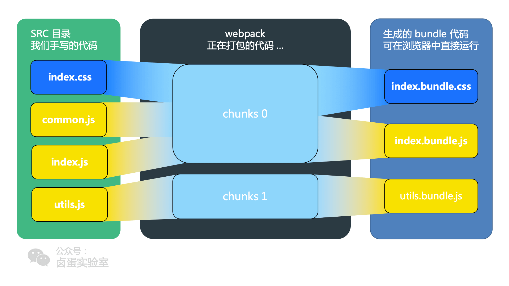

# Webpack 食用手册

还是老老实实写一篇中文的使用手册吧

本篇不讨论原理、模块化之类的，只记录如何使用

_时过境迁，公司的 [rspack](https://github.com/web-infra-dev/rspack) 也已经开源，rust 版的 webpack，鼓掌_

## 前言

### module chunk bundle

webpack 的三个基础/核心概念



_[图片来源](https://www.cnblogs.com/skychx/p/webpack-module-chunk-bundle.html)_

Module：手写的源码文件、其他类库的产物/源码，即本次构建的目标代码

Chunk：根据文件引用关系生成的，webpack 进行处理的对象

Bundle：最终输出的产物，可以给浏览器/node/...环境运行的 JavaScript 代码

## 安装

`npm init `

都安装在本地开发环境 `--save-dev`

`npm install -D webpack webpack-cli`

`npm install -D webpack-dev-server` 安装 webpack 服务器

## 创建配置

项目根目录下创建`webpack.config.js`文件

基本大致内容如下

```js
modules.export={
    entry:{
        // 入口文件
    },
    output:{
        // 出口文件
    },
    module:{
        // loaders
        rules:[{},{},{}]
    },
    plugins:[
        // 插件
    ],
    devtool: ...
    devServer: {...}
    resolve:{...}
}
```

## 入口 Entry

webpack 创建依赖图的入口文件，递归遍历这些文件，然后用 Loaders 去进行对应处理

官网给了三种方式：

1. 字符串

   ```js
   entry: "./src/index.js";
   ```

2. 对象（多个入口作为属性，都会打包，互不依赖）

   ```js
   entry: {
     main: './src/app.js',
     vendor: './src/vendor.js'
   }
   ```

   这里的属性值对应着入口文件的 `name`

3. 数组

   ```js
   entry: ["app.js", "main.js"];
   ```

使用场景：

- 分离 App 和 Vendor 的入口（ App 就是应用主程序， Vendor 可以认为是通用的库，分发给 App 中不同模块使用）
- 多页应用，每个页面依赖的模块都不同

## 输出 Output

打包后输出的文件

```js
output: {
  path: path.resolve(__dirname, '/dist'),		// 打包后文件所在的路径
  filename: '[name].[hash].bundle.js',  // 文件名
  publicPath: '/assets/', 	// 上线时的路径，用于线上
  chunkFilename: 'js/[name].bundle.js', 	// 按需加载模块输出的文件名
}
```

主要来看看下面两个属性

### publicPath

这个路径配置之后，例如`/assets/`，会访问`www.xxx.xxx/assets/yyy.js`来获取输出的文件

这个其实在之前部署项目的时候遇到过，当初需要将项目部署在主域名的一个子路径下，可以通过 www.coyoo.xyz/wisdom 来访问，在 `nginx` 中将打包后的文件放在对应`wisdom`目录即可，然后发现所有获取的静态资源都挂了，因为在`index.html`中访问的都是没有子路径的资源。

由于使用的是`quasar`ui 框架，之后查阅了资料发现需要在配置文件中的`build`中配置`publicPath: '/wisdom'`，打包也是基于`webpack`的，所以现在就清楚了。。

### chunkFilename

在动态加载（按需加载）的时候，用注释`import(/* webpackChunkName: 'chunk'*/chunkModule)`来给输出对象指定名字

## 处理器 Loader

浏览器只认识那三剑客，所以 webpack 可以通过 loaders 将其他语言处理成浏览器认识的语言。能够分析不同类型的文件，反正都认为是模块嘛，甚至可以在 js 模块中`import` css 和 图片！

基础结构：

```js
module:{
  rules:[
    {
      test:/\.xxx$/,//以 .xxx 结尾的文件
      use: [{loader: 'xxx-loader'}] // 从最后一个往前的顺序执行
      loader: "xxx-loader",
      exclude: {排除的路径},
      include: {包含的路径},
      options: {Loader 配置}
    }
  ]
}
```

### 三种方式使用 Loaders

不需要引入，指明名字，配置一下就行

1. `module.rules`中配置

   ```js
   module.exports = {
     module: {
       rules: [
         {
           test: /\.css$/,
           use: [
             // style-loader
             { loader: "style-loader" },
             // css-loader
             {
               loader: "css-loader",
               options: {
                 modules: true,
               },
             },
             // sass-loader
             { loader: "sass-loader" },
           ],
           // loader 的执行顺序是从下至上的 从左至右
         },
       ],
     },
   };
   ```

2. 在 import 的时候用 inline 方式：

   ```js
   import Styles from "style-loader!css-loader?modules!./styles.css";
   ```

   ```js
   // 配置中
   {
     loader: "style-loader!css-loader?importLoaders=1!less-loader";
   }
   ```

   **用 `!` 分割 loaders**

3. CLI 的方式

   ```shell
   webpack --module-bind pug-loader --module-bind 'css=style-loader!css-loader
   ```

### 特性

- 可以将加载起链式串起，**顺序都是从右往左**（数组， inline ），为感觉这个原因可以解释为：正序读取 loaders ，然后处理成`loaderA(loaderB(loaderC(loaderD( source ))))`
- 异步/同步执行
- 插件给 loader 赋能
- 可以输出任何文件，在 node 环境中可以干很多事情

### 常用 loaders

#### css

1. style-loader

   通过注入`style`标签将 CSS 添加到 DOM

   ```shell
   npm install style-loader --save-dev
   ```

2. css-loader

   css-loader 像 import / require（）一样解释@import 和 url（）并解析它们。

   ```shell
   npm install css-loader --save-dev
   ```

3. postcss-loader

   补充不兼容的 css 属性 的浏览器前缀

   ```shell
   npm install postcss-loader postcss-preset-env cssnano --save-dev
   # 后者会在 package.json 找 browserslist
   ```

   package.json: 默认找生产环境（可以设置 process.env.NODE_ENV = 'development'）

   ```json
   "browserslist": {
     "development": [
   	  "last 1 chrome version",
   	  "last 1 firefox version",
       "last 1 safari version",
     ],
     "production": [
       ">0.01%",		// 99.99% 的兼容
       "not dead", // 活着的
       "not op_mini all"
     ]
   }
   ```

   webpack.config.js

   ```js
   {
   	loader: 'postcss-loader',
     options: {
       ident: 'postcss',
       plugins: () => [
         require('postcss-preset-env')(),
         require('cssnano')()		// 可以压缩
       ]
     }
   }
   ```

   可以参考官方https://github.com/postcss/postcss-loader

4. less/sass-loader

   ```shell
   npm install less --save-dev
   npm install less-loader --save-dev
   ```

#### JavaScript

babel

```shell
npm install -D babel-core babel-loader babel-preset-es2015
```

#### 图片 & 字体

1. file-loader 用于压缩文件

   ```js
   // module.rules:
   {
     test: /\.(jpg|svg|png|gif|jpeg)$/,
     use: ['file-loader'],
   },
   // ...
   ```

   字体：

   ```js
   {
   	test: /\.(woff|woff2|eot|ttf|otf)$/,
   	use: [
   		'file-loader',
   	],
   }
   ```

2. url-loader 将会 url 转换成二进制编码（这个包依赖于 file-loader ）

   ```shell
   npm install --save-dev url-loader
   ```

   ```js
   modules: {
     rules: [
       {
         test: /\.(jpe?g|png|gif)$/,
         use: [
           {
             loader: "url-loader",
             options: {
               esModule: false, // 不加的话会有这种情况 img属性src="[object Module]"
               // 图片大小小于10kb的都会转为 base64 编码 来减少http请求
               limit: 1024 * 10, // 当大于100kb时候，将文件打包到publicPath中
               outputPath: "images", // 将文件打包到哪里
               publicPath: "/images/",
               name: "[name].[hash:8].[ext]", // 取前 8 位 hash
             },
           },
         ],
       },
     ];
   }
   ```

   base64 是啥：一种编码数据的方式，直接将图片二进制内容编码到 URL 中，浏览器直接可以从中读出图片，不需要发送请求了。注意，大的图片还是发请求吧， URL 太长了。转换成字符串之后大小还可能会更大。 8 - 12 kb 比较适合。

   最终打包成：`data:image/png;base64,............`的数据`data:<MIME type>;base64,`

3. html-loader

   专门负责引入 html 中的 img 标签，从而能被 url-loader 引入

```js
{
  test: /\.html$/,
  use: 'html-loader',
}
```

会有小问题， url-loader 默认是 es module 解析的， html-loader 是 commonJS 解析的，关闭 URL 的 es6 模块化

上面的例子已经关闭了`esModule: false`。但是好像开了也没问题。。。

如果使用框架啥的，比如 vue ，直接 import 进来放到 data 里面作为字符串，也是会被 url-loader 处理的

## 插件 Plugin

> **Plugins** are the backbone of webpack.
>
> ——来自官网

一个插件是一个 js **对象**，必须有 `apply `方法

### 使用

需要引入模块，生成一个**对象**

```js
plugins: [
  new webpack.ProgressPlugin(),
  new HtmlWebpackPlugin({ template: "./src/index.html" }),
];
```

```js
plugins: [
  // for customize the option, you need to create an instance
  new HtmlWebpackPlugin({ template: "./src/index.html" }),
];
```

### 常用插件：

#### html-webpack-plugin

主要用于生成 HTML，可以规定 模板 HTML，也可以为 模板传入参数，压缩文件等

```bash
npm install --save-dev html-webpack-plugin
```

配置很多

```js
new htmlWebpackPlugin({
  // 打包后的文件名
  filename: "index.html",

  // 模板 复制这个文件 自动引入所有的打包后资源 输出到目标
  template: "index.html",

  // 为 true 自动生成 script 标签添加到 html 中
  // 或者写 body/head 标签名
  inject: false,//js 的注入标签

  // 通过<%= htmlWebpackPlugin.options.title  %>引用
  // 自动会修改到模版
  title: "参数 title",

  //通过<%= htmlWebpackPlugin.options.date %> 引用
  date: new Date()

  //网站的图标
  favicon: 'path/to/yourfile.ico'

  //生成此次打包的 hash
  //如果文件名中有哈希，便代表有 合理的缓冲
  hash: true,

   //排除的块
	excludeChunks: [''],

  //选中的块 与入口文件相关
  chunks: ['app','people'],

  //压缩
  minify:{
   removeComments: true,  // 移除注释
   collapseWhitespace: true,  // 折叠空格
   removeRedundantAttributes: true,
   useShortDoctype: true,
   removeEmptyAttributes: true,
   removeStyleLinkTypeAttributes: true,
   keepClosingSlash: true,
   minifyJS: true,
   minifyCSS: true,
   minifyURLs: true,
  }

}),
```

用 ejs 的语法使用

```js
<!DOCTYPE html>
<html lang="en">
<%= htmlWebpackPlugin.options.date %>
</html>
```

#### uglifyjs-webpack-plugin

#### mini-css-extract-plugin

_推荐使用 [github](https://github.com/webpack-contrib/mini-css-extract-plugin)_

提取 js 中的 css 样式到文件，在 html 中用 link 引入

```bash
npm install -D mini-css-extract-plugin
```

```js
const MiniCssExtractPlugin = require('mini-css-extract-plugin');

// 在loader 也要改
{
  test: /\.css$/,
  use: [
    // 'style-loader',  // 不需要创建标签了 不推荐一起用
    MiniCssExtractPlugin.loader,
    'css-loader'
  ],
},
// plugins 中
plugins: [
  new MiniCssExtractPlugin(),
]
```

#### optimize-css-assets-webpack-plugin

压缩 css 成一行，用 cssnano 在 postcss 中也可以的

```js
// plugins:
new OptimizeCssAssetsWebpackPlugin();
```

#### webpackbar

https://github.com/unjs/webpackbar

能够在终端展示 webpack 打包进度条，真不错

## 模式 Mode

```js
mode: "development"; // 'production'
```

| 选项        | 描述                                                                                       | 特点               |
| ----------- | ------------------------------------------------------------------------------------------ | ------------------ |
| development | 会设置 process.env.NODE_ENV 为 development ，启用 NamedChunksPlugin 和 NamedModuluesPlugin | 让代码能本地调试   |
| production  | 会设置 process.env.NODE_ENV 为 production ，启用各种优化插件                               | 优化线上环境的代码 |

生产模式下：

- css 需要在 js 中分离出来（之前是导入到 js 文件然后生成 `<style>` 标签，会导致闪屏）
- 代码压缩
- 兼容性

这些操作放在生产环境下做，耗时比较多，不适合在开发模式。

## 常用命令

- `webpack`: 启动后寻找 `webpack.config.js` 进行打包
- `webpack -w`: 监控代码变化
- `webpack -p`: 对打包后的文件进行压缩，利于线上发布
- `webpack -d`: 提供 source map ，方便调试
- `webpack -colors`: 输出带颜色，好看
- `webpack -profile`: 输出性能数据

## devtool 属性

## devServer

前面下载过`npm install -D webpack-dev-server`

```js
devServer: {
  contentBase: path.join(__dirname, 'dist'),
  port: 8088,
  hot: true,			// 热更新
  inline: true, // reload when file changes
  historyApiFallback: true, // fallback to index.html when missing other files
  open: true,		// 自动打开浏览器
  compress: true,		// 启用 gzip 压缩
},
```

用 npx 启动`npx webpack-dev-server`

## resolve

自动扩展文件名，可以在导入的时候不写后缀名

```js
resolve: {
  extensions: [".less", ".mjs", ".js", ".json"];
}
```

将路径取别名，方便引入

```js
resolve: {
  alias: {
    Utilities: path.resolve(__dirname, 'src/utilities/'),
    Templates: path.resolve(__dirname, 'src/templates/')
  }
}
```

## 一份配置

```js
const path = require("path"),
  webpack = require("webpack"),
  htmlWebpackPlugin = require("html-webpack-plugin"),
  ExtractTextPlugin = require("extract-text-webpack-plugin"),
  marked = require("marked"),
  renderer = new marked.Renderer(),
  CleanWebpackPlugin = require("clean-webpack-plugin"),
  OpenBrowserPlugin = require("open-browser-webpack-plugin");

const MyConfig = {
  entry: {
    app: "./src/js/app.js",
  },

  output: {
    path: path.resolve(__dirname, "dist"),
    filename: "js/[name].js",

    // 上线时的公共路径
    // publicPath: "http://cdn.com/",

    // 按需加载模块时输出的文件名称
    // chunkFilename: 'js/[name].js'
  },

  /* 生成调试用的 source-map */
  devtool: "eval-source-map",
  // [inline-|hidden-|eval-][nosources-][cheap-[module-]]source-map
  // 开发环境用 eval-source-map / eval-cheap-module-source-map
  // 生产环境 source-map

  devServer: {
    contentBase: "./dist", //本地服务器所加载 的页面所在的目录
    historyApiFallback: true, //再找不到文件 的时候默认指向 index.html,
    inline: true, //当源文件改变时会自动刷新页面
    hot: true, //热加载开启
    port: 8080, // 设置默认监听端口
  },
  resolve: {
    //自动扩展文件后缀名，意味着我们 require 模块可 以省略不写后缀名
    extensions: [".js", ".html", ".css", ".txt", "less", "ejs", "json"],

    //模块别名定义，直接 require('AppStore')  即可,方便后续直接引用别名
    alias: { Temp: path.resolve(__dirname, "src/templates/") },
  },
  module: {
    rules: [
      {
        test: /\.(less|css)?$/,
        use: ExtractTextPlugin.extract({
          fallback: "style-loader",
          use: [
            { loader: "css-loader? modules", options: { importLoaders: 1 } },
            {
              loader: "postcss-loa der",
              options: { plugins: (loader) => [require("autoprefixer")()] },
            },
            { loader: "less-loader" },
          ],
        }),
        exclude: path.resolve(__dirname, "./node_modules"),
      },
      {
        test: /\.js$/,
        loader: "babel-loader",
        exclude: path.resolve(__dirname, "./node_modules"),
        include: path.resolve(__dirname, "./src"),
        options: { presets: ["latest"] },
      },
      {
        test: /\.html$/,
        loader: "html-loader",
        include: path.resolve(__dirname, "./src/layer"),
        exclude: path.resolve(__dirname, "./node_modules"),
      },
      {
        test: /\.ejs$/,
        loader: "ejs-loader",
        include: path.resolve(__dirname, "./src/layer"),
        exclude: path.resolve(__dirname, "./node_modules"),
      },
      {
        test: /\.(png|jpe?g|gif|svg| woff|woff2|ttf|eot|otf)$/i,
        loaders: [
          "file-loader",
          "url-loader?limit=8192",
          {
            loader: "image-webpack-loader",
            options: {
              gifsicle: { interlaced: false },
              optipng: { optimizationLevel: 7 },
              pngquant: { quality: "65-90", speed: 4 },
              mozjpeg: { progressive: true, quality: 65 },
              webp: { quality: 75 },
            },
          },
        ],
        exclude: path.resolve(__dirname, "./node_modules"),
      },
    ],
  },
  plugins: [
    //打包前 先删除 dist 目录下的文件
    new CleanWebpackPlugin(["dist"], {
      root: __dirname, //指定插件根目录 位置
      verbose: true, //开启在控制台输出 信息
      dry: false, //启用删除文件
    }),

    //生成 html
    new htmlWebpackPlugin({
      filename: "index.html", //文件名
      template: "index.html", //模板
      inject: false, //js 的注入标签
      //这个配置项为 true 表示自动把打包出来的文 件通过自动生成 script 标签添加到 html 中

      title: "参数 title", //通过<%=  htmlWebpackPlugin.options.title %> 引用
      date: new Date(), //通过<%=  htmlWebpackPlugin.options.date %>引 用

      //favicon: 'path/to/yourfile.ico'

      // excludeChunks: [''],//排除的块
      // chunks: ['app','people']//选中的 块

      /* 
      minify:{ //压缩
       removeComments: true,
       collapseWhitespace: true,
       removeRedundantAttributes:  true,
       useShortDoctype: true,
       removeEmptyAttributes: true,
       removeStyleLinkTypeAttributes:  true,
       keepClosingSlash: true,
       minifyJS: true,
       minifyCSS: true,
       minifyURLs: true,
      }
      */
    }),
    //防止 CSS 文件混乱，单独生成一个 css 文件
    new ExtractTextPlugin("./css/[name].min.css"),

    //在每个生成的 chunk 顶部添加 banner
    new webpack.BannerPlugin("Anthor:"), //添加一个显示版权声明的插 件

    new webpack.optimize.UglifyJsPlugin({
      compress: {
        //额外的压缩选项
        warnings: false,
      },
      // mangle: {  排除不想要压缩的对象名称
      //      except: ['$super', '$',  'exports', 'require', 'module',  '_']
      // },
    }), //压缩 js

    //定义全局变量
    new webpack.DefinePlugin({
      __DEV__: JSON.stringify(JSON.parse(process.env.DEBUG || "false")),
    }),

    //使用 ProvidePlugin 加载的模块在使用时将不再 需要 import 和 require 进行引入
    //全局自动加载模块
    new webpack.ProvidePlugin({
      $: "jquery",
      jQuery: "jquery",
    }),

    //打开服务器后 会自动打开浏览器
    new OpenBrowserPlugin({ url: "http://localhost:8080" }),

    //排序输出,为组件分配 ID
    new webpack.optimize.OccurrenceOrderPlugin(),

    // 启用 HMR 热加载插件
    new webpack.HotModuleReplacementPlugin(),

    // 打印日志信息时 webpack 默认使用模块的数 字 ID 指代模块，不便于 debug，
    // 这个插件可以将其替换为模块的真实路径
    new webpack.NamedModulesPlugin(),

    /*提取 Chunks 中的公共内容
   new webpack.optimize.CommonsChunkPlugin ({
    name: ["vendor", "manifest"], //  vendor libs + extracted manifest
    minChunks: Infinity,
   }),*/

    /*拷贝资源插件 适用于线上场景
   new CopyWebpackPlugin([{
       from: __dirname + '/src/public'
   }]),*/
  ],
};

module.exports = MyConfig;
```

## 再来一份

```js
/*
 * @Author: CoyoteWaltz
 * @Date: 2020-06-27 16:13:35
 * @LastEditTime: 2020-06-27 16:58:33
 * @LastEditors: CoyoteWaltz
 * @Description: 生产环境的一份配置
 */

const { resolve } = require("../copy.config");
const MiniCssExtractPlugin = require("mini-css-extract-plugin");
const htmlWebpackPlugin = require("html-webpack-plugin");

// css js html

// process.env.NODE_ENV = 'development';

// 抽离代码
const commonCssLoader = [
  MiniCssExtractPlugin.loader,
  "css-loader",
  {
    // 兼容性处理 记得在package.json 中定义 browserslist
    loader: "postcss-loader",
    options: {
      ident: "postcss",
      plugins: () => [require("postcss-preset-env")(), require("cssnano")()],
    },
  },
];

module.exports = {
  entry: "./src/js/index.js",
  output: {
    filename: "js/bundle.js", // js目录下的 bundle.js
    path: resolve(__dirname, "dist"),
  },
  module: {
    rules: [
      {
        test: /\.css$/,
        use: [...commonCssLoader],
      },
      {
        test: /\.less$/,
        use: [
          ...commonCssLoader,
          "less-loader", // 逆序执行 loaders 的
        ],
      },
      // 多个匹配同一个文件的 loader 的执行顺序 先执行 eslint 再 babel
      {
        // 下载 eslint-config-airbnb-base eslint eslint-plugin-import
        // js eslint 用 airbnb 的规则 package.json 中 eslintConfig
        test: /\.js$/,
        exclude: path.resolve(__dirname, "./node_modules"),
        loader: "eslint-loader",
        // 优先执行  如果有多个呢 用 use
        enforce: "pre",
        options: {
          fix: true, // 自动修复错误
        },
      },
      {
        // js eslint 用 airbnb 的规则 package.json 中 eslintConfig
        test: /\.js$/,
        exclude: path.resolve(__dirname, "./node_modules"),
        loader: "babel-loader",
        include: path.resolve(__dirname, "./src"),
        options: { presets: ["latest"] },

        // options: {
        //   presets: [
        //     [
        //       '@babel/preset-env', // 基本语法转换 但是 promise 这种高级的就不行
        //       // 按需进行兼容性的映入 core-js
        //       {
        //         useBuiltIns: 'usage', // 按需加载
        //         codejs: { version: 3 }, // 指定第三个版本
        //         target: {
        //           chrome: '60', // 指定兼容性到某个版本
        //           firefox: '50',
        //           ie: '9',
        //           safari: '10',
        //           edge: '17',
        //         },
        //       },
        //     ],
        //   ],
        // },
      },
      {
        test: /\.(jpe?g|svg|png|gif|woff|woff2|ttf|eot|otf)$/,
        use: [
          {
            loader: "url-loader",
            options: {
              esModule: false, // 不加的话会有这种情况 img属性src="[object Module]"
              // 图片大小小于8kb的都会转为 base64 编码 来减少http请求
              limit: 1024 * 8, // 当大于100kb时候，将文件打包到publicPath中
              outputPath: "images", // 将文件打包到哪里
              // publicPath: '/images/',
              name: "[name].[hash:10].[ext]",
            },
          },
          {
            loader: "image-webpack-loader",
            options: {
              gifsicle: { interlaced: false },
              optipng: { optimizationLevel: 7 },
              pngquant: { quality: "65-90", speed: 4 },
              mozjpeg: { progressive: true, quality: 65 },
              webp: { quality: 75 },
            },
          },
        ],
        exclude: path.resolve(__dirname, "./node_modules"),
      },
      {
        test: /\.html$/,
        use: "html-loader",
      },
      {
        exclude: /\.(js|css|less|html|jpe?g|gif|png)$/,
        use: "file-loader",
        options: {
          outputPath: "media",
        },
      },
    ],
  },
  plugins: [
    new MiniCssExtractPlugin({
      filename: "css/bundle.css",
    }),
    new htmlWebpackPlugin({
      title: "output",
      template: "./src/index.html",
      minify: {
        //压缩
        removeComments: true,
        collapseWhitespace: true,
        removeRedundantAttributes: true,
        useShortDoctype: true,
        removeEmptyAttributes: true,
        removeStyleLinkTypeAttributes: true,
        keepClosingSlash: true,
        minifyJS: true,
        minifyCSS: true,
        minifyURLs: true,
      },
    }),
  ],
  mode: "production",
};
```

## 编写一个 webpack plugin
