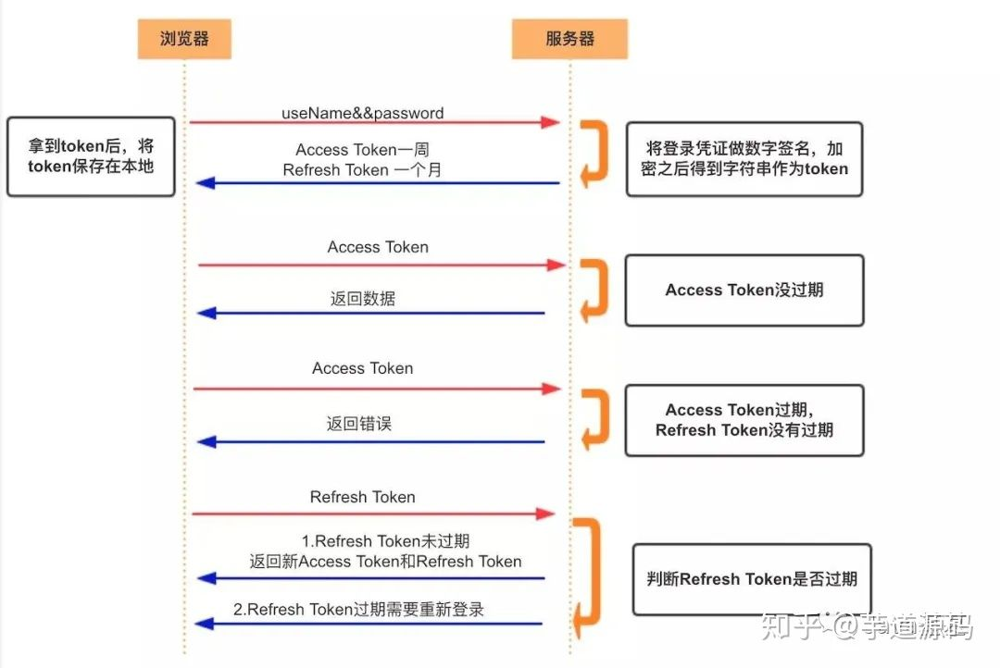

# 网络安全

面试中的一大软肋，还是认真的搞一搞

大概有：CSRF, DDOS, XSS

## CSRF

Cross-Site Request Forgery，跨站点请求伪造

参考：https://blog.csdn.net/xiaoxinshuaiga/article/details/80766369

### 是什么

攻击者利用用户在某一网站的**用户信息**发起对**原目标网站的请求**（Request Forgery），以达到攻击者的目的（坏想法）。

攻击者是如何获得用户信息的呢？

通常是利用了用户登陆之后的 **cookie**，由于 cookie 会被浏览器在每次在同源请求的时候自动带上，攻击者在**另一个网站上**（Cross-Site）伪造了这次请求（可能篡改了请求参数来达到目的），用户一旦点击，就中招了。

对服务器来说这个请求是完全合法的，但是却完成了攻击者所期望的一个操作，比如以你的名义发送邮件、发消息，盗取你的账号，添加系统管理员，甚至于购买商品、虚拟货币转账等。

### 攻击过程

1. 用户浏览并登陆信任的网站 A
2. A 网站验证通过，给客户端 set cookie，内容为 A 的登陆信息
3. 用户在没有登出 A 网站的情况下，访问了危险网站 B
4. B 要求访问第三方站点 A，发出了请求

不能理解的话在看一个例子：

受害者 Bob 在银行有一笔存款，通过对银行的网站发送请求 http://bank.example/withdraw?account=bob&amount=1000000&for=bob2 可以使 Bob 把 1000000 的存款转到 bob2 的账号下。通常情况下，该请求发送到网站后，服务器会先验证该请求是否来自一个合法的 session，并且该 session 的用户 Bob 已经成功登陆。

黑客 Mallory 自己在该银行也有账户，他知道上文中的 URL 可以把钱进行转帐操作。Mallory 可以自己发送一个请求给银行：http://bank.example/withdraw?account=bob&amount=1000000&for=Mallory。但是这个请求来自 Mallory 而非 Bob，他不能通过安全认证，因此该请求不会起作用。

这时，Mallory 想到使用 CSRF 的攻击方式，他先自己做一个网站，在网站中放入如下代码： src=”http://bank.example/withdraw?account=bob&amount=1000000&for=Mallory ”，并且通过广告等诱使 Bob 来访问他的网站。当 Bob 访问该网站时，上述 url 就会从 Bob 的浏览器发向银行，而这个请求会附带 Bob 浏览器中的 cookie 一起发向银行服务器。大多数情况下，该请求会失败，因为他要求 Bob 的认证信息。但是，如果 Bob 当时恰巧刚访问他的银行后不久，他的浏览器与银行网站之间的 session 尚未过期，浏览器的 cookie 之中含有 Bob 的认证信息。这时，悲剧发生了，这个 url 请求就会得到响应，钱将从 Bob 的账号转移到 Mallory 的账号，而 Bob 当时毫不知情。等以后 Bob 发现账户钱少了，即使他去银行查询日志，他也只能发现确实有一个来自于他本人的合法请求转移了资金，没有任何被攻击的痕迹。而 Mallory 则可以拿到钱后逍遥法外。

### 如何防御

#### 验证 HTTP Referer 字段

先看看 referer 字段：

http 请求头中可以有一个 referer 字段，记录了该 HTTP 请求的来源地址（源文档的 url）。（Referer 的正确英语拼法是 referrer。由于早期 HTTP 规范的拼写错误，为了保持向后兼容就将错就错了。）

从主页上链接到一个朋友那里，他的服务器就能够从 HTTP Referer 中统计出每天有多少用户点击我主页上的链接访问他的网站。

**空 Referer**：当这个链接的访问不是在其他页面上产生的，就没有这个字段的值（比如浏览器直接访问 url），**允许空 Referer 和不允许空 Referer 有什么区别？**

允许 Referer 为空，意味着你允许比如浏览器直接访问，就是空。

页面添加 Referer 元素需要使用 meta referrer 标签：（注意这里用的是正确的 referrer 拼写）

```xml
1、None：绝不允许referrer data通过
标签写法：<meta name="referrer" content="none">

2、None When Downgrade：发送referrer信息去安全的HTTPS站点，而非不稳定的HTTP站点。
标签写法：<meta name="referrer" content="none-when-downgrade">

3、Origin Only: 发送协议、主机和端口（即子域）没有一个完整的URL作为来源，
即https://moz.com/example.html只会发送https://moz.com
标签写法：<meta name="referrer" content="origin">

4、Origin When Cross-Origin: 当传origin-only来路信息发送给外部站点时，如果目标有相同的协议、主机和端口（即子域），无论它是HTTP或HTTPS，都将全部的URL作为Referrer发送出去。（注解：官方说明书上有一处排印错误，将来的版本应该是"origin-when-cross-origin"）
标签写法：<meta name="referrer" content="origin-when-crossorigin">

5、Unsafe URL: 总是将URL字串作为一个referrer通过。
注意：如果你的URL中存在任何敏感信息，这不是最安全的选择。其中URL的片段、用户名、密码被自动剥去。
标签写法：<meta name="referrer" content="unsafe-url">
```

所以在防范 CSRF 的时候可以通过这个字段来检查链接的请求是否是自己的页面，可以在服务端的敏感请求前加上拦截器检查，也不用修改业务逻辑代码，不会带来风险，非常方便。

当然这不是万无一失的方法，因为这个字段完全是浏览器来操作的，不同浏览器实现的方法可能不一样，同时也可以篡改这个字段（旧版浏览器）。用户也可能因为不想暴露自己的隐私（访问信息）而关闭浏览器的这个字段，这样就防不了 CSRF 了。

#### 请求中用 csrf_token

这个 token 还不是 jwt 的 token。这个 token 是为了检验是该用户发起的请求，一串只有在自己页面才有的密文。

在 HTTP 请求中以参数的形式加入一个随机产生的 token（可以是 hash），并在服务器端建立一个拦截器来验证这个 token，如果请求中没有 token 或者 token 内容不正确，则认为可能是 CSRF 攻击而拒绝该请求。

而对于 POST 请求来说，要在 form 的最后加上 `<input type="hidden" name="csrftoken" value="tokenvalue"/>`，这样就把 token 以参数的形式加入请求了。但是，在一个网站中，可以接受请求的地方非常多，要对于每一个请求都加上 token 是很麻烦的，并且很容易漏掉，通常使用的方法就是在每次页面加载时，使用 javascript 遍历整个 dom 树，对于 dom 中所有的 a 和 form 标签后加入 token。这样可以解决大部分的请求，但是对于在页面加载之后动态生成的 html 代码，这种方法就没有作用，还需要程序员在编码时手动添加 token。

#### 使用验证码

判定是用户的请求

#### 使用 token

### 为什么

为什么会出现 csrf 攻击，主要原因还是因为浏览器会共享 cookie 并且自动带上这个 cookie，而大多数应用采用 cookie 作为登陆信息的存储功能，让 csrf 有机可乘。

同时服务端是无状态的，他无法感知这个请求就是用户本人发起的，所以需要 token 之类的数据来验证用户的身份。

## Token JWT

来自：https://zhuanlan.zhihu.com/p/152224669

### Acesss Token

- 访问资源接口（API）时所需要的资源凭证

- 简单 token 的组成： uid(用户唯一的身份标识)、time(当前时间的时间戳)、sign（签名，token 的前几位以哈希算法压缩成的一定长度的十六进制字符串）

- 特点：

- - 服务端无状态化、可扩展性好
  - 支持移动端设备
  - 安全
  - 支持跨程序调用

- token 的身份验证流程：

  1. 客户端使用用户名跟密码请求登录
  2. 服务端收到请求，去验证用户名与密码
  3. 验证成功后，服务端会签发一个 token 并把这个 token 发送给客户端
  4. 客户端收到 token 以后，会把它存储起来，比如放在 cookie 里或者 localStorage 里
  5. 客户端每次向服务端请求资源的时候需要带着服务端签发的 token
  6. 服务端收到请求，然后去验证客户端请求里面带着的 token ，如果验证成功，就向客户端返回请求的数据

- 每一次请求都需要携带 token，需要把 token 放到 HTTP 的 Header 里
- 基于 token 的用户认证是一种服务端无状态的认证方式，服务端不用存放 token 数据。用解析 token 的计算时间换取 session 的存储空间，从而减轻服务器的压力，减少频繁的查询数据库
- token 完全由应用管理，所以它可以避开同源策略

### Refresh Token

- 另外一种 token，refresh token
- refresh token 是专用于**刷新 access token 的 token**。如果没有 refresh token，也可以刷新 access token，但每次刷新都要用户输入登录用户名与密码，会很麻烦。有了 refresh token，可以减少这个麻烦，客户端直接用 refresh token 去更新 access token，无需用户进行额外的操作。



- Access Token 的有效期比较短，当 Acesss Token 由于过期而失效时，使用 Refresh Token 就可以获取到新的 Token，如果 Refresh Token 也失效了，用户就只能重新登录了。
- **Refresh Token 及过期时间是存储在服务器的数据库中，只有在申请新的 Acesss Token 时才会验证，不会对业务接口响应时间造成影响，也不需要向 Session 一样一直保持在内存中以应对大量的请求**

### JWT

还是看那篇[知乎](https://zhuanlan.zhihu.com/p/152224669)吧，讲的很细致了

## XSS

参考：[美团技术](https://tech.meituan.com/2018/09/27/fe-security.html)，写的还是很棒的，直接看就完事了

Cross-Site Scripting（跨站脚本攻击），一种代码注入攻击，利用这些恶意脚本，攻击者可获取用户的敏感信息如 Cookie、SessionID 等，进而危害数据安全。

很多类型，充分转译 html

XSS 有哪些注入的方法：

- 在 HTML 中内嵌的文本中，恶意内容以 script 标签形成注入。
- 在内联的 JavaScript 中，拼接的数据突破了原本的限制（字符串，变量，方法名等）。
- 在标签属性中，恶意内容包含引号，从而突破属性值的限制，注入其他属性或者标签。
- 在标签的 href、src 等属性中，包含 `javascript:` 等可执行代码。
- 在 onload、onerror、onclick 等事件中，注入不受控制代码。
- 在 style 属性和标签中，包含类似 `background-image:url("javascript:...");` 的代码（新版本浏览器已经可以防范）。
- 在 style 属性和标签中，包含类似 `expression(...)` 的 CSS 表达式代码（新版本浏览器已经可以防范）。

总之，如果开发者没有将用户输入的文本进行合适的过滤，就贸然插入到 HTML 中，这很容易造成注入漏洞。攻击者可以利用漏洞，构造出恶意的代码指令，进而利用恶意代码危害数据安全。

## CSP

Content Security Policy——内容安全协议

**开发者明确告诉客户端（制定比较严格的策略和规则），哪些外部资源是可以加载和执行的 ，即使攻击者发现漏洞，但是它是没办法注入脚本的**，简单来说，就是我们能够规定，我们的网站只接受我们指定的请求资源。

也是基于浏览器同源策略的，防范**跨网站脚本 XSS**

### 开启 CSP

#### 响应头中添加字段：

Content-Security-Policy

```json
"Content-Security-Policy:" 策略
"Content-Security-Policy-Report-Only:" 策略
```

#### `<meta>`标签

```html
<meta http-equiv="Content-Security-Policy" content="script-src 'self'" />
```

这里的 content 就是策略，表示 script 的来源只能是自身的源

### CSP 的作用

防 XSS 等攻击的利器。CSP 的实质就是白名单制度，开发者明确告诉客户端，哪些外部资源可以加载和执行，等同于提供白名单。它的实现和执行全部由浏览器完成，开发者只需提供配置。CSP 大大增强了网页的安全性。攻击者即使发现了漏洞，也没法注入脚本，除非还控制了一台列入了白名单的可信主机。

### 例子

```json
// 限制所有的外部资源，都只能从当前域名加载
Content-Security-Policy: default-src 'self'

// default-src 是 CSP 指令，多个指令之间用英文分号分割；多个指令值用英文空格分割
Content-Security-Policy: default-src https://host1.com https://host2.com; frame-src 'none'; object-src 'none'

// 错误写法，第二个指令将会被忽略
Content-Security-Policy: script-src https://host1.com; script-src https://host2.com

// 正确写法如下
Content-Security-Policy: script-src https://host1.com https://host2.com

// 通过report-uri指令指示浏览器发送JSON格式的拦截报告到某个地址
Content-Security-Policy: default-src 'self'; ...; report-uri /my_amazing_csp_report_parser;
```

响应头的 CSP 字段告诉浏览器这份资源可以让符合什么策略的客户端来加载
