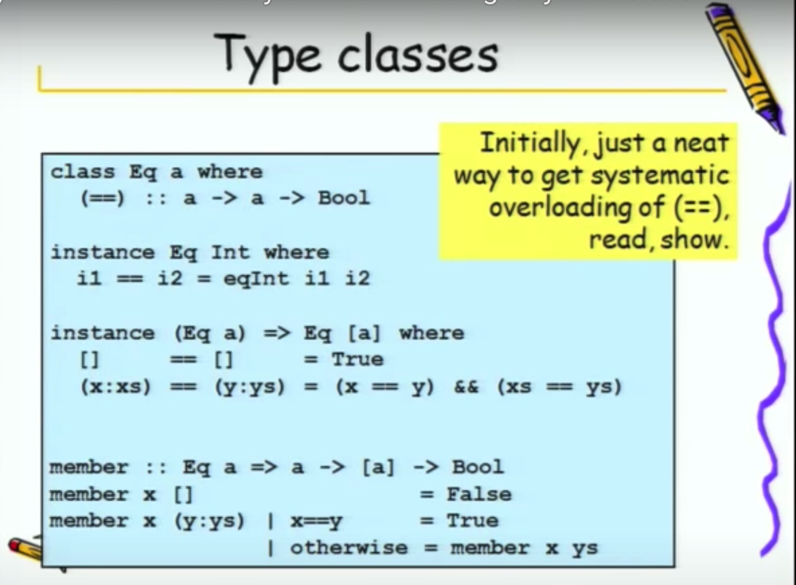

# Haskell

看的是[这个教程](http://learnyouahaskell.com/)，在线免费，但是觉得有点 out of date

## 简介

### 特性

- purely functional programming language
- lazy
- **statically** typed & type inference (compiled & type inference)

### 编译器

[GHC](https://www.haskell.org/ghc/) Glasgow Haskell Compiler

有机会详细了解了解

### 能干什么

> In short; I use Haskell programming for:
>
> - the mathematical elegance and rigor; and hence correctness
> - the clean, elegant syntax
> - GHC as a marvel of a compiler
> - cutting edge type-level programming features
> - performance
> - just elegance (using Lenses, for example)
> - Static typing
> - Ecosystem (yes, I’m actually quite fond of the Haskell ecosystem, but YMMV)
> - Learning
> - Purity
>
> 来自：https://www.quora.com/What-can-Haskell-do

> 作者：阅千人而惜知己
> 链接：https://www.zhihu.com/question/20933265/answer/38358900
> 来源：知乎
> 著作权归作者所有。商业转载请联系作者获得授权，非商业转载请注明出处。
>
> Programming in Haskell
>
> Learn you a Haskell for great good
>
> The craft of functional programming
>
> Introduction to Functional Programming Using Haskell
>
> School of Expression
>
> Real World Haskell
>
> Beginning Haskell
>
> Haskell for data analysis
>
> Parallel and Concurrent Programming in Haskell
>
> Developing web applications with Haskell and Yesod
>
> 其中前 4 本是教学用的，根本无法指导工程实践。理论跟实践比较好的就是 School of Expression，但是很多不是常用的库，很多方向如 FRP、Memoization 没有深入地介绍。RWH 是一本非常好的书，但是很多库已经太旧了，不能使用了，但是书还是可以看，在线版的有讨论，书中不翔实的地方都有人给出解释，十分不错。Beginning Haskell 实践部分很不错，但是理论部分几乎没有。Haskell for data analysis 没看过，不发表评论。Parallel and Concurrent Programming in Haskell 只是讲并行与并发的，但是一本难得的 Haskell 好书。高级的 Haskell 相关的书，最好的一本就是 Michael Snoyman 的 DWAHY 了，工程上是一本非常好的书，但是你需要了解一些如何使用 TH 与 QQ，还有一些其他相关的内容，但是遗憾的是没有讲这些内容。Haskell 每本都如珍珠一般，这些书的作者也者是相当强悍的人，Paul Hudak、Graham Hutton，Simon Marlow 等等。但是 C++、Java、JS 的书我能随便就搜出上百本，无论中文还是英文。

### 历史

可以在油管上看[这个视频](https://www.youtube.com/watch?v=06x8Wf2r2Mc)

haskell 名字的由来：Haskell Curry (1900-1982)

a rearch language



真的牛逼，list 是 Eq 的重载`==`递归

### Why learn

为什么要学 haskell。和其他技术一样，这是一个很重要也很值得思考的一个问题之一。

## ghci

### 安装 ghcup

[ghcup](https://www.haskell.org/ghcup/) is an installer for the general purpose language Haskell

通过指令下载安装包，有点大。。。

有个`haskell language server`没安装，是可以和编辑器集成的

最后还是安装了，为了配合 vscode 的插件

同样可以去 [medium](https://medium.com/@dogwith1eye/setting-up-haskell-in-vs-code-with-stack-and-the-ide-engine-81d49eda3ecf) 上看一下 vscode 环境配置

### 使用

在终端中输入`ghci`就可以进入`REPL`（`⌃ + d`离开 GHCi）

`:?`指令查看帮助

写完脚本（`.hs`文件）之后在 gchi 中用`:l xxx.hs`来倒入和编译模块（在脚本的路径下进入 gchi）

## 初见面

### Everything is a function

_infix_ function & _prefix_ function

前者是“中插”的函数，比如`*`乘法函数，`2 * 5`接受左右两个参数

后者就是前缀的函数了，命令型语言中基本都会是`函数名(参数)`这样来调用

在 Haskell 中是`函数名+空格+参数`多个参数用空格隔开

这样的调用方式是优先级最高的

```haskell
ghci> succ 9 + max 5 4 + 1
16 -- 等价于下面的
ghci> (succ 9) + (max 5 4) + 1
16
```

注意下面两个函数调用（succ 函数返回一个值的 successor the successor of a value. For numeric types, `succ` adds 1）

`succ 9 * 10`

`succ (9 * 10)`

同时如果一个函数接受两个参数的话，可以让他作为 infix 函数，会读起来更加清晰

`div 13 2`13 除 2 可以写成

```haskell
13 `div` 2
```

#### 写几个函数

```haskell
doubleMe x = x + x
doubleUs x y = x * 2 + y * 2

doubleSmallNumber x = if x > 100
  then x
  else x * 2
-- That apostrophe doesn't have any special meaning in Haskell's syntax.
doubleSmallNumber' x = (if x > 100 then x else x * 2) + 1

conanO'Brien = "It's a-me, Conan O'Brien!"
```

#### 函数的注意事项

- 函数名开头不能大写
- 没有参数的函数相当于是被定义了，不能改变他的含义了（When a function doesn't take any parameters, we usually say it's a _definition_ (or a _name_). Because we can't change what names (and functions) mean once we've defined them, **conanO'Brien** and the string **"It's a-me, Conan O'Brien!"** can be used interchangeably.）

#### PS

声名变量`a = 4`可并不是那么简单的 a 为 4 这个值，而是 a 是一个函数，不接受任何参数，直接返回 4，这个概念在写 haskell 的时候要加强！

### list

lists are a _homogenous_ data structure 所有元素都是一样的类型哦

可以用`let`来声名一个变量（在 ghci 中？），相当于在脚本中写`xxx = 123`之后倒入 gchi

#### 拼接

- `++`：`[1,2,3] ++ [4]`，`++`会完整遍历左边的数组，所以如果往很大的数组 append 元素的时候，挺耗时的。。
- `:`：`'J' : "oJo"`，用这个 cons operator 来做及时的拼接，注意接收的参数是**一个 number/char 和一个 number/char 数组**，顺序也不变

数组其实也可以是`1 : 2 : 3 : 4 : []`的语法糖（有趣，从左往右操作的）

#### 取值

- `!!`：`[1, 2, 3] !! 2`，相当于传统的`arr[idx]`

#### 嵌套

可以的，但是类型一定要相同

#### 比较

可以用比较操作符进行比较，逐个元素字典序（lexicographical）比较

#### 数组方法

- head
- tail：除了 head 的剩余部分
- last
- init：返回一个新的 copy，但不包括 last。注意前面这几个都不能作用在空数组`[]`上，会报错，而且在 compile 阶段无法检查
- length
- null：判空数组，`null [] == True`
- reverse
- take：接收参数为一个 number 和一个数组，相当于 `arr.slice(n)`
- drop：`drop 3 [1,2,3,4]`返回去除掉前 n 个元素的数组
- maximum
- minimum
- sum：number 数组
- product：number 数组
- elem：检查一个元素是否在数组中，`elem 123 [1, 2, 3]`，可以写成 infix 的更好

#### 生成数组

[m-n] 的数组？`[m..n]`

字符数组也可以`['A'..'z']`，根据 ascii 码来递增的

步长？告诉 haskell 前两个即可`[2, 4..20]`

```haskell
ghci>init = 4
ghci>step = 7
ghci>[init, init + step..100]
[4,11,18,25,32,39,46,53,60,67,74,81,88,95]
```

递减的数组？反着来呗，但是 step 是负数`[20, 19..1]`

浮点数？有点蛋疼

```haskell
ghci>[0.1,0.2..1]
[0.1,0.2,0.30000000000000004,0.4,0.5,0.6,0.7000000000000001,0.8,0.9,1.0]
ghci>[0.1,0.3..1]
[0.1,0.3,0.5,0.7,0.8999999999999999,1.0999999999999999]
```

精度是老问题了，**不建议用 range**

#### 无限数组

- 利用无限的 range：`[13,26..24*13]`求前 24 个 13 的倍数，`take 24 [13, 26..]`（haskell 是 lazy 计算的）

- cycle：`take 13 (cycle [1, 2, 3])`，无限循环一个数组
- repeat：`take 23 (repeat 4)`，无限重复一个元素
  - replicate：用它来构造重复元素会更好`replicate 3 10` returns `[10,10,10]`

#### list comprehension

数组理解？？感觉是构造器/生成器

非常数学的一种写法，熟悉集合定义的就觉得非常简单了

如果我们要`take 10 [2,4..]`

可以用数学定义的方式来写`[ x * 2 | x <- [1..10] ]`

还是很有意思的，`<-` === 属于`\in`

`[x ** 2 | x <- [3..10]]`

对比 python `[x ** 2 for x in range(3, 11)]`显得更加的数学（逼格高）

同时还能加条件判断`[x*2 | x <- [1..10], x*2 >= 12]`

```haskell
[x | x <- [40..100], x `mod` 7 == 5]
```

相当于是 filter 了，同样 filter 可以是一个 predicate，比如 odd、even

```haskell
-- 定义了一个函数 接收一个数组 返回一个数组 如果是奇数并且小于10就是 Boom 否则为 Bang 不是奇数的直接被过滤了
boomBangs xs = [if x < 10 then "Boom" else "Bang" | x <- xs, odd x]
```

多个 filter（必须同时满足）：`[ x | x <- [10..20], x /= 13, x /= 15, x /= 19]`，`/=`也是个 infix operator，就是不等号`!=`。。。

多个集合的笛卡尔积？先 x 后 y

```haskell
ghci> [ x*y | x <- [2,5,10], y <- [8,10,11]]
[16,20,22,40,50,55,80,100,110]
```

重写一个 length

```haskell
length' xs = sum [1 | _ <- xs]
```

以及对于字符串

```haskell
removeNonLowerCase str = [c | c <- str, c `elem` ['a' .. 'z']]
```

嵌套的

```haskell
ghci> let xxs = [[1,3,5,2,3,1,2,4,5],[1,2,3,4,5,6,7,8,9],[1,2,4,2,1,6,3,1,3,2,3,6]]
ghci> [ [ x | x <- xs, even x ] | xs <- xxs]
[[2,2,4],[2,4,6,8],[2,4,2,6,2,6]]
```

### string

**即为字符数组的语法糖。。。**

`"hellow"` === `['h', 'e', 'l', 'l', 'o', 'w']`

### tuple

和数组其实很像的一个数据结构，但是不同的点在于可以是不同类型元素的组合，这种情况下你明确的知道多少数量和类型的元素需要绑定在一个 tuple 中

#### 语法

和 python 差不多，`(p1, p2)`

#### 用法

好处是可以当我们要用 list 表示一组 tuple 的时候，可以避免错误

```haskell
[(1, 2), (1, 2, 3), (3, 3)]
<interactive>:94:10: error:
    • Couldn't match expected type ‘(a, b)’
                  with actual type ‘(Integer, Integer, Integer)’
    • In the expression: (1, 2, 3)
      In the expression: [(1, 2), (1, 2, 3), (3, 3)]
      In an equation for ‘it’: it = [(1, 2), (1, 2, 3), (3, 3)]
    • Relevant bindings include
        it :: [(a, b)] (bound at <interactive>:94:1)
```

如果我们用嵌套的数组写，haskell 不会觉得是错的

`[[1, 2], [1, 2, 3], [3, 3]]`

但是数组中的 tuple 必须是 homogenous 的，同样`(1, 'a'), (1, 2)]`也是会报错的

- fst：返回一个 pair 的第一个元素`fst (8,11)`
- snd：
- zip：和 py 的差不多，将两个数组 zip 成一个 tuple 数组，以短的 list 为主，`zip [1..] ['a'..'z']`

写一个直角三角形的获取方法

```haskell
let rightTrangles = [ (a, b, c) | c <- [1..10], b <- [1..c], a <- [1..b], a ^ 2 + b ^ 2 == c ^ 2 ]
-- rightTrangles
-- [(3,4,5),(6,8,10)]
```

限定一下斜边的范围

```haskell
rightTrianglesFromLongestSide m n = [(a, b, c) | c <- [m .. n], b <- [1 .. c], a <- [1 .. b], a ^ 2 + b ^ 2 == c ^ 2]
rightTrianglesFromLongestSide 10 20
-- [(6,8,10),(5,12,13),(9,12,15),(8,15,17),(12,16,20)]
```

## Types

### 类型推断

在 ghci 中检查类型用`:t x`

```haskell
ghci>:t "adsf"
"adsf" :: [Char]
-- 看的出 string 实际上是 char 的数组
```

`::`表示 has a type of

```haskell
ghci>:t (1, 'a')
(1, 'a') :: Num a => (a, Char)
```

函数也是有类型的！可以写类型声名（vscode 插件会自动帮你生成。。）

```haskell
removeNonUppercase :: [Char] -> [Char]
-- removeNonLowerCase :: String -> String
removeNonUppercase st = [ c | c <- st, c `elem` ['A'..'Z']]

-- 插件生成的
double :: Num a => a -> a
double x = x + x

-- 插件生成的
doubleUs :: Num a => a -> a -> a
doubleUs x y = x * 2 + y * 2

-- 插件生成的
addThree :: Num a => a -> a -> a -> a
addThree x y z = x + y + z
```

注意看多个参数的函数他的类型，其实是**柯里化**吧！？

_感觉插件生成的函数声明更加的简明吧，把相同类型的参数提前声明了类型_

### 基础类型

- Int：-2147483648 to 2147483647
- Integer：也是整型，但是范围大得多了，`Int`会更高效
- Float
- Double
- Bool
- Char

### Type variables

类型变量

看一眼几个常用函数的类型吧

```haskell
ghci>:t head
head :: [a] -> a
ghci>:t tail
tail :: [a] -> [a]
ghci>:t take
take :: Int -> [a] -> [a]
```

有点意思哈，`[a]`中的`a`是一个类型吗？显然不是（因为类型必须是首字母大写的）

这个`a`其实是一个 type variable，类型变量？感觉就是泛型。可以代表任意类型

所以`head`这个函数的声明类型为：接收一个数组，返回一个元素，数组元素的类型任意

> Functions that have type variables are called _polymorphic functions_.多态函数？？

同样可以看看多个参数的函数

```haskell
ghci>:t fst
fst :: (a, b) -> a
```

### Typeclasses

_A typeclass is a sort of **interface that defines some behavior**._

类型类？好像是之前遇到过的概念，但是有点模糊了，理解为可以表示类型的 interface 吧，只要满足了这个接口的实现都可以称为这个 typeclass 的一部分。同样 type 可以实现不同的 typeclass，这些 typeclass 也像 type 的 subclass，体会一下

```haskell
ghci>:t (==)
(==) :: Eq a => a -> a -> Bool
```

_`==`需要用括号包起来，因为被认为是 infix 的函数，两边接收参数_

> **==** is a function. So are **+**, **\***, **-**, **/** and pretty much all operators

**注意箭头`=>`，在其前面的叫做 class constraint，限制了 type variables 的 typeclass**（换句人话就是函数的参数变量一定要满足某中接口的实现）

The type of those two values must be a member of the **Eq** class (this was the class constraint).

#### 基础的 typeclass

- Eq：used for types that support equality testing. 能够满足相等醒检查的类型，这个类的成员内部都实现了`==`和`/=`

  - 所以上面`(==)`的函数声明表示为：类型变量`a`限制为`Ep`类型（能够相等性检测的），函数的类型为`a -> a -> Bool`

  - ```haskell
    ghci>:t elem
    elem :: (Foldable t, Eq a) => a -> t a -> Bool
    ```

- Ord：for types that have an ordering. 类型是有序的（课比较的），实现了`>`, `<`, `>=` and `<=`

  - ```haskell
    ghci>:t (>)
    (>) :: Ord a => a -> a -> Bool
    ```

  - ```haskell
    ghci>5 `compare`3
    GT
    ghci>:t (5 `compare` 3)
    (5 `compare` 3) :: Ordering
    ```

  - 所以比较的结果`GT`，`LT`，`EQ`都是`Ordering`这个类型的

- Show：函数`show`比较像`toString()`的作用，参数的 typeclass 必须是满足`Show`接口的（可以理解是实现了`toSting`方法。。）

  - ```haskell
    ghci>show 123
    "123"
    ghci>:t show
    show :: Show a => a -> String
    ```

- Read：`read`函数比较像 eval 操作，对字符串进行解析

  - ```haskell
    ghci>read "True" || False
    True
    ghci>read "123" + 4
    127
    ghci>read "[1, 2, 3]" ++ [5]
    [1,2,3,5]
    ```

  - 单独的`read "44"`为什么会报错`*** Exception: Prelude.read: no parse`呢，因为 read 需要上下文来推断他需要的类型（暂时可以这样理解）

  - ```haskell
    ghci>:t read
    read :: Read a => String -> a
    ```

  - 我们也可以显示的告诉 read 需要解析的类型

    ```haskell
    hci>read "123" :: Int
    123
    ghci>read "123" :: Float
    123.0
    ghci>read "[1, 2, 3, 5]" :: [Int]
    [1,2,3,5]
    ghci>read "('e', 123)" :: (Char, Float)
    ('e',123.0)
    ```

- Enum：有序、可枚举的类型，可以被`succ`和`pred`函数作用

  - ```haskell
    ghci>:t succ
    succ :: Enum a => a -> a
    ```

  - ```haskell
    ghci> ['a'..'e']
    "abcde"
    ghci> [LT .. GT]
    [LT,EQ,GT]
    ghci> [3 .. 5]
    [3,4,5]
    ghci> succ 'B'
    'C'
    ```

- Bounded：类型有上下限的值

  - ```haskell
    ghci>:t minBound
    minBound :: Bounded a => a
    ```

  - ```haskell
    ghci>minBound :: Int
    -9223372036854775808
    ghci>maxBound :: Char
    '\1114111'
    ghci>maxBound :: Bool
    True
    ghci>minBound :: Bool
    False
    ```

  - ```haskell
    ghci>minBound :: (Int, Char, Bool)
    (-9223372036854775808,'\NUL',False)
    ```

- Num：a numeric typeclass. 只要表现的像是数字类型的（能加减乘除等）都是 Num

  - ```haskell
    ghci> 20 :: Int
    20
    ghci> 20 :: Integer
    20
    ghci> 20 :: Float
    20.0
    ghci> 20 :: Double
    20.0
    ```

  - ```haskell
    ghci>:t (/)
    (/) :: Fractional a => a -> a -> a
    ghci>:t (*)
    (*) :: Num a => a -> a -> a
    ghci>:t (+)
    (+) :: Num a => a -> a -> a
    ghci>:t (-)
    (-) :: Num a => a -> a -> a
    ```

  - 所以`（5 :: Int) * (6 :: Integer)`会报错，因为`*`接收的参数的`Num`类型必须是一样的。。`5 * (6 :: Integer)`这样就可以了

- Integral：积分？整数？In this typeclass are **Int** and **Integer**.

- Floating：`Float`和`Double`

关于`fromIntegral`这个函数：

```haskell
ghci>:t fromIntegral
fromIntegral :: (Integral a, Num b) => a -> b
```

能够将 Integral 类型转换为更加宽泛的 Num

当我们需要将 Int/Integer 与 Floating 相加的时候

```haskell
fromIntegral (length [1,2,3,4]) + 3.2
```

因为`length`的返回类型写死了是`Int`，如果想要将 length 与一个浮点数相加就会报错了

```haskell
ghci>:t length
length :: Foldable t => t a -> Int
```

## Functions

### pattern matching

相当于是重载函数，不同的重载函数的参数可以匹配任意的类型

```haskell
lucky :: Integral a => a -> String
lucky 7 = "Lucky you!"
lucky x = "You are not lucky enough, pal"
-- 特例的重载要写在前面。。不然先编译第三行了
```

可以少写一些 if else，让函数可读性更高

```haskell
sayMe :: (Integral a) => a -> String
sayMe 1 = "One!"
sayMe 2 = "Two!"
sayMe 3 = "Three!"
sayMe 4 = "Four!"
sayMe 5 = "Five!"
sayMe x = "Not between 1 and 5"
```

求阶乘（递归）

```haskell
factorial :: Integral a => a -> a
factorial 0 = 1
factorial n = n * factorial (n - 1)
```

_When making patterns, we should always include a catch-all pattern so that our program doesn't crash if we get some unexpected input._

tuple 也可以直接被解构进行 pattern matching

```haskell
addVectors :: Num a => (a, a) -> (a, a) -> (a, a)
-- addVectors tp1 tp2 = (fst tp1 + fst tp2, snd tp1 + snd tp2)
addVectors (x1, y1) (x2, y2) = (x1 + x2, y1 + y2)
```

三元组的 first second third

```haskell
first :: Num a => (a, a, a) -> a
first (x, _, _) = x

second :: Num a => (a, a, a) -> a
second (_, x, _) = x

third :: Num a => (a, a, a) -> a
third (_, _, x) = x
```

利用`:`来解构 list（`[]`其实就是`x:y:z:[]`的语法糖嘛）

```haskell
head' :: [a] -> a
head' [] = error "Can't call head on an empty list, dummy!"
head' (x : _) = x
-- 这里很妙啊 用 : 和 _ 屏蔽了剩余部分
```

> _Note_: The `x:xs` pattern is used a lot, especially with recursive functions. But patterns that have `:` in them only match against lists of length 1 or more.

写个 tail 也很简单啦

```haskell
tail' :: [a] -> [a]
tail' [] = error "Can't call head on an empty list, dummy!"
tail' (_ : x) = x
```

再看个例子

```haskell
tell :: (Show a) => [a] -> String
tell [] = "The list is empty"
tell (x : []) = "The list has one element: " ++ show x
tell (x : y : []) = "The list has two elements: " ++ show x ++ " and " ++ show y
tell (x : y : _) = "This list is long. The first two elements are: " ++ show x ++ " and " ++ show y
```

#### 获取参数的完整引用（在解构的同时）

在 pattern 前写一个`@`

```haskell
capital :: String -> String
capital "" = "empty!"
capital all@(x : _) = "The capital of " ++ all ++ " is " ++ [x]
```

#### 在 pattern 中不能用`++`

`xs ++ ys`，我们也不知道两个数组分别放那些元素

```haskell
firstThree :: Num a => [a] -> a
firstThree (x : y : z : [_]) = x + y + z
-- firstThree ([x, y, z] ++ [_]) = x + y + z  -- 报错的
```

### Guards

怎么说，很数学的感觉，但又很 if else，用`|`（pipe 管道符）连接各个情况

```haskell
bmiTell :: (RealFloat a) => a -> String
bmiTell bmi
  | bmi <= 18.5 = "You're underweight, you emo, you!"
  | bmi <= 25.0 = "You're supposedly normal. Pffft, I bet you're ugly!"
  | bmi <= 30.0 = "You're fat! Lose some weight, fatty!"
  | otherwise = "You're a whale, congratulations!"
```

说实话又有点像 switch case，条件判断为`False`会进入下一个判断

Many times, the last guard is `otherwise`. `otherwise`is defined simply as `otherwise = True` and catches everything.

没有`otherwise`的情况下，所有 guard 都判断为`False`之后会进入下一个 pattern，如果没有其他的 pattern，会报错。所以最好都要有兜底。

#### where

用`where`语句来简化一下每次需要计算的表达式，一种在函数内绑定变量的操作

```haskell
bmiTell' :: (RealFloat a) => a -> a -> String
bmiTell' weight height
  | bmi <= 18.5 = "You're underweight, you emo, you!"
  | bmi <= 25.0 = "You're supposedly normal. Pffft, I bet you're ugly!"
  | bmi <= 30.0 = "You're fat! Lose some weight, fatty!"
  | otherwise = "You're a whale, congratulations!"
  where
    bmi = weight / height ^ 2
```

提高可读性，可维护性！

```haskell
bmiTell' :: (RealFloat a) => a -> a -> String
bmiTell' weight height
  | bmi <= skinny = "You're underweight, you emo, you!"
  | bmi <= normal = "You're supposedly normal. Pffft, I bet you're ugly!"
  | bmi <= fat = "You're fat! Lose some weight, fatty!"
  | otherwise = "You're a whale, congratulations!"
  where
    bmi = weight / height ^ 2
    skinny = 18.5
    normal = 25.0
    fat = 30.0
```

甚至还能用 pattern matching（在 haskell 里就这样叫吧）

```haskell
...
where bmi = weight / height ^ 2
      (skinny, normal, fat) = (18.5, 25.0, 30.0)
```

甚至直接可以在函数声明里使用

```haskell
initials :: String -> String -> String
initials firstName lastName = [f] ++ "." ++ [l] ++ "."
  where
    (f : _) = firstName
    (l : _) = lastName
```

还能 where 一个函数

```haskell
calcBmis :: RealFloat a => [(a, a)] -> [a]
calcBmis xs = [bmi w h | (w, h) <- xs]
  where
    bmi weight height = weight / height ^ 2
```

#### let ... in

同样也是绑定

_`where` bindings are a syntactic construct that let you bind to variables at the end of a function and the whole function can see them, including all the guards._

_`let` bindings let you bind to variables anywhere and are expressions themselves, but are very local, so they don't span across guards._

```haskell
-- 计算圆柱体表面积
cylinder :: (RealFloat a) => a -> a -> a
cylinder r h =
  let sideArea = 2 * pi * r * h
      topArea = pi * r ^ 2
   in sideArea + 2 * topArea
```

`let <bindings> in <expression>`在`in`的表达式中才能获取前面绑定的变量

目前好像还看不出`where`和`let`的差别，只是前者是放在整个函数的最后，后者可以随处

- `where`：一种 syntactic constructs
- `let`：变量声明而已，更加随性

用`;`隔开 inline 的变量声明，或者用解构

```haskell
(let a = 100; b = 200; c = 300 in a*b*c, let foo="Hey "; bar = "there!" in foo ++ bar)
(let (a,b,c) = (1,2,3) in a+b+c) * 100
```

在数组的定义中声明

```haskell
calcBmis :: (RealFloat a) => [(a, a)] -> [a]
calcBmis xs = [bmi | (w, h) <- xs, let bmi = w / h ^ 2]
```

在 GHCI 中用`let`，相当于是声明变量，可以参略`in`。当然也可以让变量有 scope

```haskell
ghci>let boot x y z = x * y + z in boot 2 3 4
10
ghci>boot
<interactive>:186:1: error: Variable not in scope: boot
```

#### Case expression

类似于命令式语言的`switch case`？根据变量不同的值的情况执行不同的代码

每一种 case 都是一个表达式

前面的参数 pattern matching 其实就是 case expression 的一个语法糖

```haskell 
head' :: [a] -> a
head' [] = error "No head for empty lists!"
head' (x:_) = x
```

```haskell
head'' :: [a] -> a
head'' xs = case xs of
  [] -> error "No head for empty lists!"
  (x : _) -> x
```

语法如下

```haskell
case expression of pattern -> result
                   pattern -> result
                   pattern -> result
                   ...
```

看几个例子

```haskell
describeList :: [a] -> String
describeList xs =
  "The list is " ++ case xs of
    [] -> "empty"
    [x] -> "single element"
    xs -> "a longer list"

```

同样可以用 pattern matching 这个语法糖来写

```haskell
describeList' :: [a] -> String
describeList' xs = "The list is " ++ what xs
  where
    what [] = "empty."
    what [x] = "a singleton list."
    what xs = "a longer list."
```

## Recursion

在 haskell 中，递归很重要哦，是因为：you do computations in Haskell by declaring what something _is_ instead of declaring _how_ you get it. That's why there are no while loops or for loops in Haskell and instead we many times have to use recursion to declare what something is.

我们不会像命令式语言去写一个 for 循环来得到一个 list 的最大值，而是先定义一个 edge condition：单元素的数组最大值就是这个元素，其余情况判断第一个元素和 tail 的最大值哪个大

#### 求一个数组的最大值

```haskell
maximum' :: Ord a => [a] -> a
maximum' [] = error "empty list!"
maximum' [x] = x
maximum' (x : xs)
  | x > maxTail = x
  | otherwise = maxTail
  where
    maxTail = maximum' xs
-- 可以用 max 来替换 guard
-- maximum' (x : xs) = max x (maximum' xs)
```

这个代码还是写的有意思的！

#### 重复一个值 n 次

```haskell
replicate' :: (Num i, Ord i) => i -> a -> [a]
replicate' n x
  | n <= 0 = []     -- 需要 i 是 Ord 的 typeclass
  | otherwise = x : replicate' (n - 1) x
```

_Note:_ **Num** is not a subclass of **Ord**.

#### 实现一个递归的 take 函数

```haskell
take' :: (Num i, Ord i) => i -> [a] -> [a]
take' n _
  | n <= 0 = [] -- 边界情况
take' _ [] = [] -- 边界情况
take' n (x : xs) = x : take' (n - 1) xs
```

注意`take' (-1) [1, 2, 3]`，负数是要用括号括起来的。。。别忘了

#### reverse

```haskell
reverse' :: [a] -> [a]
reverse' [] = [] -- 边界情况
reverse' (x : xs) = reverse' xs ++ [x] -- 拆解下去重新链
```

#### repeat

haskell 支持无限列表，所以似乎可以没有一个 edge condition 来 terminate。

```haskell
repeat' :: a -> [a]
repeat' x = x : repeat' x
```

#### zip

```haskell
zip' :: [a] -> [b] -> [(a, b)]
zip' [] _ = [] -- 其中一个短的就终止递归了
zip' _ [] = []
zip' (x : xs) (y : ys) = (x, y) : zip' xs ys
```

#### elem

有点点复杂

```haskell
-- a 一定要是 可等性比较的 Eq typeclass
elem' :: (Eq a) => a -> [a] -> Bool
elem' _ [] = False
elem' x (y : ys)
  | x == y = True
  | otherwise = x `elem'` ys
```

_发现了，只要是需要循环的，递归都可以拆成 head 和 tail 去操作，判空的时候做一下边界处理_

#### quicksort

我裂开，如此有表达力的代码！牛逼！

```haskell
-- quicksort!
quicksort :: Ord a => [a] -> [a]
quicksort [] = []
quicksort (x : xs) =
  let smallSorted = quicksort [a | a <- xs, a <= x]
      largeSorted = quicksort [a | a <- xs, a > x]
   in smallSorted ++ [x] ++ largeSorted
```

复杂度呢？怎么感觉是 n 方。。

#### Thinking recursively

> So when trying to think of a recursive way to solve a problem, try to think of when a recursive solution doesn't apply and see if you can use that as an edge case, think about identities and think about whether you'll break apart the parameters of the function (for instance, lists are usually broken into a head and a tail via pattern matching) and on which part you'll use the recursive call.

## High order functions

### Curried function

函数的柯里化

前面其实也提到过，可以注意到函数签名的时候都是 currify 的

所以在 haskell 中，每个函数都只接收一个参数（第一个）

_柯里化有什么好处？_

我们可以通过给少量的参数而得到一个绑定参数的特定函数，拿他去做一些其他的事情

```haskell
ghci>mulThree x y z = x * y * z
ghci>let mulTwoWithSix = mulThree 6
ghci>mulTwoWithSix 2 4
48
```

对于 infix 的函数分割，要用`()`

```haskell
divideByTen :: Double -> Double
divideByTen = (/ 10)

divideTen :: Double -> Double
divideTen = (10 /)

isAlphabet :: Char -> Bool
isAlphabet = (`elem` ['a' .. 'z'] ++ ['A' .. 'Z'])
-- 缺哪一边的参数就是新的函数的参数
```

**`-`减法不能直接用**

`(-4)`被认为是 -4，可以用`subtract`函数**（`subtract A from B`）**

```haskell
subtractTen :: Num a => a -> a
subtractTen = (subtract 10)
```

当参数少的时候，得到的新函数不能在 ghci 中打印出来哦，Functions aren't instances of the `Show` typeclass

### 试着写一个 zipWith

zip 两个数组之后，对元组的两个元素进行操作，返回列表

简单看一下`zipWith`的类型

```haskell
ghci>:t zipWith
zipWith :: (a -> b -> c) -> [a] -> [b] -> [c]
```

用递归

```haskell
zipWith' :: (a -> b -> c) -> [a] -> [b] -> [c]
zipWith' _ [] _ = []
zipWith' _ _ [] = []
zipWith' f (x : xs) (y : ys) = f x y : zipWith' f xs ys
```

调用一下！

```haskell
ghci>zipWith (*) [2, 3, 5] [4, 1, 3]
[8,3,15]
ghci>zipWith (++) ["haha ", "hehe "] ["JOJO", "DIO"]
["haha JOJO","hehe DIO"]
ghci>
```

_everything is a function_

`flip`：接收一个函数，返回这个函数，将其的两个参数的顺序交换

```haskell
flip' :: (a -> b -> c) -> b -> a -> c
flip' f x y = f y x

-- flip' f = g
--   where
--     g x y = f y x
```

`div`：整除函数

```haskell
ghci>zipWith (flip div) [3,3..] [3, 1, 2, 4, 5, 6]
[1,0,0,1,1,2]
```

### map 和 filter

比较关键和有用的两个高阶函数！

#### map

```haskell
map' :: (a -> b) -> [a] -> [b]
map' _ [] = []
map' f (x : xs) = f x : map' f xs
```

用一下

```haskell
ghci>map (subtract 12) [1, 2, 3, 4, 5]
[-11,-10,-9,-8,-7]
ghci>map (++ "??") ["are", "you", "ok"]
["are??","you??","ok??"]
```

You've probably noticed that each of these could be achieved with a list comprehension.

但是 map 肯定更加 readable

#### filter

```haskell
filter' :: (a -> Bool) -> [a] -> [a]
filter' _ [] = []
filter' p (x : xs)
  | p x = x : filter' p xs -- p x == True
  | otherwise = filter' p xs
```

```haskell
ghci>filter' even [1, 3, 5, 33, 44, 112]
[44,112]
```

对于用`map`和`filter` v.s. 数组定义的场景还是取决于代码在上下文的可读性

之前的`quicksort`也可以改写成

```haskell
quicksort' :: Ord a => [a] -> [a]
quicksort' [] = []
quicksort' (x : xs) =
  let smallSorted = quicksort' (filter (<= x) xs)
      largeSorted = quicksort' (filter (> x) xs)
   in smallSorted ++ [x] ++ largeSorted
```

`takeWhile`函数：接收一个 pred 和一个 list，当 pred 为 False 的时候，返回之前所有 pred 为 True 的元素集合，相当于是一个断路的 filter

_求平方小于 10000 的数之和_

```haskell
ghci>sum (takeWhile (< 10000) (filter odd (map (^2) [1..])))
166650
```

用无限列表即可

也可以用 list comprehension 来写，少一点括号

```haskell
ghci>sum (takeWhile (< 10000) [s | n <- [1..], let s = n ^ 2, odd(s)])
166650
```

#### Collatz sequences

偶数除以 2，奇数乘 3 再加 1，可以得到一个 chain

```haskell
chain :: Integral a => a -> [a]
chain 1 = [1]
chain n
  | even n = n : chain (n `div` 2)
  | otherwise = n : chain (n * 3 + 1) -- odd
```

执行一下

```haskell
ghci>chain 1
[1]
ghci>chain 15
[15,46,23,70,35,106,53,160,80,40,20,10,5,16,8,4,2,1]
```

问题来了：分别从 1-100 开始的 chain，长度超过 20 的有多少个？

```haskell
numLongChains :: Int
numLongChains = length (filter isLong (map chain [1 .. 100]))
  where
    isLong xs = length xs > 20
-- ghci>numLongChains
-- 46
```

> _Note:_ This function has a type of `numLongChains :: Int` because `length` returns an `Int` instead of a `Num a` for historical reasons. If we wanted to return a more general `Num a`, we could have used `fromIntegral` on the resulting length.

我们甚至可以这样写`map (*) [0..]`来创建一个无限数组`[(*0), (*1), (*2), (*3), (*4), (*5)]`

```haskell
ghci>let listOfFn = map (*) [0..]
ghci>(listOfFn !! 5) 6
30
```

**`!!`是取 list 的下标。别忘了。。**

### lambdas

- 用一次
- 传递给高阶函数

#### 语法

用`\`作为开头（比较像 $\lambda$），后面跟上参数列表，`->` 之后是函数题。**通常我们用`()`包裹起来**

#### why

我们可以将上面函数中`where`的函数定义部分改成匿名函数

```haskell
numLongChains' :: Int
numLongChains' = length (filter (\xs -> length xs > 20) (map chain [1 .. 100]))
```

同样可以使用 pattern matching 来解构参数，但是不能用特殊值的写法（比如`[]`的匹配），如果不匹配 pattern 会报 runtime 的错

lambda 也是一个表达式，返回的是一个函数，所以在很多时高阶函数返回的是一个新的函数，用 lambda 会更好的表现力

```haskell
flip'' :: (a -> b -> c) -> b -> a -> c
flip'' f = \x y -> f y x
-- ghci>flip'' (/) 4 3
-- 0.75
```

虽然这和直接`flip' (/) 4 3`没有很多本质区别，但是后者是一个新的函数，在调用的时候同时接收了三个参数，`flip''`则是返回一个新的函数，害，这里真的只可意会不也言传。。。

### folds and horses?

#### fold

所谓`fold`函数，就是`reduce`吧

> A fold takes a binary function, a starting value (I like to call it the accumulator) and a list to fold up. The binary function itself takes two parameters. The binary function is called with the accumulator and the first (or last) element and produces a new accumulator.

reduce 到最后只剩下一个 accumulator 了。

参数：`binary-function starting-value list`

- `foldl`：fold from _left_，从第一个元素开始 reduce

  ```haskell
  sum' :: Num a => [a] -> a
  sum' xs = foldl (\x y -> x + y) 0 xs
  ```

  还能写的更加简洁一点（柯里化来返回一个新函数）

  ```haskell
  sum' = foldl (+) 0
  ```

  再写一个`elem`

  ```haskell
  elem'' :: Eq a => a -> [a] -> Bool
  elem'' y xs = foldl (\acc x -> if y == x then True else acc) False xs
  ```

  觉得这样写会更好？

  ```haskell
  elem'' y xs = foldl (\acc x -> y == x || acc) False xs
  ```

- `foldr`：fold from right，binary function 需要 flip 一下参数顺序`\x acc -> ...`

  写一个`map`试试

  ```haskell
  map'' :: (a -> b) -> [a] -> [b]
  map'' f xs = foldr (\x acc -> f x : acc) [] xs
  ```

  可我们同样可以用`foldl`来实现

  ```haskell 
  map'' f xs = foldl (\acc x -> acc ++ [f x]) [] xs
  ```

  但是注意了，`++`的开销会比`:`大！

  再写一个`reverse`

  ```haskell
  reverse'' :: [a] -> [a]
  reverse'' = foldl (\acc x -> x : acc) []
  ```

注意：`foldr`能够作用在 infinite list 上，但是`foldl`不可以。。不过。。。。

```haskell
ghci>foldr (+) 0 [1..]
*** Exception: stack overflow
```

`foldl1`和`foldr1`是不需要 starting value 的 fold 函数。。。但是他们接收的 list 至少要有一个参数，否则会 runtime 报错

#### powerful fold

实现一堆标准函数吧

```haskell
maximum'' :: Ord a => [a] -> a
maximum'' = foldl1 (\acc x -> if x > acc then x else acc)
-- 也不用考虑空 list 了 foldl1 会自己报错

product' :: Num a => [a] -> a
product' = foldr1 (*)

filter'' :: (a -> Bool) -> [a] -> [a]
filter'' f = foldr (\x acc -> if f x then x : acc else acc) []

head''' :: [a] -> a
head''' = foldl1 (\first _ -> first) -- 感觉遍历一边很多此一举。。

last' :: [a] -> a
last' = foldr1 (\_ last -> last) -- 一样。。
```

`reverse`同样可以写成：`foldl (flip (:)) []`

#### scan

`scanl`和`scanr`（`scanl1`和`scanr1`）

和 fold 一样，只不过 they **report all the intermediate accumulator states** in the form of a list.

用 scan 做 reduce 的结果在 list 的 head（`scanr`） 和 last（`scanl`)

_问题来了，scan 有啥用呢？_

来写个题：**平方数求和大于 1000 的连续自然数的个数有多少个？**

```haskell
sqrtSumNum :: Int
sqrtSumNum = length (takeWhile (< 1000) (scanl1 (+) (map sqrt [1 ..]))) + 1
```

1. 首先自然数的平方`map sqrt [1 ..]`
2. 对每个结果求和，因为需要中间过程，就用 scan
3. 每个结果上限 1000，`takeWhile`结束一个数组的 filtered results

看一下结果

```haskell
ghci>sqrtSumNum
131
ghci>sum (map sqrt [1..131])
1005.0942035344083
ghci>sum (map sqrt [1..130])
993.6486803921487
```

### `$`函数

这是啥？

```haskell
ghci>:t ($)
($) :: (a -> b) -> a -> b
```

叫 _function application_

难道就是`apply`？好吧不是。。

```haskell
f $ x = f x
```

一样是调用函数的操作，但是`$`作用的优先级是最低的，以至于我们有的时候可以不需要写很多括号

`f a b c` == `((f a) b) c)`

`sum (map sqrt [1..131])` == `sum $ map sqrt [1..131]`

遇到`$`之后先不执行函数，先看后面有没有调用

#### 原理

`$`右边的表达式作为左边函数的参数

`f (g (z x))` is equal to `f $ g $ z x`

教程中写到：`sum (filter (> 10) (map (\*2) [2..10]))` as `sum $ filter (> 10) $ map (\*2) [2..10]`

可是。。报错了

```haskell
ghci>sum $ filter (> 10) $ map (*2) [2..10]

<interactive>:40:7: error:
    • Couldn't match type ‘[Integer]’ with ‘[Integer] -> t2’
      Expected type: [Integer] -> [Integer] -> t2
        Actual type: [Integer] -> [Integer]
    • Possible cause: ‘filter’ is applied to too many arguments
      In the second argument of ‘($)’, namely ‘filter (> 10)’
      In the first argument of ‘($)’, namely ‘sum $ filter (> 10)’
      In the expression: sum $ filter (> 10) $ map (* 2) [2 .. 10]
    • Relevant bindings include it :: t2 (bound at <interactive>:40:1)
```

反复尝试之后还是加了一对括号

```haskell
ghci>sum $ (filter (> 10) $ map (*2) [1, 2, 3, 33])
66
```

可以把`$`当成是一个函数的生成

```haskell
ghci> map ($ 3) [(4+), (10*), (^2), sqrt]
[7.0,30.0,9.0,1.7320508075688772]
```

### Function composition

$(f\circ g)(x) = f(g(x))$

所以在 haskell 里面居然就是`.`

```haskell
hci>:t (.)
(.) :: (b -> c) -> (a -> b) -> a -> c
f . g = \x -> f (g x)
```

注意是第二个 g 先作用，所以类型要注意咯（g 的 output `::` f 的 input）

```haskell
ghci>n33 = negate . (*33)
ghci>n33 123
-4059
```

明显通过函数组合会更有表达力（下面要取全负数）

```haskell
ghci>map (\x -> negate (abs x)) [1, 2, -3, 1, -2, -33, 2]
[-1,-2,-3,-1,-2,-33,-2]

ghci>map (negate . abs) [1, 2, 3]
[-1,-2,-3]
```

多个函数的组合也是连用`.`的

```haskell
ghci>map (negate . sum . tail) [[1..5], [2..7], [3..9]]
[-14,-25,-39]
```

目前所有的函数接收的参数都只有 1 个，多个怎么办呢

分开依次作用，反正都是 currying 的

```haskell
ghci>sum (replicate 5 (max 5.3 5.9))
29.5
ghci>(sum . replicate 5 . max 5.3) 5.9
29.5
```

或者用`$`，`sum . replicate 5. max 5.3 $ 5.9`

`$`连接的函数执行会最后执行，前面的几个函数从右往左依次组合

再来变换一个`replicate 100 (product (map (*3) (zipWith max [1,2,3,4,5] [4,5,6,7,8])))`

```haskell
replicate 100 . product . map (*3) . zipWith max [1,2,3,4,5] $ [4,5,6,7,8]
```

解读一下：`$`之前的都是组合起来的函数，最内部的函数是`zipWith max [1, 2, 3, 4, 5]`，是一个 curry 之后的函数，缺少一个参数。

组合之后，`[4,5,6,7,8]`作为这个组合函数的参数。

#### 等式两边的参数抵消

还是很有意思的

```haskell
sum' :: (Num a) => [a] -> a
sum' xs = foldl (+) 0 xs
-- 可以同时消去 xs 实现柯里化
sum' = foldl (+) 0
```

```haskell
fn x = ceiling (negate (tan (cos (max 50 x))))
fn = ceiling . negate . tan . cos . max 50
```

这样的做法叫 a point free style，就是用组合函数的方式来构造函数

但是很多情况下，很长很复杂的函数组合会降低可读性。The prefered style is to **use _let_ bindings to give labels to intermediary results** or **split the problem into sub-problems and then put it together** so that the function makes sense to someone reading it instead of just making a huge composition chain.

最后我们再来尝试改写一下之前的一个函数

```haskell
oddSquareSum :: Integer
oddSquareSum = sum (takeWhile (< 10000) (filter odd (map (^2) [1 ..])))
```

answer is

```haskell
oddSquareSum = sum . takeWhile (< 10000) . filter odd . map (^ 2) $ [1 ..]
```

当然，上面这个代码可能读起来很费劲，尽可能的还是 readable 吧

```haskell
oddSquareSum' :: Integer
oddSquareSum' =
  let oddSquares = filter odd $ map (^ 2) [1 ..]
      belowLimit = takeWhile (< 10000) oddSquares
   in sum belowLimit
```

## Modules

模块化

### 语法

`import <module name>`

比如我们导入一个有很多 List 操作方法的模块

```haskell
import Data.List

-- calc the number of a list unique elements
numUniques :: Eq a => [a] -> Int
numUniques = length . nub

-- nub O(n^2) remove duplicated elements i.e. keep unique element
-- weeds out duplicate elements
```

在 GHCi 中导入用`:m +/- <mod>`，m -> module

可以一次加很多，用空格隔开

已经有很多模块被自动的导入了，叫做`Prelude` module

#### 导入指定的函数

```haskell
import Data.List (nub)   -- () 就是啥也不导入
```

#### 屏蔽某个函数的导入

如果我们已经有一个`nub`函数，不想引起冲突，可以 hiding 掉某个函数。函数冲突会报错的。。

```haskell
import Data.List hiding (nub)
```

#### qualified imports

```haskell
import qualified Data.Map as M
```

让一个模块的方法名都加上模块名才能正常调用

### 标准库文档

[文档](https://downloads.haskell.org/~ghc/latest/docs/html/libraries/)

> A great way to pick up new Haskell knowledge is to just click through the standard library reference and explore the modules and their functions. You can also view the Haskell source code for each module. Reading the source code of some modules is a really good way to learn Haskell and get a solid feel for it.

用 [Hoogle](https://hoogle.haskell.org/) 来查询模块的信息，Haskell Google?

### Data.List

关于 list 的很多函数（方法），来看看呗

#### intersperse

接收一个值和一个数组（同类型的），将这个值安插在每两个元素之间

```haskell
ghci>import Data.List
ghci>intersperse '?' "MUDAMUDAMUDA"
"M?U?D?A?M?U?D?A?M?U?D?A"
```

_intersperse：散布_

#### intercalate

插入的意思

接收一个 list 和一个 list of list，将第一个 list 在后面的嵌套数组中安插，然后再 flat 一下

```haskell
ghci>intercalate "-+-" ["haha", "you", "ok"]
"haha-+-you-+-ok"
ghci>intercalate [33, 44] [[1, 2], [9, 0], [7, 8]]
[1,2,33,44,9,0,33,44,7,8]
```

#### transpose

转置？没错，接收一个二维数组，然后转置他，类似矩阵的转置，但不局限维度

```haskell
ghci>transpose ["qwer", "asd", "zxcvb"]
["qaz","wsx","edc","rv","b"]
ghci>transpose [[1, 2, 3], [4, 5, 6], [9, 8, 7]]
[[1,4,9],[2,5,8],[3,6,7]]
ghci>
```

其实就是按照 index 来取这些数组

多项式相加的时候可以用得到

$3x^{2} + 5x + 10$ 和 $5x^{2} + 1$ 相加，通过系数`[3, 5 10]`和`[5, 0, 1]`相加

```haskell
ghci>map sum $ transpose [[3, 5, 10], [5, 0, 1]]
[8,5,11]
```

回顾一下`$`：两边的函数和参数最后才被调用，所以是`map sum`先组合柯里化，然后再作用`transpose`的结果，相当于`map sum (transpose [[3, 5, 10], [5, 0, 1]])`

#### foldl' foldl1'

严格模式的`foldl`，相比他们的惰性求值的版本会直接计算中间 accumulator 的结果。

*lazy function 直到这个函数会得出最终结果的时候才会 compute，这叫做 thunk。。*有的时候会中间结果保留太多会导致 stack overflow

_laziness 是 haskell 一个关键的概念，待深入理解_

所以当处理一些 list 爆栈的时候可以用 stick 模式的 fold

注意没有`foldr'`的

#### concat

接收一组 list of list，将数组元素串起来

```haskell
ghci>concat [[3, 3, 4], [2, 3, 4], [1]]
[3,3,4,2,3,4,1]
```

也就是 flat 了一次，多重嵌套就需要多次 concat 了

```haskell
ghci>concat $ concat [[[2, 3], [3, 4, 5], [2]], [[2, 3], [3, 4]]]
[2,3,3,4,5,2,2,3,3,4]
```

#### concatMap

先 map 嵌套的数组元素，再 concat 起来

```haskell
ghci>concatMap (replicate 4) [1 .. 3]
[1,1,1,1,2,2,2,2,3,3,3,3]
```

#### and or

`and`类似于`all`这种感觉，接收一个 list of Bool，全是`True`才返回`True`

```haskell
ghci>and $ map (< 12) [1, 3, 4, 6]
True
ghci>or $ map (< 12) [11, 33, 4, 6]
True
```

#### any all

比上面两个常用多了，接收一个 predicate 和一个 list

```haskell
ghci>all even [1, 3, 4]
False
```

#### iterate

接收一个 list 和一个 starting value

对这个初始值应用函数，对得到的值继续应用，构造数组（无限的。。。）

```haskell
ghci>take 10 $ iterate (*3) 1
[1,3,9,27,81,243,729,2187,6561,19683]
ghci>take 3 $ iterate (++ "yo") "oha"
["oha","ohayo","ohayoyo"]
```

#### splitAt

对于数组的 split 操作，拆分得到元组，可以接受负数

```haskell
ghci>splitAt 3 "hahah"
("hah","ah")
ghci>let (f, s) = splitAt 4 "aaafbbbe" in s ++ f
"bbbeaaaf"
```

#### takeWhile

前面也遇到了好多次啦，会获取一个数组中满足条件的元素，遇到不满足的情况直接停止

```haskell
ghci>sum $ takeWhile (<10000) $ map (^3) [1..]
53361
```

#### dropWhile

和 takeWhile 类似，只不过是 drop 掉满足 predicate 的元素，返回第一个不满足条件后剩余的数组

```haskell
ghci>dropWhile (/= ' ') "thisis a "
" a "
```

```haskell
ghci>let stock = [(994.4,2008,9,1),(995.2,2008,9,2),(999.2,2008,9,3),(1001.4,2008,9,4),(998.3,2008,9,5)]
ghci>dropWhile (\(val, year, month, date) -> val < 1000) stock
[(1001.4,2008,9,4),(998.3,2008,9,5)]
```

#### span

和 takeWhile 一样，但是将剩余部分作为元组第二个元素返回了

```haskell
ghci>span (/= ' ') "yes ok"
("yes"," ok")
```

#### break

也有点类似 span，遇到第一个满足 predicate 的时候断开，返回元组

```haskell
ghci>break (== 4) [1, 2, 3, 4, 5]
([1,2,3],[4,5])
```

#### sort

#### group

将相同元素 group 到一组，先 sort 再用应该挺好

```haskell
ghci>group $ sort [1, 3, 4, 2, 3, 5, 1, 4, 2, 3, 4]
[[1,1],[2,2],[3,3,3],[4,4,4],[5]]

ghci>map (\l@(x:xs) -> (x,length l)) . group . sort $ [1,1,1,1,2,2,2,2,3,3,2,2,2,5,6,7]
[(1,4),(2,7),(3,2),(5,1),(6,1),(7,1)]
```

#### inits tails

依次取数组的头/尾，直到为空，返回结果 list

```haskell
ghci>inits "apple"
["","a","ap","app","appl","apple"]
ghci>tails "apple"
["apple","pple","ple","le","e",""]
```

来看一个搜索字串的函数

```haskell
-- 搜索子序列是否在 list 中
search :: (Eq a) => [a] -> [a] -> Bool
search needle haystack =
  let nlen = length needle
   in foldl (\acc x -> if take nlen x == needle then True else acc) False (tails haystack)
```

写的还是很巧妙的，用 tails 构造数组，算是一个遍历的操作，妙啊

```haskell
-- 搜索子序列是否在 list 中
search :: (Eq a) => [a] -> [a] -> Bool
search needle haystack =
  let nlen = length needle
   in foldl (\acc x -> if take nlen x == needle then True else acc) False (tails haystack)
```

#### isInfixOf

其实就是刚刚实现的 search 功能，判读一个 list 是否在另一个 list 中

同样也有**`isPrefixOf`和`isSuffixOf`**

```haskell
ghci>"abc" `isInfixOf` "abc"
True
ghci>"abc" `isPrefixOf` "abc"
True
ghci>"abc" `isPrefixOf` "babc"
False
ghci>"abc" `isSuffixOf` "babc"
True
```

还有`elem` and `notElem`

#### partition

接收一个 predicate 和一个 list，将满足条件的和不满足条件的分为两个 list 元组返回

```haskell
ghci>partition (< 10) [2, 3, 1, 33, 324, 23, 3, 5]
([2,3,1,3,5],[33,324,23])
```

有点太高度封装了吧这些方法，快排直接可以用这个函数来写。。。

#### find

接收一个 list 和一个 predicate，返回满足 predicate 的第一个元素，但是这个元素会被包装在`Maybe`这个包装/容器内（这个概念应该是之后 monad 会遇到），这个 `Maybe` 中可以是空元素，可以是有一个元素，`Just something` or `Nothing`

```haskell
ghci>find (> 12) [1..9]
Nothing
ghci>find (> 12) [1..92]
Just 13
ghci>:t find
find :: Foldable t => (a -> Bool) -> t a -> Maybe a
```

注意 find 的最后返回类型是 Maybe，和 list 的区别是在于它只能包含一个元素或没有元素（Nothing）

来看一下教程上的这个例子：`head (dropWhile (\(val,y,m,d) -> val < 1000) stock)`，如果 dropWhile 返回的结果是空 list，那么 head 会直接报错了，然而用 find 会更加的安全 `find (\(val,y,m,d) -> val > 1000) stock`，当 stock 没有满足 `val > 1000` 的情况，我们只会拿到一个 `Nothing`

#### elemIndex

和 elem 差不多，但是返回的不是布尔类型，而是对应的下标（也是 Maybe 包裹的），没有找到就是 Nothing

```haskell
ghci>:t elemIndex
elemIndex :: Eq a => a -> [a] -> Maybe Int
ghci>55 `elemIndex` [1, 2, 3, 4]
Nothing
```

#### elemIndices

就是上面函数的复数形式啦，返回的是元素所在的下标 list，没有的话就是`[]`

```haskell
ghci>:t elemIndices
elemIndices :: Eq a => a -> [a] -> [Int]
ghci>44 `elemIndices` [1, 2, 44, 44, 4, 44]
[2,3,5]
ghci>44 `elemIndices` [1, 2]
[]
```

#### findIndex

通过 predicate 来查找第一个满足条件的元素下标

```haskell
ghci>:t findIndex
findIndex :: (a -> Bool) -> [a] -> Maybe Int
ghci>findIndex (\x -> (x / 5 + 3) == 5) [1..16]
Just 9
```

同样还有复数形式 findIndices 返回的是 list

#### zip3, zip4... and zipWith3, zipWith4...

一直到 zip7 都是有的

recall zipWith：将 zip 后的 list of tuple 进行 map 得到最终的 list 结果

#### lines

接收一个字符串，然后自动的按照分隔符来分割，返回分割后的每一行内容的数组

```haskell
ghci>lines "hah\nhehe\n\n\n"
["hah","hehe","",""]
```

#### unlines

the reverse of lines

将字符串数组按照`\n`组合成一个新的字符串。。。

#### words and unwords

分割出单词 and 组合成句子

```haskell
ghci>unwords ["yes", "ok"]
"yes ok"
```

以上几个对于文本/文件处理都很有用

#### nub

之前就提到过的一个函数，命名有点诡异。。。记住它是挑出字符串中唯一字符就行了。

#### delete

接收一个元素和一个 list，删除出现在 list 中第一次的元素

```haskell
ghci>delete 'h' "haha yes ok hehe"
"aha yes ok hehe"
ghci>delete 'h' . delete 'h' $ "haha yes ok hehe"
"aa yes ok hehe"
ghci>delete 'h' . delete 'h' . delete 'h' $ "haha yes ok hehe"
"aa yes ok ehe"
```

#### `\\`

这个函数有点像集合的差集操作，也是一个 infix，将操作符右边的 list 元素在左边的 list 中删掉

```haskell
ghci>"yes ok" \\ "sok"
"ye "
```

就相当于是不停的组合`delete`。。。

#### union

求并集。。返回 list

#### intersect

求交集。。返回 list

#### insert

将一个元素插入一个 list，插入的位置是第一个大于或者等于待插入目标的元素之前

```haskell
ghci>insert 4 [1, 2, 3]
[1,2,3,4]
ghci>insert 4 [1, 28, 3]
[1,4,28,3]
```

#### 其他一些函数

`length`, `take`, `drop`, `splitAt`, `!!` and `replicate`，这些函数的问题在于他们接收或者返回的数字类型都是 `Int` 这样就会导致在被用到其他地方需要 Number 类型的时候无法转换而报错，很不方便。

所以在 Data.List 这个 module 中就提供了更加 generic 的函数

`genericLength`, `genericTake`, `genericDrop`, `genericSplitAt`, `genericIndex` and `genericReplicate`

同样提供了 `nubBy`, `deleteBy`, `unionBy`, `intersectBy` and `groupBy`，可以通过给定的比较函数（二元 predicate）来代替原有的 `==` 比较

```haskell
ghci>:t nubBy
nubBy :: (a -> a -> Bool) -> [a] -> [a]
```

`group` 相当于 `groupBy (==)`

```haskell
ghci>let values = [-4.3, -2.4, -1.2, 0.4, 2.3, 5.9, 10.5, 29.1, 5.3, -2.4, -14.5, 2.9, 2.3]
ghci>groupBy (\x y -> (x > 0) == (y > 0)) values
[[-4.3,-2.4,-1.2],[0.4,2.3,5.9,10.5,29.1,5.3],[-2.4,-14.5],[2.9,2.3]]
```

可以看一下将同号的相邻元素都 group 到一起了（注意 group 就是 group 相邻的相同元素），这样我们就可以清晰的看到哪一段区间是同号的了。
