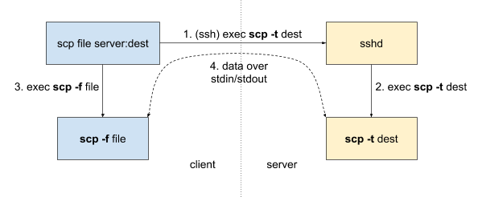

# SCP

### 是什么

**Secure** Copy Protocol，能够让我们在两台 computer 之间传送文件/目录，unix-like 和 windows 系统都能很好的用他，但是传送文件并不是 SCP 的真正价值，而是 Secure：authentication of both computers and encryption of data in flight

每次使用 SCP 的时候都要通过 SSH，所以 SCP 是 run on the top of SSH 的，SSH 完成了上面提到的安全的活（比较繁重），SCP 只是在此连接基础之上传输 plain text 而已。

简单的了解一下 SCP 的历史：之前有个叫 [RCP](https://en.wikipedia.org/wiki/Berkeley_r-commands) 的工具，在旧的 BDS 系统上用来传递文件，当时的网络还是可信任的（每个节点都是 friend），但是人们意识到之后的网络上不是所有人都是好人，所以就在 openSSH 的基础上实现了 RCP，让他在一个 SSH 会话中与非 friend 的计算机传递文件。

> an undocumented, unstandardized mashup of two protocols

### SCP 原理

“connection” establishment and wire protocol after that.

#### “Connection” establishment

并非是一个连接，只是通过 SSH 执行 `STDIN/STDOUT` 的指令，像 pipe 做的事情。

两个进程 `sshd` 和 `scp`，建立 ssh 连接之后，我们执行 scp 就仿佛是执行 `ssh exec scp [flags]`，flags 可以是 `-t` (“to”) and `-f` (“from”), `-d` (target is a directory) , `-r` (recursive, source is a directory).

如下图的过程，在另一端的 sshd 进程接收到的也只是一个指令，然后让 ssh 执行。



注意 SCP 协议是单向的，如果需要反向传递文件，需要再次执行 `scp`。

**the actual SCP protocol commands start flowing via `STDIN` and `STDOUT`.**

#### Wire protocol

这个 wire 协议定义了文件是如何传送的：sequential (one operation at a time) and synchronous **(each command must be completed before the next one starts)**

大致格式：`[command type][arguments]\n[optional data]`

- command type: 单个的 ASCII 字母：
  - ‘C’ - write a file
  - ‘D’ - enter a directory
  - ‘E’ - exit last directory
  - ‘T’ - set create/update timestamps of the next file or directory
- arguments: 和指令相关的值，可能是文件/目录名、文件大小、时间戳，E 指令没有参数
- optional data: 当最后一个指令为 C 的时候发送，

一些用来控制的 bytes：

- `0x00` - “OK”, acknowledgement of completing the last command (like writing a local file). This is also sent by the receiver at startup to let the sender know it’s ready to receive commands.
- `0x01` - “warning” that’s followed by a line (terminated by newline) to be displayed to the user.
- `0x02` - “error” with an optional message (same as warning) but the connection is terminated afterwards.

可以看一下详细的过程（不解释了，很好理解）：


### SCP 存在的问题

#### Performance

wire protocol 的原因。以及每次指令都要经过确认（上面加粗英文）才会继续执行，如果一个确认包在网络中丢包了，整个进程要暂停等待重传。

和 `tar` 压缩比较：（复制那个文章里的）

```bash
# Copy a local folder with 10000 files
$ find /tmp/big_folder/ -type f | wc -l
10000

# Using scp
$ time scp -r -q /tmp/big_folder/ server:/tmp/big_folder

________________________________________________________
Executed in  882.99 millis	fish       	external
   usr time  114.09 millis	0.00 micros  114.09 millis
   sys time  278.46 millis  949.00 micros  277.51 millis

# Using tar over ssh
$ time sh -c "tar cf - /tmp/big_folder | ssh server 'tar xC /tmp/ -f -'"
tar: Removing leading '/' from member names

________________________________________________________
Executed in  215.68 millis	fish       	external
   usr time   93.22 millis	0.00 micros   93.22 millis
   sys time   66.51 millis  897.00 micros   65.62 millis
```

#### Security

虽然是在 SSH 基础之上，但是由于指令是通过 `stdin/stdout`，万一有非交互的指令被打印出来，也会被 scp 接受，那就完蛋了。

包括 From [OpenSSH 8.0 release notes](https://lists.mindrot.org/pipermail/openssh-unix-dev/2019-March/037672.html):

> The scp protocol is outdated, inflexible and not readily fixed. We recommend the use of more modern protocols like **sftp** and **rsync** for file transfer instead.

### SCP 的替代品（拷贝自文章）

[SFTP](https://en.wikipedia.org/wiki/SSH_File_Transfer_Protocol) is widely considered the successor of SCP. It still runs on top of SSH for transport-layer security and doesn’t require setting up access separately. It can give you a custom interactive prompt for exploring the remote filesystem or you can script with a pre-written series of commands.

On the downside, you will need to learn SFTP prompt commands and the protocol itself hasn’t been fully standardized (there were [many](https://en.wikipedia.org/wiki/SSH_File_Transfer_Protocol#History_and_development) RFC drafts, but the authors eventually gave up).

[Rsync](https://en.wikipedia.org/wiki/Rsync) is another good alternative. The usage is exactly the same as with the scp command - it’s a drop-in replacement that also leverages SSH. Rsync is all about performance - it does a lot of complex computation locally to send as little data as possible over the network. Technically, it does data synchronization instead of pure transfer - if remote and local content are similar, only the deltas will be sent.

Again, it comes with its own downsides: the sender uses a lot of CPU power to figure out what to send and the receiver uses a lot of disk IO to put things together in the right order. Rsync also does not come pre-installed on most systems, unlike OpenSSH.

If you need to send a file over to someone (and email isn’t an option), [Magic Wormhole](https://github.com/warner/magic-wormhole)(Python 写的) is an easy tool to use. You exchange short, readable codes out-of-band (like over the phone) and throw in some files. It handles your typical [NAT traversal](https://en.wikipedia.org/wiki/NAT_traversal) headaches and is much easier than exchanging SSH keys.

The problem is that you need to exchange the authentication codes for each transfer, so it’s only good for one-off copies. The whole system is designed to be used by humans, if you need to transfer data between your laptop and some servers, Magic Wormhole is not the right tool.

On the heavier side, there’s also software for syncing folders between personal devices (including phones and servers). Two great examples are [Syncthing](https://syncthing.net/)(Golang 写的) and [Perkeep](https://perkeep.org/). These systems are meant to always run in the background and exchange diffs between the files, similar to rsync.

Both take some time to learn and configure (especially if you make use of their many, many features) and are primarily optimized for personal data (such as photos or chat logs), not for infrastructure scripting. They’re also much slower and more resource-hungry than everything I’ve mentioned above.

这些都可以去了解了解

### 结论

SCP 的实现确实比较怪异，但是作为信任电脑之间的个人简单的文件传输还是够用的，对于性能和安全的问题来说，可以有更好的选择。

参考：https://gravitational.com/blog/scp-familiar-simple-insecure-slow/（墙）

一篇非常不错的文章
