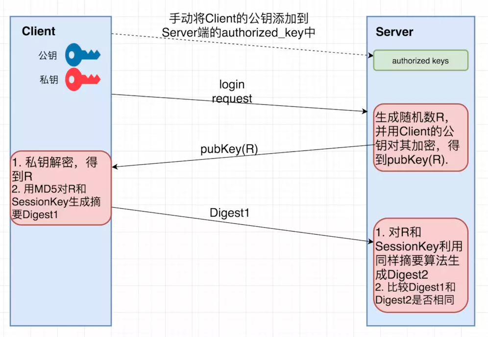

# SSH

Secure Shell，平时用的也很多，在本地计算机登陆到另一台远程计算机。（连服务器啊之类的）

1995 年，芬兰学者 Tatu Ylonen 设计了 SSH 协议，将登录信息全部加密，成为互联网安全的一个基本解决方案，迅速在全世界获得推广，目前已经成为 Linux 系统的标准配置。

SSH 只是一种协议，存在多种实现，既有商业实现，也有开源实现（[openSSH](http://www.openssh.com/)）。

### 用法

不多说了吧

`ssh user@host -p <port>`，默认 22 端口，建议修改。。

### SSH 原理

和 https 的一样是将用户登陆信息通过公钥加密，在服务端私钥解密，但是没有 CA 证书来防止**中间人攻击**

#### 登陆口令

第一次连接主机的时候会提示

```bash
$ ssh user@host
　　The authenticity of host 'host (xx.xx.xx.xx)' can't be established.
　　RSA key fingerprint is 98:2e:d7:e0:de:9f:ac:67:28:c2:42:2d:37:16:58:4d.
　　Are you sure you want to continue connecting (yes/no)?
```

表示改 host 未确认过，只有公钥的 fingerprint，是否继续连接。

这里**公钥的 fingerprint** 是公钥（RSA 算法 1024 位）经过 MD5 得到的 128 位指纹。

很自然的一个问题就是，用户怎么知道远程主机的公钥指纹应该是多少？回答是没有好办法，远程主机必须在自己的网站上贴出公钥指纹，以便用户自行核对。

确认无误之后，就继续连接即可，本机会把这个 host 加入 `~/.ssh/known_hosts` 文件中，保存 `[host] [ip][key_type?] public_key`（中间那个类型我也不知道啥意思，比如：`github.com,140.82.114.3 ssh-rsa`）

#### 公钥登陆

将本机的公钥上传给目标服务器，之后就不用密码登陆了。

步骤：

1. 如果没有公钥/私钥对，执行`ssh-keygen`生成一个，会存在`.ssh`目录下
2. 执行`ssh-copy-id user@host`，输个密码发送一下即可。
3. 可以不用密码直接登陆

如果不行：

- 打开远程主机的`/etc/ssh/sshd_config`，取消下面几行的注释

  ```bash
  RSAAuthentication yes
  PubkeyAuthentication yes
  AuthorizedKeysFile .ssh/authorized_keys
  ```

- 然后重启 ssh 服务：Ubuntu：`service ssh restart`，Debian：`/etc/init.d/ssh restart`

- 在远程机器的`$HOME/.ssh/authorized_keys`文件后追加公钥即可，可以用`ssh user@host 'mkdir -p .ssh && cat >> .ssh/authorized_keys' < ~/.ssh/id_rsa.pub`。

  - 登陆之后先尝试创建 `.ssh` 文件夹，**`-p` 表示归创建目录，即使上级目录不存在，会按目录层级自动创建目录**（感觉这里不要也罢）
  - 然后将本地的公钥追加到 `authorized_keys` 文件中。

来看一下原理：

用户将自己的公钥储存在远程主机上。登录的时候，远程主机会向用户发送一段随机字符串，用户用自己的私钥加密后，再发回来。远程主机用事先储存的公钥进行解密，如果成功，就证明用户是可信的，直接允许登录 shell，不再要求密码。

这个图可以解释：[来自](https://www.cnblogs.com/276815076/p/10449354.html)



也就是 server 需要验证 client 就是公钥的拥有者。

参考[阮一峰](http://www.ruanyifeng.com/blog/2011/12/ssh_remote_login.html)
