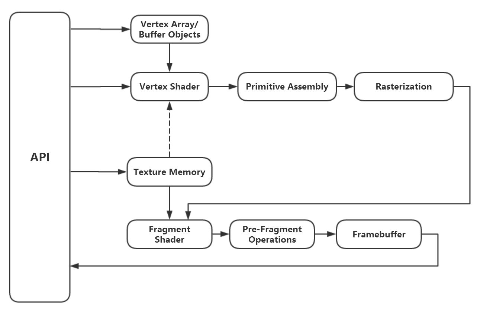
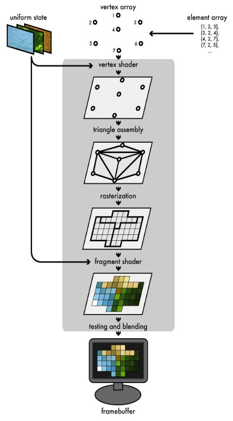
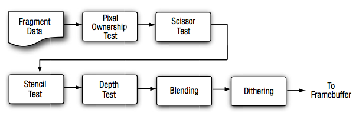

# learnopengl

> 在这个[网站](https://learnopengl.com/)学习
>
> doc 网站推荐：http://docs.gl/

### 百问百答

#### `gl_FragCoord` 到底是啥

[知乎回答](https://zhuanlan.zhihu.com/p/102068376)

#### `gl_FragCoord.st` st 是啥玩意

https://computergraphics.stackexchange.com/questions/4537/what-does-st-mean-in-the-context-of-opengl/4539

**_In GLSL, you can swizzle with XYZW, STPQ, or RGBA._**

### 安装

可以参考：https://methi1999.github.io/2020/08/19/opengl.html

#### GLFW

#### GLEW

### opengl 到底是什么

OpenGL is mainly considered an API (an Application Programming Interface) that provides us with a large set of functions that we can use to manipulate graphics and images. **However**, OpenGL by itself is not an API, **but merely a specification**, developed and maintained by the [Khronos Group](http://www.khronos.org/).

所以，treat OpenGL as a set of specification really，每个硬件/OS 厂商会依照声明去实现对应的方法 core profile，我们在使用 OpenGL 开发的时候不用关心具体实现，treat as an API。

_specification 有点像 js，es 规范其实也只是个 specification，每个浏览器去实现了_

NOT OPEN SOURCE! BUT CROSS-PLATFORM? NO, many other graphics [APIs](https://en.wikipedia.org/wiki/List_of_3D_graphics_libraries)(Matal DirectX).

TO CONTROL YOUR GRAPHICS CARD

legacy(like preset) v.s. morden(shaders core profile?) opengl

Shader program runs on GPU as well as C++, java etc. run on CPU

所以 OpenGL 这个 specification 对外暴露到 headers，具体的 cpp 实现也只不过是 link 了显卡提供的 lib（pull out all the functions we need function point）

#### Context

庞大的状态机，各种状态，指令（面向过程）

可以封装成面相对象的方式

OpenGL 上下文是一个巨大的状态机，切换上下文往往会产生较大的开销，但是不同的绘制模块，可能需要使用完全独立的状态管理。因此，可以在应用程序中分别创建多个不同的上下文，在不同线程中使用不同的上下文，上下文之间共享纹理、缓冲区等资源。这样的方案，会比反复切换上下文，或者大量修改渲染状态，更加合理高效的。

提前告诉 OpenGL 一堆 context/state，然后告诉他 draw call，OpenGL 就知道如何画图了

#### Frame buffer

纹理（Texture）或者是渲染缓冲区（RenderBuffer）

好比一张张画布，只有把某张画布夹在了画板上，才开始绘制（输出数据）

#### Attachment

理解为画布的夹子

颜色（ColorAttachment），深度（DepthAttachment），模板（StencilAttachment）。这三种附着对应的存储区域也被称为颜色缓冲区（ColorBuffer），深度缓冲区（DepthBuffer），模板缓冲区（StencilBuffer）。

#### 纹理（Texture）和渲染缓冲区（RenderBuffer）

**实际存储图像数据**的地方

纹理或渲染缓冲区作为帧缓冲区的附着，也就是说，纹理缓冲区和渲染缓冲区都会分别将数据输出到 framebuffer，不能同时 attach

- Texture buffer：1D 2D 3D 的数据
- Render Buffer：2D 的平面数据（对应窗口）

#### 顶点数组（VertexArray）和顶点缓冲区（VertexBuffer）

画布有了，数据有了，可以开始绘制了

从骨架开始：顶点

图元：点、线、三角形

性能更高的做法是，提前分配一块显存，将顶点数据预先传入到显存当中。这部分的显存，就被称为顶点缓冲区

#### 索引数组（ElementArray）和索引缓冲区（ElementBuffer）

索引数据的目的主要是为了实现顶点的复用，在绘制图像时，总是会有一些顶点被多个图元共享

因此对通过索引数据，指示 OpenGL 绘制顶点的顺序，不但能防止顶点的重复运算，也能在不修改顶点数据的情况下，一定程度的重新组合图像。

提前分配一块显存，将索引数据存储在这块显存当中，这块显存就被称为索引缓冲区

glDrawArrays 和 glDrawElements。前者对应的就是没有索引数据的情况，后者对应的是有索引数据的情况。

#### Shader

可编程图像渲染管线

- 顶点着色器（VertexShader）
- 片段着色器（FragmentShader）/像素着色器（PixelShader）
- 几何着色器（GeometryShader）
- 曲面细分着色器（TessellationShader）

编译、链接等步骤，生成了着色器程序（glProgram）

回顾一下 gpu pipeline：

1. 拿到顶点数据 -> vertex shader
2. 图元 assembly -> 光栅化
3. fragment shader
4. alpha test, depth test
5. Color attachment to frame buffer -> blending





#### VertexShader

每个顶点会经过 vertex shader 的计算得到顶点数据（**并行的**），一般会遇到的顶点计算有：

- 坐标变换
- 光照运算

shader 输入的数据：

- 统一变量（Uniform）
- 顶点属性（VertexAttribute）

#### FragmentShader

计算片段（像素）颜色的程序，片段其实也是逐个像素计算的（**并行的**）

输入数据：

- 统一变量
- 顶点数据（vertex shader 来的）称为可变变量 varying
- 采样器（Sampler）

#### Per-Fragment Operation



#### 测试（Test）

模版测试在 depth test 之前，剔除不必要的像素

#### Blending

#### 抖动 Dithering

抖动是一种针对对于可用颜色较少的系统，可以以牺牲分辨率为代价，通过**颜色值的抖动来增加可用颜色数量的技术**。抖动操作是和硬件相关的，允许程序员所做的操作就只有打开或关闭抖动操作。实际上，若机器的分辨率已经相当高，激活抖动操作根本就没有任何意义。默认情况下，抖动是激活的。

#### 渲染到纹理

有些 OpenGL 程序并不希望渲染出来的图像立即显示在屏幕上，而是需要多次渲染。可能其中一次渲染的结果是下次渲染的输入。因此，如果帧缓冲区的颜色附着设置为一张纹理，那么渲染完成之后，可以重新构造新的帧缓冲区，并将上次渲染出来的纹理作为输入，重新进行前面所述的流程。

#### 渲染上屏/交换缓冲区(SwapBuffer)

### Core-profile vs Immediate mode

#### Immediate mode

fixed function pipeline

感觉像是旧的一套定义虽然开箱即用，简单方便，但是不够灵活和高效，逐渐被 opengl 给废弃了

#### Core-profile mode

core-profile mode, which is a division of OpenGL's specification that removed all old deprecated functionality.

The advantage of learning the modern approach is that it is very flexible and efficient. 不过学习起来有一定难度，需要开发者对 opengl 和图形编程有一定的理解

### State machine

a collection of variables that define how OpenGL should currently operate.

状态机：OpenGL context，keep in mind 一些 state-changing functions 就能明白了

### Objects

对象的概念，来描述一切

openGL 的库基本都是用 C 写的（也有其他变种语言）所以对象都是 struct

### Create a window

- GLFW
- GLEW（The OpenGL Extension Wrangler Library）
- CMake
  - [ ] 搞定 link

有了这三个东西，就可以愉快的写代码了

#### cmake

```cmake
cmake_minimum_required(VERSION 3.5)

project(test)

set(CMAKE_CXX_STANDARD 20)

# OpenGL
find_package(OpenGL REQUIRED)

# GLFW
find_package(GLFW3 REQUIRED)

find_package(GLEW REQUIRED)

# Put all libraries into a variable
set(LIBS glfw GLEW::GLEW)  # GLEW 是以模块导出的

add_executable(${PROJECT_NAME} main.cpp)

target_link_libraries(${PROJECT_NAME} ${LIBS})
# g++ main.cpp -o test.o -lglfw -lGLEW -framework OpenGL
```

#### 初始化

`glfwInit()`：glfw 必须要初始化之后才能使用他的函数，返回值 `GLFW_TRUE` or `GLFW_FALSE` 表示初始化成功与否

`glfwWindowHint(int target, int hint)`：用来配置 glfw 的方法，第一个

- target：需要配置的内容（都是 int 型），大部分变量都是以 `GLFW_` 开头的
- hint：具体的值

```c++
glfwWindowHint(GLFW_CONTEXT_VERSION_MAJOR, 3);
glfwWindowHint(GLFW_CONTEXT_VERSION_MINOR, 3);
glfwWindowHint(GLFW_OPENGL_PROFILE, GLFW_OPENGL_CORE_PROFILE);
glfwWindowHint(GLFW_OPENGL_FORWARD_COMPAT, GL_TRUE);
```

告诉 glfw 我们使用的 OpenGL api 版本为 3.3，能够合适的构造 opengl context

告诉 glfw 使用 core profile 模式

Note that on Mac OS X you need to add `glfwWindowHint(GLFW_OPENGL_FORWARD_COMPAT, GL_TRUE);` to your initialization code for it to work.

#### 构造 window

```c++
GLFWwindow *window = glfwCreateWindow(640, 480, "OpenGL window", NULL, NULL);
if (!window)
{
  std::cerr << "ERROR: could not open window with GLFW3" << std::endl;
  glfwTerminate();
  return 1;
}
glfwMakeContextCurrent(window);
```

创建 window 返回一个对象指针

#### viewport

告诉 glfw 我们需要 render 的 viewport 的坐标：x, y, width, height（坐标系原点在左下方）

`glViewport(0, 0, 640, 480);` 或者更小：`glViewport(40, 40, 600, 400);`

_behind scene：opengl 会对每个处理之后的点（归一化坐标范围在[-1, 1]）做 viewport 的变换，就是 glViewport 设置的这个数据_

#### resize callback

窗口 resize 之后重新 render 的大小需要在 callback 里面设置

#### Ready your engines

开始 render loop

```c++
while(!glfwWindowShouldClose(window))
{
    glfwSwapBuffers(window);
    glfwPollEvents();
}
```

`glfwWindowShouldClose`：检查 window 是否被 instruct 关闭，如果是就返回 GL_TRUE（#define 1）

`glfwSwapBuffers`：交换 canvas buffer 给屏幕

`glfwPollEvents`：检查是否有交互事件发生，改变 window 的 state，调用对应事件的 callback

_Double buffer：单 buffer 的时候会出现 flickering 问题，闪屏。两个 buffer 一个 front 传输给 screen 一个做逾渲染_

#### Input

各种输入事件

```c++
void processInput(GLFWwindow *window)
{
    if(glfwGetKey(window, GLFW_KEY_ESCAPE) == GLFW_PRESS)
        glfwSetWindowShouldClose(window, true);
}
```

#### 上个色儿

`glClearColor(r, g, b, a)`：清除整个 buffer 的颜色（整个 window 不是 viewport）

### Triangle

#### graphics pipeline 简化版

- step by step
- parallel
  - shaders：每个 core 执行的那段程序

write our own shaders to replace the existing default shaders -> fine-grained control

_OpenGL Shading Language (GLSL)_

pipeline：（可配置

- Vertex shaders：vertex data，将顶点的三维坐标 transform 成另一个不同的坐标，可以同时对顶点属性做一些基础操作
- -> Shape assembly：将 vertex shader 的数据全部拿过来组合成一些 primitives
- -> geomertry shader：将 primitives 生成其他的形状
- -> Rasterization：将三维图形画到屏幕上，会做 clip 将屏幕外的图形 clip 提高效率
- -> Fragment shader：计算某一片段的最终颜色（包括光照、阴影等）
- -> tests and blending：alpha, depth test 测试像素点的可见度，blending

图元 primitive

- GL_POINTS
- GL_TRIANGLES
- GL_LINE_STRIP

#### vertex

OpenGL 只会处理 [-1, 1] 之间的坐标（normalized device coordinates），3D-only

#### vertex data

在 GPU 上创建空间去存放顶点数据，vertex buffer objects (VBO)，好处是我们可以传送批量的顶点数据，而不是每次都传（送去 GPU 太慢了）

```c++
// 创建 buffer
unsigned int VBO;
glGenBuffers(1, &VBO);
```

buffer 有很多类型，绑定一个顶点 buffer GL_ARRAY_BUFFER

copy 数据到 buffer

```c++
// bind the type
glBindBuffer(GL_ARRAY_BUFFER, VBO);
// set the data
glBufferData(GL_ARRAY_BUFFER, sizeof(vertices), vertices, GL_STATIC_DRAW);
```

第四个参数表示图形卡如何处理这些数据：

- `GL_STREAM_DRAW`: the data is set only once and used by the GPU at most a few times. 流的感觉
- `GL_STATIC_DRAW`: the data is set only once and used many times.
- `GL_DYNAMIC_DRAW`: the data is changed a lot and used many times.

#### vertex shader

写 shader 当然要用 glsl，但现在还不急，可以先简单看一个 glsl 的 snippet

```glsl
#version 330 core
layout (location = 0) in vec3 aPos;

void main()
{
    gl_Position = vec4(aPos.x, aPos.y, aPos.z, 1.0);
}
```

- 第一行是 OpenGL 的版本和 core profile 的声明
- 声明变量 aPos 是 vec3 三维向量类型，并且位置在 location = 0 的 layout（之后会讲）
  - OpenGL 的向量最多是 4 维的：x, y, z, w（还是 3D，会用作为 perspective division
- shader 的输出是通过对 `gl_Position` 这个变量赋值

#### Fragment shader

计算输出像素颜色，rgba，在 OpenGL 中的颜色强度都是 [0, 1] 范围，这里简单的输出统一的颜色

```glsl
#version 330 core
out vec4 FragColor;

void main()
{
    FragColor = vec4(1.0f, 0.5f, 0.2f, 1.0f);
}
```

- 一个输出值 FragColor 四维 vec

#### Shader program

组合所有的 shader 的程序

#### Linking Vertex Attributes

让 OpenGL 知道如何处理这些顶点数据（刚才的 VBO）

vertex **is not a position**:

- position
- colors
- texture coords
- norms

#### Vertex Array Object

vertex array object (also known as VAO)

好处是 draw 时设置 vertex attribute 的时候只需要调用一次即可

**Core OpenGL requires that we use a VAO so it knows what to do with our vertex inputs. If we fail to bind a VAO, OpenGL will most likely refuse to draw anything.**

core 强制的，我们有这行：`glfwWindowHint(GLFW_OPENGL_PROFILE*,* GLFW_OPENGL_CORE_PROFILE);`

`GLFW_OPENGL_COMPAT_PROFILE` 是会默认创建一个

1. 当 VBO 被 set attribute 的时候，VAO 会依次的将数据存入 array

`glDrawArrays`

一个全局的 VAO 每次 bind 不同 data v.s. 多个 VAO 对应不同的 obj？

- it dependents

#### index buffer

如果要画一个长方形，两个三角形组成，会有顶点的重复（大量的重复顶点数据，一个顶点的数据可能就很大：position、texture coords...）

#### Wireframe mode

`glPolygonMode(GL_FRONT_AND_BACK, GL_LINE);`

第一个参数告诉 opengl 三角形的前后 face 都要画，画 line（第二个参数）

默认是 `GL_FILL`

### errors

#### glDebugMessageCallback

好家伙，4.3 才支持，mac 只有 4.1 的 OpenGL，无法享用

#### glGetError

```c++

// 处理 ASSERT
#ifdef _MSC_VER
// 只有 msc++ 有
#define ASSERT(x) \
    if (!(x))     \
        __debugbreak();
#else
#include <signal.h>
#define ASSERT(x) \
    if (!(x))     \
        raise(SIGTRAP);
#endif

// 妙啊 用 宏 去 wrap gl 函数调用
#define GLCALL(x)     \
    gl_clear_error(); \
    x;                \
    ASSERT(gl_log_call(#x, __FILE__, __LINE__))
    // # 转为字符串 文件名 行数

```

### uniforms

在 shader 中从 cpu 获取一些常量数据

### shaders

### Texture

image file: a pointer to a buffer of

#### 2D 纹理的处理

这些参数啥意思呢（注意 s t 就是 u v 坐标）

```c++
GLCALL(glTexParameteri(type, GL_TEXTURE_WRAP_S, GL_REPEAT));
GLCALL(glTexParameteri(type, GL_TEXTURE_MIN_FILTER, GL_NEAREST));

```

WRAP 参数
上面提到纹理坐标(0.5, 1.0)到纹素的映射，恰好为(128,256)。如果纹理坐标超出[0,0]到[1,1]的范围该怎么处理呢？ 这个就是 wrap 参数由来，它使用以下方式来处理：

GL_REPEAT: 坐标的整数部分被忽略，重复纹理，这是 OpenGL 纹理默认的处理方式.
GL_MIRRORED_REPEAT: 纹理也会被重复，但是当纹理坐标的整数部分是奇数时会使用镜像重复。
GL_CLAMP_TO_EDGE: 坐标会被截断到[0,1]之间。结果是坐标值大的被截断到纹理的边缘部分，形成了一个拉伸的边缘(stretched edge pattern)。
GL_CLAMP_TO_BORDER: 不在[0,1]范围内的纹理坐标会使用用户指定的边缘颜色。
————————————————
版权声明：本文为 CSDN 博主「The fool」的原创文章，遵循 CC 4.0 BY-SA 版权协议，转载请附上原文出处链接及本声明。
原文链接：https://blog.csdn.net/wangdingqiaoit/article/details/51457675（这篇博文介绍的很清楚了）

### Blending

如何做 透明度的 混合
