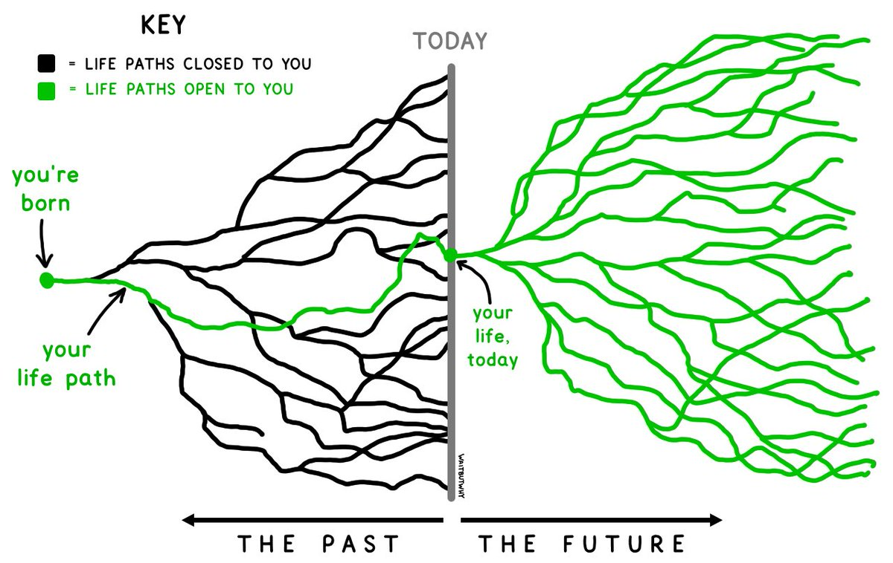

# 【个人】

> Note Order:
>
> ⬇️ - Oldest
>
> ⬇️ - ...
>
> ⬇️ - **Latest🆕**

2021.02.13 20:40:25

【好文】[信息方法论](https://blog.ddlee.cc/posts/3a6233e2/)

> - 信息模型：信息+信息所依托的形式—>渠道—>接收者—>对接收者产生影响
> - 我所理解的信息处理实践的框架，有三个关键的维度：信息类型、时间质量和处理状态。于是，信息处理的问题可以表述为：**如何以合理的时间和精力投入，使不同类型的信息达到适合的处理状态？**
> - 并不是每一分钟都有同样的质量
> - 文字太模糊了，不足以让你记起全部的细节，你只好亲自走回去，回到青葱的岁月，像看故事里的人物那样看看那时的自己；文字又太准确了，这些陌生又熟悉的字眼，这些亲切又早已忘却的句子，就像当年的自己把故事亲口哼唱给你听，此时此刻，恰如彼时彼刻。文字脆弱，却又力量无穷。
> - RSS Rich Site Summary

[什么是 RSS](https://blog.ddlee.cc/posts/5768c6d/)

> 信息源头 -> 阅读者
>
> 信息源头 -> 平台 -> 阅读者（数量增多）
>
> 信息源头 -> 平台（过滤，推荐，隐藏） -> 阅读者（数量增多）
>
> RSS：
>
> - Rich Site Summary & Really Simple Syndication（前者注重格式，后者强调目的：方便更新）
> - 一种信息流动的格式/协议：「允许内容提供者按一定格式组织和发布内容，方便内容消费者抓取。你甚至可以认为，它是一项信息提供者和消费者之间的“契约”。」
>
> 如何使用 RSS：
>
> 1. 找到网站（我主要以大佬们的博客为主）的 RSS 链接
> 2. 去 [Feedly](https://feedly.com/) 服务，创建账号，搜索 RSS 订阅（想用 mac 的客户端 reeder 发现要 A 区账号而且还要钱。。）
> 3. 手机也可以下载 Feedly（需要 A 区账号）
>
> TODO 一些 RSS 源：
>
> - https://www.zhihu.com/question/19580096

2021.03.04 22:44:37

[the paradox of abundance](https://perell.com/note/the-paradox-of-abundance/)

> 讲了目前信息爆炸的现状
>
> 摘录几句话：
>
> Average consumers are doomed to the tyranny of instinct. Meanwhile, consumers at the top are propelled by unlimited access to nutritious food and information.
>
> On the Internet, your rate of learning is limited not by access to information, but by your ability to ignore distractions.

2021.03.07 18:33:58

[Solo-year-1](https://mtlynch.io/solo-developer-year-1/), [why left Google](https://mtlynch.io/why-i-quit-google/)

> 读了网上一位前 google 的大佬员工的经历，从工作到创业，感触颇多。最后作者离开了谷歌
>
> 摘录几个点：
>
> - Limit focus，作者原以为自由创业之后会有更多的时间和精力，现实缺恰恰相反
> - Regularly reflection，我也有这样的习惯，不过最近执行的很糟。。
> - Set goals，measurable goals，我觉得 OKR 会更好吧，目前我这快比较差。。
>
> 工作上的晋升建议（作者在 google 晋升之路坎坷的不行）
>
> - 量化的记录（qualifiable record）

[为什么可以不读大学--阮一峰](https://survivor.ruanyifeng.com/collapse/university.html)（1）

[东亚教育浪费了太多生命](https://www.jiemian.com/article/887630.html)（2）

> （2）亚洲教育的对比，思考和感触很多，也很庆幸自己在 K-12 的教育制度中没有失去想象力和个性吧
>
> 内容还是比较深刻和辽阔的
>
> - 普鲁士基因
> - 复习的过度重视，孔子当年学的是“礼”，是需要不断重复演练，如今我们学的是”认知“
> - 联考 - 平均主义 - 一刀压制了不同类型的人才
> - 好学生一定得做到：要自我决定学习的侧重，衡量自己知识的掌握度，管理自己的学习时间。这就需要具有极大的主动性和自由度。
> - 工业化的追赶，海归，又陷入了比较学校名气的漩涡
>
> 从（1）读过来的，两篇连着读，感触很大

2022.01.05 12:47:27

[花刺子模的信使问题](https://m.vrrw.net/hstj/17892.html)

> 相传花刺子模是一个东亚的国家，那里的君王会对传达好消息的信使给予奖励，会把传达坏消息的信使关进老虎笼子。
>
> 文章是王小波对这一现象的分析和思考，类比当下我们现实生活中（职场、学校等等）的种种情况，还是很有体会和同感的。

2022.02.27 22:48:39

[加班与效率](https://coolshell.cn/articles/10217.html)

> 反思，效率到底是什么？创造的价值/总工作量（**有用功/总功**）
>
> **1）增加有用功**
>
> - 你得多问问你的需求方，为什么要加这个需求？干这个事到底有多大的价值？能让多少人受益？
> - 你得多问问你的需求方，能不能稍微简化一下需求，这样可以让我付出的努力更少一些？
> - 你得要多去思考一下，你是在干一个建筑队的活呢？还是在干一个装修队的活？
> - 你得要多去思考一下，业务上和用户的最大的痛点是什么？
>
> 关于增加有用功，再说两点：
>
> - 像乔布斯那样，告诉你的产品经理或是业务方，你现在提的 10 需求，我只能做 3 个，会是哪 3 个？为什么是这 3 个？**有用功的来源不是拼命做需求，而是砍需求。**
>
> - **关于创造价值，我们要干的不是像百度的“竞价排名”那样，把钱从别人口袋里搬运到自己的口袋里，而是要像“英国工业革命”或是“硅谷”那样，把价值真正的创造出来**。
>
> **2）降低总功**
>
> - 你得多问问自己，你有多少时间是在干一些支持性而不是产出性的工作？
> - 你得多问问自己，有没有残酷无情地减少重复劳动的劳动密集型的工作？
> - 你得多问问自己，自己的管理者和员工的能力和素质有没有在降低你的团队执行的成本？
>
> **3）形成合力**
>
> 评估项目价值的方法：T-shirt size estimation（项目价值 - 耗费人力）

[Uncomfortable](https://alexanderell.is/posts/uncomfortable/)

> 非常美的文字去形容作为一个程序员去解决自己的 uncomforable time.
>
> Slowly, over time, the mist starts to clear up. Suddenly you can see how things are connected. After a chat with a coworker, a deep-dive into the code, or a [walk around the block](https://alexanderell.is/posts/trust-in-your-unconscious/), something clicks, and some of the pieces start falling into place. The mist transforms into an outline, the outline into a conversation, the conversation into a diagram, the diagram into a few pull requests, the pull requests into follow up pull requests, and finally this vague problem has been translated from that amorphous blob into concrete lines of code.

[关于副业](https://catcoding.me/p/side-hustle-for-programmer/)

> 依旧是 catcoding 的博文。自己对副业的思考也是不急着做，在职场先好好摸爬滚打，看看机会，多思考、沉淀和收集信息吧，寻找机会，等过几年工作遇到瓶颈了，可以搞搞。
> 摘录下总结：
> _技术通常不是最重要的，重要是有效地解决问题和满足真实世界的需求。_ > _如果还不清楚自己想做什么，可以先从建立个人品牌着手，或者其他任何有复利效应、能复用自己的优势和资源、或者能提高自己的事情，很多事做起来了才能有些新想法。_ > _副业可能是为了挣钱，自由，探路，兴趣等等。做得不好也不必焦虑，上班低头做事，副业抬头看路，带着一种探索的心态来做副业就很好。_

[20 年编程经验](https://alexewerlof.medium.com/my-guiding-principles-after-20-years-of-programming-a087dc55596c)

> 做一些摘录
>
> Deprecate yourself. Don’t be the go-to person for the code. Optimize it for people to find their way fixing bugs and adding features to the code. Free yourself to move on to the next project/company. Don’t own the code or you’ll never grow beyond that.
>
> Realize that every code has a life cycle and will die. Sometimes it dies in its infancy before seeing the light of production. Be OK with letting go. Know the difference between 4 categories of features and where to put your time and energy:
>
> - **Core:** like an engine in a car. The product is meaningless without it.
> - **Necessary:** like a car’s spare wheel. It’s rarely used but when needed, its function decides the success of the system.
> - **Added value:** like a car’s cup-holder. It’s nice to have but the product is perfectly usable without it.
> - **Unique Selling Point:** the main reason people should buy your product instead of your rivals. For example, your car is the best off-road vehicle.
>
> When making decisions about the solution all things equal, go for this priority: **Security** > **Reliability** > **Usability (Accessibility & UX)** > **Maintainability** > **Simplicity (Developer experience/DX)** > **Brevity (code length)** > **Finance** > **Performance**，But don’t follow that blindly because it is dependent on the nature of the product. Like any career, the more experience you earn, the more you can find the right balance for each given situation.
>
> Get out of your comfort zone. Learn every day. **Teach** what you learn. If you’re the master, you’re not learning. Expose yourself to other languages, technologies, culture and stay curious.
>
> Don’t do **speculative programming**.
>
> Software is more fun when it’s made together. Build a sustainable **community**. Listen. Inspire. Learn. Share.

[Life is not short](https://dkb.show/post/life-is-not-short)

> 生命并不短暂，只是我们浪费的太多了时间。
>
> 做一些摘录
>
> Putting things off for the future is the biggest waste of a life. **You deny yourself the present by promising the future.** You’re relying on the future, which is outside of your control, and abandoning the present, which is the only thing you can control.
>
> The whole future lies in uncertainty – live immediately.
>
> The part of life we really live is small. All the rest is not life, but merely time.

[2050 年的我们应该知道什么](https://www.wired.co.uk/article/yuval-noah-harari-extract-21-lessons-for-the-21st-century)

>

[哪些书应该读？在哪里应该划线？](https://sspai.com/post/44427)

> 读书，如果是以学习为目的，如果不能过目不忘，就需要划线。
>
> 文章基于《一流的人讀書，都在哪裡畫線？》一书，讲了读书改怎么选书、如何划线（关注什么）、怎么读。。。

[十年编程经验](https://thorstenball.com/blog/2022/05/17/professional-programming-the-first-10-years/)

> 做点摘录：
>
> Nothing really matters, except bringing value to the customer
>
> Perfection is unachievable
>
> Perfectionism is a trap
>
> Knowing the full stack
>
> Negativity begets negativity
>
> Code has mass
>
> Programming as a part of my life

[软技能](https://sspai.com/post/44653)

> 书目推荐（已经下单了，早日读完！）
>
> 我们的有效产出取决于我们**专注**的时间；
>
> 有效的事前计划和事后回顾是提高生产力的重要方法。
>
> 专注的动量效应——如果由于惰性不愿意开始工作，可以先试着硬着头皮开始工作 15 分钟。

[提问的智慧](https://mp.weixin.qq.com/s/q461so9lWk4FKJGZ-p7Vcg)

>

[高维思考](https://fs.blog/second-order-thinking/)

> 尝试高维度的思考吧，结合系统性、交互、时间，这三个要素。

[antfu move to paris](https://antfu.me/posts/bonjour-paris)

> 推特刷到这条，就是说很羡慕和向往了，自己也要努力

2023

[ADEPT method](https://betterexplained.com/articles/adept-method/)

> ADEPT 学习方法（to internalize a new concept）
>
> **_Use an Analogy, Diagram, Example, Plain-English description, and then a Technical description._**
>
> 从类比 -> 画图形/图表（可视化）-> 尝试（实践）-> 简单语句的描述 -> 技术性表达（系统化），这几个步骤来学习一个新知识
>
> **是一个需要自我 check 的 mental checklist，改进自己的学习顺序（从模糊 -> 具体）**
>
> 最后：BE ADEPT
>
> - Brevity [is beautiful](https://betterexplained.com/articles/brevity-is-beautiful/).
> - Empathy makes us human.

[tiny projects](https://tinyprojects.dev/posts/i_spent_two_years_launching_tiny_projects)

> 作者花了两年时间发布了不少的小项目，还能赚到钱，很不错！
>
> _Each morning I sit down with a coffee and bash out some project code. It's a hobby I love, and one that's starting to generate some decent passive income now._ 很喜欢这种感觉
>
> 我也有一个 projects list，那就干起来吧！
>
> _to start trying one idea each week in its tiniest form._
>
> 最后还是挺佩服作者能将这么多小想法落地，并且还能赚钱，商业模式也搞起来了。

[用 github 仓库记录](https://github.com/yihong0618/gitblog/issues/209)

> Mark，实践一下自己的记录工作流！
>
> [实操](https://github.com/yihong0618/gitblog/issues/177)

[People Die, but Long Live GitHub](https://laike9m.com/blog/people-die-but-long-live-github,122/)

> 挺有启发的一篇文章，百年之后我们的信息还会在吗。
>
> _几十几百年后，GitHub 将成为世界上最大的数字公墓，注册用户大部分都已去世，然而个人主页，项目，commit 历史 还述说着他们生前做过的事——就比如 Joe 的[博客](https://joearms.github.io/)。_
>
> _人有两次死亡，第一次是肉体，第二次是被人忘记_

[Stay positive mode for creative work](https://www.psychologicalscience.org/news/releases/a-positive-mood-allows-your-brain-to-think-more-creatively.html)

> Generally, positive mood has been found to enhance creative problem solving and flexible yet careful thinking
>
> And music is an easy way to get into a good mood.

2023.03.30 14:43:23 +0800

[Aaron Swartz' Quotes](https://www.goodreads.com/author/quotes/6893150.Aaron_Swartz)

> “People shouldn’t be forced to categorize themselves as “gay,” “straight,” or “bi.” People are just people. Maybe you’re mostly attracted to men. Maybe you’re mostly attracted to women. Maybe you’re attracted to everyone. These are historical claims — not future predictions. If we truly want to expand the scope of human freedom, we should encourage people to date who they want; not just provide more categorical boxes for them to slot themselves into. A man who has mostly dated men should be just as welcome to date women as a woman who’s mostly dated men.
>
> So that’s why I’m not gay. I hook up with people. I enjoy it. Sometimes they’re men, sometimes they’re women. I don’t see why it needs to be any more complicated than that.”
> ― **Aaron Swartz**
>
> 搜了下作者，好家伙 [Aaron Swartz](https://en.wikipedia.org/wiki/Aaron_Swartz#) 神仙程序员，开发了 RSS、web.py 和 Markdown。OMG。不过他 1986 年生，2013 年就去世了。He is often credited as a martyr and a prodigy。去世后被加入 Internet Hall of Fame.
>
> [github](https://github.com/aaronsw)

[Make Your Pessimism Productive](https://lucumr.pocoo.org/2023/3/20/lessons-from-a-pessimist/)

> Flask 框架的[作者](https://github.com/mitsuhiko)的 blog
>
> be a pragmatic form of pessimism other than destructive pessimism
>
> 知道事情并不会那么完美，但是也要有终将克服困难的信念，建立积极的形象帮助他人，不必当一个总想着能成功的乐观主义者

[我们时代的精神危机](https://weizhou.substack.com/p/d33)

> 《浮士德》第一部里，有一句著名的哀叹：“我的心中盘踞着两种精神”，一个贴紧凡尘，一个则想要脱离尘世。然而在中国，大部分人只是抱紧第一个，“脱离尘世”？那就意味着自我边缘化。
>
> 现实生活当然是我们无法离开的，但只有贫瘠的现实取向却是危险的，那会让所有人都走投无路，造成普遍的物欲横流和一言难尽的平庸，只留下一地垃圾。你怎么能相信一个没想过超越限制的人，能留下超越时空限制的非物质遗产？

[Cant explain that attraction in terms of anything else that's familiar to you](https://youtu.be/MO0r930Sn_8)

> 在解释 why 之前，必须知道他是 what

[zettelkasten method](https://www.youtube.com/watch?v=GpV47rUYk8I)

> zettel → slip ,kasten → box 是德语 slip of paper box 的意思( note box )
>
> - Fleeting notes: walking thoughts, showering thoughts, …
> - Literature notes: thoughts while consuming content( books, articles, podcast … )
> - Permanent notes: The output, review
>
> 1, 2:
>
> - One atomic content each
> - re-describe in your own words
> - write down the references
>
> 3:
>
> - One atomic idea per note
> - Express the idea assuming the readers have no context(make ur system future prove)
> - Connect with other notes in the system
>
> Two Boxes(literature and permanent)
>
> Not a top-down organizing system!
>
> 这个博主 focus on clear thinking and clear communicating，有关 obsidian 的后续[继续看](https://www.youtube.com/watch?v=HSTOSWOhNo4)！

[读书？](https://hanyang.wtf/p/500-3163)

> 个世界上有那么多我想知道的，但我能知道的又如此有限。
>
> 庄子说：「吾生也有涯，而知也无涯。以有涯随无涯，殆已；已而为知者，殆而已矣。」张岱说的更明白点：「学海无边，书囊无底。世间书怎读得尽。」
>
> 在庄子看来，我们孜孜于那些知识，那些没有读过的书，就是鹪鹩巢于深林，不过一枝；偃鼠饮河，不过满腹。不如早点想明白人的有限，早日乘天地之正，而御六气之辩，以游无穷。
>
> _讀書，是為了遮眼睛。_
>
> 我也遮不住眼，但，何妨呢？
>
> 世界就像是一个黑暗的房间，我们学习的全部努力不过是在里面秉烛夜游。但即使如此，昼短苦夜长，何不秉烛游！

[脆弱就是力量](https://www.kele.me/p/126)

> 来自 happy xiao 的可乐周报
>
> 除此之外：每本书都会留下痕迹。即使它没有留在你有意识的记忆中。就像发生在你身上的每一件事和你遇到的每一个人一样。
>
> [courage 的本意](https://thesoulofhope.com/courage-is-a-heart-word-and-mine-for-2020)：**Courage is a heart word.** 词根(etymology) cor 来自拉丁语，意思是 heart。最早的解释 **“To speak one’s mind by telling all one’s heart.”** Courage has the inner strength and level of commitment required for us to actually speak honestly and openly about who we are and about our experiences — good and bad.

[自尊 & 自信](https://mp.weixin.qq.com/s/xpeYhhZCN64NtqRYSXFa7w)

> 可以按照两个维度，画出四个象限：高/低自尊，稳定 or 脆弱
>
> **自尊想象也是想象你赢得自尊的动作，而不是赢得自尊后大家尊重你的结果**（聚焦当下）

2023.06.07 10:44:49 +0800

[数字游民](https://medium.com/nataliamok/digital-nomad-%E4%B8%80%E6%96%87%E8%A7%A3%E5%86%B3%E5%85%A8%E7%90%83%E4%BA%BA%E5%AF%B9%E6%95%B0%E5%AD%97%E6%B8%B8%E6%B0%91%E7%9A%84%E7%96%91%E9%97%AE-da61308c24d8)

> [以及什么人可以成为 digital nomad](https://mp.weixin.qq.com/s?__biz=MzUyMjUzMjAwNg==&mid=2247488098&idx=1&sn=f15f9aa4b6f5126f12eeb4f826fff74d&chksm=f9cb37abcebcbebd5e88f66ef9c393db49022c580a435c96c4b26d9c060fdef61e3afcf63a01&scene=21#wechat_redirect)
>
> **不是一种职业，这是一种生活方式！**
>
> 大伙儿有没有发觉工作日的朋友圈真的很“工作日”，然后周末都是各种吃喝玩乐的？
>
> **不要总觉得假期，周末就理应任性去玩耍，其实这些都是社会系统的产物；**辛辛苦苦工作五天，然后休息二天，赚到的钱拿去消费，商家们获益，但他只需支付小小的一点薪水作为你工作五天的报酬，但同样地又从你的消费赚回来一些；节假日就更可怕，各种商家就像吸血鬼在嗷嗷待哺，早就提前做好准备诱导你消费，美其名为：工作已经这么辛苦，该报答一下自己了，赶紧买买买。
>
> **自我驱动能力。**
>
> **享受孤独**
>
> **辩证的思考能力**
>
> **好奇心**
>
> **情感控制能力**
>
> **打造被动收入流**
>
> **_To become a digital nomad you have to learn how to live holding hands with the uncomfortable. Fall in love with the constant change and not let fear guide you._**
>
> 国内数字游民[最大部落（hash node 写的博客站）](https://jarodise.com/)，荷兰的 [nomad list](https://nomadlist.com/)

[从上海润去英国工作](https://www.v2ex.com/t/955368)

> [上篇](https://www.v2ex.com/t/955368)
>
> [中篇](https://www.v2ex.com/t/956323)
>
> [下篇](https://www.v2ex.com/t/959091)

2023.08.29 23:19:29 +0800

[如何有效提问](https://github.com/ryanhanwu/How-To-Ask-Questions-The-Smart-Way/tree/main)

> 收藏下，建议所有人阅读
>
> RTFM: Read The F\*\*king Manual
>
> STFW: Search The F\*\*king Web

2024.01.31 13:10:13 +0800

【Mark】[每年给自己的 40 个提问](https://stephango.com/40-questions)

> Mark 一下，年度总结的时候可以问问自己
>
> [github 地址](https://github.com/kepano/40-questions/blob/master/translations/zh-hans/year.md)

2024.05.31 13:37:25 +0800

[Measuring personal growth](https://huyenchip.com/2024/04/17/personal-growth.html)

> 如何衡量个人成长？人的一生需要被衡量（measure）吗？_“Life is to be lived, not to be measured.”_
>
> 作者认为衡量人生能够 live better，提出了三个方面来衡量个人成长：
>
> - rate of change：3-6 年，会变成一个不一样的自己，认识不一样的朋友、做新的事情、环境等。改变不是一件坏事
> - time to solve problems：尽可能快的解决/搞清楚遇到的问题（比如一些人生大事），这样才能有更多的注意力放在其他感兴趣的事情上
> - number of future options：强化学习中的 empowerment maximization，图片来自一条[推特](https://twitter.com/waitbutwhy/status/1367871165319049221)，更加关注在成长过程中为你打开的门
>
> 
