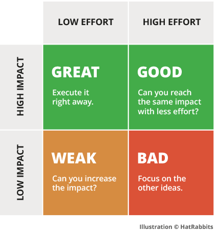

### 【技术】

[(80 封私信 / 81 条消息) 2020 国内公司前端团队都在搞些什么? - 知乎](<Reading%20List%2068c05d9b17b04eac936dcb715058a8ab/(80%20%E5%B0%81%E7%A7%81%E4%BF%A1%2081%20%E6%9D%A1%E6%B6%88%E6%81%AF)%202020%20%E5%9B%BD%E5%86%85%E5%85%AC%E5%8F%B8%E5%89%8D%E7%AB%AF%E5%9B%A2%E9%98%9F%E9%83%BD%E5%9C%A8%E6%90%9E%E4%BA%9B%E4%BB%80%E4%B9%88%20-%20%E7%9F%A5%E4%B9%8E%20e86ca9b16d4047499354a9195bcd6371.md>)

[畅销书《深入浅出 Vue.js》作者，在阿里淘系 6 个月的收获成长](Reading%20List%2068c05d9b17b04eac936dcb715058a8ab/%E7%95%85%E9%94%80%E4%B9%A6%E3%80%8A%E6%B7%B1%E5%85%A5%E6%B5%85%E5%87%BAVue%20js%E3%80%8B%E4%BD%9C%E8%80%85%EF%BC%8C%E5%9C%A8%E9%98%BF%E9%87%8C%E6%B7%98%E7%B3%BB6%E4%B8%AA%E6%9C%88%E7%9A%84%E6%94%B6%E8%8E%B7%E6%88%90%E9%95%BF%20e966e7d788784574ada3bee7411836b6.md)

[APP 设计模式之——导航设计 - 知乎](Reading%20List%2068c05d9b17b04eac936dcb715058a8ab/APP%E8%AE%BE%E8%AE%A1%E6%A8%A1%E5%BC%8F%E4%B9%8B%E2%80%94%E2%80%94%E5%AF%BC%E8%88%AA%E8%AE%BE%E8%AE%A1%20-%20%E7%9F%A5%E4%B9%8E%209b76d30ef8904637bfca76b499c42177.md)

[Copy of Redux 数据流管理架构有什么致命缺陷,未来会如何改进? - 知乎](Reading%20List%2068c05d9b17b04eac936dcb715058a8ab/Copy%20of%20Redux%E6%95%B0%E6%8D%AE%E6%B5%81%E7%AE%A1%E7%90%86%E6%9E%B6%E6%9E%84%E6%9C%89%E4%BB%80%E4%B9%88%E8%87%B4%E5%91%BD%E7%BC%BA%E9%99%B7,%E6%9C%AA%E6%9D%A5%E4%BC%9A%E5%A6%82%E4%BD%95%E6%94%B9%E8%BF%9B%20-%20%E7%9F%A5%E4%B9%8E%20974bd4a3650f4d91bcf59615819c98fb.md)

[Workspaces | Yarn](Reading%20List%2068c05d9b17b04eac936dcb715058a8ab/Workspaces%20Yarn%200cb8bce2348447d7a2373805ef5883ac.md)

[阿里前端委员会主席圆心：未来前端的机会在哪里？-阿里云开发者社区](Reading%20List%2068c05d9b17b04eac936dcb715058a8ab/%E9%98%BF%E9%87%8C%E5%89%8D%E7%AB%AF%E5%A7%94%E5%91%98%E4%BC%9A%E4%B8%BB%E5%B8%AD%E5%9C%86%E5%BF%83%EF%BC%9A%E6%9C%AA%E6%9D%A5%E5%89%8D%E7%AB%AF%E7%9A%84%E6%9C%BA%E4%BC%9A%E5%9C%A8%E5%93%AA%E9%87%8C%EF%BC%9F-%E9%98%BF%E9%87%8C%E4%BA%91%E5%BC%80%E5%8F%91%E8%80%85%E7%A4%BE%E5%8C%BA%208bf98a609696429abe4c2a5a8d78385a.md)

> 服务搭建、serverless、智能化、IDE
>
> 效率、质量、体验

[用 github-page 做短链服务](https://github.com/nelsontky/gh-pages-url-shortener)

> 包括[这篇](https://zhuanlan.zhihu.com/p/339832422)国人作者搬运的，利用 github 仓库做 db，github-page 的 `404.html` 来做查 db 和重定向

[Evan You interview](https://evrone.com/evan-you-interview)

https://umaar.com/dev-tips/242-considerate-javascript/

> 如何根据终端的配置来进一步优化 UX 呢?这篇文章给出了一些例子.

2021.01.09 23:25:46

[TensorFlow.js intro](https://www.youtube.com/watch?v=dDIk1Tmnj9A&ab_channel=GoogleChromeDevelopers)

> 油管视频，介绍了 ai ml 以及 tf.js 的一些有趣应用，以及谷歌在线训练，挺有意思

[chakra-ui](https://chakra-ui.com/)

> react ui 组件库，快速构建应用

[Tailwindcss](https://tailwindcss.com/):star::star::star:

> 纯 css ui 库，很赞，解决了很多 css 的痛点，极速构建应用！

[来自新时代的 CSS](https://mp.weixin.qq.com/s/pPtzhXbAaXfoTV2q3u0Dww)

> 好文，从历史的角度讲了新时代对于 CSS 模块化、兼容、预处理、规范化、可扩展性的各种方法
>
> 值得继续深入的：
>
> - [CSS Houdini](https://developer.mozilla.org/en-US/docs/Web/Houdini)：一套底层的 API 提供给开发者写 js in css，来创建一些浏览器未支持的自定义特性
>
>   - https://slides.iamvdo.me/css-houdini/#/ 上面很多有趣的特效！
>   - https://iamvdo.me/en/blog/css-houdini 博客介绍
>
> - CSS 界的 Babel -- [PostCSS](https://preset-env.cssdb.org/)
> - 强大的网格系统 -- [LostGrid](https://github.com/peterramsing/lost)
> - [cssdb](https://cssdb.org/)：postcss-preset-env 的实现基准，主要就是 CSS 的新功能功能及这些功能从提出到成为标准时所在的进程

[Youtube 7 trending js library in 2021](https://www.youtube.com/watch?v=2wucLthrUjw)

> 介绍了 7 个有趣好用的 js 库
>
> - nipple.js：virtual joystick library，就是玩游戏的虚拟摇杆
> - intro.js：能够实现页面功能介绍引导
> - [Tesseract.js](https://github.com/naptha/tesseract.js)：OCR
> - faker.js：造假数据的库
> - editor.js：编辑器
> - popper.js：tips 库
> - three.js：webgl

[Youtube design trending in 2021](https://www.youtube.com/watch?v=5RluSnRPRbI)

> 2021 UI 设计大趋势
>
> - 3D 元素
> - glassmorphism：没搜到这个单词，感觉是毛玻璃片的意思，可以看[这篇文章](https://uxdesign.cc/glassmorphism-in-user-interfaces-1f39bb1308c9)继续学习。其实已经有很多 panel 是这种毛玻璃片透明 or 模糊的了，挺喜欢的
> - colorless：色彩尽量少的，黑白最好，我喜欢
> - dark mode
> - animated illustrated in UI：感觉字节现在就有吧，UI 中的简单动画能增加很多活力
> - aesthetic minimalism：极简风，我爱了，但是真的做的好看好难哦
> - immersive interface：仿真的界面，让场景有真实效果的动效

2021.01.31 11:51:58

[glassmorphism](https://uxdesign.cc/glassmorphism-in-user-interfaces-1f39bb1308c9)

> 毛玻璃片的 UI 风格，苹果用的已经很多啦
>
> 文章介绍了一些 UI 注意点
>
> - 背景选择
> - 深度与透明度
> - Accessibilty 元素的可点击范围
> - 边框细节

2021.02.13 11:02:25

[写给前端的原生开发基础入门](https://zhuanlan.zhihu.com/p/340410273)

> 乍一看会觉得原生开发的概念和现在前段框架的概念类似？
>
> - [Retained mode](https://en.wikipedia.org/wiki/Retained_mode):
>
>   - in CG libs, client 调用底层函数并不会立即执行 render 操作，而是改变（update）框架内部维护的一个 model 对象（list），This allows the library to optimize when actual rendering takes place along with the processing of related objects. 有点像 React or Vue 的 vm 概念了哈？
>
> - [AOT & JIT(Angular2 as example)](https://levelup.gitconnected.com/just-in-time-jit-and-ahead-of-time-aot-compilation-in-angular-8529f1d6fa9d)
>
>   - AOT(Ahead of time):
>     - 在 build 阶段就将代码编译到机器指令集（在浏览器上就是 js bundle）
>     - source 更小，不需要下载 compiler 的代码
>   - JIT(Just in time):
>     - 在 runtime 的时候再进行变异
>     - source 更大，需要下载 compiler
>   - 
>   - JIT 更适合在 development 模式，AOT 更适合生产模式
>
> - Object-C：
>
>   - 方括号语法
>
>     - 用 send message 的语义去理解
>
>     - ```objective-c
>       // 另一种初始化方式，即先发 alloc 消息，再发 init 消息
>       NSDate* now = [[NSDate alloc] init];
>
>       // 初始化一个 NSCalendar 日期实例
>       NSCalendar* obj = [NSCalendar currentCalendar];
>
>       // 给实例发多个参数的消息
>       // 消息名为 ordinalityOfUnit:inUnit:forDate:
>       NSUInteger day = [obj ordinalityOfUnit:NSDayCalendarUnit
>                                       inUnit:NSMonthCalendarUnit
>                                      forDate:now];
>       ```

[Vite intro](https://www.twitch.tv/videos/911252528)

> you 大的 twitch 访谈？聊天？
>
> 大致介绍了 vite 是个什么东东，还挺有意思
>
> - Framework agnostic
> - Es module
> - Chunk

2021.02.17 10:46:43

[why esbuild is fast](https://esbuild.github.io/faq/#production-readiness)

> 了解了 esbuild，才知道用 non-js 的语言写的打包器居然依旧很久了，而且很厉害
>
> - golang 写的，充分利用了*多线程*并行的特性
> - 编译成二进制在命令行使用，而不是 JIT 的形式（用 node 去解析 js 写的 bundler）
> - 可以看到 JS 语言的局限性，或者说 JS 的特性更适合在浏览器场景使用？而在其他场景必然会有性能上的缺陷

2021.03.02 16:06:49

[best of js 2020](https://risingstars.js.org/2020/en)

> js 相关工具生态一年的上升趋势

https://github.com/Kaiyiwing/qwerty-learner-vscode

> 分享个 vscode 插件 可以摸鱼的时候练单词

[QR code generate on Chrome 88](https://www.androidpolice.com/2021/02/04/chrome-84-brings-new-dino-themed-qr-codes-to-android-and-desktops/)

> chrome 自带生成页面 QR code 能力
>
> - chrome://flags -> sharing-qr-code-generator -> relaunch chrome

【nice idea】[trace user by favicon](https://supercookie.me/workwise)

> 背景：
>
> - 获取用户数据
> - 大量网站的 cookie
> - 催生了下面的 supercookie
>
> 很不错的一个想法：
>
> - 利用了浏览器对 favicon 的强缓存（切 VPN、更换网络、重启等都不会清除）的功能
> - 在 server 端生成用户的唯一标识 id，转为二进制，重定向访问 log2(id) 次的 subpath 下发对应 bit 为 1 的 favicon 文件让浏览器缓存（写操作）
> - 用户再次访问网站的时候会再次经历重定向，server 记录 favicon 的访问 bit 位，以此来获得用户的 id（读操作）
> - 扩容能力和性能都还不错（个人感觉重定向还是有点慢啊）
>
> github 地址：https://github.com/jonasstrehle/supercookie
>
> - node 写的，express + typescript

2021.04.05 17:19:24

[react concurrent-mode](https://reactjs.org/docs/concurrent-mode-intro.html)

> 让 UI 更新是可以被 interruptted 的，能够带来更好的性能和体验
>
> 结合了 git 分支和图形学 double buffering 的思想，很妙啊

2021.05.03 20:47:33

[Immediate mode GUI](https://caseymuratori.com/blog_0001)

> retained gui：create -> update -> callbacks

[about mipmaps](https://cgl.ethz.ch/teaching/former/vc_master_06/Downloads/Mipmaps_1.pdf)

> why mipmap？
>
> - 发现其实在 games101 7-9 课程中学到过，为了更好的在 texture 太大、点太小，可以在某个下采样的 map 上更好的取到 texture
>
> 什么是 mipmap
>
> - mip = "multum in parvo" (lat.: many things in small place) 来自拉丁文
> - 类似图像金字塔，2 的 pow，会需要额外的 1/3 数据量
> - by downsampling the original texture
>   - 最近点、box filter、gaussian filter
> - 三线性插值（第三重在 level 直接插值），更加平滑

【Archived to [about_imgs](../../02learning_notes/about_imgs.md)】[Tiff](https://www.programmersought.com/article/8912800630/)

> **Tag Image File Format**
>
> TIFF is a mark-based file format that is widely used for the storage and conversion of images that require high image quality.
>
> 在 file header 中有 label，能在一个文件中处理多个图像

[what is raw in photography](https://www.findingtheuniverse.com/what-is-raw-in-photography/#What-is-RAW-in-Photography)

> RAW 是什么
>
> - 相机拍摄得到的图片原始数据
> - 统称 RAW，而不是具体的某个相机厂商的格式：.cr2 or .cr3(Canon RAW), .nef(Nikon), .raw(Android)
>
> JPG 其实就是 JPEG(Joint Photographic Experts Group)
>
> - This is often shortened to JPG, _as a throwback to a time when file extensions could only be three letters_. So a JPG file on your hard drive would look like “Image.JPG”. There is no difference between a JPG and a JPEG, they are the same.
>
> [白平衡 white balance](https://www.cambridgeincolour.com/tutorials/white-balance.htm)
>
> - 可以理解就是色温？想象一张白纸放在一个钨丝灯泡（tungsten bulb）下
>
> 不建议拍 raw 的一些原因
>
> - 没有足够时间去后期编辑
> - 连拍场景可能会 brust，因为 raw 文件太大了，写入硬盘会比较慢（相比 jpg）

[tiny-wins](https://joelcalifa.com/blog/tiny-wins/)

> github pr 的状态可以在 favicon 上显示
>
> 下面这张图挺好
>
> - small change add up to big win
> - 发现/解决一些**高频事情中的痛点（时间浪费）**
> - Getting your personal pet peeve（个人烦恼） fixed is powerful, often more so than new, more substantial features.
>
> btw 这篇文章文笔还挺好的



【好文】[跨平台动态化容器方案优化（非常切合工作哈哈）](https://mp.weixin.qq.com/s/0QViGHkt6R5fOZms-EpwAA)

> 比较全面的讲了目前（2021 前后）移动互联网应用跨平台解决方案的整体架构、优化方案
>
> 摘录一些：
>
> 开头：随着互联网红利的消失，整个移动市场的关注从“流量”转成了“留量”，大部分的移动产品也都告别了初期的抢占市场，**进入了 A/B 实验和快速试错的阶段，迭代速度、效果验证的压力与日俱增，效率变成了移动 App 的核心竞争力。**
>
> - 动态化 UI 方案
> - 平台化 App
> - 小程序平台
>
> 容器化方案整体架构：
>
> - JS 做什么
> - Native 提供什么
>
> 
>
> **为什么要跨平台？**
>
> - Write once, run anywhere
> - 提升效率（研发、运营...）
>
> 可以优化的切入点（容器 webview。。。）
>
> 
>
> P.S. 结合自己的工作，公司内部的 lynx react-lynx DSL 的动态化方案，包括所学的 CG 知识，其实能看出整个大前端（App）渲染的 pipeline：
>
> - App 容器（-> DSL -> JsVM -> ... ->）Native platform/engine -> Device GPU
>
> 还挺有意思的，可以深入的地方还是很多！

2021.06.02 19:23:17

[js functions compare](https://habr.com/ru/post/554334/)

> 俄罗斯大佬比较了 angular 的项目中 node_modules 里面有 39% 的函数是重复的，里面如何比较 js 函数的思路
>
> - 函数 `toString`
> - Uglifyjs 统一变量名
> - 遍历所有 js 文件 用 ast 解析出函数
> - 函数字符串 hash 作为文件名
> - sqlite 数据库保存信息
> - [完整的脚本](https://github.com/gurov/identical-functions/blob/master/index.js)

【TODO】[intro to multi-thread](https://www.internalpointers.com/post/gentle-introduction-multithreading)

> 一个系列的教程文章，后续继续要看 TODO
>
> - 希腊语 atom 原子性 uncuttable 原子不可再分

[webview 概述](https://mp.weixin.qq.com/s/PipKSnMQaTBhE5kSwG3DVQ)

> JS to Native：
>
> - 注入型 JSB `JavascriptInterface`
>   - 在 native 上实现实例注入到 webview 的 window 对象下面
> - 拦截型 `WebViewClient.shouldOverrideUrlLoading()`
>   - 拦截所有的 URL schema
>   - iframe.src/location.href
> - 监听？`WebChromeClient.onXXX()`
>   - 通过修改原来浏览器的 `window `某些方法，然后拦截固定规则的参数，然后分发给 Java 对应的方法去处理
>   - alert/console.log/confirm/prompt
>
> 通信原理是 JSBridge 实现的核心，实现方式可以各种各样，但是万变不离其宗。这里，推荐的实现方式如下：
>
> - JavaScript 调用 Native 推荐使用 **注入 API** 的方式。（ iOS6 忽略，Android 4.2 以下使用 WebViewClient 的 onJsPrompt 方式。）
> - Native 调用 JavaScript 则 xx 直接执行拼接好的 JavaScript 代码即可。

2021.06.23 16:44:28

[webcontainer](https://blog.stackblitz.com/posts/introducing-webcontainers/)

> 用 web 来开发 web，非常跨时代，[doc](https://github.com/stackblitz/webcontainer-core)
>
> 在浏览器中运行 node 项目，安全性，离线化，node_modules，等等
>
> 最终目的：开发抛弃一切 git，node，npm，VSCode...

[css-in-js v.s. real-css](https://pustelto.com/blog/css-vs-css-in-js-perf/)

> 比较了 css-in-js（比如 [styled-component](https://styled-components.com/) 的 runtime css）和纯 css 文件（[linaria](https://github.com/callstack/linaria)-built-time）的 web 应用的性能，具体数值没细看，而“现代框架如何渲染 css 文件”这件事情是我一直忽略没有关心过的，文中能提到几个框架可以值得学习一下。
>
> btw，在 built-time extract 出 css 文件可能是未来 css 文件发展的方向，[vanilla-extract](https://github.com/seek-oss/vanilla-extract) 和 Facebook 团队都已经开始尝试了。脸书的那个 react conf [视频](https://www.youtube.com/watch?v=9JZHodNR184)还是有点东西的。

[zerocopy](https://developer.ibm.com/articles/j-zerocopy)

> zerocopy 的技术，提升从硬盘读取数据在传送到网络的速度/性能。
>
> - 为什么？
>   - 应用读取文件传输到网络（比如：静态资源服务器）
>   - 经历了 disk -> app -> socket 的过程
>   - 每个通信过程中都会有数据拷贝操作，app 仅仅作为了一个中间缓存
>   - 却带来了多次的 kernel/user mode 交换和数据拷贝，非常低效
> - 怎么做？
>   - 类 UNIX 的 Linux 系统有直接将一个 file descriptor 传递到另一个 descriptor 的系统调用，可以避免再拷贝到 app 上下文的内存
>   - 直接将 kernel mode 中的 buffer 拷贝到 socket buffer 即可
>   - Linux 2.4 之后还有一个操作，修改了 socket buffer 的实现，zero copy 直接可以将 file descriptor 作为 index 一样 DMA 传给 NCI buffer，做到真正的 zero copy
>   - 在 Java 中的实现为 `transferTo()`
>
> 这篇文章图画的挺清楚，易懂

[react 加速工具](https://blog.bitsrc.io/5-recommended-tools-for-optimizing-performance-in-reactjs-29eb2a3ec46d)

> 先 mark 了，用到再说

[third age of JS](https://www.swyx.io/js-third-age/)

> JS 的第三个阶段（第二阶段刚过去 2009-2020，扩展和探索）
>
> In summary: Third Age JS tools will be
>
> - Faster
> - ESM first
> - Collapsed Layers (One thing doing many things well instead of many things doing one thing well)
> - Typesafe-er (built with a strongly typed language at core, and supporting TS in user code with zero config)
> - Secure-er (from dependency attacks, or lax permissions)
> - Polyglot（多语言？）
> - Neo-Isomorphic (recognizing that much, if not most, JS should run first at buildtime or on server-side before ever reaching the client)
>
> 更好的 DX 和 UX...
>
> The result of all of this work is **both a better developer experience** (faster builds, industry standard tooling) and **user experience** (smaller bundles, faster feature delivery). It is the final metamorphosis of JavaScript from site scripting toy language to full application platform.
>
> 也说到这 10 年可能就是 JS 最后的阶段了——因为有 WASM！
>
> If so - **we're in the Endgame now**.

[Git-centric workflow](https://www.netlify.com/blog/2019/09/27/git-centric-workflow-the-one-api-to-rule-them-all/?utm_source=twitter&utm_medium=gitcentric-swyx&utm_campaign=devex)

> 以 GIT 为中心的工作流，everything in Git
>
> - CD，rollback
> - AB test
> - ...
>
> 提到了 [Git lfs](https://git-lfs.github.com/)（large file storage）用 go 写的，提供：大文件 -> 本地文本指针 -> 文件上传到服务器（没细看）

[未来计算领域的 10 个预测](https://blog.container-solutions.com/10-predictions-for-the-future-of-computing)

[通过 AI 将动漫人物真实化](https://designyoutrust.com/2021/04/person-uses-artificial-intelligence-to-make-anime-and-cartoon-characters-look-more-realistic/)

> 没找到技术相关，都是图片，发现了帅气的波波


[emoji 作为 favicons](https://css-tricks.com/emojis-as-favicons/)

> 浏览器支持用 svg 作为 favicons，可以添加文本内容，这篇文章有例子

[react 和 IMGUI](https://www.zhihu.com/question/39093254/answer/1351958747)

> doodlewind 在知乎的回答，阐述了 IMGUI（immediate mode gui）的特点：指令式、每帧进行计算，和 React 本质上其实就不是一回事情。也讲到了对应的 GUI 范式 retained mode，也是大多数渲染接口所保留的。
>
> 同时提到了「前端」对于「渲染」的理解，个人认为前端真的只是在解决渲染逻辑上的操作，而不是渲染真正的问题（图形学才是），这点想清楚其实就不会对这个问题产生太多疑惑了。
>
> _依赖 React 做所谓「渲染」，不外乎就是在改一堆对象（DOM）的状态而已，许多 GUI 技术栈里的重点和难点根本摸不到_ 所以浏览器在 DOM 这层就已经把「渲染」的事情封装掉了 XD

[Lottie intro](https://airbnb.design/introducing-lottie/)

> Lottie 作为动画的新技术，airbnb 开源
>
> - 跨平台
> - 文件小，json based
> - 可复用

2021.12.14 13:50:49

[Rust——JS 基建的未来](https://leerob.io/blog/rust)

> 用 Rust 写的 JS 工具越来越多，逐渐来替换之前的打包/构建/lint 工具
>
> - 介绍了 rust 的一些 JS 工具：swc，Deno，esbuild，Rome
> - Rust 和 Wasm 的结合（后续可以多了解下 Wasm）
> - 展望未来：**Extensibility**，**Performance**，**WebAssembly**，**Community**

[抖音国庆小游戏 cocos](https://mp.weixin.qq.com/s/cQ9S20Uxm6lir2pa1RF2cA)

> cocos 做小游戏的介绍，自己也不会，看了也想象不出开发过程，不过既要兼顾业务需求也需要顾及性能，还挺难的。

2022.02.07 18:25:29

[sass 编译器的历史](https://mp.weixin.qq.com/s/tP_hXQ5Dc1wPKitTZ095kw)

> 从 ruby-sass，node

[React hooks](https://juejin.cn/post/7051535411042058271)

> 作者：“红脸太常见，也来唱个黑脸，**本文将站在一个「挑刺儿」的视角**，聊聊我眼中的 React Hooks ~”
>
> React hooks 在设计上的一些问题和缺陷，挺好的文章，对 hooks 的理解又多了

[JS undefined & null](https://mp.weixin.qq.com/s/aKMFjO_N8LoAKiZfW-lYTg)

> 讲述了 undefined 和 null 在 js 中的不同表现：
>
> 以及提到了底层 `typeof null` 为什么是 `object`
>
> > 对于所有的对象，它的前 `3位` 都以 `000` 作为类型标记位。在 `JavaScript` 早期版本中， `null` 被认为是一个特殊的值，用来对应 `C` 中的 `空指针` 。但 `JavaScript` 中没有 `C` 中的指针，所以 `null` 意味着什么都没有或者 `void` 并以 `全0(32个)` 表示。因此每当 `JavaScript` 读取 `null` 时，它前端的 `3位` 将它视为 `对象类型` ，这也是为什么 `typeof null` 返回 `'object'` 的原因。
>
> btw 中间的排版有点错乱。。

[一个 DNS 解析器 toy](https://jvns.ca/blog/2022/02/01/a-dns-resolver-in-80-lines-of-go/)

> 据说作者很牛
>
> 文章通过漫画讲述了 DNS 解析的过程，挺生动易懂的
>
> 对 DNS 查询的输入和返回进行了剖析
>
> 然后通过简短的 go 代码将整个 resolve 方法描述了（简化版）挺有意思

[【好文】intro of Worker Threads in Nodejs](https://yarin.dev/nodejs-cpu-bound-tasks-worker-threads/#using-a-worker-pool)

> 这篇文章主要介绍了 Nodejs 应用在处理 CPU-bound task（CPU 计算密集型任务）中可以使用的提升性能的工具/方法
>
> 基于 Nodejs 自身的运行机制（event loop，异步非阻塞 IO），对于 CPU 计算型任务会阻塞 eventloop，导致处理并发请求的吞吐量降低，文章介绍了几种方法（结合简单代码 example）：
>
> - Splitting up tasks with `setImmediate()` (single-threaded)
>   - 相当于是将一个完整任务拆成很多片段，让他们在 event loop 的间隙里执行
> - Spawning a child process
> - **Using worker threads**（文章重点，但不一定是最好方法，还是根据实际情况看）
>   - 在另一个独立的 js context（V8 eventloop）中执行（不会阻塞主线程的 eventloop）
>   - 比 child process 更好的点
>     - 更加轻量
>     - 可以共享数据
>   - 不用考虑线程间同步问题（除了 SharedArrayBuffer），可以减少 bug
>   - 使用 worker pool（有开源现成的 npm 包 [workerpool](https://www.npmjs.com/package/workerpool))减少每次创建 worker 的开销
>   - ArrayBuffer 和 SharedArrayBuffer
>
> 最后文章的 summary 部分也写的非常好，一切软件都是 trade-off，**There is no silver bullet**
>
> Successful software projects make trade-offs that enable them to excel at **their core use case**, while (hopefully) leaving some room for flexibility.

[JS Array 的 search 函数通用化](https://jasonformat.com/reusable-array-search-predicates)

> 挺有意思的编程思路，将 `filter` `find` 之类的 search 方法抽离出来，通过 `this` 来得到实现通用化
>
> - filter 之类的函数接受第二个参数就是一个对象 `thisValue` 是给 predicator 的上下文，相当于是 `fn.bind(obj)`
> - 方便单元测试
>
> 直接看他的一个普适性的例子代码，挺有意思
>
> ```js
> function matches(item) {
>   const expected = item[this.value];
>   const actual = item[this.property];
>   switch (this.comparator) {
>     case "===":
>       return actual === expected;
>     case ">":
>       return actual > expected;
>     case "<":
>       return actual < expected;
>     case "includes":
>       return actual.includes(expected);
>     case "after":
>       return new Date(actual) > expected;
>   }
> }
>
> function compare(property, comparator, value) {
>   return { property, comparator, value };
> }
>
> items.filter(matches, compare("id", ">", 40));
>
> // borrowing from the previous example:
> blogPosts.filter(matches, compare("tags", "includes", "b"));
> blogPosts.filter(
>   matches,
>   compare("published", "after", new Date(2020, 12, 15))
> );
> ```
>
> 不过唯一的不足是，绑定 this 对于性能上来说，会差一些

TODO [js 中真正的 sleep](https://jasonformat.com/javascript-sleep/)

> 如何让 js 的线程真正的 sleep，最 naive 的想法就是用 while 循环，但是对于 cpu 的占用率是非常高的
>
> 文中介绍了几种更高效的 tricky 的方法
>
> - 用 xhr 发送网络请求，service worker 进行拦截并且 timeout
> - 用 [`Atomics.wait()`](https://developer.mozilla.org/en-US/docs/Web/JavaScript/Reference/Global_Objects/Atomics/wait) 来等待一个数组的元素发生变化（worker 线程）
>
> 都是比较骚的实现，还不能完全理解，日后实践

[【好文】我做系统架构的一些原则](https://coolshell.cn/articles/21672.html)

> coolshell 的深度好文，讲架构的一些好的原则，值得反复阅读和品味

[why svelte](https://www.swyx.io/svelte-why)

> 大佬对 svelte 的一些看法，自己虽然也只是看了文档还没有实操，对 svelte 还是有很大的兴趣，从文档中能看到
>
> - mutability in svelte
> - 作者对 svelte 和 react 之间的看法，以及框架的理解/看法
> - svelte 存在的一些问题，作者自己选择框架的方式 For now, my approach is ”**Svelte for sites, React for apps**“.

[git commit template](https://gist.github.com/lisawolderiksen/a7b99d94c92c6671181611be1641c733)，[为何/如何写好 commit](https://cbea.ms/git-commit/)

> git commit 的模版，可以让我们更方便的写完更好的 commit 信息，有机会 try try
>
> A diff will tell you _what_ changed, but only the commit message can properly tell you _why_.

[浏览器被 fingerprint](https://fingerprintjs.com/blog/disabling-javascript-wont-stop-fingerprinting/)

> 概念/定义 什么是 fingerprint？
>
> - 对某一个东西的唯一标识（比如身份证、指纹信息
>
> 浏览器的 fingerprint 就是浏览网站的人的唯一标识，这个标识当然是存在服务端数据库里面的
>
> 文章介绍了禁用 js 之后仍然可以通过一系列的浏览器信息获取，通过这些信息生成对应浏览器的指纹（hash）
>
> - ip
> - http request header/UA/Client Hints/...
> - 浏览器 CSS 引擎的各种 feature（有没有开启
> - 字体信息
> - ...
>
> 脑洞十足呀，附上 [github](https://github.com/fingerprintjs/fingerprintjs)

[开发团队的效率](https://coolshell.cn/articles/11656.html)

> 团队开发的各种毛病！和现实十分贴切！

[H.264](https://sidbala.com/h-264-is-magic/)

> H.264 视频编码到底是什么（有损的视频压缩编码），文章比较生动和细致的讲了 H.264（虽然还不知道该怎么读他）所用到的压缩方法：
>
> - 2D 空间上：
>   - **entropy encoder**：信息熵不变，但是他的 representation 变了
>   - **frequency domain quantization**：频域压缩，图像处理很常用，去除低频（变化不那么大的元素），前提是其实是基于人们对于颜色变化其实不敏感
>   - **Chroma Subsampling**：颜色变化细节不敏感，去除图片区块的部分像素
> - 时序上：
>   - **Motion compensation**：
>     1. split to macro blocks
>     2. one static image I-frame，others are P-frame(predicted) or B-frame(bi-directionaly predicted)
>     3. use motion vectors to define P or B-frames
>     4. at cost of calculations
>     5. Entropy Coder to reduce the redundancy of I-frames

[weapenisation of open source](https://beny23.github.io/posts/on_weaponisation_of_open_source/)

> now: 2022.04.05 20:28:28
>
> 前不久俄罗斯向乌克兰发起了战争，在开源社区也有一些行为在做抵制俄罗斯的行为，但他们的影响面导致了一些公司依赖的软件遭到连带（collateral damage）

[utopia](https://utopia.app/)

> 非常牛的一个产品，react code with design，代码开发 + 设计软件双向同步，代码编辑器采用 vscode，设计的编辑器也非常牛啊。

2022.05.03 11:17:28

[RPC from scratch](https://alexanderell.is/posts/rpc-from-scratch/)

> 文章介绍了 RPC 的概念，并用一个 toy example 解释
>
> 烟蒂 _stub_ 模型，RPC 是一个比较抽象的设计模式（？）封装了 client 和 server 之间的通信方式（协议、接受参数、打包/解包数据、返回）
>
> 最后介绍一个正真的 RPC 框架需要满足的能力：
>
> - **Discoverability**：在网络中可被发现性，服务是否在线等
> - **RPC type**：辨别不同类型的 RPC 服务
> - **Packing**：打包/解包不同数据结构的数据，传输协议、压缩、节省带宽
> - **Generating code automatically**：只需要定义 interface，不用每次写很多重复代码
> - **Multiple languages**：cross-service and cross-language communication
> - **Error & timeout handling**：失败和超时的处理、通信
> - **Versioning**：版本控制
> - **All of the other caveats that go along with running servers**: threading, blocking, multiplexing, security, encryption, authorization… 以及其他一些运行时服务一样会遇到的问题，都需要得到很好的解决

[Thunk 是什么](https://daveceddia.com/what-is-a-thunk/)

> 这篇文章真正解答了我用 redux 以来这么久对于 thunk 的疑惑
>
> _thunk_ 这个单词本身含义就是一个能返回函数的函数（常用的 wrapper 方法）
>
> **redux-thunk** 的作用和意义就是在于能在一个 redux action 中去执行其他的 action，增加 action 的灵活性，把 action 的形态拓展成函数。
>
> _P.S. 对于 redux action 来说就是一个 pure object 包含了 type_
>
> redux-thunk 的实现其实也是运用了 redux 的 middleware，判断一个 action 是否是 function，如果是就执行他，如果不是就正常的走 `next` 方法
>
> 补充：来自 redux-thunk 源码
>
> _A [thunk](https://en.wikipedia.org/wiki/Thunk) is a function that wraps an expression to delay its evaluation._
>
> 维基百科：_Thunks are primarily used to **delay a calculation until its result is needed**, or to insert operations at the beginning or end of the other subroutine._
>
> 所以 thunk action 他一定是一个函数（区别于 pure object 的 action）
>
> And 看了源码，短短 50 行，很厉害，单测也很完备！不愧是 Dan。

[Youtube State of CSS](https://www.youtube.com/watch?v=Xy9ZXRRgpLk)

> 介绍了 2022 年的一些新 css 特性，很强大。

[浅浅了解一下 Web3 开发](https://guoyu.mirror.xyz/RD-xkpoxasAU7x5MIJmiCX4gll3Cs0pAd5iM258S1Ek)

> Web3 创业的大佬（郭宇，貌似就是之前在字节自由的人），介绍了 Web3 开发的基本全部的部分吧。

[macos 系统界面里的 webview](https://blog.jim-nielsen.com/2022/inspecting-web-views-in-macos/)

> 命令行中输入
> defaults write NSGlobalDomain WebKitDeveloperExtras -bool true
> defaults write -g WebKitDeveloperExtras -bool YES
> 可以在一些界面通过右键审查元素，但是目前只发现在设置中**家人共享**可以，还挺有意思的，能看到很多源码，比如 html 就是用 react 写的，有一个自定义 hook，

```typescript
import { useState, useEffect } from "react";

// This hook will set a flag once the requested image is loaded. This should help with large images not being downloaded fast enough.
const usePreloadedImage = (imageUrl: string): boolean => {
  const [isImagePreloaded, setIsImagePreloaded] = useState(false);

  useEffect(() => {
    const preload = new Image();
    preload.src = imageUrl;
    preload.onload = () => {
      setIsImagePreloaded(true);
    };
  }, []);

  return isImagePreloaded;
};

export default usePreloadedImage;
```

[可以检查素数的正则](https://www.noulakaz.net/2007/03/18/a-regular-expression-to-check-for-prime-numbers/)

> 这篇文章挺久远的，07 年的
> 先看下最终的这个正则：`/^1?$|^(11+?)\1+$/`
> 这个正则有两个部分
>
> 1. 检查是否是 0 or 1
> 2. 用 11 开始匹配，`\1` 是指前一个部分匹配到的变量，先用 `11+` 匹配有多少个，然后在看是不是以这个的倍数结尾的
>
> 挺有意思的，但是呢，需要将数字 n 转换成 `'1'.repeat(n)`，然后在进行 test
>
> 这个步骤的分析其实文章里也写的很清楚，其实主要是转换成了 n 个 1 的字符串，在第二部分的正则中会去开始从最小的素数 2（两个 1 `11`）来猜这个数是否是它的倍数（`\1+$` 倍数结尾），如果不满足，正则引擎会继续走 `11+`，用 3 开始猜，以此类推。
>
> 不得不说用正则来做这个计算还是很骚的，但是问题就在于对于大数的匹配有性能和内存的问题。。

[favicon 的分析](https://iconmap.io/blog)

> 爬取了 100k 个网站，下载了 425,909 个 favcion(favorites icon)
>
> 如何获取 favicon 的：link（icon、apple-touch-icon），/favicon.ico，/apple-touch-icon.png，icons from link rel=“manifest” JSON
>
> 逐步分析了 icon 的大小/下载速度、文件类型、主导色（紫色、白色、橙色、蓝色、黑色、...）
>
> 爬虫方法、分析方法

[mac 个性化菜单栏](https://felixkratz.github.io/SketchyBar/setup)

> [Github](https://github.com/FelixKratz/SketchyBar)
> 挺不错的，但是有点难搞，装了好久，原生的菜单栏突然去掉还挺尴尬的。

[VSCode CodeTour](https://marketplace.visualstudio.com/items?itemName=vsls-contrib.codetour)

> 还不错的一个插件！可以 tell the story of the code，适合给别人介绍如何阅读代码，要是每个开源仓库都能配这个就好了哈哈

[VSCode dev](https://code.visualstudio.com/blogs/2021/10/20/vscode-dev)

> 支持 web 版的编辑器了！
>
> - 浏览器可以访问/修改本地文件，chrome 支持的 api！
>
> - 当然对于一些场景的体验会差一些
>   - 插件
>   - 语言的 language server

[Product-first or Code-first](https://thezbook.com/code-first-vs-product-first?x-host=thezbook.com)

> 两类程序员：1）code-first 专注代码写的是否优雅、是否用了最新的技术、架构设计、...2）product-first 聚焦的目标是最终产品是不是 work well。
>
> 这里的 product 泛指一切代码的产出，api、sdk、页面、产品、...
>
> 一个好的产品意味着好的代码，不好的产品意味着不好的代码，可以去问这么两个问题：
>
> 1. 产品是否 work well
> 2. 产品是否能 produce quickly
>
> _Programming is about building products that solve problems for users not about writing beautiful code for its own sake._
>
> 还是挺有收获的，也能在生边看到这两类程序员，自我评估是两者兼备吧，一切都是 tradeoff，需要不断的做好这两者的平衡。

[protocols not platforms](https://knightcolumbia.org/content/protocols-not-platforms-a-technological-approach-to-free-speech)

> twitter 的 CEO 都收到鼓舞的文章，很长，论述了当前社交网络从大平台掌控到基于协议的系统/服务，的一些好处：free speech and innovation
>
> 大致内容：protocol 和 platform 能做的，现在大的 platform 存在的问题，protocol 的优势/劣势，怎么做，结论

[http 连接池](https://www.cnblogs.com/xrq730/p/10963689.html)

> 浅了解一下，顺便复习一下网络知识
>
> 解决的目标：
>
> - QPS 暴增的时候，解决每次 http 建立连接的开销，降低并发请求的总耗时
>
> 长/短链接：
>
> - http1.1 开始默认长连接，能在一个 TCP 连接上传递多个 HTTP 请求
>
> 长连接
>
> - 客户端发送一个 Connection: keep-alive 的 header，表示需要保持连接
> - 客户端可以顺带 Keep-Alive: timeout=5,max=100 这个 header 给服务端，表示 tcp 连接最多保持 5 秒，长连接接受 100 次请求就断开，不过浏览器看了一些请求貌似没看到带这个参数的
> - 服务端必须能识别 Connection: keep-alive 这个 header，并且通过 Response Header 带同样的 Connection: keep-alive，告诉客户端我可以保持连接
> - 客户端和服务端之间通过保持的通道收发数据
> - 最后一次请求数据，客户端带 Connection：close 这个 header，表示连接关闭
>
> 记录：
>
> - http 的 keep-alive 是为了**复用已有连接**
> - tcp 的 keep-alive 是为了**保活**，即保证对端还存活，不然对端已经不在了我这边还占着和对端的这个连接，浪费服务器资源，做法是隔一段时间发送一个心跳包到对端服务器，一旦长时间没有接收到应答，就主动关闭连接
>
> TSL 层的优化：每次 HTTPs 的连接都会进行 tsl 的握手，文中提到两种优化思路（都是缓存/解析）
>
> 连接池个数的设置，不太好控，有没有什么自适应的方法呢？

[reduce 来按序 resolve promise](https://css-tricks.com/why-using-reduce-to-sequentially-resolve-promises-works/)

> reduce => Take a collection of things, and reduce them to a single value
>
> 其思路就是将多个 promise 按顺序挂到一个 promise 的 then 上

[js framework 的时代](https://www.pzuraq.com/blog/four-eras-of-javascript-frameworks)

> 粗读了一下，有空再看一遍。
>
> 前端框架的演进，未来又会是怎么样的呢。

【好文】[程序员的喵 weekly18](https://catcoding.me/p/weekly-18/)

> 这期的周刊不错，收藏下（2022/7/2）
>
> 1. 程序员的软技能：mark，是个需要不断学习的东西。“写代码只是个门槛，本质上来说在公司工作，是和同事一起帮公司解决问题，所以沟通和协作特别重要。特别是要从广度上增加自己的影响力，沟通力起决定性作用。”
>    1. [软技能演讲 ppt（slidev）](https://github.com/forrestchang/programmer-soft-skills)
> 2. “人一生的三次死亡”。程序员写的代码可能还在世界上的某处运行着，这样也许就不会被世界遗忘吧。

2022.07.14 12:46:47

[重新构想 atomic css](https://zhuanlan.zhihu.com/p/425814828)

> 依旧是 antfu 大佬的文章（[原文](https://antfu.me/posts/reimagine-atomic-css)） 以及他的作品 [unocss](https://github.com/unocss/unocss)
>
> 文章也是剖析了当下（写于 21 年 10 月）atomic css 方案的一些问题：（tailwind 为主）
>
> - 无用的 css 过多，生成器的流程需要变革
> - 不够定制化，维护成本
> - ...
>
> 介绍了 windicss，先扫描再生成
>
> 最后介绍他自己的 unocss，完全可以自定义的、高灵活度的 css 生成引擎
>
> 很是牛逼。

[Pure CSS Icon](https://antfu.me/posts/icons-in-pure-css)

> 依旧是 antfu 的
>
> 纯 CSS 图标
>
> - 使用 DataURI
> - 可缩放（scalable），用了 `em` 单位
> - Colorable，纯色图标用 mask 和 `background-color: currentColor`
>
> 使用：unocss 的 preset
>
> 以及 egoist 他是[怎么用](https://egoist.dev/using-unocss-for-icons)的（updated on 2023.03.30 19:13:28 +0800）

[hide a photo inside another](https://avestura.dev/blog/hide-a-photo-inside-another-photo)

> 文章介绍了一种在一张图片中藏另一张图片的 trick，能做水印、存储、....
>
> 一种密码学（steganography）
>
> 利用 LSB(Least significant bit)，将图片以二维矩阵的结构（考虑单个 channel），每个元素用二进制表达，当我们修改最右的一位之后，新的图片和原图其实看不出什么差异
>
> 于是就能用每一个像素点的最后一个 bit 来存储需要 hide 的图片。所以 hidden photo 是有大小限制的：还得是个正方形，边长 = `sqr(ori_H * ori_W / 8)`
>
> 限制：对于有损压缩的图片格式（如 jpeg），在取图的时候可能就会损失惨重，噪音也会很大。
>
> 扩展：
>
> - 想象一下如果用两位最低 bit 取存，是不是能存更大的图片
> - 如果再加入一些 header 信息，比如 size 之类的 hidden photo 会更加丰富

[Tilg](https://github.com/shuding/tilg)

> 源码阅读 **`useTilg`**
>
> 这是一个 react hooks，tiny logger to help you debug your components. 详细功能可以去 [github](https://github.com/shuding/tilg) 看
>
> 主要提炼核心的几个点：
>
> 1. 整体结构是在每次 render 中输出 log：
>    1. 组件名，props，变更属性，自定义的 log 信息
> 2. 在 React 环境如何获取到当前渲染组件的信息：
>    1. 首先是组建名，非常骚，用了 `React.__SECRET_INTERNALS_DO_NOT_USE_OR_YOU_WILL_BE_FIRED`，但这么写在生产环境大概率是会报错的（uglify js），当然它 README 的[最后](https://github.com/shuding/tilg#faq--caveats)也写了不要自己再用这种东西实现 hh
>    2. 如何统计同一个组件多次 render，用了 WeakMap（见[[../../02learning_notes/front_end_notes/js/ES6]]）存了一个数组 `WeakMap<ComponentId, HookPath[]>`，这里的 `HookPath` 就是每次调用 `useTilg` 的时候都会去看看是在哪里调用的，如果是不同的调用路径，就认为是同一个组件的另一个实例。BTW 为什么用 WeakMap，如果一个组件直接从 React 上下文去除掉了，也没必要继续存了（我猜的）
>    3. 怎么获取调用 path？给我惊到了，通过对 `new Error().stack` 的处理，能拿到当前 call 的调用栈，里面包含了 caller 和代码 path，做了正则匹配提取。
>    4. 在组建中多次 hook 调用只会执行第一次，用了一个闭包的 id 做的。
> 3. MarkDown 的实现
>    1. 不得不说为了支持 md，足足得多 200+行代码，真是煞费苦心。
>    2. 支持了 node 和 webview 环境，详细的可以看代码。。
>
> 整个代码还是比较精炼好懂的（除了 markdown 的部分。。），确实如同作者说的非常 hacky。哈哈。

[【open source】CONTRIBUTING.md 是什么](https://mozillascience.github.io/working-open-workshop/contributing)

> 介绍了 CONTRIBUTING.md 存在的意义，以及如何写 CONTRIBUTING.md
>
> [atom 项目的例子](https://github.com/atom/atom/blob/master/CONTRIBUTING.md)

[别在用 TODO 啦](https://goldin.io/blog/stop-using-todo)

> 用以下这些更有实际意义的词来替换 comment 中的 `TODO`
>
> - FIXME
> - HACK/OPTIMIZE
> - BUG
> - CHECKME/REVIEW
> - DOCME
> - TESTME
>
> vscode 插件 TODO tree、TODO highlight

[terser](https://github.com/terser/terser)

> 偶然打开这个库的 GitHub 看了下，才发现 `uglify-es` 已经[不维护了](https://github.com/mishoo/UglifyJS2/issues/3156#issuecomment-392943058)
>
> terser 也是现在主流使用的 js 压缩工具（es6+）

[将 base64 字符串文件转成 js 文件对象可以作为 form 的 input](https://stackoverflow.com/questions/35940290/how-to-convert-base64-string-to-javascript-file-object-like-as-from-file-input-f)

> 来自 stackoverflow，直接贴牛逼的代码吧 hh
>
> ```js
> function dataURLtoFile(dataurl, filename) {
>   var arr = dataurl.split(","),
>     mime = arr[0].match(/:(.*?);/)[1],
>     bstr = atob(arr[1]),
>     n = bstr.length,
>     u8arr = new Uint8Array(n);
>
>   while (n--) {
>     u8arr[n] = bstr.charCodeAt(n);
>   }
>
>   return new File([u8arr], filename, { type: mime });
> }
>
> //Usage example:
> var file = dataURLtoFile(
>   "data:text/plain;base64,aGVsbG8gd29ybGQ=",
>   "hello.txt"
> );
> console.log(file);
> ```

[Math and Front End](https://chenhuijing.com/blog/math-and-front-end/)

> 数学在前端的作用～在 web 开发过程中不会注意到的数学知识
>
> 数值：
>
> - `calc()`：自适应布局，[准确的字体大小自适应](https://www.madebymike.com.au/writing/precise-control-responsive-typography/)
>
>   ```css
>   // max:24 min: 12 maxVW:800 minVW:400
>   font-size: calc(12px + (24 - 12) * ((100vw - 400px) / (800 - 400)));
>   ```
>
> 几何：
>
> - `border-radius`：
>   - 可以是 `60px/30px` 其实可以接受两个参数，第一个是 horizontal 的值，第二个是 vertical 的值，以这两个值画的椭圆，就是这个 radius 了，原来可以这样！
>   - 同样，如果是给百分比数值，那他就分别是 width 和 height 的宽度，所以如果给 50%，就是完美的过渡圆角
> - 三角形：通常我们会用 border + transparent 去 hack [三角形](../../02learning_notes/front_end_notes/css/CSS.md)，会需要计算高度

[why not use prettier](https://antfu.me/posts/why-not-prettier)

> 来自 antifu
> 自己的项目代码更会去选择 eslint 作为质量保证和 formatter 其他场景可以选择 prettier
> 安利了他自己的 eslint config
> 工具没有好坏之分，只是根据适用场景

[10 years of TS](https://devblogs.microsoft.com/typescript/ten-years-of-typescript/)

> typescript 的十年回顾
> 回顾加感谢的文章，读完能更加了解 ts 真正之于 js 的定位，很不错

[16 进制颜色的透明度数值](https://gist.github.com/lopspower/03fb1cc0ac9f32ef38f4)

> 很早就学到的东西，但一直没有记录，就顺便归档下
>
> 能够解决有透明度色彩的 hex 表达值，其实就是在 A 通道用 16 进制表达透明度百分比即可
>
> 直接看标准答案吧（转换百分比 -> 16 进制），然后 append 到字符串后面，记得补齐 2 位
>
> ```js
> const percentToHex = (p) => {
>   const percent = Math.max(0, Math.min(100, p)); // bound percent from 0 to 100
>   const intValue = Math.round((p / 100) * 255); // map percent to nearest integer (0 - 255)
>   const hexValue = intValue.toString(16); // get hexadecimal representation
>   return hexValue.padStart(2, "0").toUpperCase(); // format with leading 0 and upper case characters
> };
>
> console.log(percentToHex(0)); // 00
> console.log(percentToHex(50)); // 80
> console.log(percentToHex(80)); // CC
> console.log(percentToHex(100)); // FF
> ```
>
> 当然，很多地方（ide）都支持各种方式的转换，比较方便

[js container](https://tinyclouds.org/javascript_containers)

> 来自 deno 的文章，首先讲了大多数 server 的容器都是 Linux container 比如 docker，配置比较复杂，不高效，js 会将成为 universal scripting language 但这里指的是 browser 里的（node 设计的败笔就是加了很多非标准化的 api）
> deno deploy 已经在将 js 容器落地了，能够高效的提升业务逻辑效率
> 一些复杂的实现也可以用 wasm 来代替 js

[flexible.js?](https://juejin.cn/post/6844904029898670088)

> Recap:
>
> - rem: font size of the root element，相对于根元素（即 html 元素）font-size 计算值的倍数。
> - 移动端屏幕尺寸适配：1）替换 px 单位为 rem，2）根据屏幕尺寸动态调整 html 元素的 font-size 属性
>
> 目前业界已经有很多种方案（flexible.js，scss 结合 media-query，...）
>
> 这篇文章提出用 vw 直接做动态调整
>
> 1. 根据视觉稿宽度，750px == 100vw -> 1px = 0.133333vw -> 100px = 13.333333vw，所以设置 html 的 font-size 为 13.3333vw
> 2. 1rem == 1 unit('font-size') == 100px，所以视觉稿的 n 需要转换成 n/100 rem
> 3. 后者的单位转换可以用 postcss & pxToRem 来做
> 4. html 的 font-size 可以通过配置 + 构建脚本来做
>
> 当然，也可以不用 100 倍的换算，直接 1rem -> 1px 来写，于是设置 font-size 为 0.13333vw

[pdd 两年记](https://wingjay.bearblog.dev/review-in-pdd/)

> 同事之前推的文章。又完整的读了之后，感慨很多，pdd 的公司文化还是很不错的，也学到了很多技术方案的思路，也感叹移动端的这些事情还是做 native 比较有意思呀哈哈哈 XD。
>
> 长期价值 & 平常心。

[谷歌软件工程文化](https://www.bmpi.dev/dev/software-engineering-at-google/culture/)

> 也是正巧翻到自己 mac 的 books 里面有这本 'software engineering at Google'（全英版）最近好像很火的一本书，google 搜了一下发现 @madawei 也写过文章（SEO 做的真好）
>
> 也趁此机会准备开始抽空看一下这本。

[figma 构建 web 上的专业设计软件](https://www.figma.com/blog/building-a-professional-design-tool-on-the-web/)

> 文章是 figma 的创始人写的，讲述了想把专业设计软件做在 web 上的这个过程中遇到的种种困难（emscripten（WebAssembly）、渲染（webGL）、浏览器所提供的功能不足），同时强调了 figma 最重视的两个要素：Performance and quality

2022-12

[petite-vue](https://github.com/vuejs/petite-vue)

> 在 vue conf 2022 上听到尤大说把 vue1 的设计重新实现了一份 petite-vue，发现 demo 上一段 script：
>
> ```html
> <script src="https://unpkg.com/petite-vue" defer init></script>
>
> <!-- anywhere on the page -->
> <div v-scope="{ count: 0 }">
>   {{ count }}
>   <button @click="count++">inc</button>
> </div>
> ```
>
> 就是说 script 标签的 init 很不是理解，然后搜了一下在这个[回答](https://stackoverflow.com/questions/68238484/petite-vue-init-attribute-in-html-script-tag)里才知道，原来是 petite-vue 自己识别了这个 attr，很骚。

[lodash.get 类型推导](https://github.com/DefinitelyTyped/DefinitelyTyped/pull/62968/files)

> 来自公司里的一位大神，帮 lodash 的 get 新增了类型，太厉害了！可以详细看下这个 PR

[不用括号来调用函数](https://portswigger.net/research/the-seventh-way-to-call-a-javascript-function-without-parentheses)

> 脑洞还是很大的，主要原理还是基于模版字符串的标签模版
>
> ```ts
> function x() {
>   console.log(arguments);
> }
>
> x`a${123}`;
> // { '0': [ 'a', '' ], '1': 123 }
> ```
>
> 当一个函数被用作标签模版来调用之后，arguments（形参）是有一个规则的：
>
> 1. 第一个参数是根据模版字符串生成的一个数组，规则是分割占位符`${}`的字符串组合，包括最后一个空字符串
> 2. 后面的参数就是每个占位符了，可以无限放，他的值就是变量本身（注意了，什么都能放）
>
> 所以作者首先利用模版字符串可以喊（call）函数，干掉了括号 `()`，接着利用标签模版的调用规则，可以通过占位符放入各种想要的参数，但问题是第一个参数（分割字符串）通常是很多内置函数不需要的，所以得想办法 hack 跳过他。
>
> 于是用 `call`，因为第一个参数会绑定给 `this`，但是说不在 `window` 上？浏览器直接报错（Uncaught TypeError: Illegal invocation），但是 node 环境可以。
>
> ```js
> setTimeout.call`${console.log}${1000}${123}`;
> ```
>
> 所以再次 hack
>
> ```js
> [].sort.call`${alert}1337`;
> ```
>
> 文中还用到了 `Reflect.apply`

[小程序的同层渲染](https://developers.weixin.qq.com/community/develop/article/doc/000c4e433707c072c1793e56f5c813)

> “解决了原生组件的层级问题，同时也让原生组件有了更丰富的展示和交互的能力”
>
> 小程序是基于 webview 定制的渲染方案，如果要在 webview 之上扩展一些定制能力，比如说 video、map 组件，客户端渲染的层级是在 webview 之上的，所以要解决这个问题，让 webview 能扩展丰富的组件
>
> 文章讲到了两个端分别实现“同层渲染”的方案，核心思路就是通过 webview 内核的一些机制，让自定义组件渲染在 webview 的同一层（详细看文章就好了）

[2020 js13k 游戏 top10](https://github.blog/2020-10-11-top-ten-games-from-the-js13k-2020-competition/)

> [JS13K 竞赛](https://js13kgames.com/)：每年举办的，h5 游戏开发比赛，限制就是代码大小在 13kb 之内。
>
> 2020 年的主题是 _404_，其中我觉得最有意思的是 [track not found](https://github.blog/2020-10-11-top-ten-games-from-the-js13k-2020-competition/#track-not-found)，通过转变相机视角和 2D/3D，让火车轨道能够通行，很有意思。

[husky](https://typicode.github.io/husky/#/)

> 用了很久的 husky，来看看他的文档吧
>
> _You can use it to **lint your commit messages**, **run tests**, **lint code**, etc... when you commit or push. Husky supports [all Git hooks](https://git-scm.com/docs/githooks)._
>
> 可以在各个 git 环节（hook）增加指令

[数据大屏自适应方案](https://mp.weixin.qq.com/s/huzCTjMv8VcsTQ8_UjCv1g)

> 先上代码：
>
> ```jsx
> /*
> 	JS部分
> */
> //数据大屏自适应函数
> const handleScreenAuto = () => {
> const designDraftWidth = 1920;//设计稿的宽度
> const designDraftHeight = 960;//设计稿的高度
> //根据屏幕的变化适配的比例
> const scale = document.documentElement.clientWidth / document.documentElement.clientHeight < designDraftWidth / designDraftHeight ?
>      (document.documentElement.clientWidth / designDraftWidth) :
> (document.documentElement.clientHeight / designDraftHeight);
> //缩放比例
> (document.querySelector('#screen') as any).style.transform = `scale(${scale}) translate(-50%)`;
> }
>
> //React的生命周期 如果你是vue可以放到mountd或created中
> useEffect(() => {
> //初始化自适应  ----在刚显示的时候就开始适配一次
> handleScreenAuto();
> //绑定自适应函数   ---防止浏览器栏变化后不再适配
> window.onresize = () => handleScreenAuto();
> //退出大屏后自适应消失   ---这是react的组件销毁生命周期，如果你是vue则写在deleted中。最好在退出大屏的时候接触自适应
> return () => window.onresize = null;
> }, [])
>
> ```
>
> 不用 rem 的方案，纯靠 scale 来进行自适应，思路也比较简单：onresize 的时候通过计算宽高比和预设的设计稿宽高比进行比较，如果小于就选择宽作为缩放比例，大于就用高做缩放比，最后让容器 div `#screen` 进行 transform，这里为啥还要 `translate(-50%)` 呢，移动到中间？
>
> % 和 px 随便用，好评，不用担心单位计算
>
> 主要存在两个问题
>
> 1. **当缩放比例过大时候，字体会有一点点模糊，就一点点。**
> 2. **当缩放比例过大时候，事件热区会偏移。**

2023-1

[rimraf（node 的 rm 指令）](https://github.com/isaacs/rimraf)

> node 版的 `rm -rf`，只是内部仓库用到了，找来看看，用 node 应该就是要解决跨平台兼容性的问题（unix、linux、macos、windows）
>
> 看了下代码，其实就是用 node 的 fs 来操作，不走 shell 指令

[神人 Fabrice Ballard](https://zhuanlan.zhihu.com/p/386115058)

> 他的官网：https://bellard.org/
>
> QuickJS、FFmpeg 等一些非常牛逼有名的库的作者

[isInputPending](https://developer.chrome.com/articles/isinputpending/)

> Facebook(React) 为 chromium 提出的一个标准 API（文章是写在 2020，**chrome 87** 版本）
>
> 背景是解决 load fast or response fast 的问题：由于浏览器是单线程运作，加载页面（exec js 脚本）和响应事件（fire input 的一些回调），必然是阻塞的，需要将执行权交回给浏览器（常见的做法就是将任务分割，一个个 js block，执行完通过一次 settimeout 等宏/微任务，将线程执行权交还给浏览器），也就是 React 中的 schedular
>
> 有了 isInputPending 之后，可以如下代码更加优雅，也更加合理（相比手写时间片）
>
> ```js
> const DEADLINE = performance.now() + QUANTUM;
> const options = { includeContinuous: true }; // continuous events 比如 mousemove pointermove
> while (workQueue.length > 0) {
>   if (
>     navigator.scheduling.isInputPending(options) ||
>     performance.now() >= DEADLINE
>   ) {
>     // Yield if we have to handle an input event (any of them!), or we're out of time.
>     setTimeout(processWorkQueue);
>     return;
>   }
>   let job = workQueue.shift();
>   job.execute();
> }
> ```
>
> 一些 caution：
>
> - 小心使用（自己大概率也是用不到的）
> - 如果是在 iframe 中的交互 target 可能一直返回的是 false
> - 移动端比如安卓的 Chrome 不同的 page 会复用 event loop，所以 isInputPending 会不准确，需要结合 page visibility

[字体 otf 和 ttf](https://www.makeuseof.com/tag/otf-vs-ttf-fonts-one-better/)

> **True Type Font(.ttf)**
>
> - Apple 和微软一起创建的
> - 目标是为了在原生系统、打印机上渲染字体
> - 早期的跨平台字体文件格式
>
> **Open Type Font(.otf)**
>
> - Adobe 和微软
> - 包含 ttf 的特点
> - 文件存储可到达 65000 个字符（可以设计更多的字体）
> - 一些额外字体（Ligatures、Glyphs、small caps、alternate characters、old-style figures）可以直接在 otf 文件中共存（如果是 ttf 需要新增额外的字体文件）
>
> 哪个好？必然是 otf，优先考虑
>
> **_Web Open Font Format(WOFF)_**
>
> The Web Open Font Format is a little different in that it is a container for OTF and TTF, compressed and packaged with other information for use on the web.
>
> WOFF files are useful when a website wants to use a custom font that the user is unlikely to have stored on their machine.
>
> 可以通过 WOFF 文件来存放**压缩之后**的 ttf or otf、协议信息等
>
> Mozilla, Opera, and Microsoft 开发（2018），WOFF2 比 WOFF 压缩更好，大多数主流浏览器已经支持（**字体文件大小优化手段之一**）
>
> **关于 CSS 的 @font-face**
>
> 可以通过 src 属性的可选项 `format()` 告诉浏览器字体的格式，如果不支持 or 不合法，浏览器就不会下载这个资源
>
> 支持的类型[有这些](https://developer.mozilla.org/en-US/docs/Web/CSS/@font-face/src#font_formats)

[rollup dynamic import 插件 原理](https://github.com/rollup/plugins/tree/master/packages/dynamic-import-vars)

> 原文是一篇公司内部的文章，在迁移到 vite 的时候发现历史遗留的动态引入问题，于是调研了 rollup 的动态导入。主要内容其实就是对 github readme 的翻译，和源码分析
>
> - Rollup 插件构建时，动态引入（path 是动态的）是如何实现的，构建时不知道运行时的变量，通过一些特殊的手段。（[github](https://github.com/rollup/plugins/tree/master/packages/dynamic-import-vars)）
> - import( '../path/\${xx}.js' ) -> 会构造 glob path，然后编译所有的文件，再将代码转换成 switch/case 匹配
> - [源码](https://github.com/rollup/plugins/blob/master/packages/dynamic-import-vars/src/index.js)
> - 这个业务团队也用 [unplugin](https://github.com/unjs/unplugin) 开发了一个 vite 支持的插件

[babel 插件 按需引入](https://juejin.cn/post/7078527789388791821)

> [babel-plugin-import](https://github.com/umijs/babel-plugin-import)
>
> 一种按需引入的方法，核心就是通过 babel 改写 import 的路径：原本的路径改写成更加细粒度的组件文件路径
>
> 使用方法：
>
> - 直接在 `babelrc` 配置
>
>   ```json
>   {
>     "plugins": [["import", options]]
>   }
>   // options
>   {
>     "libraryName": "@material-ui/core",
>     "libraryDirectory": "components",  // default: lib
>     "camel2DashComponentName": false,  // default: true
>   }
>
>   // 例子
>   [
>     "import",
>     {
>       "libraryName": "@arco-design/web-react",
>       "libraryDirectory": "lib",
>       "camel2DashComponentName": false,
>       "style": true
>     },
>     "@arco-design/web-react"
>   ],
>   ```
>
> 最终编译结果（例子）
>
> ```js
> import { TimePicker } from "antd"
> ↓ ↓ ↓ ↓ ↓ ↓
> var _button = require('antd/lib/custom-time-picker');
> ```
>
> 扩展阅读：https://juejin.cn/post/7058964067100131365

[浅谈移动端开发技术](https://mp.weixin.qq.com/s?__biz=Mzg4MTYwMzY1Mw==&mid=2247496579&idx=1&sn=34dc5cc35bd62d20f6d6cf992928f579&source=41#wechat_redirect)

> 虽然是 21 年的文章，但是对于移动端开发的大概技术介绍都很全面，比较详细（在浏览器待了很久的 tab...）
>
> 主要是 Hybrid App
>
> - webkit
>   - 解析 HTML 和运行 JS 的核心
>   - 诞生于 safari，chromium 基于此，Chrome 浏览器
>   - IOS 中 JSCore
>     - JSVM
>     - JSContext
>     - JSValue 转换 JS 类型 -> OC 类型
> - RN
>   - JSI（JS 和 Native 通信）
>   - 新架构，解决了 JSB 通信消耗
> - Flutter
>   - Skia 自渲染
>   - Dart，放弃 Web 生态
>   - 类似浏览器渲染

[clay css](https://github.com/codeAdrian/clay.css)

> claymorphism styles 的 CSS 样式库，[demo site](https://codeadrian.github.io/clay.css/)
>
> claymorphism 中文翻译过来是粘土风格？inflated fluffy 3D elements
>
> 用法比较简单，安装好之后提供了预设的 class
>
> - class="clay"
>
> 为什么没有再做一个 UI Frame：（节选）相对来说比较新的设计理念，自由简单，不想维护 XD

[js is weird](https://jsisweird.com/)

> JS is weird!
>
> 这是一个做题网站，测试一下对 js 各种稀奇古怪的坑是否了解
>
> 做完题还会有讲解

[what makes GIT hard to use](https://www.highflux.io/blog/what-makes-git-hard-to-use)

> 使用 git 的体验和作者文中所说的一样感同身受，“常常感觉自己还是一个 git 新手”，git 对于大家日常使用的一些命令之外，还是比较难用的，主要原因：
>
> 1. 命令太多、太底层了，一些直觉上的操作，需要结合多个指令一起完成
> 2. 文件存在的版本太多了，作者觉得有 4 个，实际上只关心：当前自己编辑器中的，和远程仓库团队的版本
> 3. git 不太方便做实验，也就是缺少了很多 undo 的功能，以至于我们也不太敢尝试一些指令（也许代码就丢了）
>    1. 最好有撤销（undo）的能力
>    2. dry run 的选项，只输出执行结果，而非真正执行
>
> 最后作者推荐了一些工具，在 git 之上，让 git 的使用体验更佳

[codeball](https://codeball.ai/)

> 好家伙，AI based Code Review
>
> _我看 tt 有在使用？_
>
> 基于 github actions 触发 CR
>
> 支持的语言很多

[react 和 imgui 的区别](https://www.zhihu.com/question/39093254/answer/1351958747?utm_id=0)

> 渲染，立即模式，保留模式，的一些科普。
>
> react 这种 web 框架还是离渲染太远啦，dom 这层基本就封装掉底层渲染的东西了。

[设计模式为什么会流行](https://yinwang1.substack.com/p/846?continueFlag=da0095b31d2a28cf55236ccb31b4ab9f)

> 也没学过设计模式，还好没浪费这个时间哈哈。以及 yinwang 十年前的[吐槽](http://www.yinwang.org/blog-cn/2013/03/07/design-patterns)

[如何评价 qwik 框架](https://www.zhihu.com/question/467071621/answer/2835310168)

> 一个 22 年？出的新 SSR 框架，[官网](https://qwik.builder.io/)，应该也是 builder.io 主要的框架语言之一（好吧，qwik 的作者就是 builder.io 的 CTO...）
>
> 这篇文章讲的挺好，比较全面的说明了 CSR & SSR 目前的问题，以及 qwik 的 Resumability 思想
>
> 简单概述下现在传统 SSR 的性能问题
>
> - SSR 流程：服务端渲染好 HTML（reactDom.renderToString），发送到客户端，客户端需要再次 hydrate，执行一遍对应的 js 脚本，为的是给 html 元素绑定上交互需要的事件监听
> - 存在的问题（流程图来自文章）
>   - 在服务端下发 HTML 回到 CSR 之后，会进行 hydrate 的过程，需要下载解析全部的页面 JS，去恢复应用应有的状态（Recover 过程），所以消耗会非常大，真正等待交互的事件会延后（**TTI**，和 **FCP**）
>   - 当应用变得复杂，hydrate 过程会变得更长！
>
> **Resumability: 更加优雅的 hydartion 替代方案**
>
> - qwik 的作者认为 hydration 其实是多余的
> - 将必要的信息序列成 html 的一部分（减少 js 的解析）
> - 依赖于事件冒泡来拦截所有事件的全局事件处理程序
>
> 
>
> 具体细节可以看文章，讲的还是比较容易懂的

[SSR Islands 架构](https://juejin.cn/post/7155300194773860382)

> 依旧是前端 SSR 框架，作者也是字节员工
>
> - MPA 和 SPA 的取舍
> - Islands 架构：
>   - 也是解决 SSR 方案在全量 hydration 的过程导致页面 TTI 的折损
>   - 核心思路就是区分静态组件（无需任何交互的组件）将静态组件直接渲染成 HTML，用少量代码去做其他组件的 hydration（这些非静态组件就像是“岛屿”一样）
> - [Astro 框架](https://astro.build/)
> - 作者自己实现的 https://github.com/sanyuan0704/island.js
>   - 文章有整体流程，很不错
>   - 可以整体看一下源码
> - 这个架构框架无关（astro）

[solidjs 是 react 应该变成的样子](https://typeofnan.dev/solid-js-feels-like-what-i-always-wanted-react-to-be/)

> 一篇对 solidjs 的感受
>
> _If a linter knows when an effect (or callback, or memo) hook is missing a dependency, then why can’t the framework automatically detect dependencies and react to those changes?_ react 并不是真正 reactive
>
> BTW，solidjs [文档](https://docs.solidjs.com/)好全啊，unocss、部署到 vercel 都介绍了

[重新理解 web](https://zhuanlan.zhihu.com/p/581977751?utm_id=0)

> 又是一篇在字节的同学的文章，大佬真多啊。内部的飞书文档不能公开，全集是从 Web 切入到 Web XR。知乎是第一章「重新理解 Web」的摘录
>
> - Web Runtime（Web 三要素）：
>   - 传统浏览器/PWA/WebView/跨端容器
>   - 浏览器 -> 画框 -> 地址栏/收藏夹/...；内容/界面 -> 画布
>   - 标准化 Web 软件：分发、实现、运行三个维度的标准化
> - 前端技术（Web 三要素）
>   - 设计驱动开发/功能驱动开发
> - URL & Web 独特能力（Web 三要素）
>   - URL：资源的标识符「真名」
>   - 能力：分发、解绑、混搭、即用、动态、共创、跨平台、协作
>     - 安装 App 的心智 v.s. 随用随弃
> - 平台现状（新能力、to Dev、UI 框架、引擎、小程序/容器）
> - 总结
>   - 具备八大 web 独特能力的就是 Web

[husky 原理](https://juejin.cn/post/6879955438482227207)

> husky 是 lint 代码比较常用的工具，配合 `lint-staged` 在 git commit 之前进行 lint
>
> git hooks：
>
> - 在 git 操作前触发的自定义脚本（在 `.git/hooks` 目录）
>
> Husky 的作用：
>
> - 官方描述：Modern native Git hooks made easy
> - 通过配置共享 git hooks（团队协作）
>
> 原理：
>
> - 在 npm scripts 的 install 指令，执行 husky install（目前会需要指明：` "prepare"*:* "husky install"`）
> - 直接在 `.git/hooks` 下创建所有支持的 hooks
> - 内容都是执行 `husky.sh`，交给 husky 来执行 hook
> - 步骤：
>   - husky.sh 脚本获取 hook 名称
>   - 找到配置的 hook 对应的脚本
>   - 执行指令（node）
>
> 新版的 husky [不太一样](https://stackoverflow.com/questions/57297444/how-husky-works)，可以直接从 husky 源码入手：
>
> - husky install 会执行 `index.js`：
>   - 一系列判断（有没有 `.git`、git 状态...）
>   - 创建文件，包括 `husky.sh` 和 `hooks`
>   - **将 git hooksPath 指向 `.huksy` 路径，该目录下直接是各个 hooks**
>   - 每个 hooks 的开头会将 hook 交给 `husky.sh` 来执行
>     - 核心 ` sh -e "$0" "$@"` 是通过 `$0` 取到调用的脚本（hook）执行参数
>     - 下面就是需要执行的脚本，方便自己定义
>   - 无需再配置 package.json 等配置
>
> _`$0` 是 call 脚本的路径 or 指令，`$@` 是所有参数的特殊变量_

Tree shaking 问题排查指南（内部文档 docs/doccn8E1ldDct5uv1EEDQs8Ycwe）

> - Tree shaking 是在什么环节：LTO（Link Time Optimization）的时候，检查各个模块之间的引用依赖
> - 是什么：分析出模块中导出的被引用代码之外的代码是否有用，是否有副作用，删除这些代码
>   - _Tree shaking_ is a term commonly used in the JavaScript context for dead-code elimination. It relies on the [static structure](http://exploringjs.com/es6/ch_modules.html#static-module-structure) of ES2015 module syntax, i.e. `import` and `export`. The name and concept have been popularized by the ES2015 module bundler [rollup](https://github.com/rollup/rollup).
> - 每个打包工具之间的 tree shaking 算法比较固定
> - sideEffects：具体教程可以看 webpack 的 [doc](https://webpack.js.org/guides/tree-shaking/)，
>   - 值可以是 boolean，告诉打包工具模块里面所有的代码都是没有副作用的
>   - 也可以是 string[]，指定有副作用的代码
> - 误区：
>   - 包含副作用的代码，都不能配置 sideEffects false：就是要看这个副作用设计是给模块内部还是外部的，如 vue，虽然是有副作用，但是是给内部用的，所以可以配置为 true(see [side effects in vue](https://github.com/vuejs/vue/pull/8099))。
>   - Css 配置 sideEffects 为 false 来实现 tree shaking：直接 import 进来的 css 如果被认为是没有副作用就会被误 tree shaking 掉，导致直接引入的 css 不生效，跟着组件相关一起 shaking

[Webpack 设计理念](https://juejin.cn/post/7170852747749621791)

> 爽文，文章从核心思路到架构到 MVP 版代码实现，一气呵成

[Webpack HRM 解析](https://juejin.cn/post/7176963906844246074)

> 热更新是提升开发效率的强力工具之一
>
> 核心原理：
>
> - 「客户端」和「服务端」（webpack-dev-server）之间通过 ws 通信
> - 服务端 watch 代码变更（webpack compile 之后会有一个模块文件列表），推送更新消息给客户端，通知客户端去获取**最新的**模块变更
> - 服务端：每次编译都会生成一个 hash，通过 ws 发送给客户端
> - 客户端：
>   - 存 hash，比较上次 hash
>   - 如果不同，将自己的 hash 回传服务端（请求 hash.json 信息），让服务端比较出和最新代码之间的 diff
> - 服务端：
>   - 对比找出变更的模块 chunk 信息返回给客户端
> - 客户端：请求新的模块 js 文件，合并到自己的 modules，并且重新执行依赖这个模块的模块
>
> 这个图还挺不错的，摘录下
>
> 

[前端的 Race Condition](https://juejin.cn/post/6938286092693176334)

> 常见的场景：登录/切换账户、切换 tab、搜索，请求返回时序不一致的问题（异步方法）
>
> 大部分语言是有资源锁/同步锁这种东西，然而 JS 是单线程的，异步渲染场景还是会有这个问题
>
> 解决方案：
>
> - 取消请求：比如 axios，基于 XMLHttpRequest 是可以取消的，详见 axios 的文档
> - 匹配请求：根据每次请求唯一 id 来匹配和执行，或者是匹配最后的请求
> - 取消 Promise：提前 reject，但实际的网络请求还是会发送出去，而不处理 response 了而已
> - rx.js

[beautiful gradients](https://www.joshwcomeau.com/css/make-beautiful-gradients/)

> 色彩是有趣的，更加好看的渐变色生成方式
>
> 传统的 CSS `line-gradient` 生成出来的渐变色中间那段会出现灰色区域，原因就是渐变插值方式用线性函数的时候，RGB 模型的色彩会趋于三通道接近的颜色（灰色）
>
> _`(128, 128, 128)` 灰度图！_
>
> 于是，考虑用其他的色彩模型就能得到更加好看的渐变，比如 HSI（色彩、颜色饱和度、亮度）。
>
> _HSL isn't concerned with how humans perceive colors, though; it's modeled after the raw physics, energy and wavelengths and such._
>
> 在 CSS 中目前还不能替换渐变的颜色模型，但是可以通过多个色彩去离散的逼近！思路有了
>
> 当然也有[工具](https://www.joshwcomeau.com/gradient-generator)能够 tweak 出自己喜欢的渐变效果，得到 CSS 代码，很棒！

[精度 react hooks](https://github.com/ascoders/weekly/blob/v2/079.%E7%B2%BE%E8%AF%BB%E3%80%8AReact%20Hooks%E3%80%8B.md)

> react hooks 是什么？
>
> **要解决的问题是状态共享**
>
> 状态共享可能描述的不恰当，称为**状态逻辑复用**会更恰当，因为只共享数据处理逻辑，不会共享数据本身。
>
> **“有状态的组件没有渲染，有渲染的组件没有状态”**：hooks 中应该只有逻辑，没有 UI
>
> 带有 hooks 的组件可以看作是纯组件，只不过 `state, setState` 是被当作 props 传给了 render，而触发 render 是其他的 effect
>
> P.S. redux 的 hooks 实现完全可以基于 `useContext` 和 `useReducer`（[源码](https://github.com/facebookarchive/redux-react-hook/blob/main/src/create.ts)）

[前端中的 Functional Reactive Programming](https://zhuanlan.zhihu.com/p/77687564)

> FRP: Functional Reactive Programming，其代表 RXJS 的函数式响应式编程
>
> 异步数据流
>
> 文章介绍了 RxJS 的核心概念：
>
> - Observable：异步数据流的抽象
> - Subscription：数据的消费方
> - Operators
> - Subject：multi-cast，（默认 unicast 的 Observable）共享数据源
>
> _但一旦领会其万物皆流、Observable => Pipeline => Subscription 的要义，随着异步逻辑复杂度的提升，例如表单交互、视频播放器、大型应用等等复杂场景，这种编程范式将会给你带来越来越高的性价比。_
>
> 至于是否选用 RxJS，结合自己的项目对于异步数据/操作的复杂度来判断吧！

[前端 2022 一览](https://vived.io/javascript-wrapped-2022-frontend-weekly-vol-119/)

> [中文翻译版](https://mp.weixin.qq.com/s/wC9Wq7FJ_sKg1I-z8AozCQ)
>
> 大多数都了解到了，摘录一些没了解到的/重要的
>
> - are types coming to JavaScript?：js 中引入类型说明的提案
>   - 卡在 stage 1，23 年可能会继续
>   - 能超过 ts 吗？感觉还很遥远
> - TS
>   - satisfies 关键字
>   - TS 的版本不是基于 Semantic Versioning
> - React 18
>   - concurrent mode：并发是关于对渲染进行排队、排定优先级以及添加中止正在进行的渲染的能力的。
>   - 新的 hook api：useTransition、useDeferredValue
> - SSR：
>   - Qwik、Astro island arch
> - Bun：
>   - Node 和 deno 的替代品，重在性能
> - Nodejs：
>   - 内置了 test 能力，无需引入 jest 之类的

[deepkit framework: high performance ts backend framework](https://github.com/deepkit/deepkit-framework)

> Mark 一下
>
> 2023.04.04 19:32:22 +0800
>
> 看了一下 [intro](https://deepkit.io/blog/introducing-deepkit-framework)，直呼太牛了。属于 Web 服务框架，最大化利用了 TS 的特性，简述下框架的几个特性：
>
> - Runtime Types：在 runtime 加入 type 信息会翻天覆地（对于 JS），deepkit 包含了很多好用的基础函数用来做运行时类型检查
> - Type Decorators：框架采用了 Branded Types，TS 自己的一种模式。可以将类型附加各种装饰信息，`type Username = string & MinLength<3> & MaxLength<23> & Alphanumeric;` 很直观有木有！而且很好的配合类型检查
> - Database Schemas：Deepkit ORM，支持所有 TS 类型
> - Router：HTTP API Routes 会自动根据所声明的类型做检查 params, body 等！
> - Dependency Injection：依赖注入问题，框架能够很好的解耦依赖（通过 implements interface，只要是满足类型的即可，而不是强耦合实现）（_In backend frameworks it was not possible until recently to write properly modular applications and libraries, because as soon as a dependency injection container is used with TypeScript, one is more or less forced to develop against implementations instead of abstractions._）
> - Configuration：应用的配置通常是单调无味的，在这里可以用一种很新的方法来写配置
> - High Performance：不仅是运行效率（ORM 效率很高，因为有自己的 js vm 包含了很多运行时的 JIT 优化），开发效率也很重要，在 Fully TS 的加持下，能够让项目长期保持高效的开发（感觉有点像 rust，能让所有人写的代码都符合高质量水平，而不会随着代码膨胀而变得难维护）
>
> 框架是如何工作的，有一个 type 编译器，将类型信息抽离成二进制码，会在 runtime 的时候通过一个小 vm 来执行，在 `{kind: ReflectionKind.string}` 中。细节在 [TypeScript Bytecode Interpreter / Runtime Types](https://github.com/microsoft/TypeScript/issues/47658) 非常长的文章。。之后再读读看吧，也不一定看得懂。
>
> 框架能力也非常的完善。也包括一个 debugger 工具？

[Minimize state](https://www.worldofbs.com/minimize-state/)

> _All Programming Philosophies Are About State_
>
> What this means is that there is no "one true way" to deal with state, and that each programming philosophy is useful and important in the correct domain. It also shows how important _minimizing_ state is.

[SQLite 文艺复兴](https://www.bmpi.dev/dev/renaissance-sqlite/)

> SQLite 的故事、架构
>
> 各个领域基于 SQLite 的创新
>
> _SQLite 为什么能在如此多领域有创新的项目出现？一方面得益于 SQLite 高质量的代码，近亿行的测试代码保证了其坚若磐石的可靠性，另一方面又得益其简单的架构，总共的实现源码也才 15 万行。_
>
> _随着 Serverless 及运行在 CDN 上的 Edge Computing 的流行，SQLite 这种轻量级的关系型数据库将会有更多的应用场景，也会有更多的创新出现。SQLite 也是一个非常适合学习的数据库，它的源码非常简单，可以很好的帮助你理解数据库的原理。_

[RESTful API 一把梭 post？](https://coolshell.cn/articles/22173.html)

> 挺有意思的背景：有人认为 api 全都用 post 一把梭，方便。
>
> 为什么要用不同的 HTTP 动词
>
> - **业务逻辑**。业务功能实现的代码，比如完成一个订单
> - **控制逻辑**。非功能性代码，用于程序/系统控制，比如多线程、分布式、协议、中间件等与用户需求无关
>
> 幂等
>
> - **缓存**。通过 CDN 或是网关对 API 进行缓存，很显然，我们要在查询`GET` 操作上建议缓存。
> - **流控**。你可以通过 HTTP 的动词进行更粒度的流控，比如：限制 API 的请用频率，在读操作上和写操作上应该是不一样的。
> - **路由**。比如：写请求路由到写服务上，读请求路由到读服务上。
> - **权限**。可以获得更细粒度的权限控制和审计。
> - **监控**。因为不同的方法的 API 的性能都不一样，所以，可以区分做性能分析。
> - **压测**。当你需要压力测试 API 时，如果没有动词的区分的话，我相信你的压力测试很难搞吧。
> - ...
>
> POST 更安全吗？
>
> - 不会，https 才会安全。`GET` 和 `POST` 的安全问题都一样的
>
> **你应该做的是为了“长期的早回家”，而不是“短期的早回家”**

2023.02.10 11:48:32

[wasm interface types](https://hacks.mozilla.org/2019/08/webassembly-interface-types/)

> 长文，讲述了 wasm 和 js 之间如何交换数据（wasm <-> js, js_1 -> wasm -> js_2）
>
> 太长了。。看了一半看不下去了

[zx 更方便的写脚本](https://github.com/google/zx)

> Bash is great, but when it comes to writing more complex scripts, many people prefer a more convenient programming language.
>
> 这个包是用来写更加复杂逻辑的 bash 脚本，用 node js！
>
> 官方代码示例用到了 top-level await，试了下 node16 已经支持了（虽然也搜到 v14.8 已经可以，但是试了下 v14.19 还是不行）
>
> 写完的 js 脚本需要用 `mjs` 后缀（node 用，如果是 `js` 后缀就不能用 top-level await 了）
>
> 开头需要 `#!/usr/bin/env zx` 让全局安装的 `zx` 来执行
>
> 配合 [shx](https://github.com/shelljs/shx)

[chatGPT 让谷歌掉千亿美元](https://coolshell.cn/articles/22398.html)

> chat GPT 现在很火（2023 年初），微软要基于此推出最新的搜索引擎并且结合进他们的全生态产品
>
> 1. **ChatGPT 不是基于事实，是基于语言模型的**，事实对他来说不重要，对他重要的是他能读懂你的问题，并按照一定的套路回答你的问题。
> 2. **因为是基于套路的回答，所以，他并不能保证内容是对的，他的目标是找到漂亮的精彩的套路**，于是，你会发现，他的内容组织能力和表述还不错，但是只要你认真玩上一段时间，你会发现，ChatGPT 那些表述的套路其实也比较平常一般。
>
> 因此，微软的 Bing + ChatGPT，成为了 Google 有史以来最大的挑战者

[泛型是如何实现的](https://www.bmpi.dev/dev/deep-in-program-language/how-to-implement-generics/)

> 看完之后，没怎么看太懂，不太了解编程语言的编译环节，底层的名次也很多
>
> generic programming 是什么：
>
> - _Generic programming is a style of computer programming in which algorithms are written in terms of types to-be-specified-later that are then instantiated when needed for specific types provided as parameters. This approach permits writing common functions or types that differ only in the set of types on which they operate when used, thus reducing duplication._
> - 上头这句话解释的很好，从编程的视角来抽象，将类型的确认后置，将类型作为参数，能够让我们写出更通用的方法/类型，减少代码重复度。
>
> 实现方式：
>
> - 类型擦除（Java）
> - 字典（Go）
>   - witness table（swift）
> - 单态化 Monomorfization
>   - 模版（C++）
>   - 腊印 GC shape stenciling（Go）

[个人技术栈](https://www.bmpi.dev/amp/dev/tech-stack-of-side-project/?__twitter_impression=true)

> mark 一下大佬的技术选择，虽然是 21 年的，但也有很多是值得参考的

[one year of excalidraw (2020)](https://blog.excalidraw.com/one-year-of-excalidraw/)

> 很厉害的白板绘图工具，自己也在用，很感兴趣
>
> 技术栈
>
> - 基于 [Rough.js](https://github.com/rough-stuff/rough) 绘制手绘风的图形
> - react
> - vercel
>
> [素材库](https://libraries.excalidraw.com/?theme=light&sort=default)
>
> [npm package](https://www.npmjs.com/package/@excalidraw/excalidraw) 可以作为项目中的组件
>
> 以及用户很多精彩的设计！

[2022 大前端总结](https://mp.weixin.qq.com/s/AU-d819I-Zo9sQOdbbU3Iw)

> 文章快速的回顾了 21 世纪以来的前端技术发展，点出了 09 年 node 的出现引发了前端自我技术迭代，从而直接带来一波技术爆炸，13 年 angular 和 backbone 等插件对后来 mvvm 框架的启发，可以说 13-19 年的前端技术增长（以及薪资增长）是极为惊人的，这也是前端的“黄金时期”。此外，作者也分阶段解读了“全栈”的发展，从 ror 时代的“全干”，到仅兼顾 bff 等 API 胶水层开发，再到低码全栈，大家可以看下文章中提到的 retool 官网视频，就能明白目前低码发展到什么程度以及为何如此受资本追捧了：https://retool.com/（很震撼）
>
> [Pake](https://github.com/tw93/Pake) 原来是基于 tauri 封装的，用法简单，很厉害
>
> [Rust 是前端基建的未来](https://github.com/i5ting/learn-rust-for-fe)
>
> _1）拥抱变化，积极转型全栈。大部分的只能这样选择_
>
> _2）主动出击，做好 bff，去分一块服务端的业务。_
>
> 说实话看完这篇文章的第一感觉就是迷茫，个人认为这两年的前端关键字是“DX”，不管是框架、构建，都在往性能、体验上做文章

[volar a new beginning](https://blog.vuejs.org/posts/volar-a-new-beginning.html)

> Volar，Vue 的官方 VSCode 插件
>
> highlight：_As an example, ByteDance's Lynx team, an early adopter of Volar.js, shipped a whole set of language tools supporting their in-house framework with two weeks of work from a single developer. That would have taken months if it were built from scratch even with a team._
>
> Volar 整体架构的变化（拆分 volar.js）；目前的 Team；
>
> 后续的规划：
>
> - [Monaco's](https://github.com/microsoft/monaco-editor) support(The Monaco Editor is the code editor that powers [VS Code](https://github.com/microsoft/vscode).)
> - 支持其他 ide
> - 基于 bun 的 Language Server，目前 bun 没有完全兼容 Node Api 的 LSP servers
> - Monoserver：看意思是说现在的 LS 是与 ts language server 分开的，但是大多数框架语言都支持 ts，合并之后能够减少大量的开销
> - ...

[CSS Custom Highlight API](https://juejin.cn/post/7199438741533376573)

> _尚未实践，先 mark_
>
> Chrome 105 以上加入，能够通过不改变 dom 结构的情况下，为文本增加自定义高亮
>
> 使用场景：
>
> - 花里胡哨的文字颜色变换效果（🌈）
> - 自定义的搜索文本高亮
>
> 具体步骤（js）：
>
> 1. 创建选区，`new Range`
> 2. 创建高亮，`new Highlight`
> 3. 注册高亮，`CSS.highlights.set`
> 4. 自定义样式，`::highlight()`（CSS）
>
> 相比传统使用标签的方式而已，有很多优点
>
> 1. 使用场景更广泛，很多情况下不能修改`dom`或者成本极大
> 2. **性能更好，避免了操作`dom`带来的额外开销，在`dom`较多情况下性能差异至少`100`倍**
> 3. 几乎没有副作用，能有效减少`dom`变化引起的其他影响，比如光标选区的处理

【Archived to [commands](../../02learning_notes/shell/commands.md)】[让 history 更好用的 tips](https://cyb.org.uk/2021/05/03/bash-productivity.html)

> 使用命令行的时候，经常会反复的敲出之前的命令，这篇文章讲了一些 tips，让我们更高效的使用 history
>
> 1. Use HISTIGNORE to remove pointless commands from history
>    1. 目标：减少一些无用的指令出现在 history 中（无用：常用的，不需要在 history 里面找）
>    2. 例子：`export HISTIGNORE='pwd:exit:fg:bg:top:clear:history:ls:uptime:df'`
> 2. Recalling commands effectively
>    1. `!!` recalls the previous line，加上 `:p` 可以仅展示而不立即执行（等同于按上箭头）
>    2. `!ping` 可以展示上一条 `ping` 命令的历史
> 3. Using parameters from the previous line with `!$` and `!*`
>    1. 上一条指令参数的简写变量
>    2. 例子：
>
> ```
> $ rm /var/log/httpd/access.log /var/log/httpd/error.log
> $ touch !*
> touch /var/log/httpd/access.log /var/log/httpd/error.log
> ```
>
> 4. Use readline for partial history search
>    1. `ssh <up arrow>` 提示上一条执行 ssh 的命令参数（warp 支持）
>
> 总结下：很实用，现在用的 warp 也有很多好用的提效功能，包括智能命令搜索 `⌃ + ~`

[发现大佬 postcss/browserlist/nanoid/size-limit 等的作者](https://github.com/ai)

> https://github.com/ai/size-limit 这个感觉很有意思，测试你的 js 项目在各个环节的性能

[experimenting-a-new-syntax-to-write-svg](https://yuanchuan.dev/experimenting-a-new-syntax-to-write-svg)

> css-doodle 的作者的 blog，用 CSS 的写法来写 svg，原因是 svg 写起来真的很费劲（两个维度上的复杂性：tag 和 attr）
>
> 于是用 css 的写法来写 svg，最后再转码成 svg
>
> BTW：[css-doodle](https://css-doodle.com/) 是一个很有意思，很强的项目：web-component + CSS 自定义语法来绘制图案，太强了

[从 JS VM 看 a=-x 的优化方式](https://twitter.com/mhevery/status/1626002464469323777)

> 来自一条 twitter thread（builderio 的 CEO。。）
>
> `a = 0 - x` 比 `a = -x` 性能快 3-10x
>
> JS 有两种存 number 的方式
>
> - Integers：_Two's complement_ 翻译过来叫“二补”？**不能有 `-0`**，浮点数可以
> - Floats(IEEE 754)
> - number 数组存的时候如果有混合类型（int 和 float），访问效率会慢，如果只有 int 访问效率高（VM 会创建更快的纯整数数组）
> - 访问数组必须是 integer，所以转换 float 到 int 也会有开销
>
> 可以看 [demo](https://perf.builder.io/?q=eyJpZCI6Inh0a3l0czhvbDY5IiwidGl0bGUiOiJGaW5kaW5nIG51bWJlcnMgaW4gYW4gYXJyYXkiLCJiZWZvcmUiOiJjb25zdCBkYXRhID0gWzAsIDFdO1xuY29uc3QgZGF0YUludCA9IGRhdGEubWFwKHY9PjAtdik7XG5jb25zdCBkYXRhTWl4ID0gZGF0YS5tYXAodj0%2BLXYpO1xuXG5jb25zdCBsZW5ndGggPSAxMDA7XG5jb25zdCBpZHhJbnQgPSBbXTtcbmNvbnN0IGlkeE1peCA9IFtdO1xuZm9yKGxldCBpPTA7IGk8bGVuZ3RoOyBpKyspIHtcbiAgaWR4SW50LnB1c2goaSUyKTtcbiAgaWR4TWl4LnB1c2goLShpJTIpKTtcbn1cbiIsInRlc3RzIjpbeyJuYW1lIjoiSW5kZXggYXJyYXkgd2l0aCBJbnQiLCJjb2RlIjoibGV0IHN1bSA9IDA7XG5mb3IobGV0IGk9MDsgaTxsZW5ndGg7IGkrKykge1xuICBzdW0gKz0gZGF0YUludFtpZHhJbnRbaV1dO1xufSIsInJ1bnMiOltdLCJvcHMiOjEyMDI3NH0seyJuYW1lIjoiSW5kZXggYXJyYXkgd2l0aCBGbG9hdCIsImNvZGUiOiJsZXQgc3VtID0gMDtcbmZvcihsZXQgaT0wOyBpPGxlbmd0aDsgaSsrKSB7XG4gIHN1bSArPSBkYXRhTWl4W2lkeE1peFtpXV07XG59IiwicnVucyI6W10sIm9wcyI6MzYxMDJ9XSwidXBkYXRlZCI6IjIwMjMtMDItMjFUMDU6MDU6NDYuMjg3WiJ9)，总结下，也算是比较 tricky 的手段了，个人感觉使用场景比较有限，大部分时候不太能明确区分一个 number 变量最后是 int 还是 float XD，知道 -0 是会转成 float 就行了，`0 - 0` 还是 int。

[JS VM 看对象属性的访问以及如何优化的](https://twitter.com/mhevery/status/1622499293440663553)

> 同上，依旧是 thread(Understanding monomorphism can improve your JavaScript performance 60x.)
>
> “单态性”提速，结论：这里是指保持对象的单态，不要随意让某个属性消失/出现（比如声明了 `o = {}` 然后给属性赋值，破坏了单态性）
>
> 原理：
>
> - CPU JSVM 不知道啥是对象，存储方式使用数组来存储的
> - 第一位是 ClassShape（这个对象长啥样，有哪些属性）
> - 后面 ...rest 就是属性对应的值
> - JS 访问属性的时候，VM 实际上是访问那个对象数组，通过 ClassShape 来寻找属性所在的下标（寻址取值）
> - 当然 VM 会对这个寻址过程做缓存来优化：如果对象的 ClassShape 之前已经访问过，就知道这个属性位置在哪，即可缓存。这里的缓存是 `inline-cache`
>
> ```js
> // JS code
> const u1 = builder.url;
> // VM
> const u1 = vmBuilder[vmBuilder[0].indexOf("name") + 1];
> ```
>
> 还有值得注意的点是：inline cache 数量是 4，所以很快，之后的 indexOf（VM 实现会更加复杂），但是有 megamorphic-cache，chrome 是 1024 个 entry，所以也比较稳定。
>
> _`indexOf` implementation is a bit more complicated. The actual function has something called megamorphic cache which in chrome is 1024 entries._
>
> 最后就是优化手段：
>
> ```js
> // slower
> const obj = {};
> obj.firstName = "123"; // 寻址过程中多次的 ClassShape 切换
> obj.secondName = "1234";
> // faster
> const obj = {
>   firstName: undefined,
>   secondName: undefined,
> };
> obj.firstName = "123"; // ClassShape 能被一直缓存
> obj.secondName = "1234";
> ```

[天猪的文章：主题色算法](https://xcoder.in/2014/09/17/theme-color-extract/)

> 14 年的，算法是用八叉树、最小差值（先用八叉树过滤出颜色）
>
> 最后 nodejs 包，包含了 c++ 的部分（算法计算）
>
> 主题色提取的应用场景还挺多，基本都是自定义图片的背景/装饰之类的，为了和主题更加和谐（比如苹果现在 IOS16 桌面播放器的背景色也是主题色算的）

[利用 JS Map 实现 O(1) 的 LRU Cache](https://gist.github.com/dherges/86012049be7b1263b2e594134ff5816a?permalink_comment_id=4238757)

> 来自一条 tt，不过直接放 gist 代码吧。
>
> 代码比较简单清晰，主要是需要了解 JS Map 实际上是维护了两个数组，通过数组来寻找值的
>
> O(1) ：Map 取 key，至于为什么，后面讲到的 hash code
>
> LRU：如果是 recent，就是第一个，如果不是，就重新 set 到 Map 中
>
> 解析版：（代码里面还有 非 class 版和非继承版的，按需～）
>
> - 注意一个点是 map.keys() 返回的是一个迭代器（按照插入的 key 顺序），next() 获取的是下一个 key，这里为什么要删除第一个呢
>
> ```typescript
> // simple O(1) LRU cache least recent used
> // prettier-ignore
> class LruCache< T > extends Map<string, T> {
>   constructor(private maxSize = 20, entries?: [[string, T]]) {
>     super(entries);
>   }
>   get(key: string) {
>     const hasKey = this.has(key);
>     if (!hasKey) {
>       return;
>     }
>     const value = super.get(key);
>     // Reinsert to mark as most recently used??
>     this.delete(key);
>     super.set(key, value!);
>     return value;
>   }
> 
>   set(key: string, value: T) {
>     if (this.size >= this.maxSize) {
>       // max size for LRU
>       // Delete the least recently used key??
>       this.delete(this.keys().next().value);
>     }
> 
>     return super.set(key, value);
>   }
> }
> ```

[JS Map 的魔力](https://www.builder.io/blog/maps)

> 还是 builder.io 的 blog，收集了之前提到的一些 TT Thread
>
> 提到了 JS VM 如何优化 JS 对象 by assuming their [shape](https://mathiasbynens.be/notes/shapes-ics)（以后研究）
>
> Another great article is [What’s up with monomorphism](https://mrale.ph/blog/2015/01/11/whats-up-with-monomorphism.html)（解释了为什么 JS 对象不太适合像 hashmap 那样使用频繁的增删 keys）
>
> 还是在说 Map 比 Object 更好用的场景和优势：
>
> - 性能更好：属性（key/value）删除/增加操作性能大幅优于 object
>
> - object 的 Built-in keys 问题（会和内置 key 冲突，即使看起来是空对象）
>
> - 迭代对象的操作很糟糕，Map 更好，直接用 `values()` `keys()` 或者本身迭代即可
>
> - key 的顺序，Map 是有序记录加入的顺序的，Object 是乱序
>
> - 复制，可以直接 `new Map(map)` or 通过 entries 和 object 转化 or structuredClone
>
>   - ```typescript
>     const makeMap = <V = unknown>(obj: Record<string, V>) =>
>       new Map<string, V>(Object.entries(obj));
>     ```
>
> - key 的类型，可以是所有类型，比如想记录对象的一些 meta 信息。当然还有 WeakMap（内存占用问题）
>
> 什么时候用 Map or Object
>
> - Object：有固定的结构，用对象能过更快的读写
> - Map：频繁的 key 操作
>
> 这篇文章还提到了 JSON.stringify/parse...他们的第二个参数用来转化数据，可以将非对象的变量转成对象，为了 JSON，反之也是可以从 JSON 获取想要的类型
>
> ```js
> function replacer(key, value) {
>   if (value instanceof Map) {
>     return { __type: "Map", value: Object.fromEntries(value) };
>   }
>   if (value instanceof Set) {
>     return { __type: "Set", value: Array.from(value) };
>   }
>   return value;
> }
>
> function reviver(key, value) {
>   if (value?.__type === "Set") {
>     return new Set(value.value);
>   }
>   if (value?.__type === "Map") {
>     return new Map(Object.entries(value.value));
>   }
>   return value;
> }
>
> const obj = { set: new Set([1, 2]), map: new Map([["key", "value"]]) };
> const str = JSON.stringify(obj, replacer);
> const newObj = JSON.parse(str, reviver);
> // { set: new Set([1, 2]), map: new Map([['key', 'value']]) }
> ```

[v8 hash code](https://v8.dev/blog/hash-code)

> v8 官方 blog
>
> ES 2015 引入了一些新的数据结构比如 Map Set WeakSet WeakMap，这些底层其实都是用 hash table 实现的。这篇博文介绍了
>
> - Hash Code 是什么：
>   - hash function 将一个 key 映射成 hash table 中的一个位置（下标、...）
>   - hash code 就是 hash function 执行之后的结果
>   - V8 中 hash code 就是一个随机的数字，独立于对象，必须存起来（每个对象可以有一个）
>   - 是对象一个类似 `Symbol` 的 privite key，但是不会暴露给用户侧的 js
>   - 并且这个 hash code 是当对象需要它时才会计算和存储，不用到的时候可以节省空间
>   - V8 优化查找这个 hash code 的方式是一样的用 monomorphic IC lookups，inline-cache!（当对象有相同的 hidden class），但是大多数情况都不能满足，就会 megamorphic IC lookups（可以理解是全局的 cache？比较慢了）
>   - 访问这个 prvite symbol 也会触发 hidden class transition
> - JS Object 背后如何存数据的
>   - one word for storing a pointer to the **elements backing store**, and another word for storing a pointer to the **properties backing store**.
>     - elements：就是数组的元素，在内部也是类似数组的结构
>     - properties：属性值，string or symbols
> - 如何存(hide) hash code
>   - 存在 elements，因为数组是不定长，总会浪费空间
>   - 所以会存在 properties 的空间：数组 or 字典
>     - 空。无 properties
>     - array（最大限制 1022 个，超过后 V8 会转成 dictionary 存）
>     - dictionary（会新开辟一个空间，但是问题不大）
> - 三种方式存储之后，得到的结果是：hash code 的 lookup 不需要和 js 对象属性访问那么复杂了！
>
> 小结：
>
> - Map 为什么能比对象取 key 更快？就是因为读取的是元素的 hash code，hash code 又通过上述存储方式可以比常规属性访问快速很多！
> - 个人假想：`Map.set(key, value)` 的时候，是先获取 key 的 hash code，将 value 存在 hash table，get 取的时候也直接取 key 的 hash code（很快），所以 Map 的存取操作非常快 O(1)。任何字面量/常量的 hash code 应该也是一样的？或者说存储的地方也是同一个，保证 `getHash(true) === 'xxxx'`
> - 个人假想：Map 的 key 为啥是有序的，内部通过数组来存的 key 的引用？Remained Problem

[rescript](https://rescript-lang.org/docs/manual/latest/introduction)

> Rescript 另一种 JS 方言？知乎看到是国内大佬开始搞的，编译到 JS，更好的 type 系统
>
> 和 TS 的区别：
>
> - TS 目标在于 cover JS 的全部特性；**Rescript covers only a curated subset of JavaScript**.
> - TS 的类型系统有很多陷阱，Res 没有；
> - Res 的性能非常快
> - **Migrating to TypeScript is done "breadth-first,"**，**migrating to ReScript is done "depth-first."**
>   - 切换到 ts 其实只要改个文件后缀就行了，很轻易，但是会泄漏很多 js 无类型的很多漏洞。无法衡量安全性
>   - Rescript 限制了只能写纯 res or 纯 js code
>
> 更多：
>
> - **比 JS 更快**
>   - 编译器编译到的 JS 代码会做很多的优化，针对 VM 的，比如 Just-In-Time optimizations (hidden classes, inline caching, avoiding deopts, etc).
>   - 也许通过这样能学会如何写更高效的 JS
> - High Quality Dead Code Elimination
> - Tiny JS Output
> - Readable Output & Great Interop（互通性）
> - Preservation of Code Structure
>
> [和 React 的关系，提供了非常好的 bindings](https://rescript-lang.org/docs/react/latest/introduction)
>
> [编译器](https://github.com/rescript-lang/rescript-compiler)是用 OCaml 写的。浅了解下。。

[tnpm rapid 模式比 pnpm 快 10s](https://zhuanlan.zhihu.com/p/455809528)

> 还是关于包管理器的
>
> [最终更快的 npminstall 已经开源了](https://github.com/cnpm/npminstall)
>
> 介绍了 npm 下载一个包经历的过程，为什么慢
>
> tnpm 和 cnpm 是什么？
>
> - tnpm 是 taobao npm 私有源
> - cnpm 是中国 NPM 公共镜像站
>
> 
>
> 如何优化：比较深入了，浅浅了解
>
> - 网络 IO
> - FUSE 文件系统
> - 文件 IO
> - ...
>
> 文章的最后，摘录下：
>
> **cnpm 和 tnpm 并不是另一个包管理器的竞品，我们一直专注的领域是企业的私有化 Registry 服务。而 npmfs 在设计之初就不希望绑定特定的包管理器，我们未来将开源出去，任何包管理器都可以尝试集成该能力。**
>
> 同时我们也呼吁：**前端的包管理的规范化**：
>
> - 有类似 ECMA 之类的标准，来规范各个包管理器的行为。
> - 有类似 Test 262 的测试用例规范。
> - 处于薛定谔阶段的 ESM 和 CommonJS 规范的加速演进。
> - 前端 和 Node.js 不同场景依赖的差异性的混乱局面得到解决。
>
> 关于它的[讨论](https://www.zhihu.com/question/515760375)
>
> - pnpm、vercel 的大佬都评价了

[ts-reset](https://github.com/total-typescript/ts-reset)

> like css reset(reset.css)
>
> 这个 ts 库也为一些平时比较痛的 ts 问题增加了一些妙药
>
> 同时对于一些问题也没有加更好的类型：
>
> - Object.keys/entries：因为 ts 是 duck deducing，在 type 之外的属性其实也是合法的，不能仅返回 `keyof T`
> - Generics for `JSON.parse`, `Response.json` etc

【Archived to [nanostores](../../02learning_notes/front_end_notes/state/nanostores.md)】[状态管理 nanostores](https://github.com/nanostores/nanostores)

> 细看了源码，写的还是很有意思的，一个 atom store 完成了基础类型变量的状态系统，衍生出 map 处理对象类型，先写的 js 再加的 ts 类型，感觉写起来会方便很多（不用顾及写代码时候的类型了）
>
> 支持的场景也比较丰富，computed，action，mapTemplate（可以简化很多相同类型的状态所需的代码）
>
> 整体的生态还是比较完善的，支持很多现代框架，看了 [nanostores/react](https://github.com/nanostores/react) 的代码，简单的结合 [`useSyncExternalStore`](https://beta.reactjs.org/reference/react/useSyncExternalStore#usage) 完成的，很棒，又学了一个 hook。
>
> 代码还是比较简洁和易懂的，也不多，从 `atom` 开始 `map`，然后到 `task` `action` `lifecycle`...不是很费力
>
> BTW 这个[作者](https://github.com/ai)非常牛牛牛啊，The creator of Autoprefixer, [@postcss](https://github.com/postcss), [@browserslist](https://github.com/browserslist), and [@logux](https://github.com/logux)

[Monorepo tools compare](https://byteofdev.com/posts/lerna-vs-turbopack-rush/)

> 比较了 lerna turbopack rush 这三个 monorepo 工具的 setup performance 和 features。

[runs user-provided code into a Web Worker](https://github.com/slashd-analytics/run)

> 看了下源码，非常简洁，能够在 worker 中执行自定义代码（这个包的背景是为了他们的 low code 项目，执行不同作者的 code）
>
> 能够安全的执行一些非信任的代码（as string）（worker 有很多限制，不能读 dom 之类的）
>
> 思路：
>
> - 组合上下文信息，将代码片段塞入预先写好的 worker 线程运行的 js 代码中
> - worker 执行的结果用 postMessage 抛出给主线程，处理 error（闭包了 promise 的 resolve 和 reject）
> - 将 worker 代码构造成 Blob 并且 createObjectURL 实例化 Worker

[前端中的 pipeline](https://zhuanlan.zhihu.com/p/28561932)

> _计算机领域的 Pipeline 通常认为起源于 Unix。最初 Douglas Mcllroy 发现很多时候人们会将 shell 命令的输出传递给另外一个 shell 命令，因此就提出了 Pipeline 这一概念。后来同在贝尔实验室的大牛 Ken Thompson 在 1973 年将其实现，并使用 | 作为 pipe 的语法符号_
>
> 优雅的 pipeline，很常见，比如 express/koa 的中间件、Node 的 stream pipeline、gulp 采用流水线的配置形式、Browserify 用 pipeline 的形式来处理复杂的打包任务、promise pipeline、ramdajs、rxjs

[Lerna 运行机制](https://mp.weixin.qq.com/s/cTHhYZK3UMKfWnHpSoWurg)

> 首次读于：20220524
>
> 执行 command 的那块源码分析吧，挺深的，代码真骚，看懂一半吧，需要真的 clone 看下源码
>
> 2023.03.03 更新，完全忘了内容，有空再看看

[HTTP 链接池](https://www.cnblogs.com/xrq730/p/10963689.html)

>

day.js

> JS 时间库用 day.js

[lerna to Nrwl](https://github.com/lerna/lerna/issues/3121)

> lerna 的维护者退休了，交给 nx 的公司 nrwl 来维护

[JS third age](https://www.swyx.io/js-third-age)

> In summary: Third Age JS tools will be
>
> - Faster
> - ESM first
> - Collapsed Layers (One thing doing many things well instead of many things doing one thing well)
> - Typesafe-er (built with a strongly typed language at core, and supporting TS in user code with zero config)
> - Secure-er (from dependency attacks, or lax permissions)
> - Polyglot
> - Neo-Isomorphic (recognizing that much, if not most, JS should run first at buildtime or on server-side before ever reaching the client)
>
> JS 会死吗？“JS could be “the universal virtual machine”, but [told me once that](https://twitter.com/BrendanEich/status/1001307081725562882?s=20) WASM now is the ultimate fulfillment of that idea.”
>
> 未来会是 WASM 吗

[移动端页面键盘无法自动拉起](https://juejin.cn/post/6844903504230744077)

> 踩坑，发现无论在 IOS 还是 Android 的 webview 都无法主动通过 `input.focus()` 来拉起键盘，只能通过 native 配合实现了 XD
>
> and [这篇](https://www.zhihu.com/question/28905353)

[pm2 nodejs process manager](https://github.com/Unitech/pm2)

> node application 进程管理，功能很丰富，先马后用
>
> with a built-in load balancer. It allows you to keep applications alive forever, to reload them without downtime and to facilitate common system admin tasks.

[Turbopack 从 go 迁移到 rust](https://vercel.com/blog/turborepo-migration-go-rust)

> Vercel 将构建工具从 go 迁移到 rust 的一些背景和原因
>
> go 更适合处理复杂网络中心的事物
>
> Go favors simplicity over expressiveness，runtime-error 会很多，但是对于用户需要 install 的软件来说，错误会被放大
>
> 更加追求 up-front correctness 和 go 所专注的方向 mismatch 了
>
> Rust 的语言在复杂度和正确性之间做了 tradeoff（更加正确，但是更复杂）
>
> rust 的生态好，有很多库是底层用 C/C++，上层暴露 Rust API
>
> _Happier developers deliver better software. Your brain is [better at complex problem-solving](https://www.psychologicalscience.org/news/releases/a-positive-mood-allows-your-brain-to-think-more-creatively.html) when it's happy._ 哈哈

[why use border-box](https://www.quora.com/What-does-box-sizing-border-box-do-What-are-its-advantages)

> 突然好奇我们实际开发中 css 的 `box-sizing` 都是统一使用 `border-box`（reset.css 之类），于是 google 了一下
>
> 简单来说最大的方便之处就在于不用去额外计算 content + padding = 总宽度的问题了，确实很方便！

2023.03.14 18:45:52

[Tomohoko sakamoto algorithm 求星期几](https://www.geeksforgeeks.org/tomohiko-sakamotos-algorithm-finding-day-week/)

> 最牛的求一个日期是星期几的算法：先看代码
>
> ```c++
> int day_of_the_week(int y, int m, int d)
> {
>     int t[] = { 0, 3, 2, 5, 0, 3, 5, 1, 4, 6, 2, 4 };
>     if (m < 3)
>         y -= 1;
>
>     return ((y + y / 4 - y / 100 + y / 400 + t[m - 1] + d) % 7);
> }
> // day_of_the_week(2023, 3, 14);
> ```
>
> 很迷幻对吧，来看下[解释](https://www.quora.com/How-does-Tomohiko-Sakamotos-Algorithm-work)：
>
> 1. 首先需要知道日期的源头，也就是公历（Gregorian calendar）公元（AD）的 1.1 是星期几，星期一
> 2. 先不看闰年，一月 31 天（7\*4+3），所以 2.1 会比 1.1 的星期多 3 天，3.1 比 1.1 多 3 天，以此类推得到数组 `t[] = {0, 3, 3, 6, 1, 4, 6, 2, 5, 0, 3, 5}`
> 3. 每一年是 365 = 52 \* 7 + 1，所以每一年都会比前一年多 1，我们需要加上 y
> 4. 再看闰年（leap years）问题：
>    1. 每 4 年一次闰年，会多一天，每 100 年又不会多一天，每 400 年又多一天
>       1. 好吧每 100 年不算闰年，但每 400 年算闰年，[常识问题](https://www.quora.com/Why-do-we-skip-a-leap-year-every-100-years)：一年真实 365.24 天，所以每四年多一天（leap year）来修正（平均每年 365.25 天），于是每年就又多 0.01 天，所以每 100 年的时候，还得归还这一天，所以每 100 年的闰年就还是 365 天，但是每 4 \* 100 年，又遇到了 4 年问题，所以还得算是闰年
>       2. _咱就是说自己也活不过百年，谁知道这事呢哈哈哈_
>    2. 所以需要加上闰日：`+ y / 4 - y / 100 + y / 400`（都是整除）
> 5. 例外：因为闰日（leap day）不是 1 月 0 日（d 不等于 0，如果是 0 就无脑加 d 就行了），而是 2 月 29 日，所以当年不能被算在里面（按照 4 已经算了一个闰日了），如果是 1、2 月，要将 y 减 1，y/4 这些值按照上一年算，不会多算一天（这是一种非常简洁的办法，牺牲了可读性。。）
>    1. 这样还有个小问题，就是把非闰年也当作闰年来做了，这样 2.28 - 3.1 中间空了一天，所以作者把 2 月之后的每一天都减少了 1，这样来弥补 gap，很聪明。。
>    2. 所以现在的数组：`t[] now becomes {0, 3, 2, 5, 0, 3, 5, 1, 4, 6, 2, 4}`
>
> 最终就是以上的代码，其实还需要加上一个基数（起始的星期几，是 1，但是 d 已经是从 1 开始计数了，也就不用加了），核心思路就是计算出距离公元 1.1 的偏差，通过周期来简化。
>
> 解析完了，感觉很费解。。很烧脑哈哈，自己太笨了。
>
> [c++ playground](https://www.sololearn.com/compiler-playground/cpp)

[knip 检测出项目中未用到的文件/导出](https://github.com/webpro/knip)

> 很精致的项目，功能很全，插件也挺多的（Knip is Dutch for a "cut". ）
>
> 试了下公司的项目，效果却并不是很好（可能是使用姿势不对）

【Archived in [ssr](../02learning_notes/front_end_notes/frameworks/react/ssr/intro.md)】[useEffect 在 SSR 的时候为什么不执行](https://codewithhugo.com/react-useeffect-ssr/)

> useEffect 只会在 mount/update 之后才会执行（页面上渲染**后**）
>
> Your understanding is correct. useEffect happens _after_ mount/update, but the server doesn’t mount so it doesn’t happen.
>
> — Kent C. Dodds (@kentcdodds) [February 26, 2021](https://twitter.com/kentcdodds/status/1365359744991469570?ref_src=twsrc^tfw)
>
> “it [useEffect] won’t run on the server, but **it also won’t warn**.”
>
> — Hugo (@hugo) February 26, 2021

[TS 10x faster for IntelliSense](https://github.com/johnsoncodehk/typescript-10x-faster-poc)

> volar 作者对于编辑器 TS 推断重计算太慢做的优化的 POC(proof of concept)，优化方法是假定 AST Node 的所有属性一致，就复用之前缓存的计算结果，用来精细化更新。最后也说这个方法不一定能在所有场景使用，针对于特定的性能瓶颈。

[World ID](https://worldcoin.org/blog/announcements/introducing-world-id-and-sdk)

> _As we venture into the exciting new Age of Artificial Intelligence, solving proof of personhood is more important than ever—specifically to ensure democratic access and governance of these systems, fairly distribute the benefits generated and know who and what to trust online._
>
> AI 时代，需要一个真正的身份（Proof of personhood），这个公司用红膜信息生成唯一的 key。[github](https://github.com/worldcoin)

[【好文】从 rust 看编程语言](https://mp.weixin.qq.com/s/ZA-_BARVAWe0Q4eM0lYgwg)

> 讲述了 rust 等不同语言的世界观，编程语言在设计上的取舍；以及 rust 语言的特性，好文，值得反复看，学 rust 之后再看看
>
> Rust 对我们做系统的启示：首先是把系统的运行规则清晰地定义出来，然后对其做类似从特殊化的定理到一般化的公理那样的推敲和抽象，找到满足系统运行的最小化的核心规则，最后用这些规则来限制系统的行为。

[ESM 与 CJS 的 interop（互通）](https://zhuanlan.zhihu.com/p/446113714)

> 来自杨健的文章
>
> 讲述了 ESM 模块和 CJS 模块之间是如何互通的，只需要支持个`import foo from 'bar'`这个 syntax sugar 即可满足（即`import foo from 'bar'` 等价于 `const foo = require('bar')`），然而却同时错误的支持了`export default 'xxx'`这个语法，为后续的交互性问题埋下了祸根
>
> Babel 将 ES 模块转成 CJS 模块，会设置 `__esModule` 属性标记是 ESM 模块，按照 `default` 导出时，能够知道使用 `module.exports.default`（可以跑下 babel 看看）
>
> 当 Node.js 最终发布他们的 ES 模块实现时，他们采用了原来的实现，即`default`导出总是等于`module.exports`，这打破了与现有的 ES 模块生态系统的兼容性(即和 Babel runtime 的兼容性)，这些模块已经被 Babel 交叉编译成 CommonJS 模块。为此，esbuild 做了兼容性修复...
>
> 其他一些：
>
> esbuild 0.14.4 引入的 break change
>
> esbuild 的 changelog 业界良心，能学到新东西
>
> babel 这种大工具也是会犯错（方向错了）
>
> js 真难写哈哈
>
> 杨健写了好多文章...很多都很有兴趣去看

[turbowatch](https://github.com/gajus/turbowatch)

> Extremely fast file change detector and task orchestrator for Node.js.
>
> [nodemon](https://github.com/remy/nodemon/) 的更好替代品，有更丰富的功能比如 nodejs API, retries, debounce, ...

[不推荐 export default](https://zhuanlan.zhihu.com/p/97335917)

> 杨健的文章，深入理解 ES Module & 编译，CJS & ESM
>
> 也就是 `export default` 代码在构建之后，被 node 环境引入的时候需要改写 `require('xxx').default` 这样丑陋的代码等一些问题。
>
> React 不支持 esm 入口，`module.exports = React.default || React` 以及错误用了 `default export`
>
> 推荐：
>
> - 不使用 `export default`
> - 编译器使用 rollup 的 auto 模式

[TS 体操：属性互斥](https://zhuanlan.zhihu.com/p/522191794)

> 常见场景：其中有 a 和 b 字段是二选一的, foo 是可选的。自己也遇到过，挺棘手的。
>
> 文中给出了解决方案
>
> - 手工用 never 处理类型（也是自己用的方法，比较初级，也是核心逻辑）
>
> - 函数重载
>
> - 用体操自动加 never 字段
>
>   - 可以实现 `JustOne<UserConfig, ['a', 'b','c']>`
>
> - XOR（也见过这个体操）
>
>   - 什么是 [XOR](https://en.wikipedia.org/wiki/Exclusive_or)，门电路中，两个输入**互不相同**，但**只要其中一个**有 1 则输出 1，其他输出 0
>
>   - 在 TS 中的场景，比如 `XOR<{ a: boolean}, { b: boolean }>` 就是只能有 `a` 或者 `b` 其中一个给了值（有 1），没有给的情况就是输入 0，如果两个都输入了 1（都有值），就不符合类型
>
>   - ```typescript
>     export type Without<T, U> = { [P in Exclude<keyof T, keyof U>]?: never }; // => U without T, 把 T 独有的 key 都变成 never
>     export type XOR<T, U> = T | U extends object
>       ? (Without<T, U> & U) | (Without<U, T> & T)
>       : T | U; // 最终生成的结果还是类似自动加 never
>     ```
>
>   - 在这个[回答](https://stackoverflow.com/questions/44425344/typescript-interface-with-xor-barstring-xor-cannumber)中也看到了这段代码
>
> 具体使用场景，拿 XOR 做例子
>
> ```typescript
> /**
>  * 有 error 的时候 就是异常了 必然有 description 且 data 是 error 真实的值 可能是 字符串 or 对象
>  * 没有 error (if (!error) 的 else 情况) data 就是 API 的类型
>  */
> export type SDKApiResponseWrapper<T> = XOR<
>   {
>     error: SDKApiErrResp;
>     data: RawSDKApiErrResp;
>   },
>   {
>     data?: T;
>   }
> >;
> ```

[聊聊前端的未来 & Vercel](https://live.juejin.cn/4354/vercel)

> 我司 web infra 大咖面对面，[文字版](https://zhuanlan.zhihu.com/p/510366735)
>
> 介绍了现代 web 渲染的选型，CSR SSR ISR ...
>
> 细粒度组件渲染
>
> 很多 FAQ 也很有意思

[web container 浅析](https://zhuanlan.zhihu.com/p/446329929)

> 就是魔法站点 https://stackblitz.com/ 能在浏览器跑项目（node）所需的技术实现分析
>
> 浅了解一下，还是挺有意思的，很牛啊，node 模块用 wasm 来写，其他模块用 js 实现，终端的指令也用 js 来实现来模拟 命令行（工作量很大）
>
> 更多可看[这篇官方介绍（mark）](https://blog.stackblitz.com/posts/introducing-webcontainers/)

[write own reactive signal library](https://www.lksh.dev/blog/writing-your-own-reactive-signal-library/)

> 写一个响应式“signal”库，文中给的代码非常简单
>
> 更好的理解响应式 & signal
>
> 以及 Solidjs 的 signal，推荐了他们的 [playground](https://playground.solidjs.com/) 可以看到是如何编译代码的
>
> ```javascript
> let currentListener = undefined;
>
> function createEffect(callback) {
>   currentListener = callback;
>   callback();
>   currentListener = undefined;
> }
>
> function createSignal(initialValue) {
>   let value = initialValue;
>   // a set of callback functions, from createEffect
>   const subscribers = new Set();
>
>   const read = () => {
>     if (currentListener !== undefined) {
>       // before returning, track the current listener
>       subscribers.add(currentListener);
>     }
>     return value;
>   };
>   const write = (newValue) => {
>     value = newValue;
>     // after setting the value, run any subscriber, aka effect, functions
>     subscribers.forEach((fn) => fn());
>   };
>
>   return [read, write];
> }
>
> // use your signal
> const [count, setCount] = createSignal(0);
>
> const button = document.createElement("button");
> createEffect(() => {
>   button.innerText = count();
> });
> button.addEventListener("click", () => {
>   setCount(count() + 1);
> });
>
> document.body.append(button);
> ```

[Visualise your app logic](https://stately.ai/)

> 从 Xstate 文档跳过去的新站点，xstate 团队推出的 studio 用来通过状态机描述 app 的逻辑

[React 还是不好处理 Prop-drilling](https://www.builder.io/blog/react-compiler-will-not-solve-prop-drilling)

> 即使有 React-Forget（自动在编译环节给 FC 中增加 useMemo 和 useCallback），也没办法很好的处理 React prop drilling 的问题（state 变更，组件自上而下的 render）
>
> 而 signal 的方式能够让对应的 subscriber 更新，更加细粒度和高效
>
> builder.io 认为 Signal 更好

[artus-cli](https://github.com/artus-cli/artus-cli)

> 企业级 CLI 框架，个人目前用不到，可以作为 CLI 设计的参考学习

[What is TSDoc](https://tsdoc.org/)

> 微软
>
> 说白话就是在写函数头上的一堆 `/** @params */` 这样的注释，用于更好的生成代码文档
>
> [TSDoc](https://github.com/microsoft/tsdoc) 也是一个开源的库，用来解析 TS DOC 的，当然也有很多其他的工具解析了 DOC
>
> 三个必备条件：
>
> 1. **Extensibility:** Tools must be able to define their own custom tags to represent domain-specific metadata in a natural way.
> 2. **Interoperability（互通性）:** Custom tags **must not prevent other tools from correctly analyzing the comment**. In order words, custom tags must use established syntax patterns that can be safely recognized and discarded during parsing.
> 3. **Familiar syntax:** As much as possible, TSDoc should preserve the familiar style of JSDoc/Markdown. This also maximizes the likelihood that legacy comments will parse correctly as TSDoc.
>
> 为什么 JSDoc 不能成为标准？JSDoc 的语法不是严格要求的，而可以说是通过具体 API 的实现来推到出的注释，不满足 TS 强类型语言的诉求
>
> 有 [Playground](https://tsdoc.org/play)
>
> 差不多了解到这，后续需要深入再说

[v8 更快的访问 super 属性](https://v8.dev/blog/fast-super)

> super 关键字可以访问 class 的父类上的属性，依旧是用了 IC(inline cache)（还得去详细学习下）
>
> class 继承的最根本基础还是原型链！
>
> ```javascript
> class A {}
> A.prototype.x = 100;
>
> class B extends A {
>   m() {
>     return super.x;
>   }
> }
> const b = new B();
> b.m();
> ```
>
> 这里的 B 继承 A，所以 `B.prototype.__proto__` 指向 `A.prototype`，b 是 B 的实例所以 `b.__proto__` 指向 `B.prototype`，执行 `m()` 寻找 `super.x` 的过程就是
>
> 1. 从 _home object_（这里就是 m 所定义的对象 `B.prototype`），目标就是让访问 `super.x` 的过程变得更快！
> 2. 这个 case 中，x 是很快就能被访问到的，但是很多情况可能需要 look up 通过很长的 prototype chain 才能寻找到，此时就需要用 IC 进行加速
> 3. 另说一下，这里即使 `B.prototype` 有 `x` 也不会去找的，因为 `super` 是从 home object 的 `__proto__`（也就是 `B.prototype.__proto__`）去找，receiver 就是访问 super 函数的调用者（receiver）
> 4. 实现细节：
>    1. [Ignition](https://v8.dev/docs/ignition) bytecode, `LdaNamedPropertyFromSuper`, a new IC, `LoadSuperIC`, for speeding up super property loads.
>    2. `LoadSuperIC` reuses the existing IC machinery for property loads, just **with a different lookup start object**.
>    3. 具体代码在 [`JSNativeContextSpecialization::ReduceNamedAccess`](https://source.chromium.org/chromium/chromium/src/+/master:v8/src/compiler/js-native-context-specialization.cc;l=1130)，chromium 项目的在线编辑器，搜索代码比较方便（虽然看不懂代码）
> 5. 最后有一些场景可能是 vm 优化不到的，比如直接给 `super.x = ...` 修改了。或者用 mixin 方式会把 inline cache 变成全局的 cache (megamorphic)就慢了点

[React 2023/3 进展](https://react.dev/blog/2023/03/22/react-labs-what-we-have-been-working-on-march-2023)

> RSC React Server Component（了解不多）
>
> - async/await 方式来从服务端获取数据
> - 推荐用更高级抽象的框架去使用这个特性（比如 nextjs）
>
> Asset Loading
>
> - Suspense 能够在一些组件/资源/数据加载的时候展示 loading 状态的内容
>
> Document Metadata
>
> React Optimizing Compiler
>
> - React Forget 编译器已经在开发中 and 重构过，能够帮助 react 团队更好的了解 React 的响应式——an automatic _reactivity_ compiler
> - React 的问题是太响应式了（会 re-render 很多次比如深浅比较的问题），React Forget 的意义在于 apps re-render only when state values _meaningfully_ change
> - 完全与 Babel 解耦，核心的编译 API 输入和输出都是 AST，上层可以和 Babel 等多种
> - 更好的理解组件的语义 in JS 语言，需要不断扩展对于 JS 表达式的理解
> - 在 Meta 内部在试点，等验证之后会公布更多细节和开源
>
> Offscreen Rendering
>
> - 很有用的特性，也是推荐通过上层框架封装后再使用，以后就可以用到 vue 中的 keep-alive 了哈哈

[why react re-render](https://www.joshwcomeau.com/react/why-react-re-renders/)

> 一篇很好的 react 入门/深入文章，有可交互的例子说明了 react 的 render loop，和一些我们认为 react 会 render 的误区：
>
> 误区 并不是所有的 props 变化才会引起组件渲染：
>
> - 场景：一个组件 A 的 render 中包含一个没有 props 的纯组件 B，当 A re-render 的时候，B 也会 re-render，理想情况我们直觉是认为无需改动的组件可以跳过渲染，但是作为框架，_it would be counter-productive to memoize every single component we create._ 比较每一次组件是否渲染是很费劲的，所以 react 并没有做，而是推荐用 memo 将组件包裹（之后就看 React Forget 了）
> - context 场景，即使 memo 的组件其中用了 useContext，这个 context 也会被认作是一个 invisible state，可以理解成一个 prop，组件会随着 context 的变化而 rerender
>
> 文章介绍了用 react devtools，控制台的 Profiler 可以看到每次 render 的组件、render 一次所用的时间
>
> 以及一些性能优化的 tips

[shadcn/ui](https://github.com/shadcn/ui)

> 2023 年初开始就很火的一个 ui 库？框架？star 数一路飙升（目前 2023.03.30 13:03:57 +0800 已经 10.1k）
>
> 作者也是 vercel 的，可以直接通过模版 create next app [构建新项目](https://ui.shadcn.com/docs/installation)
>
> - 如果是已有项目，需要手动加一些配置才能更好配合 ui 库
>
> 理念：
>
> - This is **NOT** a component library.
> - It's a collection of re-usable components built using [Radix UI](https://radix-ui.com/) and [Tailwind CSS](https://tailwindcss.com/).
> - 不发布 npm 包，而是自己 **copy** 代码到项目，自定义样式
>
> [组件](https://ui.shadcn.com/docs/primitives/accordion)也挺好看的，组件的[源码](https://github.com/shadcn/ui/tree/main/apps/www/components/ui)都在文档中～

[Radix UI](https://www.radix-ui.com/)

> 那就再来看一下 Radix UI 是什么
>
> [目标 & Vision](https://www.radix-ui.com/docs/primitives/overview/introduction)
>
> - a low-level UI component library with a focus on accessibility, customization and developer experience.
> - Radix UI 实际上是为当下我们普遍已经[熟悉](https://www.w3.org/WAI/ARIA/apg/#aria_ex)的 UI 组件（checkbox、slider、toast ...）做了一层更好的抽象，但目前的 Web 平台并没有这些交互组件很好的实现（不一致性问题肯定也存在），所以码农们会自己去实现各种组件（项目里写的、好一些的开源的库）但并没那么“完美”（无障碍、功能、样式），所以 Radix 的目标就是构建一套更完备的组件库
>
> 特性：
>
> - Accessible，无障碍很完善
> - Unstyled，无预设样式，可以完全自定义
> - Opened，灵活开放
> - Uncontrolled
> - DX

[tsup](https://github.com/egoist/tsup)

> 好家伙，又是 [egoist](https://github.com/egoist) 的库，真神人
>
> 底层是 esbuild，能够打包 js, ts, tsx

[浅学分布式系统的服务发现](https://juejin.cn/post/6844903937653342216)

> 为什么需要服务发现？
>
> - 通常我们访问服务是需要知道服务实例的 IP 地址和端口，固定的我们便可以直接写在配置文件中，但大多数线上环境尤其是容器部署的情况下，实例地址都是动态分配的，只有实际部署之后才能得到地址，只能通过服务发现组件解析服务名来获取地址和端口
>   - 这里的服务名应该就是自己定义的（比如我司的 `p.s.m`）
>
> 一个标准的服务发现架构主要有三部分组成分别是服务注册中心、服务调用者、服务提供者
>
> 三者关系也就是：
>
> ```mermaid
> flowchart TB
>     服务提供者 --> |注册| 服务注册中心
>     服务调用者 --> 服务提供者
>     服务调用者 --> |服务订阅| 服务注册中心
>     服务提供者 -.-> |变更通知| 服务调用者
> ```
>
> 服务注册中心是核心组件：
>
> - 容错（Fault Tolerance）：服务注册中心保存了分布式系统中所有服务名与服务实例地址映射，一旦故障必将导致整个系统不可用，是整个分布式系统核心，必须具备高可用性；
> - 服务健康检查（Service Health Check）：服务注册中心必须要能及时发现故障实例并将其注销以防止被错误访问；
> - 监视器（Watcher）：服务注册中心必须具备及时通知服务调用者服务实例注册或注销的能力，以便服务调用者及时采取措施。
>
> 其实和域名很相似
>
> 文中介绍了现有的一些方案：DNS，mDNS，Zookeeper，Etcd，Consul

[aPaaS 入门](https://zhuanlan.zhihu.com/p/69168598)

> 互联网行业就喜欢搞一些单词的缩写，SaaS、PaaS、IaaS。都属于云计算
>
> 能够打包这些技术/装备，开发者（用户）都无需自建和维护了，公司提供
>
> 1. 应用（application）
> 2. 数据（data）
> 3. 运行库（runtime）
> 4. 中间件（middleware）
> 5. 操作系统（OS）
> 6. 虚拟化技术（virtualization）
> 7. 服务器（servers）
> 8. 存储（storage）
> 9. 网络（networking）
>
> aPaaS 可以理解为 PaaS 的一种子形式。application Platform as a Service，和 PaaS 的区别是非技术人员可以直接在云端完成应用的搭建、部署、使用、更新和管理
>
> 厂商有 Redmine，Jira，Odoo，Smartsheet, Airtable 和 Zoho Creator（文章是 2019 年的）
>
> 国外的 [retool](https://retool.com/) 也非常牛
>
> 好处：
>
> - 零代码/低代码
> - 可扩展性
> - 云服务
>
> 当然也有局限性，不适合一些企业

[How Warp Works](https://www.warp.dev/blog/how-warp-works)

> Warp 的实现（纯 Rust + Metal，performance first）
>
> Terminal → Shell
>
> 文章讲的还算是挺细节的
>
> - Warp 的一些特性/目标（现代性）：速度/性能；和现有的 shell 兼容（zsh、Bash、Fish）；多平台（还需要支持 web）；支持 blocks；任意的 UI 元素了；native and intuitive editing
> - 选择了 Rust + Metal for 性能，直接选择 Metal GPU 渲染是因为快 and 只想做 Mac 系统；选择 Rust 因为他快并且[社区](https://crates.io/)还不错，对跨平台的支持也很好（也能编译到 WASM）。
> - 为什么直接渲染到 GPU 呢：主要还是快，写 shader 代码封装了少量的基础元素（rectangle、image、glyphs），和 [Nathan Sobo](https://github.com/nathansobo)（Atom、zed）的作者一起开发了一个 **Rust 的 UI 框架**（之后也许会开源出来，很期待）
> - Blocks 的实现，为什么看不到其他 terminal 有 block 这个 feature，因为终端其实不知道到底是什么程序在跑，不知道在 shell 内部发生了什么。Warp 是通过 custom DCS(Device Control String) 包含了 metadata 来渲染一个 session 的内容（具体没怎么看）（顺带提到了 [upterm](https://github.com/railsware/upterm)）
> - Input Editor，也是和 atom 的作者一起，相当于重新实现了一个编辑输入栏，包含了很多使用的快捷键（通过一个事件分发系统实现）,We intentionally designed our editor to be an Operation-based [CRDT](https://en.wikipedia.org/wiki/Conflict-free_replicated_data_type) from the start。为了之后可以实时合作。（BTW CRDT 真的出现太多次了，只要是实时编辑就有，该去看看了）
>
> 未来的一些方向就不提了，因为这个 bog 已经是比较久的了（21 年的）
>
> Performance is one of our most important features
>
> Warp 社区好多 issues，甚至 [powerlevel10k 的作者都希望他直接集成](https://github.com/warpdotdev/Warp/issues/2851)
>
> BTW 从 upterm 看到了 [hyper](https://github.com/vercel/hyper)。。vercel 公司的 web 技术 terminal（基于 electron）

2023.4

[Linter?](https://twitter.com/dan_abramov/status/1086215004808978434)

> 来自 Dan 的 Twitter 吐槽
>
> 同样也有 Dan 的这篇[文章](https://overreacted.io/goodbye-clean-code/)，做些摘录：
>
> Obsessing with “clean code” and removing duplication is a phase many of us go through.
>
> Coding is a journey. Think how far you came from your first line of code to where you are now.
>
> **Don’t be a clean code zealot.**
>
> It’s a defense mechanism when you’re not yet sure how a change would affect the codebase but you need guidance in a sea of unknowns.
>
> Let clean code guide you. **Then let it go.**

[Optimize for Change](https://overreacted.io/optimized-for-change/)

> Dan 的文章
>
> _Good_ API design is memorable and unambiguous. It encourages readable, correct and performant code, and helps developers fall into [the pit of success](https://blog.codinghorror.com/falling-into-the-pit-of-success/).
>
> A slight change in requirements can make the most elegant code fall apart.
>
> _Great_ APIs not only let you fall into a pit of success, but help you _stay_ there.

[JSON URL](https://twitter.com/housecor/status/1555555629351198721?s=12&t=dXathnvNfnF_vdpC1hrLdQ)

> 推荐的 [JSONCrush](https://github.com/KilledByAPixel/JSONCrush) 这个库，能很高效的压缩 JSON String，让通常放在 URL 上的 JSON 数据变小（头疼问题）

[2023 年学传统软件开发还有意义吗](https://anduin.aiursoft.cn/post/2023/3/31/classic)

> Anduin Xue 大佬的博文
>
> _只是不要把重心放在传统软件工程上了，就像我的学习重心也不是汇编。但是绝对不是不学，而是对整个宏观知识都要有更高的要求的同时，将侧重点放在 AI 的研究方向上。_
>
> _例如，把 70%的精力放在 AI 相关领域，20%的精力放在传统软件工程（面向对象程序设计，MVVM，依赖注入，数据结构，算法，前后端分离，组件化开发，依赖管理，包管理，操作系统，虚拟化，云计算，分布式系统，数据库等），10%的精力放在考古技术上（C、汇编、计算机组成原理，数字电路）。_
>
> [计算机底层知识到底值得学么](https://www.zhihu.com/question/264426279/answer/1840524133) 的这个回答，提到的 [Hyrum's Law](https://www.hyrumslaw.com/)：
>
> 大意是指，如果一个接口存在足够多的用户，不论你在接口层面做出何种“契约”，整个系统每一个可观测行为都可能会被某个用户所依赖。
>
> 某种意义上计算机中的许多顶层抽象是“不完全成功”的，虽然它确实能够降低编程的门槛，但事实上作为专业程序员所需要掌握的底层知识并没有因此减少多少。

[Chrome112 支持 CSS 嵌套 document.domain 禁用](https://zhuanlan.zhihu.com/p/620412706)

> CSS 嵌套不多说了，就是 less 等后处理器的特性，但是为了兼容老版本，还是不要纯 CSS 了吧
>
> document.domain 正式禁用，为了更加安全
>
> - 之前可以在 iframe 跨域通信的场景，将主 frame 和 iframe 的 `document.domain` 都设置成相同的域名，但是不够安全，跨域通信方案还是选用 `postMessage` 或其他

[Hyrum's Law](https://www.hyrumslaw.com/)

> _With a sufficient number of users of an API,_ > _it does not matter what you promise in the contract:_ > _all observable behaviors of your system_ > _will be depended on by somebody._
>
> 什么意思呢？作者在多年的软件工程生涯中，得到了一个 interface 和 implementation 之间的观察。
>
> 通常我们认为 interface 是对复杂系统的抽象，他一旦被定义了就是确认的，可以理解是在消费者和实现者之间的一个分隔。但在实际中，这个理论经常会失败，因为当使用者增加后，他们会越来越倾向直接依赖从接口暴露的**实现细节**。
>
> “The Law of Implicit Interfaces”，有了足够多的用户，实现中的每一个细节都会被被依赖（代码覆盖），既包含了 explicitly documented interface, as well as the implicit interface captured by usage.
>
> 所以往往随着时间的推移，系统增长，用户量的增大，一个系统/API 的设计就需要考虑这些 implicit interface，也需要意识到 interface 会触达的深度比想象的更深（复杂系统中）。

[推特开源推荐算法](https://blog.twitter.com/engineering/en_us/topics/open-source/2023/twitter-recommendation-algorithm)

> GitHub 代码 [here](https://github.com/twitter/the-algorithm) (and [here](https://github.com/twitter/the-algorithm-ml)
>
> 推特的推荐算法是应用在“For You”的 tab，推荐出 tweets
>
> blog 中讲了大致的推荐流程、如何选择 tweets
>
> - 理论上，一半和用户关注的相关（In Network，社交网内），一半是 Out Of Network
> - 链路流程：候选推 -> Ranking -> 启发/过滤/特征 -> 混排 -> 下发
> - In-Network 用的 Real Graph 模型来预测两个用户之间有关联/会交互的可能性
> - Out-of-Network，开发了 GraphJet 图处理引擎用来实时维护用户和推之间的关系
> - Ranking 是用的大约 48M 参数的神经网络模型，通过学习推之间的正向交互（点赞、转推、回复等），得出每个推之间的标签分数
> - 启发/过滤其实就是对于排序结果进行微调，可见性、内容是否丰富、作者是否丰富、基于推文的反馈是否良好等规则
> - 最后就是再将推文混合一些广告啊、好友推荐等非推文的内容，给到服务下发
>
> 总的来说还是挺有意思的，流程概念也比较清晰

[字节 serverless 高密度部署与 Winter 实践](https://mp.weixin.qq.com/s/dkEgmep_9m05yXCN00NCsA)

> 传统 serverless 的调度（二层心型网络）：统一网关 -> FaaS 网关 -> Pod（函数）
>
> 进程高密度调度（三层）：在容器内部多了一个进程级别的调度
>
> 通过 Winter 作为函数运行时（interoperable 互通性）
>
> - 降低成本
> - 流程编排
>
> _相较于 Node.js 来说，有一些很好的优势，比如低门槛，因为写 JS 的前端开发者们更熟悉浏览器 API。选择 Node.js 你要自己实现一个服务器，你要监听端口，自己去实现整个 HTTP 服务器，除此之外，你还要搞它的 PM2、运维、部署，等等。如果上了 Winter 就简单了，我们不需要监听端口，只需要监听 Fetch 事件，之后直接把它上到高密度部署，其他什么事都不需要管，它直接会触发事件，我们只要写里面的逻辑就可以了。_

[how search works](https://web.dev/how-search-works/)

> 非常简单了解搜索引擎是如何收集网页信息，爬虫，排序。下一步需要 SEO
>
> As of now, Google and Bing can index synchronous JavaScript applications just fine. Synchronous being the key word there. from [vue-ssr](https://vuejs.org/guide/scaling-up/ssr.html#why-ssr)

[1x1 大小色块的 base64 data url 字符串](https://stackoverflow.com/questions/5845238/javascript-generate-transparent-1x1-pixel-in-dataurl-format/33919020#33919020)

> 在看 nextjs [文档](https://nextjs.org/docs/api-reference/next/image)中的一个 [demo](https://image-component.nextjs.gallery/color)，通过色块 blur 作为 image 加载时的 placeholder。
>
> 里面用到的算法来自 stackoverflow，方法还是蛮离谱的。。
>
> ```typescript
> // Pixel GIF code adapted from https://stackoverflow.com/a/33919020/266535
> const keyStr =
>   "ABCDEFGHIJKLMNOPQRSTUVWXYZabcdefghijklmnopqrstuvwxyz0123456789+/=";
>
> const triplet = (e1: number, e2: number, e3: number) =>
>   keyStr.charAt(e1 >> 2) +
>   keyStr.charAt(((e1 & 3) << 4) | (e2 >> 4)) +
>   keyStr.charAt(((e2 & 15) << 2) | (e3 >> 6)) +
>   keyStr.charAt(e3 & 63);
>
> const rgbDataURL = (r: number, g: number, b: number) =>
>   `data:image/gif;base64,R0lGODlhAQABAPAA${
>     triplet(0, r, g) + triplet(b, 255, 255)
>   }/yH5BAAAAAAALAAAAAABAAEAAAICRAEAOw==`;
> ```
>
> 使用方法：`rgbDataURL(2, 129, 210)`
>
> 应该是掌握了生成这个 base64 的规律，直接可以替换 RGB/HEX

[HTTP 状态码 307/308](https://nextjs.org/docs/api-reference/next.config.js/redirects)

> 在 nextjs 中看到重定向所返回给浏览器的状态码不再是 301/302 了，而是用 307/308
>
> 原因是，很多浏览器对于 301（永久重定向）和 302（临时重定向）提供的二次定向地址会无脑采用 GET 方法去请求。。。
>
> 而 307（临时重定向）和 308（永久重定向）是可以保留原始请求方法的
>
> 对于爬虫而言，即使你的 url 是永久重定向到另一个，也并不希望损失这部分访问的用户，所以比如 GoogleBot 还是会将这个 url 加入索引的

[网页 SEO 入门](https://nextjs.org/learn/seo/introduction-to-seo)

> 依旧是 nextjs 的官方文档，对于 SEO 的了解还是很值得一读的。
>
> - SEO 的重要性不言而喻，让你的网站在搜索结果中更多的曝光
> - 搜索引擎（例如 Googlebot）是如何工作的
>   - 爬虫：有特定的 UA，比如 Googlebot Desktop 和 Googlebot Smartphone，根据 HTTP 状态码进行响应
>     - robots.txt 文件，告诉爬虫什么能进行爬虫，什么不能
>     - xml sitemaps，告诉爬虫哪些 URL 是属于你的站点的，当这个文件更新之后，谷歌也能更高效的判断出新的内容（适用于超大规模站点）
>     - `<meta>` 标签，控制爬虫/浏览器的一些行为，比如不要让谷歌浏览器自动翻译或者不让爬虫将网站加入搜索排名
>     - canonical URL，官方 URL，用来去除重复的 URL（多个站点内容一样，URL 很多），可以指定一个 URL 代表是一个官方的。
>   - 存档（index）
>   - 渲染 & 排名
>     - The most important thing for SEO is that page data and metadata is available on page load without JavaScript.
>     - 对于 CSR 页面，谷歌爬虫也会解析 JS 并渲染出内容，但不保证其他爬虫也能做到
>     - [AMP Accelerated Mobile Pages](https://amp.dev/) [是什么](https://zhuanlan.zhihu.com/p/511566210)
>     - 好的 URL 结构能带来更好的 SEO 效果（语义性，逻辑性，关键字，最好是没有参数的），nextjs 的路由定义可以帮助这些
>     - metatag，包含网站的摘要信息：title、description、[open graph](https://ogp.me/)（Facebook 发明的一种 protocol，能够更简单的打开链接并在分享的时候能展示出一些缩略的内容，比如在推特卡片展示）
>     - JSON-LD
>     - 内容（更高层次），单页 SEO 由 heading 和 link 来组织内容
>
> 最后，nextjs 提供了便捷的 API 在 SSR 去做这些

[现代 Web 开发的现状与未来](https://zhuanlan.zhihu.com/p/88616149)

> 2019 年的文章，来自 yangyang。可见 Web 的广度非常大。

[zen of Python](https://github.com/python/cpython/blob/main/Lib/this.py)

> `import this` 会出现的这段话，居然也是经过编码的。。维护系数 max

[sun to moon](https://codepen.io/lunar-dark/pen/QWjgMeW)

> 无敌样式的 Check box 的实现

[优先考虑标准](https://juejin.cn/post/7216772871018889275)

> 纠结 querystringify query-string qs 用哪个？
>
> 而不是考虑 浏览器端的 `URLSearchParams` 或 node 端的 `node:querystring`
>
> 软件提供了非常大的灵活性，所以开发者几乎有可能表达任何形式的抽象。但是，这种灵活性变成了一种难以置信的、诱人的属性，因为它也迫使开发者打造几乎所有的初级构建模块，高层的抽象将建立在这些初级构建模块之上。建筑行业对原材料的品质有着统一的编码和标准，但软件行业却很少有这种标准。结果，软件行业还是一种劳动密集型的产业。
>
> 拥抱标准吧

[Shebang](<https://en.wikipedia.org/wiki/Shebang_(Unix)>)

> `#!` number sign(hash) 和 exclamation 的组合，也叫 hashbang, sha-bang, sharp-exclamation
>
> 在类 unix 系统中，最开始有 shebang 的文本文件都会被认为是可执行文件，program loader 将第一行的剩余部分解析成一个解释器指令，然开始解析文件内容。。。
>
> 常见的 `#!/bin/sh`，node 命令行脚本 `#!path/to/node`

[tachyon](https://fasterthanlight.net/)

> 功能：在页面上 hover 超过 50ms 就将这个链接进行 prerender
>
> 大道至简，直接引入 script 即可用，有 白/黑名单，同源，响应时间的 API，通过 data-set 设置即可
>
> [代码](https://github.com/weebney/tachyon)也非常简单，通过对标签的鼠标进入/离开进行监听（MutationObserver body 内的元素），在 header 里面增加/删除 prerender 的 link
>
> 也存在一些问题：
>
> - SPA 是无效的
> - safari 和 firefox 的支持
>
> P.S [prerender](https://developer.mozilla.org/en-US/docs/Web/HTML/Attributes/rel/prerender) 其实已经不推荐用了

[v8 对象属性访问](https://v8.dev/blog/fast-properties)

> V8 是如何处理动态新增的属性，让其的访问也能快速
>
> named properties（具体的 key）和元素（数组，整数下标）
>
> 两者存储的形式类似，都是连续的数组 or 字典，两者的存储是独立分开的
>
> ```javascript
> JS Object
> - hiddenClass
> - properties
> - elements
> HiddenClass
> - bit field 1 // 并不是 1 bit 而是一种结构体
> - bit field 2
> - bit field 3 // 这个结构中存了属性的数量 和 descriptor array 的指针
> ```
>
> HiddenClass：meta data，存储了一个对象的形状信息（shape）以及属性名到下标的映射
>
> - 属性的数量
> - 指向原型的引用
> - 随着对象的变化会动态更新
> - 相同构造的对象共享同一个 HiddenClass
> - V8 内部用一个 transition tree 来连接所有 HiddenClass，这样只要是按照一样的属性增加的顺序，最终得到的 HiddenClass 也是同一个（类似状态机流转状态，单向图），每次新增一个属性都会创建一个新的 hiddenClass
> - 增加数组的下标属性不会增加 hiddenClass，因为是存在另一个独立的 elemenst 区域
> - 指向 descriptor 数组记录了属性名和位置，以及值存在哪里
>
> **三种属性类型**
>
> in-object 属性 vs. 普通属性
>
> - in-object 是 v8 访问最快的属性，直接存储在对象内部
>   - 数量是由对象初始化的结构决定的
> - 普通属性：运行时新增的属性被加入到 **属性存储区**，多一层间接访问
>
> 普通属性又分：fast 属性 vs. slow 属性
>
> - fast：在 **属性存储区** 中可以线性访问的属性（直接通过下标）
> - slow：有慢属性的对象有一个内置的字典作为属性存储（不会在 HiddenClass 上共享），属性增加和移除是不会更新 HiddenClass 的，同时 inline cache 也不能作用，所以访问慢，但是增加和删除的效率高（不用改 hiddenClass）
>
> ```javascript
> Named Property:
> 1. in-object -> directly on the obj
> 2. Fast -> properties store; meta info -> descriptor array(HiddenClass)
> 3. Slow -> properties dictionary
> ```
>
> **对于数组元素**
>
> 如果数组中间有 hole `[1,,3]` 这样，对于下标 1 的访问会去 prototype 上的 elements 找，对于 elements 来说，也是 self-contained 的，不会在 HiddenClass 上共享
>
> 如果知道数组对象上没有 hole 就能认为是 packed 的，能够提升访问效率（不会去原型上找）
>
> 有 20 种数组[元素类型](https://v8.dev/blog/elements-kinds)。。。为的是 VM 可以根据特定的类型进行访问的加速。
>
> Fast or Dictionary 元素：
>
> - Fast：简单的 VM 数组结构
> - Slow：稀疏数组会通过字典来节省内存
>
> ```javascript
> const sparseArray = [];
> sparseArray[9999] = "foo"; // Creates an array with dictionary elements.
> ```
>
> Smi and Double Elements
>
> - Smi(Small Integers)，纯整数数组，整数是直接 encode 在数组中的，不会经历 GC
> - Double，纯浮点数数组 V8 stores raw doubles for pure double arrays to avoid memory and performance overhead
>
> ```javascript
> const a1 = [1, 2, 3]; // Smi Packed
> const a2 = [1, , 3]; // Smi Holey, a2[1] reads from the prototype
> const b1 = [1.1, 2, 3]; // Double Packed
> const b2 = [1.1, , 3]; // Double Holey, b2[1] reads from the prototype
> ```
>
> 每一种类型其实都通过 C++ 实现的 ElementsAccessor（基于 [CRTP](https://en.wikipedia.org/wiki/Curiously_recurring_template_pattern)），没有深入了解。简单来说像是一个代理，决定是哪种类型的数组。
>
> 知道如何访问属性是在 V8 中优化的关键，可以知道为什么某些代码写出来就是快！

[react wrap balancer](https://github.com/shuding/react-wrap-balancer)

> 又是 Shuding 的，太牛了。[在线 demo](https://react-wrap-balancer.vercel.app/)
>
> 核心功能是能够在容器宽度减少时，单行文字发生换行之后，让其更有可读性
>
> 比如 `React: A JavaScript library for building user interfaces` 这行标题
>
> 宽度很窄的时候，最好的换行时这样折叠（举个例子，意思差不多，具体可看 demo）
>
> ```json
> |      React: A JavaScript library       |
> |      for building user interfaces      |
> ```
>
> 而不是
>
> ```json
> | React: A JavaScript library for building|
> | user interfaces                         |
>
> ```
>
> 看了下源码，不多，也不难读
>
> 核心思路小结下：
>
> 1. relayout 函数
>    1. 初始化会执行
>    2. 元素 resize 发生变化会执行（**ResizeObserver**）
>    3. 干了什么？计算出一个最合适的 max-width 然后作用到文本元素（span）上
>       1. 二分法：取当前容器元素的 clientWidth 作为 upper，他的一半作为 lower，取中点 middle，将 middle 作为 max-width 更新 dom 的 style，此时检查容器的 clientHeight 是否改变，如果变了，就将 middle 作为下一次的 lower 进行计算，直到 lower 和 upper 逼近。
>       2. 其实就是取到了一个临界宽度，这个宽度能满足当前文字不会换行，但是再小一点，就换行了（宽度大了），二分法就是不断在试探当宽度减少时是否会发生高度的变化
>       3. 最后将这个宽度结合给定的 ratio 作为 max-width 设置给元素
> 2. 兼容 next.js SSR
>    1. 一些 props 直接挂在 dom 的 dataset 上
>    2. 通过 React.useId API 得到组件渲染的唯一 id，用于绑定这个元素独有的 relayout 方法
>    3. 将 relayout 方法 toString 后，render 的时候直接插入 script 标签注入
>
> 总之还是挺有意思的。
>
> 也得到个结论：换行后，单词越少其实越不好读？
>
> _React Wrap Balancer avoids single hanging word on the last line_
>
> 最后也提到这个项目也是收到 adobe 等项目的启发，还有 CSS [text-wrap: balance](https://drafts.csswg.org/css-text-4/#text-wrap) 这个提案可以深入了解

[ni use the right package manager](https://github.com/antfu/ni)

> 今天被公司的 n 个项目给“折磨”到了，不同的项目不同的包管理器装的依赖，npm/yarn/pnpm，每次都得看一眼 lock 文件是啥，于是就想着自己搞一个命令行工具检查当前的 lock 文件，执行对应的命令，想的挺美 `just dev/start`
>
> 于是回家打开 GitHub，用了 fu 哥的模版，琢磨着里头的 `ni` 是啥库，结果就是我想要的哈哈哈哈，太牛了。哎。
>
> 拿 npm 举例子：`ni` → `npm install`, `nr` → `npm run`

[web worker 综述](http://www.alloyteam.com/2020/07/14680/)

> Web worker 的深入好文，从几个方面展开
>
> 背景 & 发展历史：浏览器单线程机制，独立的 worker 线程能够带来的好处
>
> 运用场景、语言、环境、数据通信
>
> 兼容性、调试方法、配套工具
>
> 第三方库、业界实践案例

[造一个 copy-to-clipboard 轮子](https://github.com/haixiangyan/my-copy-to-clipboard)

> 封装一个复制到剪切板的功能，还是挺有意思的
>
> 作者也是参考[这个 npm 库](https://github.com/sudodoki/copy-to-clipboard/blob/main/index.js)的代码做了详细的解释，一个简单的复制方法东西也不少
>
> - 考虑用 span 解决兼容性问题，textContent 和 innerText 的区别
> - 复制时需要清空 selection range
> - 还原用户当时的选中交互（输入框聚焦、选中还原等）
> - 兼容 IE
> - 触发回调方法 `e.clipboardData` format 为了不让复制带有原来的样式
> - 样式兼容
>
> 最后 **Clipboard API**。Clipboard API 是下一代的剪贴板操作方法，比传统的 document.execCommand() 方法更强大、更合理。它的所有操作都是异步的，返回 Promise 对象，不会造成页面卡顿。而且，它可以将任意内容（比如图片）放入剪贴板。**另外还有一个问题，使用 clipboard API 需要从权限 [Permissions API](https://developer.mozilla.org/zh-CN/docs/Web/API/Permissions_API) 获取权限**

[css @property 让不可能变成可能](https://juejin.cn/post/6951201528543707150)

> [MDN](https://developer.mozilla.org/zh-CN/docs/Web/CSS/@property) @property CSS at-rule 是 CSS Houdini API 的一部分, 它允许开发者显式地定义他们的 CSS 自定义属性，允许进行属性类型检查、设定默认值以及定义该自定义属性是否可以被继承。
>
> `CSS Houdini` 开放 CSS 的底层 API 给开发者，使得开发者可以通过这套接口自行扩展 CSS，并提供相应的工具允许开发者介入浏览器渲染引擎的样式和布局流程中，使开发人员可以编写浏览器可以解析的 CSS 代码，从而创建新的 CSS 功能。
>
> 能够自定义属性，增强能力，比如让渐变色也可以进行 transition

[skia 剖析（深入 flutter）](https://segmentfault.com/a/1190000038827450)

> 移动 App：UI 库 -> 图形库 -> 低级图形接口 -> 硬件设备层
>
> Skia 的框架分析，字体、图片解析

[React FC 真的需要用吗](https://www.harrymt.com/blog/2020/05/20/react-typescript-react-fc.html)

>

[JS Ecosystem Is Delightfully Weird](https://fly.io/blog/js-ecosystem-delightfully-wierd/)

> 作者讲了 JS 的生态非常怪，但也是好的
>
> 不写纯 JS（框架、TS、...）、RSC 的 `'use server'` 这类让 JS 变成 meta programming language

[new in Web UI](https://www.youtube.com/watch?v=buChHSdsF9A)

> Now: 2023.05.16 18:48:15 +0800
>
> 谷歌团队介绍 web ui 新技术，个人比较关注的是 container query,`text-wrap: balance`, 新的 viewport 单位, cascade layer, popover, view transition（让 SPA 体验更接近原生！）

[Bun Bundler](https://bun.sh/blog/bun-bundler)

> _JavaScript started as autofill for form fields, and today it powers the instruments that launch rockets to space._
>
> bun 运行时推出的内置构建器，非常快，等啥时候用了在体验吧

[useIsomorphicLayoutEffect?](https://usehooks-ts.com/react-hook/use-isomorphic-layout-effect)

> 好奇的搜一下之前看到的 `useIsomorphicLayoutEffect` 到底意义何在，起初只是认为是做 SSR/CSR 的兼容
>
> 包括 dan 的 [gist](https://gist.github.com/gaearon/e7d97cdf38a2907924ea12e4ebdf3c85) 也解答了，如果在 CSR 非常需要 `useLayoutEffect` 在 dom 变化后立即需要的 effect，但是又是 SSR 场景，会在服务端渲染的时候报错，所以可以在服务端使用 `useEffect`（即使这两个在服务端都不会执行），来满足这个场景。
>
> 代码非常简单
>
> ```jsx
> import { useEffect, useLayoutEffect } from "react";
>
> const useIsomorphicLayoutEffect =
>   typeof window !== "undefined" ? useLayoutEffect : useEffect;
>
> export default useIsomorphicLayoutEffect;
> ```

[what happens when...](https://github.com/alex/what-happens-when)

> 老问题：当在浏览器的地址栏中输入 url 按回车发生了什么
>
> 这个仓库回答的非常详细，除了传统的流程，甚至还提到了硬件（键盘）。还是挺值得收藏和回顾的。

[HTTP3](https://en.wikipedia.org/wiki/HTTP/3)

> 也是从左耳朵耗子在字节内的演讲中听到的，目前基于 tcp 协议的网络传输已经到达一定的天花板，性能受到 tcp 的拥塞控制（congestion control）限制，Http3 协议是基于 [QUIC](https://quicwg.org/) 协议，基于 UDP 的多路复用（multiplexed transport protocol）
>
> [这一篇](https://www.debugbear.com/blog/http3-quic-protocol-guide)后续可以深入看 HTTP3 和 QUIC

2023.05.25 13:41:11 +0800

[Deep Dive Into React Fiber](https://blog.logrocket.com/deep-dive-react-fiber/)

> 非常深入理解 React Fiber 的一篇文章，22 年的，篇幅较长
>
> 解答了几个名词：
>
> - Fibler：React 内置的引擎，使得 React 快和聪明（对于处理状态变化，而更新 UI 渲染的过程），从 React16 开始成为默认的 reconciler，是 reconciliation 算法的重写
>   - 全异步的（不阻塞主线程）：可以暂停、继续、重启渲染过程，复用已完成的渲染、取消渲染，拆分任务按照优先级处理
> - `<App />`：React element，一个普通对象，表达了组件实例和 DOM 节点以及它所需要的属性
> - stack reconciler：
>   - Fiber 之前，reconciliation 是递归的遍历，导致了一次 dom 更新是同步的，复杂的情况会导致耗时增加，下一次渲染时间间隔大于 16ms 会出现掉帧的情况，影响体验
> - reconciliation：
>   - 方便 React 进行 DOM 树的遍历和解析，整个过程叫做 reconciliation
>   - 在此之后就会调用 renderer（`react-dom` or `react-native`）进行真实元素更新
>   - `ReactDOM.render()` or `setState()` 的调用就会开始一次 reconciliation
>
> `ReactDOM.render(<App />, document.getElementById('root'))` 发生了什么？
>
> React Fiber 是如何工作的：
>
> - Singly-linked list of fiber nodes，每个 fiber 节点单个连接的链表结构，已 parent-first depth-first 深度优先的顺序进行遍历，包含
>   - Type
>   - Key
>   - Child
>   - Sibling
>   - Return
>   - Alternate
>   - Output
> - 会同时存在两颗树（current 和 workInProgress），已经渲染的树和本次 conciliation 过程要生成的树
> - 具体每个函数做了什么，和整个树是怎么遍历的，文章中有详细介绍
>
> 最后是 commit 阶段...
>
> 个人感觉还是需要结合代码（比如 fre）走一遍

clientWidth clientHeight 耗时那么久？是在计算样式？

> force reflow in perforamance dashboard

[回顾 exa modern ls](https://the.exa.website/introduction)

> 重新看了下 rust 写的现代 `ls`，也了解到 `ls` 这个指令已经出现了 40 多年之久（1970s，最早叫 `listf`），那时候和 unix 交互还是通过 _teletype_（一个硬件设备通过键盘输入指令和 Unix 计算机交互，最终输出到屏幕上）。
>
> 如今个人电脑的发展，这些已经集成到电脑中，teletype 也变成了软件，每次新开一个 terminal，OS 就会连接到一个新的 pty（pseudo-ttp or pseudo-teletype）。
>
> 现在的 terminal（terminal emulator）将字符流转换为屏幕上显示的字符网格，大多都支持了 ANSI 转译字符，输出颜色（exa 的最大特性之一）
>
> 还值得说的是我才发现 exa 是自带 [tree view](https://the.exa.website/features/tree-view) 的 `exa --tree --level=2 --long`，`exa -T src/ -D` 输出仅目录的 tree view（-D 仅目录）
>
> 集成了 git 文件的信息 `exa --long --git`
>
> 还有 icon 展示，真棒 `exa --icons`（需要 nerd 字体）

[about dependencies](https://sunshowers.io/posts/dependencies/)

> 关于依赖的很多观点，文章比较长，从 python，npm 到 rust，讲了一些处理依赖的问题，比如 diamond dependency、left pad 删 npm 库之类的，主要是讲了 rust 的 cargo，也有一些细节（不允许删库、处理 diamond 优先找他们公共符合的版本）。
>
> 最后上升到 who can we believe。我们到底该信任谁写的代码
>
> evaluating third-party dependencies requires new models that combine technical and social signals.

[react lazy load with webpack 处理异常](https://raphael-leger.medium.com/react-webpack-chunkloaderror-loading-chunk-x-failed-ac385bd110e0)

> chunk 是拆分组件比较常用的手段，经常会有上报
>
> `Loading chunk 6 failed.(missing:https://WEB_SERVER.com/82fbafaa3a.CHUNK_NAME.js)`
>
> 意味着加载这个 js 资源失败了，通常是这个资源没有了，稳重举的例子是用户在浏览的时候恰巧我们更新了最新的资源，覆盖了原来带有 hash 的资源文件，或者是被缓存的 html 请求了老的不存在的资源。
>
> 但是现实场景是资源明明也都在，但是 load css 资源失败了，css 的加载时通过编译时候 [minicssextract](https://webpack.js.org/plugins/mini-css-extract-plugin/) 插件插入的 `link` 标签的 onerror 的时候会抛出错误。还需要查一查

[Lua 语言初见面](https://matt.blwt.io/post/lua-the-little-language-that-could/)

> 来自马老师的分享，精巧的小编程语言，非常简单、可编译、可集成，Redis 里也集成了 Lua，甚至可以写 World of Warcraft 的插件。记得 [neovim](https://github.com/neovim/neovim) 也有 lua 的部分
>
> [十五分钟学 Lua](https://tylerneylon.com/a/learn-lua/)

2023.06.06 17:08:43 +0800

[tsconfig lib and target 的区别](https://www.claritician.com/typescript-lib-vs-target-what-s-the-difference)

> 先有的 target 配置，目的是告诉 ts 最终输出的 js 代码语法，可以是 `ES5` 适配低级浏览器
>
> lib 是后出现的，默认是根据 `target` 字段，ts 会引入对应语法版本的类型声明，这样代码中的语法就不会报错了，但是并不会引入 polyfill，代码输出后只是转换了语法
>
> 所以当我们需要用到新的方法比如 `Promise.allSettled`, `String.matchAll` 需要在 `lib` 字段声明更高的 es 版本（`ES2020`），如果需要支持 browser api，需要加入 `dom`

[移动端 H5 唤起 App](https://mp.weixin.qq.com/s/cpDgqG8LoHcn77m1-xe7fA)

> 大家熟知的 deeplink universal link、url schema，做一个记录
>
> 目的就是将 h5 用户引流回 App（广告投放、拉新）
>
> 只是简单的介绍了可以通过多种 url 拉起 app 的几种方法，至于 App 需要做什么并没有说（也是需要配置的，比如 IOS 的 Universal Link）

[system design blueprint](https://blog.devgenius.io/system-design-blueprint-the-ultimate-guide-e27b914bf8f1)

> 系统设计蓝图/cheatsheet，非常全面的对系统改怎么做、每个模块都有设计指南。
>
> 粗看了一遍目录，马着之后用

[google 单代码仓库看工程文化](https://mp.weixin.qq.com/s/8i-lrk_URPEgCJ62M4oeWA)

> 2016 年的文章了
>
> Google 在 Communication of the ACM 上发表了一篇文章，介绍 Google 独特的单代码库模式，题为《Why Google Stores Billions of Lines of Code in a Single Repository》
>
> 虽然不是论文原文，但是感触还是挺大。数十亿行的代码仓库，必须有相应的配套设施和制度才能玩得转。Google 的工程文化还是令人尊敬和佩服，值得参考。

[H5 性能极致优化](https://mp.weixin.qq.com/s/zJMM4SF7pc6LZPCsQfWOxw)

> 比较全面的 端 → 页面加载/渲染/CDN 优化手段说明，挺好的，收藏

ffmpeg 踩坑

> 写脚本批量压缩图片的时候，发现 ffmpeg 会把输入的文件名的第一个字符干掉，[这个回答](https://stackoverflow.com/questions/60766097/bash-deletes-the-first-letter-from-line-ffmpeg)解答了
