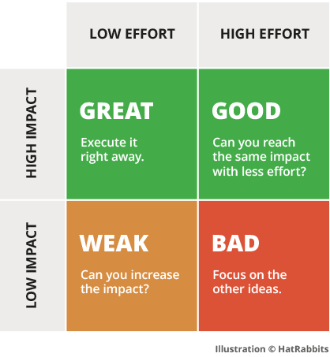
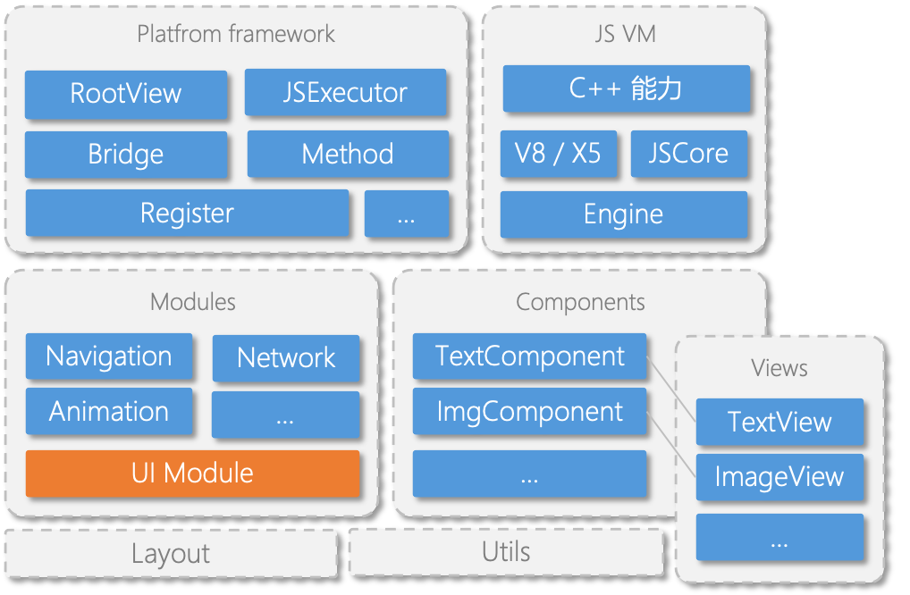
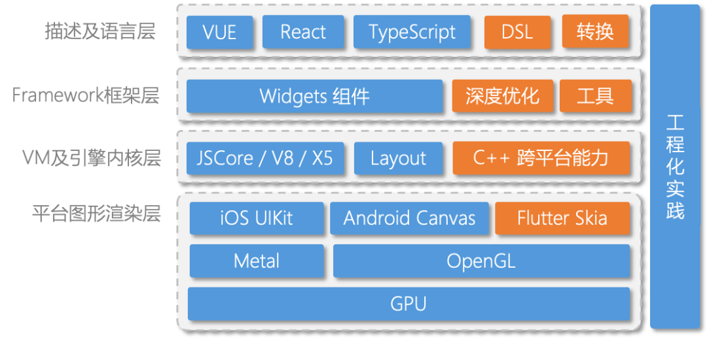

## Before

[(80 封私信 / 81 条消息) 2020 国内公司前端团队都在搞些什么? - 知乎](<Reading%20List%2068c05d9b17b04eac936dcb715058a8ab/(80%20%E5%B0%81%E7%A7%81%E4%BF%A1%2081%20%E6%9D%A1%E6%B6%88%E6%81%AF)%202020%20%E5%9B%BD%E5%86%85%E5%85%AC%E5%8F%B8%E5%89%8D%E7%AB%AF%E5%9B%A2%E9%98%9F%E9%83%BD%E5%9C%A8%E6%90%9E%E4%BA%9B%E4%BB%80%E4%B9%88%20-%20%E7%9F%A5%E4%B9%8E%20e86ca9b16d4047499354a9195bcd6371.md>)

[畅销书《深入浅出 Vue.js》作者，在阿里淘系 6 个月的收获成长](Reading%20List%2068c05d9b17b04eac936dcb715058a8ab/%E7%95%85%E9%94%80%E4%B9%A6%E3%80%8A%E6%B7%B1%E5%85%A5%E6%B5%85%E5%87%BAVue%20js%E3%80%8B%E4%BD%9C%E8%80%85%EF%BC%8C%E5%9C%A8%E9%98%BF%E9%87%8C%E6%B7%98%E7%B3%BB6%E4%B8%AA%E6%9C%88%E7%9A%84%E6%94%B6%E8%8E%B7%E6%88%90%E9%95%BF%20e966e7d788784574ada3bee7411836b6.md)

[APP 设计模式之——导航设计 - 知乎](Reading%20List%2068c05d9b17b04eac936dcb715058a8ab/APP%E8%AE%BE%E8%AE%A1%E6%A8%A1%E5%BC%8F%E4%B9%8B%E2%80%94%E2%80%94%E5%AF%BC%E8%88%AA%E8%AE%BE%E8%AE%A1%20-%20%E7%9F%A5%E4%B9%8E%209b76d30ef8904637bfca76b499c42177.md)

[Copy of Redux 数据流管理架构有什么致命缺陷,未来会如何改进? - 知乎](Reading%20List%2068c05d9b17b04eac936dcb715058a8ab/Copy%20of%20Redux%E6%95%B0%E6%8D%AE%E6%B5%81%E7%AE%A1%E7%90%86%E6%9E%B6%E6%9E%84%E6%9C%89%E4%BB%80%E4%B9%88%E8%87%B4%E5%91%BD%E7%BC%BA%E9%99%B7,%E6%9C%AA%E6%9D%A5%E4%BC%9A%E5%A6%82%E4%BD%95%E6%94%B9%E8%BF%9B%20-%20%E7%9F%A5%E4%B9%8E%20974bd4a3650f4d91bcf59615819c98fb.md)

[Workspaces | Yarn](Reading%20List%2068c05d9b17b04eac936dcb715058a8ab/Workspaces%20Yarn%200cb8bce2348447d7a2373805ef5883ac.md)

[阿里前端委员会主席圆心：未来前端的机会在哪里？-阿里云开发者社区](Reading%20List%2068c05d9b17b04eac936dcb715058a8ab/%E9%98%BF%E9%87%8C%E5%89%8D%E7%AB%AF%E5%A7%94%E5%91%98%E4%BC%9A%E4%B8%BB%E5%B8%AD%E5%9C%86%E5%BF%83%EF%BC%9A%E6%9C%AA%E6%9D%A5%E5%89%8D%E7%AB%AF%E7%9A%84%E6%9C%BA%E4%BC%9A%E5%9C%A8%E5%93%AA%E9%87%8C%EF%BC%9F-%E9%98%BF%E9%87%8C%E4%BA%91%E5%BC%80%E5%8F%91%E8%80%85%E7%A4%BE%E5%8C%BA%208bf98a609696429abe4c2a5a8d78385a.md)

> 服务搭建、serverless、智能化、IDE
>
> 效率、质量、体验

[用 github-page 做短链服务](https://github.com/nelsontky/gh-pages-url-shortener)

> 包括[这篇](https://zhuanlan.zhihu.com/p/339832422)国人作者搬运的，利用 github 仓库做 db，github-page 的 `404.html` 来做查 db 和重定向

[Evan You interview](https://evrone.com/evan-you-interview)

https://umaar.com/dev-tips/242-considerate-javascript/

> 如何根据终端的配置来进一步优化 UX 呢?这篇文章给出了一些例子.

## 2021

2021.01.09 23:25:46

[TensorFlow.js intro](https://www.youtube.com/watch?v=dDIk1Tmnj9A&ab_channel=GoogleChromeDevelopers)

> 油管视频，介绍了 ai ml 以及 tf.js 的一些有趣应用，以及谷歌在线训练，挺有意思

[chakra-ui](https://chakra-ui.com/)

> react ui 组件库，快速构建应用

【Details in [tailwindcss](../../../02learning_notes/front_end_notes/css/tailwindcss/tools.md)】[Tailwindcss](https://tailwindcss.com/):star::star::star:

> 纯 css ui 库，很赞，解决了很多 css 的痛点，极速构建应用！

[来自新时代的 CSS](https://mp.weixin.qq.com/s/pPtzhXbAaXfoTV2q3u0Dww)

> 好文，从历史的角度讲了新时代对于 CSS 模块化、兼容、预处理、规范化、可扩展性的各种方法
>
> 值得继续深入的：
>
> - [CSS Houdini](https://developer.mozilla.org/en-US/docs/Web/Houdini)：一套底层的 API 提供给开发者写 js in css，来创建一些浏览器未支持的自定义特性
> - https://slides.iamvdo.me/css-houdini/#/ 上面很多有趣的特效！
> - https://iamvdo.me/en/blog/css-houdini 博客介绍
>
> - CSS 界的 Babel -- [PostCSS](https://preset-env.cssdb.org/)
> - 强大的网格系统 -- [LostGrid](https://github.com/peterramsing/lost)
> - [cssdb](https://cssdb.org/)：postcss-preset-env 的实现基准，主要就是 CSS 的新功能功能及这些功能从提出到成为标准时所在的进程

[Youtube 7 trending js library in 2021](https://www.youtube.com/watch?v=2wucLthrUjw)

> 介绍了 7 个有趣好用的 js 库
>
> - nipple.js：virtual joystick library，就是玩游戏的虚拟摇杆
> - intro.js：能够实现页面功能介绍引导
> - [Tesseract.js](https://github.com/naptha/tesseract.js)：OCR
> - faker.js：造假数据的库
> - editor.js：编辑器
> - popper.js：tips 库
> - three.js：webgl

[Youtube design trending in 2021](https://www.youtube.com/watch?v=5RluSnRPRbI)

> 2021 UI 设计大趋势
>
> - 3D 元素
> - glassmorphism：没搜到这个单词，感觉是毛玻璃片的意思，可以看[这篇文章](https://uxdesign.cc/glassmorphism-in-user-interfaces-1f39bb1308c9)继续学习。其实已经有很多 panel 是这种毛玻璃片透明 or 模糊的了，挺喜欢的
> - colorless：色彩尽量少的，黑白最好，我喜欢
> - dark mode
> - animated illustrated in UI：感觉字节现在就有吧，UI 中的简单动画能增加很多活力
> - aesthetic minimalism：极简风，我爱了，但是真的做的好看好难哦
> - immersive interface：仿真的界面，让场景有真实效果的动效

2021.01.31 11:51:58

[glassmorphism](https://uxdesign.cc/glassmorphism-in-user-interfaces-1f39bb1308c9)

> 毛玻璃片的 UI 风格，苹果用的已经很多啦
>
> 文章介绍了一些 UI 注意点
>
> - 背景选择
> - 深度与透明度
> - Accessibilty 元素的可点击范围
> - 边框细节

2021.02.13 11:02:25

[写给前端的原生开发基础入门](https://zhuanlan.zhihu.com/p/340410273)

> 乍一看会觉得原生开发的概念和现在前段框架的概念类似？
>
> - [Retained mode](https://en.wikipedia.org/wiki/Retained_mode):
>
>   - in CG libs, client 调用底层函数并不会立即执行 render 操作，而是改变（update）框架内部维护的一个 model 对象（list），This allows the library to optimize when actual rendering takes place along with the processing of related objects. 有点像 React or Vue 的 vm 概念了哈？
>
> - [AOT & JIT(Angular2 as example)](https://levelup.gitconnected.com/just-in-time-jit-and-ahead-of-time-aot-compilation-in-angular-8529f1d6fa9d)
>
>   - AOT(Ahead of time):
>     - 在 build 阶段就将代码编译到机器指令集（在浏览器上就是 js bundle）
>     - source 更小，不需要下载 compiler 的代码
>   - JIT(Just in time):
>     - 在 runtime 的时候再进行变异
>     - source 更大，需要下载 compiler
>   - 
>   - JIT 更适合在 development 模式，AOT 更适合生产模式
>
> - Object-C：
>
>   - 方括号语法
>
>     - 用 send message 的语义去理解
>
>     - ```objective-c
>       // 另一种初始化方式，即先发 alloc 消息，再发 init 消息
>       NSDate* now = [[NSDate alloc] init];
>
>       // 初始化一个 NSCalendar 日期实例
>       NSCalendar* obj = [NSCalendar currentCalendar];
>
>       // 给实例发多个参数的消息
>       // 消息名为 ordinalityOfUnit:inUnit:forDate:
>       NSUInteger day = [obj ordinalityOfUnit:NSDayCalendarUnit
>                                       inUnit:NSMonthCalendarUnit
>                                      forDate:now];
>       ```

[Vite intro](https://www.twitch.tv/videos/911252528)

> you 大的 twitch 访谈？聊天？
>
> 大致介绍了 vite 是个什么东东，还挺有意思
>
> - Framework agnostic
> - Es module
> - Chunk

2021.02.17 10:46:43

[why esbuild is fast](https://esbuild.github.io/faq/#production-readiness)

> 了解了 esbuild，才知道用 non-js 的语言写的打包器居然依旧很久了，而且很厉害
>
> - golang 写的，充分利用了*多线程*并行的特性
> - 编译成二进制在命令行使用，而不是 JIT 的形式（用 node 去解析 js 写的 bundler）
> - 可以看到 JS 语言的局限性，或者说 JS 的特性更适合在浏览器场景使用？而在其他场景必然会有性能上的缺陷

2021.03.02 16:06:49

[best of js 2020](https://risingstars.js.org/2020/en)

> js 相关工具生态一年的上升趋势

[摸鱼练单词插件](https://github.com/Kaiyiwing/qwerty-learner-vscode)

> 分享个 vscode 插件 可以摸鱼的时候练单词

[QR code generate on Chrome 88](https://www.androidpolice.com/2021/02/04/chrome-84-brings-new-dino-themed-qr-codes-to-android-and-desktops/)

> chrome 自带生成页面 QR code 能力
>
> - chrome://flags -> sharing-qr-code-generator -> relaunch chrome

【nice idea】[trace user by favicon](https://supercookie.me/workwise)

> 背景：
>
> - 获取用户数据
> - 大量网站的 cookie
> - 催生了下面的 supercookie
>
> 很不错的一个想法：
>
> - 利用了浏览器对 favicon 的强缓存（切 VPN、更换网络、重启等都不会清除）的功能
> - 在 server 端生成用户的唯一标识 id，转为二进制，重定向访问 log2(id) 次的 subpath 下发对应 bit 为 1 的 favicon 文件让浏览器缓存（写操作）
> - 用户再次访问网站的时候会再次经历重定向，server 记录 favicon 的访问 bit 位，以此来获得用户的 id（读操作）
> - 扩容能力和性能都还不错（个人感觉重定向还是有点慢啊）
>
> github 地址：https://github.com/jonasstrehle/supercookie
>
> - node 写的，express + typescript

2021.04.05 17:19:24

[react concurrent-mode](https://reactjs.org/docs/concurrent-mode-intro.html)

> 让 UI 更新是可以被 interruptted 的，能够带来更好的性能和体验
>
> 结合了 git 分支和图形学 double buffering 的思想，很妙啊

2021.05.03 20:47:33

[Immediate mode GUI](https://caseymuratori.com/blog_0001)

> retained gui：create -> update -> callbacks

[about mipmaps](https://cgl.ethz.ch/teaching/former/vc_master_06/Downloads/Mipmaps_1.pdf)

> why mipmap？
>
> - 发现其实在 games101 7-9 课程中学到过，为了更好的在 texture 太大、点太小，可以在某个下采样的 map 上更好的取到 texture
>
> 什么是 mipmap
>
> - mip = "multum in parvo" (lat.: many things in small place) 来自拉丁文
> - 类似图像金字塔，2 的 pow，会需要额外的 1/3 数据量
> - by downsampling the original texture
>   - 最近点、box filter、gaussian filter
> - 三线性插值（第三重在 level 直接插值），更加平滑

【Archived to [about_imgs](../../../02learning_notes/about_imgs.md)】[Tiff](https://www.programmersought.com/article/8912800630/)

> **Tag Image File Format**
>
> TIFF is a mark-based file format that is widely used for the storage and conversion of images that require high image quality.
>
> 在 file header 中有 label，能在一个文件中处理多个图像

[what is raw in photography](https://www.findingtheuniverse.com/what-is-raw-in-photography/#What-is-RAW-in-Photography)

> RAW 是什么
>
> - 相机拍摄得到的图片原始数据
> - 统称 RAW，而不是具体的某个相机厂商的格式：.cr2 or .cr3(Canon RAW), .nef(Nikon), .raw(Android)
>
> JPG 其实就是 JPEG(Joint Photographic Experts Group)
>
> - This is often shortened to JPG, _as a throwback to a time when file extensions could only be three letters_. So a JPG file on your hard drive would look like “Image.JPG”. There is no difference between a JPG and a JPEG, they are the same.
>
> [白平衡 white balance](https://www.cambridgeincolour.com/tutorials/white-balance.htm)
>
> - 可以理解就是色温？想象一张白纸放在一个钨丝灯泡（tungsten bulb）下
>
> 不建议拍 raw 的一些原因
>
> - 没有足够时间去后期编辑
> - 连拍场景可能会 brust，因为 raw 文件太大了，写入硬盘会比较慢（相比 jpg）

[tiny-wins](https://joelcalifa.com/blog/tiny-wins/)

> github pr 的状态可以在 favicon 上显示
>
> 下面这张图挺好
>
> - small change add up to big win
> - 发现/解决一些**高频事情中的痛点（时间浪费）**
> - Getting your personal pet peeve（个人烦恼） fixed is powerful, often more so than new, more substantial features.
>
> btw 这篇文章文笔还挺好的
>
> 

【好文】[跨平台动态化容器方案优化（非常切合工作哈哈）](https://mp.weixin.qq.com/s/0QViGHkt6R5fOZms-EpwAA)

> 比较全面的讲了目前（2021 前后）移动互联网应用跨平台解决方案的整体架构、优化方案
>
> 摘录一些：
>
> 开头：随着互联网红利的消失，整个移动市场的关注从“流量”转成了“留量”，大部分的移动产品也都告别了初期的抢占市场，**进入了 A/B 实验和快速试错的阶段，迭代速度、效果验证的压力与日俱增，效率变成了移动 App 的核心竞争力。**
>
> - 动态化 UI 方案
> - 平台化 App
> - 小程序平台
>
> 容器化方案整体架构：
>
> - JS 做什么
> - Native 提供什么
>
> 
>
> **为什么要跨平台？**
>
> - Write once, run anywhere
> - 提升效率（研发、运营...）
>
> 可以优化的切入点（容器 webview。。。）
>
> 
>
> P.S. 结合自己的工作，公司内部的 lynx react-lynx DSL 的动态化方案，包括所学的 CG 知识，其实能看出整个大前端（App）渲染的 pipeline：
>
> - App 容器（-> DSL -> JsVM -> ... ->）Native platform/engine -> Device GPU
>
> 还挺有意思的，可以深入的地方还是很多！

2021.06.02 19:23:17

[js functions compare](https://habr.com/ru/post/554334/)

> 俄罗斯大佬比较了 angular 的项目中 node_modules 里面有 39% 的函数是重复的，里面如何比较 js 函数的思路
>
> - 函数 `toString`
> - Uglifyjs 统一变量名
> - 遍历所有 js 文件 用 ast 解析出函数
> - 函数字符串 hash 作为文件名
> - sqlite 数据库保存信息
> - [完整的脚本](https://github.com/gurov/identical-functions/blob/master/index.js)

【TODO】[intro to multi-thread](https://www.internalpointers.com/post/gentle-introduction-multithreading)

> 一个系列的教程文章，后续继续要看 TODO
>
> - 希腊语 atom 原子性 uncuttable 原子不可再分

[webview 概述](https://mp.weixin.qq.com/s/PipKSnMQaTBhE5kSwG3DVQ)

> JS to Native：
>
> - 注入型 JSB `JavascriptInterface`
>   - 在 native 上实现实例注入到 webview 的 window 对象下面
> - 拦截型 `WebViewClient.shouldOverrideUrlLoading()`
>   - 拦截所有的 URL schema
>   - iframe.src/location.href
> - 监听？`WebChromeClient.onXXX()`
>   - 通过修改原来浏览器的 `window `某些方法，然后拦截固定规则的参数，然后分发给 Java 对应的方法去处理
>   - alert/console.log/confirm/prompt
>
> 通信原理是 JSBridge 实现的核心，实现方式可以各种各样，但是万变不离其宗。这里，推荐的实现方式如下：
>
> - JavaScript 调用 Native 推荐使用 **注入 API** 的方式。（ iOS6 忽略，Android 4.2 以下使用 WebViewClient 的 onJsPrompt 方式。）
> - Native 调用 JavaScript 则 xx 直接执行拼接好的 JavaScript 代码即可。

2021.06.23 16:44:28

[webcontainer](https://blog.stackblitz.com/posts/introducing-webcontainers/)

> 用 web 来开发 web，非常跨时代，[doc](https://github.com/stackblitz/webcontainer-core)
>
> 在浏览器中运行 node 项目，安全性，离线化，node_modules，等等
>
> 最终目的：开发抛弃一切 git，node，npm，VSCode...

[css-in-js v.s. real-css](https://pustelto.com/blog/css-vs-css-in-js-perf/)

> 比较了 css-in-js（比如 [styled-component](https://styled-components.com/) 的 runtime css）和纯 css 文件（[linaria](https://github.com/callstack/linaria)-built-time）的 web 应用的性能，具体数值没细看，而“现代框架如何渲染 css 文件”这件事情是我一直忽略没有关心过的，文中能提到几个框架可以值得学习一下。
>
> btw，在 built-time extract 出 css 文件可能是未来 css 文件发展的方向，[vanilla-extract](https://github.com/seek-oss/vanilla-extract) 和 Facebook 团队都已经开始尝试了。脸书的那个 react conf [视频](https://www.youtube.com/watch?v=9JZHodNR184)还是有点东西的。

[zerocopy](https://developer.ibm.com/articles/j-zerocopy)

> zerocopy 的技术，提升从硬盘读取数据在传送到网络的速度/性能。
>
> - 为什么？
>   - 应用读取文件传输到网络（比如：静态资源服务器）
>   - 经历了 disk -> app -> socket 的过程
>   - 每个通信过程中都会有数据拷贝操作，app 仅仅作为了一个中间缓存
>   - 却带来了多次的 kernel/user mode 交换和数据拷贝，非常低效
> - 怎么做？
>   - 类 UNIX 的 Linux 系统有直接将一个 file descriptor 传递到另一个 descriptor 的系统调用，可以避免再拷贝到 app 上下文的内存
>   - 直接将 kernel mode 中的 buffer 拷贝到 socket buffer 即可
>   - Linux 2.4 之后还有一个操作，修改了 socket buffer 的实现，zero copy 直接可以将 file descriptor 作为 index 一样 DMA 传给 NCI buffer，做到真正的 zero copy
>   - 在 Java 中的实现为 `transferTo()`
>
> 这篇文章图画的挺清楚，易懂

[react 加速工具](https://blog.bitsrc.io/5-recommended-tools-for-optimizing-performance-in-reactjs-29eb2a3ec46d)

> 先 mark 了，用到再说

[third age of JS](https://www.swyx.io/js-third-age/)

> JS 的第三个阶段（第二阶段刚过去 2009-2020，扩展和探索）
>
> In summary: Third Age JS tools will be
>
> - Faster
> - ESM first
> - Collapsed Layers (One thing doing many things well instead of many things doing one thing well)
> - Typesafe-er (built with a strongly typed language at core, and supporting TS in user code with zero config)
> - Secure-er (from dependency attacks, or lax permissions)
> - Polyglot（多语言？）
> - Neo-Isomorphic (recognizing that much, if not most, JS should run first at buildtime or on server-side before ever reaching the client)
>
> 更好的 DX 和 UX...
>
> The result of all of this work is **both a better developer experience** (faster builds, industry standard tooling) and **user experience** (smaller bundles, faster feature delivery). It is the final metamorphosis of JavaScript from site scripting toy language to full application platform.
>
> 也说到这 10 年可能就是 JS 最后的阶段了——因为有 WASM！
>
> If so - **we're in the Endgame now**.

[Git-centric workflow](https://www.netlify.com/blog/2019/09/27/git-centric-workflow-the-one-api-to-rule-them-all/?utm_source=twitter&utm_medium=gitcentric-swyx&utm_campaign=devex)

> 以 GIT 为中心的工作流，everything in Git
>
> - CD，rollback
> - AB test
> - ...
>
> 提到了 [Git lfs](https://git-lfs.github.com/)（large file storage）用 go 写的，提供：大文件 -> 本地文本指针 -> 文件上传到服务器（没细看）

[未来计算领域的 10 个预测](https://blog.container-solutions.com/10-predictions-for-the-future-of-computing)

[通过 AI 将动漫人物真实化](https://designyoutrust.com/2021/04/person-uses-artificial-intelligence-to-make-anime-and-cartoon-characters-look-more-realistic/)

> 没找到技术相关，都是图片，发现了帅气的波波
> 

[emoji 作为 favicons](https://css-tricks.com/emojis-as-favicons/)

> 浏览器支持用 svg 作为 favicons，可以添加文本内容，这篇文章有例子

[react 和 IMGUI](https://www.zhihu.com/question/39093254/answer/1351958747)

> doodlewind 在知乎的回答，阐述了 IMGUI（immediate mode gui）的特点：指令式、每帧进行计算，和 React 本质上其实就不是一回事情。也讲到了对应的 GUI 范式 retained mode，也是大多数渲染接口所保留的。
>
> 同时提到了「前端」对于「渲染」的理解，个人认为前端真的只是在解决渲染逻辑上的操作，而不是渲染真正的问题（图形学才是），这点想清楚其实就不会对这个问题产生太多疑惑了。
>
> _依赖 React 做所谓「渲染」，不外乎就是在改一堆对象（DOM）的状态而已，许多 GUI 技术栈里的重点和难点根本摸不到_ 所以浏览器在 DOM 这层就已经把「渲染」的事情封装掉了 XD

[Lottie intro](https://airbnb.design/introducing-lottie/)

> Lottie 作为动画的新技术，airbnb 开源
>
> - 跨平台
> - 文件小，json based
> - 可复用

2021.12.14 13:50:49

[Rust——JS 基建的未来](https://leerob.io/blog/rust)

> 用 Rust 写的 JS 工具越来越多，逐渐来替换之前的打包/构建/lint 工具
>
> - 介绍了 rust 的一些 JS 工具：swc，Deno，esbuild，Rome
> - Rust 和 Wasm 的结合（后续可以多了解下 Wasm）
> - 展望未来：**Extensibility**，**Performance**，**WebAssembly**，**Community**

[抖音国庆小游戏 cocos](https://mp.weixin.qq.com/s/cQ9S20Uxm6lir2pa1RF2cA)

> cocos 做小游戏的介绍，自己也不会，看了也想象不出开发过程，不过既要兼顾业务需求也需要顾及性能，还挺难的。
