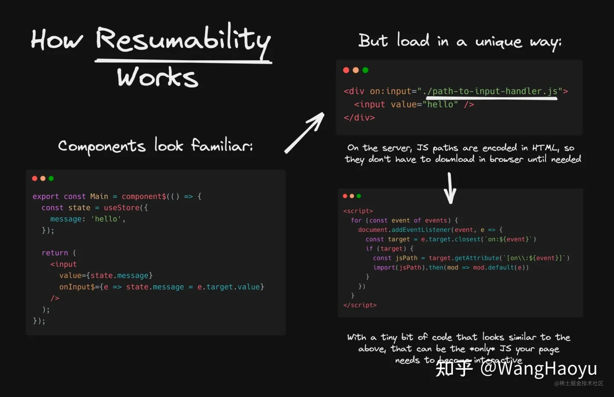

2023-1

[rimraf（node 的 rm 指令）](https://github.com/isaacs/rimraf)

> node 版的 `rm -rf`，只是内部仓库用到了，找来看看，用 node 应该就是要解决跨平台兼容性的问题（unix、linux、macos、windows）
>
> 看了下代码，其实就是用 node 的 fs 来操作，不走 shell 指令

[神人 Fabrice Ballard](https://zhuanlan.zhihu.com/p/386115058)

> 他的官网：https://bellard.org/
>
> QuickJS、FFmpeg 等一些非常牛逼有名的库的作者

[isInputPending](https://developer.chrome.com/articles/isinputpending/)

> Facebook(React) 为 chromium 提出的一个标准 API（文章是写在 2020，**chrome 87** 版本）
>
> 背景是解决 load fast or response fast 的问题：由于浏览器是单线程运作，加载页面（exec js 脚本）和响应事件（fire input 的一些回调），必然是阻塞的，需要将执行权交回给浏览器（常见的做法就是将任务分割，一个个 js block，执行完通过一次 settimeout 等宏/微任务，将线程执行权交还给浏览器），也就是 React 中的 schedular
>
> 有了 isInputPending 之后，可以如下代码更加优雅，也更加合理（相比手写时间片）
>
> ```js
> const DEADLINE = performance.now() + QUANTUM;
> const options = { includeContinuous: true }; // continuous events 比如 mousemove pointermove
> while (workQueue.length > 0) {
>   if (
>     navigator.scheduling.isInputPending(options) ||
>     performance.now() >= DEADLINE
>   ) {
>     // Yield if we have to handle an input event (any of them!), or we're out of time.
>     setTimeout(processWorkQueue);
>     return;
>   }
>   let job = workQueue.shift();
>   job.execute();
> }
> ```
>
> 一些 caution：
>
> - 小心使用（自己大概率也是用不到的）
> - 如果是在 iframe 中的交互 target 可能一直返回的是 false
> - 移动端比如安卓的 Chrome 不同的 page 会复用 event loop，所以 isInputPending 会不准确，需要结合 page visibility

[字体 otf 和 ttf](https://www.makeuseof.com/tag/otf-vs-ttf-fonts-one-better/)

> **True Type Font(.ttf)**
>
> - Apple 和微软一起创建的
> - 目标是为了在原生系统、打印机上渲染字体
> - 早期的跨平台字体文件格式
>
> **Open Type Font(.otf)**
>
> - Adobe 和微软
> - 包含 ttf 的特点
> - 文件存储可到达 65000 个字符（可以设计更多的字体）
> - 一些额外字体（Ligatures、Glyphs、small caps、alternate characters、old-style figures）可以直接在 otf 文件中共存（如果是 ttf 需要新增额外的字体文件）
>
> 哪个好？必然是 otf，优先考虑
>
> **_Web Open Font Format(WOFF)_**
>
> The Web Open Font Format is a little different in that it is a container for OTF and TTF, compressed and packaged with other information for use on the web.
>
> WOFF files are useful when a website wants to use a custom font that the user is unlikely to have stored on their machine.
>
> 可以通过 WOFF 文件来存放**压缩之后**的 ttf or otf、协议信息等
>
> Mozilla, Opera, and Microsoft 开发（2018），WOFF2 比 WOFF 压缩更好，大多数主流浏览器已经支持（**字体文件大小优化手段之一**）
>
> **关于 CSS 的 @font-face**
>
> 可以通过 src 属性的可选项 `format()` 告诉浏览器字体的格式，如果不支持 or 不合法，浏览器就不会下载这个资源
>
> 支持的类型[有这些](https://developer.mozilla.org/en-US/docs/Web/CSS/@font-face/src#font_formats)

[rollup dynamic import 插件 原理](https://github.com/rollup/plugins/tree/master/packages/dynamic-import-vars)

> 原文是一篇公司内部的文章，在迁移到 vite 的时候发现历史遗留的动态引入问题，于是调研了 rollup 的动态导入。主要内容其实就是对 github readme 的翻译，和源码分析
>
> - Rollup 插件构建时，动态引入（path 是动态的）是如何实现的，构建时不知道运行时的变量，通过一些特殊的手段。（[github](https://github.com/rollup/plugins/tree/master/packages/dynamic-import-vars)）
> - import( '../path/\${xx}.js' ) -> 会构造 glob path，然后编译所有的文件，再将代码转换成 switch/case 匹配
> - [源码](https://github.com/rollup/plugins/blob/master/packages/dynamic-import-vars/src/index.js)
> - 这个业务团队也用 [unplugin](https://github.com/unjs/unplugin) 开发了一个 vite 支持的插件

[babel 插件 按需引入](https://juejin.cn/post/7078527789388791821)

> [babel-plugin-import](https://github.com/umijs/babel-plugin-import)
>
> 一种按需引入的方法，核心就是通过 babel 改写 import 的路径：原本的路径改写成更加细粒度的组件文件路径
>
> 使用方法：
>
> - 直接在 `babelrc` 配置
>
>   ```json
>   {
>     "plugins": [["import", options]]
>   }
>   // options
>   {
>     "libraryName": "@material-ui/core",
>     "libraryDirectory": "components",  // default: lib
>     "camel2DashComponentName": false,  // default: true
>   }
>
>   // 例子
>   [
>     "import",
>     {
>       "libraryName": "@arco-design/web-react",
>       "libraryDirectory": "lib",
>       "camel2DashComponentName": false,
>       "style": true
>     },
>     "@arco-design/web-react"
>   ],
>   ```
>
> 最终编译结果（例子）
>
> ```js
> import { TimePicker } from "antd"
> ↓ ↓ ↓ ↓ ↓ ↓
> var _button = require('antd/lib/custom-time-picker');
> ```
>
> 扩展阅读：https://juejin.cn/post/7058964067100131365

[浅谈移动端开发技术](https://mp.weixin.qq.com/s?__biz=Mzg4MTYwMzY1Mw==&mid=2247496579&idx=1&sn=34dc5cc35bd62d20f6d6cf992928f579&source=41#wechat_redirect)

> 虽然是 21 年的文章，但是对于移动端开发的大概技术介绍都很全面，比较详细（在浏览器待了很久的 tab...）
>
> 主要是 Hybrid App
>
> - webkit
>   - 解析 HTML 和运行 JS 的核心
>   - 诞生于 safari，chromium 基于此，Chrome 浏览器
>   - IOS 中 JSCore
>     - JSVM
>     - JSContext
>     - JSValue 转换 JS 类型 -> OC 类型
> - RN
>   - JSI（JS 和 Native 通信）
>   - 新架构，解决了 JSB 通信消耗
> - Flutter
>   - Skia 自渲染
>   - Dart，放弃 Web 生态
>   - 类似浏览器渲染

[clay css](https://github.com/codeAdrian/clay.css)

> claymorphism styles 的 CSS 样式库，[demo site](https://codeadrian.github.io/clay.css/)
>
> claymorphism 中文翻译过来是粘土风格？inflated fluffy 3D elements
>
> 用法比较简单，安装好之后提供了预设的 class
>
> - class="clay"
>
> 为什么没有再做一个 UI Frame：（节选）相对来说比较新的设计理念，自由简单，不想维护 XD

[js is weird](https://jsisweird.com/)

> JS is weird!
>
> 这是一个做题网站，测试一下对 js 各种稀奇古怪的坑是否了解
>
> 做完题还会有讲解

[what makes GIT hard to use](https://www.highflux.io/blog/what-makes-git-hard-to-use)

> 使用 git 的体验和作者文中所说的一样感同身受，“常常感觉自己还是一个 git 新手”，git 对于大家日常使用的一些命令之外，还是比较难用的，主要原因：
>
> 1. 命令太多、太底层了，一些直觉上的操作，需要结合多个指令一起完成
> 2. 文件存在的版本太多了，作者觉得有 4 个，实际上只关心：当前自己编辑器中的，和远程仓库团队的版本
> 3. git 不太方便做实验，也就是缺少了很多 undo 的功能，以至于我们也不太敢尝试一些指令（也许代码就丢了）
>    1. 最好有撤销（undo）的能力
>    2. dry run 的选项，只输出执行结果，而非真正执行
>
> 最后作者推荐了一些工具，在 git 之上，让 git 的使用体验更佳

[codeball](https://codeball.ai/)

> 好家伙，AI based Code Review
>
> _我看 tt 有在使用？_
>
> 基于 github actions 触发 CR
>
> 支持的语言很多

[react 和 imgui 的区别](https://www.zhihu.com/question/39093254/answer/1351958747?utm_id=0)

> 渲染，立即模式，保留模式，的一些科普。
>
> react 这种 web 框架还是离渲染太远啦，dom 这层基本就封装掉底层渲染的东西了。

[设计模式为什么会流行](https://yinwang1.substack.com/p/846?continueFlag=da0095b31d2a28cf55236ccb31b4ab9f)

> 也没学过设计模式，还好没浪费这个时间哈哈。以及 yinwang 十年前的[吐槽](http://www.yinwang.org/blog-cn/2013/03/07/design-patterns)

[如何评价 qwik 框架](https://www.zhihu.com/question/467071621/answer/2835310168)

> 一个 22 年？出的新 SSR 框架，[官网](https://qwik.builder.io/)，应该也是 builder.io 主要的框架语言之一（好吧，qwik 的作者就是 builder.io 的 CTO...）
>
> 这篇文章讲的挺好，比较全面的说明了 CSR & SSR 目前的问题，以及 qwik 的 Resumability 思想
>
> 简单概述下现在传统 SSR 的性能问题
>
> - SSR 流程：服务端渲染好 HTML（reactDom.renderToString），发送到客户端，客户端需要再次 hydrate，执行一遍对应的 js 脚本，为的是给 html 元素绑定上交互需要的事件监听
> - 存在的问题（流程图来自文章）
>   - 在服务端下发 HTML 回到 CSR 之后，会进行 hydrate 的过程，需要下载解析全部的页面 JS，去恢复应用应有的状态（Recover 过程），所以消耗会非常大，真正等待交互的事件会延后（**TTI**，和 **FCP**）
>   - 当应用变得复杂，hydrate 过程会变得更长！
>
> **Resumability: 更加优雅的 hydartion 替代方案**
>
> - qwik 的作者认为 hydration 其实是多余的
> - 将必要的信息序列成 html 的一部分（减少 js 的解析）
> - 依赖于事件冒泡来拦截所有事件的全局事件处理程序
>
> 
>
> 具体细节可以看文章，讲的还是比较容易懂的

[SSR Islands 架构](https://juejin.cn/post/7155300194773860382)

> 依旧是前端 SSR 框架，作者也是字节员工
>
> - MPA 和 SPA 的取舍
> - Islands 架构：
>   - 也是解决 SSR 方案在全量 hydration 的过程导致页面 TTI 的折损
>   - 核心思路就是区分静态组件（无需任何交互的组件）将静态组件直接渲染成 HTML，用少量代码去做其他组件的 hydration（这些非静态组件就像是“岛屿”一样）
> - [Astro 框架](https://astro.build/)
> - 作者自己实现的 https://github.com/sanyuan0704/island.js
>   - 文章有整体流程，很不错
>   - 可以整体看一下源码
> - 这个架构框架无关（astro）

[solidjs 是 react 应该变成的样子](https://typeofnan.dev/solid-js-feels-like-what-i-always-wanted-react-to-be/)

> 一篇对 solidjs 的感受
>
> _If a linter knows when an effect (or callback, or memo) hook is missing a dependency, then why can’t the framework automatically detect dependencies and react to those changes?_ react 并不是真正 reactive
>
> BTW，solidjs [文档](https://docs.solidjs.com/)好全啊，unocss、部署到 vercel 都介绍了

[重新理解 web](https://zhuanlan.zhihu.com/p/581977751?utm_id=0)

> 又是一篇在字节的同学的文章，大佬真多啊。内部的飞书文档不能公开，全集是从 Web 切入到 Web XR。知乎是第一章「重新理解 Web」的摘录
>
> - Web Runtime（Web 三要素）：
>   - 传统浏览器/PWA/WebView/跨端容器
>   - 浏览器 -> 画框 -> 地址栏/收藏夹/...；内容/界面 -> 画布
>   - 标准化 Web 软件：分发、实现、运行三个维度的标准化
> - 前端技术（Web 三要素）
>   - 设计驱动开发/功能驱动开发
> - URL & Web 独特能力（Web 三要素）
>   - URL：资源的标识符「真名」
>   - 能力：分发、解绑、混搭、即用、动态、共创、跨平台、协作
>     - 安装 App 的心智 v.s. 随用随弃
> - 平台现状（新能力、to Dev、UI 框架、引擎、小程序/容器）
> - 总结
>   - 具备八大 web 独特能力的就是 Web

[husky 原理](https://juejin.cn/post/6879955438482227207)

> husky 是 lint 代码比较常用的工具，配合 `lint-staged` 在 git commit 之前进行 lint
>
> git hooks：
>
> - 在 git 操作前触发的自定义脚本（在 `.git/hooks` 目录）
>
> Husky 的作用：
>
> - 官方描述：Modern native Git hooks made easy
> - 通过配置共享 git hooks（团队协作）
>
> 原理：
>
> - 在 npm scripts 的 install 指令，执行 husky install（目前会需要指明：` "prepare"*:* "husky install"`）
> - 直接在 `.git/hooks` 下创建所有支持的 hooks
> - 内容都是执行 `husky.sh`，交给 husky 来执行 hook
> - 步骤：
>   - husky.sh 脚本获取 hook 名称
>   - 找到配置的 hook 对应的脚本
>   - 执行指令（node）
>
> 新版的 husky [不太一样](https://stackoverflow.com/questions/57297444/how-husky-works)，可以直接从 husky 源码入手：
>
> - husky install 会执行 `index.js`：
>   - 一系列判断（有没有 `.git`、git 状态...）
>   - 创建文件，包括 `husky.sh` 和 `hooks`
>   - **将 git hooksPath 指向 `.huksy` 路径，该目录下直接是各个 hooks**
>   - 每个 hooks 的开头会将 hook 交给 `husky.sh` 来执行
>     - 核心 ` sh -e "$0" "$@"` 是通过 `$0` 取到调用的脚本（hook）执行参数
>     - 下面就是需要执行的脚本，方便自己定义
>   - 无需再配置 package.json 等配置
>
> _`$0` 是 call 脚本的路径 or 指令，`$@` 是所有参数的特殊变量_

Tree shaking 问题排查指南（内部文档 docs/doccn8E1ldDct5uv1EEDQs8Ycwe）

> - Tree shaking 是在什么环节：LTO（Link Time Optimization）的时候，检查各个模块之间的引用依赖
> - 是什么：分析出模块中导出的被引用代码之外的代码是否有用，是否有副作用，删除这些代码
>   - _Tree shaking_ is a term commonly used in the JavaScript context for dead-code elimination. It relies on the [static structure](http://exploringjs.com/es6/ch_modules.html#static-module-structure) of ES2015 module syntax, i.e. `import` and `export`. The name and concept have been popularized by the ES2015 module bundler [rollup](https://github.com/rollup/rollup).
> - 每个打包工具之间的 tree shaking 算法比较固定
> - sideEffects：具体教程可以看 webpack 的 [doc](https://webpack.js.org/guides/tree-shaking/)，
>   - 值可以是 boolean，告诉打包工具模块里面所有的代码都是没有副作用的
>   - 也可以是 string[]，指定有副作用的代码
> - 误区：
>   - 包含副作用的代码，都不能配置 sideEffects false：就是要看这个副作用设计是给模块内部还是外部的，如 vue，虽然是有副作用，但是是给内部用的，所以可以配置为 true(see [side effects in vue](https://github.com/vuejs/vue/pull/8099))。
>   - Css 配置 sideEffects 为 false 来实现 tree shaking：直接 import 进来的 css 如果被认为是没有副作用就会被误 tree shaking 掉，导致直接引入的 css 不生效，跟着组件相关一起 shaking

[Webpack 设计理念](https://juejin.cn/post/7170852747749621791)

> 爽文，文章从核心思路到架构到 MVP 版代码实现，一气呵成

[Webpack HRM 解析](https://juejin.cn/post/7176963906844246074)

> 热更新是提升开发效率的强力工具之一
>
> 核心原理：
>
> - 「客户端」和「服务端」（webpack-dev-server）之间通过 ws 通信
> - 服务端 watch 代码变更（webpack compile 之后会有一个模块文件列表），推送更新消息给客户端，通知客户端去获取**最新的**模块变更
> - 服务端：每次编译都会生成一个 hash，通过 ws 发送给客户端
> - 客户端：
>   - 存 hash，比较上次 hash
>   - 如果不同，将自己的 hash 回传服务端（请求 hash.json 信息），让服务端比较出和最新代码之间的 diff
> - 服务端：
>   - 对比找出变更的模块 chunk 信息返回给客户端
> - 客户端：请求新的模块 js 文件，合并到自己的 modules，并且重新执行依赖这个模块的模块
>
> 这个图还挺不错的，摘录下
>
> 

[前端的 Race Condition](https://juejin.cn/post/6938286092693176334)

> 常见的场景：登录/切换账户、切换 tab、搜索，请求返回时序不一致的问题（异步方法）
>
> 大部分语言是有资源锁/同步锁这种东西，然而 JS 是单线程的，异步渲染场景还是会有这个问题
>
> 解决方案：
>
> - 取消请求：比如 axios，基于 XMLHttpRequest 是可以取消的，详见 axios 的文档
> - 匹配请求：根据每次请求唯一 id 来匹配和执行，或者是匹配最后的请求
> - 取消 Promise：提前 reject，但实际的网络请求还是会发送出去，而不处理 response 了而已
> - rx.js

[beautiful gradients](https://www.joshwcomeau.com/css/make-beautiful-gradients/)

> 色彩是有趣的，更加好看的渐变色生成方式
>
> 传统的 CSS `line-gradient` 生成出来的渐变色中间那段会出现灰色区域，原因就是渐变插值方式用线性函数的时候，RGB 模型的色彩会趋于三通道接近的颜色（灰色）
>
> _`(128, 128, 128)` 灰度图！_
>
> 于是，考虑用其他的色彩模型就能得到更加好看的渐变，比如 HSI（色彩、颜色饱和度、亮度）。
>
> _HSL isn't concerned with how humans perceive colors, though; it's modeled after the raw physics, energy and wavelengths and such._
>
> 在 CSS 中目前还不能替换渐变的颜色模型，但是可以通过多个色彩去离散的逼近！思路有了
>
> 当然也有[工具](https://www.joshwcomeau.com/gradient-generator)能够 tweak 出自己喜欢的渐变效果，得到 CSS 代码，很棒！

[精度 react hooks](https://github.com/ascoders/weekly/blob/v2/079.%E7%B2%BE%E8%AF%BB%E3%80%8AReact%20Hooks%E3%80%8B.md)

> react hooks 是什么？
>
> **要解决的问题是状态共享**
>
> 状态共享可能描述的不恰当，称为**状态逻辑复用**会更恰当，因为只共享数据处理逻辑，不会共享数据本身。
>
> **“有状态的组件没有渲染，有渲染的组件没有状态”**：hooks 中应该只有逻辑，没有 UI
>
> 带有 hooks 的组件可以看作是纯组件，只不过 `state, setState` 是被当作 props 传给了 render，而触发 render 是其他的 effect
>
> P.S. redux 的 hooks 实现完全可以基于 `useContext` 和 `useReducer`（[源码](https://github.com/facebookarchive/redux-react-hook/blob/main/src/create.ts)）

[前端中的 Functional Reactive Programming](https://zhuanlan.zhihu.com/p/77687564)

> FRP: Functional Reactive Programming，其代表 RXJS 的函数式响应式编程
>
> 异步数据流
>
> 文章介绍了 RxJS 的核心概念：
>
> - Observable：异步数据流的抽象
> - Subscription：数据的消费方
> - Operators
> - Subject：multi-cast，（默认 unicast 的 Observable）共享数据源
>
> _但一旦领会其万物皆流、Observable => Pipeline => Subscription 的要义，随着异步逻辑复杂度的提升，例如表单交互、视频播放器、大型应用等等复杂场景，这种编程范式将会给你带来越来越高的性价比。_
>
> 至于是否选用 RxJS，结合自己的项目对于异步数据/操作的复杂度来判断吧！

[前端 2022 一览](https://vived.io/javascript-wrapped-2022-frontend-weekly-vol-119/)

> [中文翻译版](https://mp.weixin.qq.com/s/wC9Wq7FJ_sKg1I-z8AozCQ)
>
> 大多数都了解到了，摘录一些没了解到的/重要的
>
> - are types coming to JavaScript?：js 中引入类型说明的提案
>   - 卡在 stage 1，23 年可能会继续
>   - 能超过 ts 吗？感觉还很遥远
> - TS
>   - satisfies 关键字
>   - TS 的版本不是基于 Semantic Versioning
> - React 18
>   - concurrent mode：并发是关于对渲染进行排队、排定优先级以及添加中止正在进行的渲染的能力的。
>   - 新的 hook api：useTransition、useDeferredValue
> - SSR：
>   - Qwik、Astro island arch
> - Bun：
>   - Node 和 deno 的替代品，重在性能
> - Nodejs：
>   - 内置了 test 能力，无需引入 jest 之类的

[deepkit framework: high performance ts backend framework](https://github.com/deepkit/deepkit-framework)

> Mark 一下
>
> 看了一下 [intro](https://deepkit.io/blog/introducing-deepkit-framework)，直呼太牛了。属于 Web 服务框架，最大化利用了 TS 的特性，简述下框架的几个特性：
>
> - Runtime Types：在 runtime 加入 type 信息会翻天覆地（对于 JS），deepkit 包含了很多好用的基础函数用来做运行时类型检查
> - Type Decorators：框架采用了 Branded Types，TS 自己的一种模式。可以将类型附加各种装饰信息，`type Username = string & MinLength<3> & MaxLength<23> & Alphanumeric;` 很直观有木有！而且很好的配合类型检查
> - Database Schemas：Deepkit ORM，支持所有 TS 类型
> - Router：HTTP API Routes 会自动根据所声明的类型做检查 params, body 等！
> - Dependency Injection：依赖注入问题，框架能够很好的解耦依赖（通过 implements interface，只要是满足类型的即可，而不是强耦合实现）（_In backend frameworks it was not possible until recently to write properly modular applications and libraries, because as soon as a dependency injection container is used with TypeScript, one is more or less forced to develop against implementations instead of abstractions._）
> - Configuration：应用的配置通常是单调无味的，在这里可以用一种很新的方法来写配置
> - High Performance：不仅是运行效率（ORM 效率很高，因为有自己的 js vm 包含了很多运行时的 JIT 优化），开发效率也很重要，在 Fully TS 的加持下，能够让项目长期保持高效的开发（感觉有点像 rust，能让所有人写的代码都符合高质量水平，而不会随着代码膨胀而变得难维护）
>
> 框架是如何工作的，有一个 type 编译器，将类型信息抽离成二进制码，会在 runtime 的时候通过一个小 vm 来执行，在 `{kind: ReflectionKind.string}` 中。细节在 [TypeScript Bytecode Interpreter / Runtime Types](https://github.com/microsoft/TypeScript/issues/47658) 非常长的文章。。之后再读读看吧，也不一定看得懂。
>
> 框架能力也非常的完善。也包括一个 debugger 工具？

[Minimize state](https://www.worldofbs.com/minimize-state/)

> _All Programming Philosophies Are About State_
>
> What this means is that there is no "one true way" to deal with state, and that each programming philosophy is useful and important in the correct domain. It also shows how important _minimizing_ state is.

[SQLite 文艺复兴](https://www.bmpi.dev/dev/renaissance-sqlite/)

> SQLite 的故事、架构
>
> 各个领域基于 SQLite 的创新
>
> _SQLite 为什么能在如此多领域有创新的项目出现？一方面得益于 SQLite 高质量的代码，近亿行的测试代码保证了其坚若磐石的可靠性，另一方面又得益其简单的架构，总共的实现源码也才 15 万行。_
>
> _随着 Serverless 及运行在 CDN 上的 Edge Computing 的流行，SQLite 这种轻量级的关系型数据库将会有更多的应用场景，也会有更多的创新出现。SQLite 也是一个非常适合学习的数据库，它的源码非常简单，可以很好的帮助你理解数据库的原理。_

[RESTful API 一把梭 post？](https://coolshell.cn/articles/22173.html)

> 挺有意思的背景：有人认为 api 全都用 post 一把梭，方便。
>
> 为什么要用不同的 HTTP 动词
>
> - **业务逻辑**。业务功能实现的代码，比如完成一个订单
> - **控制逻辑**。非功能性代码，用于程序/系统控制，比如多线程、分布式、协议、中间件等与用户需求无关
>
> 幂等
>
> - **缓存**。通过 CDN 或是网关对 API 进行缓存，很显然，我们要在查询`GET` 操作上建议缓存。
> - **流控**。你可以通过 HTTP 的动词进行更粒度的流控，比如：限制 API 的请用频率，在读操作上和写操作上应该是不一样的。
> - **路由**。比如：写请求路由到写服务上，读请求路由到读服务上。
> - **权限**。可以获得更细粒度的权限控制和审计。
> - **监控**。因为不同的方法的 API 的性能都不一样，所以，可以区分做性能分析。
> - **压测**。当你需要压力测试 API 时，如果没有动词的区分的话，我相信你的压力测试很难搞吧。
> - ...
>
> POST 更安全吗？
>
> - 不会，https 才会安全。`GET` 和 `POST` 的安全问题都一样的
>
> **你应该做的是为了“长期的早回家”，而不是“短期的早回家”**

2023.02.10 11:48:32

[wasm interface types](https://hacks.mozilla.org/2019/08/webassembly-interface-types/)

> 长文，讲述了 wasm 和 js 之间如何交换数据（wasm <-> js, js_1 -> wasm -> js_2）
>
> 太长了。。看了一半看不下去了

[zx 更方便的写脚本](https://github.com/google/zx)

> Bash is great, but when it comes to writing more complex scripts, many people prefer a more convenient programming language.
>
> 这个包是用来写更加复杂逻辑的 bash 脚本，用 node js！
>
> 官方代码示例用到了 top-level await，试了下 node16 已经支持了（虽然也搜到 v14.8 已经可以，但是试了下 v14.19 还是不行）
>
> 写完的 js 脚本需要用 `mjs` 后缀（node 用，如果是 `js` 后缀就不能用 top-level await 了）
>
> 开头需要 `#!/usr/bin/env zx` 让全局安装的 `zx` 来执行
>
> 配合 [shx](https://github.com/shelljs/shx)

[chatGPT 让谷歌掉千亿美元](https://coolshell.cn/articles/22398.html)

> chat GPT 现在很火（2023 年初），微软要基于此推出最新的搜索引擎并且结合进他们的全生态产品
>
> 1. **ChatGPT 不是基于事实，是基于语言模型的**，事实对他来说不重要，对他重要的是他能读懂你的问题，并按照一定的套路回答你的问题。
> 2. **因为是基于套路的回答，所以，他并不能保证内容是对的，他的目标是找到漂亮的精彩的套路**，于是，你会发现，他的内容组织能力和表述还不错，但是只要你认真玩上一段时间，你会发现，ChatGPT 那些表述的套路其实也比较平常一般。
>
> 因此，微软的 Bing + ChatGPT，成为了 Google 有史以来最大的挑战者

[泛型是如何实现的](https://www.bmpi.dev/dev/deep-in-program-language/how-to-implement-generics/)

> 看完之后，没怎么看太懂，不太了解编程语言的编译环节，底层的名次也很多
>
> generic programming 是什么：
>
> - _Generic programming is a style of computer programming in which algorithms are written in terms of types to-be-specified-later that are then instantiated when needed for specific types provided as parameters. This approach permits writing common functions or types that differ only in the set of types on which they operate when used, thus reducing duplication._
> - 上头这句话解释的很好，从编程的视角来抽象，将类型的确认后置，将类型作为参数，能够让我们写出更通用的方法/类型，减少代码重复度。
>
> 实现方式：
>
> - 类型擦除（Java）
> - 字典（Go）
>   - witness table（swift）
> - 单态化 Monomorfization
>   - 模版（C++）
>   - 腊印 GC shape stenciling（Go）

[个人技术栈](https://www.bmpi.dev/amp/dev/tech-stack-of-side-project/?__twitter_impression=true)

> mark 一下大佬的技术选择，虽然是 21 年的，但也有很多是值得参考的

[one year of excalidraw (2020)](https://blog.excalidraw.com/one-year-of-excalidraw/)

> 很厉害的白板绘图工具，自己也在用，很感兴趣
>
> 技术栈
>
> - 基于 [Rough.js](https://github.com/rough-stuff/rough) 绘制手绘风的图形
> - react
> - vercel
>
> [素材库](https://libraries.excalidraw.com/?theme=light&sort=default)
>
> [npm package](https://www.npmjs.com/package/@excalidraw/excalidraw) 可以作为项目中的组件
>
> 以及用户很多精彩的设计！

[2022 大前端总结](https://mp.weixin.qq.com/s/AU-d819I-Zo9sQOdbbU3Iw)

> 文章快速的回顾了 21 世纪以来的前端技术发展，点出了 09 年 node 的出现引发了前端自我技术迭代，从而直接带来一波技术爆炸，13 年 angular 和 backbone 等插件对后来 mvvm 框架的启发，可以说 13-19 年的前端技术增长（以及薪资增长）是极为惊人的，这也是前端的“黄金时期”。此外，作者也分阶段解读了“全栈”的发展，从 ror 时代的“全干”，到仅兼顾 bff 等 API 胶水层开发，再到低码全栈，大家可以看下文章中提到的 retool 官网视频，就能明白目前低码发展到什么程度以及为何如此受资本追捧了：https://retool.com/（很震撼）
>
> [Pake](https://github.com/tw93/Pake) 原来是基于 tauri 封装的，用法简单，很厉害
>
> [Rust 是前端基建的未来](https://github.com/i5ting/learn-rust-for-fe)
>
> _1）拥抱变化，积极转型全栈。大部分的只能这样选择_
>
> _2）主动出击，做好 bff，去分一块服务端的业务。_
>
> 说实话看完这篇文章的第一感觉就是迷茫，个人认为这两年的前端关键字是“DX”，不管是框架、构建，都在往性能、体验上做文章

[volar a new beginning](https://blog.vuejs.org/posts/volar-a-new-beginning.html)

> Volar，Vue 的官方 VSCode 插件
>
> highlight：_As an example, ByteDance's Lynx team, an early adopter of Volar.js, shipped a whole set of language tools supporting their in-house framework with two weeks of work from a single developer. That would have taken months if it were built from scratch even with a team._
>
> Volar 整体架构的变化（拆分 volar.js）；目前的 Team；
>
> 后续的规划：
>
> - [Monaco's](https://github.com/microsoft/monaco-editor) support(The Monaco Editor is the code editor that powers [VS Code](https://github.com/microsoft/vscode).)
> - 支持其他 ide
> - 基于 bun 的 Language Server，目前 bun 没有完全兼容 Node Api 的 LSP servers
> - Monoserver：看意思是说现在的 LS 是与 ts language server 分开的，但是大多数框架语言都支持 ts，合并之后能够减少大量的开销
> - ...

[CSS Custom Highlight API](https://juejin.cn/post/7199438741533376573)

> _尚未实践，先 mark_
>
> Chrome 105 以上加入，能够通过不改变 dom 结构的情况下，为文本增加自定义高亮
>
> 使用场景：
>
> - 花里胡哨的文字颜色变换效果（🌈）
> - 自定义的搜索文本高亮
>
> 具体步骤（js）：
>
> 1. 创建选区，`new Range`
> 2. 创建高亮，`new Highlight`
> 3. 注册高亮，`CSS.highlights.set`
> 4. 自定义样式，`::highlight()`（CSS）
>
> 相比传统使用标签的方式而已，有很多优点
>
> 1. 使用场景更广泛，很多情况下不能修改`dom`或者成本极大
> 2. **性能更好，避免了操作`dom`带来的额外开销，在`dom`较多情况下性能差异至少`100`倍**
> 3. 几乎没有副作用，能有效减少`dom`变化引起的其他影响，比如光标选区的处理

【Archived to [commands](../../../../02learning_notes/shell/commands.md)】[让 history 更好用的 tips](https://cyb.org.uk/2021/05/03/bash-productivity.html)

> 使用命令行的时候，经常会反复的敲出之前的命令，这篇文章讲了一些 tips，让我们更高效的使用 history
>
> 1. Use HISTIGNORE to remove pointless commands from history
>    1. 目标：减少一些无用的指令出现在 history 中（无用：常用的，不需要在 history 里面找）
>    2. 例子：`export HISTIGNORE='pwd:exit:fg:bg:top:clear:history:ls:uptime:df'`
> 2. Recalling commands effectively
>    1. `!!` recalls the previous line，加上 `:p` 可以仅展示而不立即执行（等同于按上箭头）
>    2. `!ping` 可以展示上一条 `ping` 命令的历史
> 3. Using parameters from the previous line with `!$` and `!*`
>    1. 上一条指令参数的简写变量
>    2. 例子：
>
> ```
> $ rm /var/log/httpd/access.log /var/log/httpd/error.log
> $ touch !*
> touch /var/log/httpd/access.log /var/log/httpd/error.log
> ```
>
> 4. Use readline for partial history search
>    1. `ssh <up arrow>` 提示上一条执行 ssh 的命令参数（warp 支持）
>
> 总结下：很实用，现在用的 warp 也有很多好用的提效功能，包括智能命令搜索 `⌃ + ~`

[发现大佬 postcss/browserlist/nanoid/size-limit 等的作者](https://github.com/ai)

> https://github.com/ai/size-limit 这个感觉很有意思，测试你的 js 项目在各个环节的性能

[experimenting-a-new-syntax-to-write-svg](https://yuanchuan.dev/experimenting-a-new-syntax-to-write-svg)

> css-doodle 的作者的 blog，用 CSS 的写法来写 svg，原因是 svg 写起来真的很费劲（两个维度上的复杂性：tag 和 attr）
>
> 于是用 css 的写法来写 svg，最后再转码成 svg
>
> BTW：[css-doodle](https://css-doodle.com/) 是一个很有意思，很强的项目：web-component + CSS 自定义语法来绘制图案，太强了

[从 JS VM 看 a=-x 的优化方式](https://twitter.com/mhevery/status/1626002464469323777)

> 来自一条 twitter thread（builderio 的 CEO。。）
>
> `a = 0 - x` 比 `a = -x` 性能快 3-10x
>
> JS 有两种存 number 的方式
>
> - Integers：_Two's complement_ 翻译过来叫“二补”？**不能有 `-0`**，浮点数可以
> - Floats(IEEE 754)
> - number 数组存的时候如果有混合类型（int 和 float），访问效率会慢，如果只有 int 访问效率高（VM 会创建更快的纯整数数组）
> - 访问数组必须是 integer，所以转换 float 到 int 也会有开销
>
> 可以看 [demo](https://perf.builder.io/?q=eyJpZCI6Inh0a3l0czhvbDY5IiwidGl0bGUiOiJGaW5kaW5nIG51bWJlcnMgaW4gYW4gYXJyYXkiLCJiZWZvcmUiOiJjb25zdCBkYXRhID0gWzAsIDFdO1xuY29uc3QgZGF0YUludCA9IGRhdGEubWFwKHY9PjAtdik7XG5jb25zdCBkYXRhTWl4ID0gZGF0YS5tYXAodj0%2BLXYpO1xuXG5jb25zdCBsZW5ndGggPSAxMDA7XG5jb25zdCBpZHhJbnQgPSBbXTtcbmNvbnN0IGlkeE1peCA9IFtdO1xuZm9yKGxldCBpPTA7IGk8bGVuZ3RoOyBpKyspIHtcbiAgaWR4SW50LnB1c2goaSUyKTtcbiAgaWR4TWl4LnB1c2goLShpJTIpKTtcbn1cbiIsInRlc3RzIjpbeyJuYW1lIjoiSW5kZXggYXJyYXkgd2l0aCBJbnQiLCJjb2RlIjoibGV0IHN1bSA9IDA7XG5mb3IobGV0IGk9MDsgaTxsZW5ndGg7IGkrKykge1xuICBzdW0gKz0gZGF0YUludFtpZHhJbnRbaV1dO1xufSIsInJ1bnMiOltdLCJvcHMiOjEyMDI3NH0seyJuYW1lIjoiSW5kZXggYXJyYXkgd2l0aCBGbG9hdCIsImNvZGUiOiJsZXQgc3VtID0gMDtcbmZvcihsZXQgaT0wOyBpPGxlbmd0aDsgaSsrKSB7XG4gIHN1bSArPSBkYXRhTWl4W2lkeE1peFtpXV07XG59IiwicnVucyI6W10sIm9wcyI6MzYxMDJ9XSwidXBkYXRlZCI6IjIwMjMtMDItMjFUMDU6MDU6NDYuMjg3WiJ9)，总结下，也算是比较 tricky 的手段了，个人感觉使用场景比较有限，大部分时候不太能明确区分一个 number 变量最后是 int 还是 float XD，知道 -0 是会转成 float 就行了，`0 - 0` 还是 int。

[JS VM 看对象属性的访问以及如何优化的](https://twitter.com/mhevery/status/1622499293440663553)

> 同上，依旧是 thread(Understanding monomorphism can improve your JavaScript performance 60x.)
>
> “单态性”提速，结论：这里是指保持对象的单态，不要随意让某个属性消失/出现（比如声明了 `o = {}` 然后给属性赋值，破坏了单态性）
>
> 原理：
>
> - CPU JSVM 不知道啥是对象，存储方式使用数组来存储的
> - 第一位是 ClassShape（这个对象长啥样，有哪些属性）
> - 后面 ...rest 就是属性对应的值
> - JS 访问属性的时候，VM 实际上是访问那个对象数组，通过 ClassShape 来寻找属性所在的下标（寻址取值）
> - 当然 VM 会对这个寻址过程做缓存来优化：如果对象的 ClassShape 之前已经访问过，就知道这个属性位置在哪，即可缓存。这里的缓存是 `inline-cache`
>
> ```js
> // JS code
> const u1 = builder.url;
> // VM
> const u1 = vmBuilder[vmBuilder[0].indexOf("name") + 1];
> ```
>
> 还有值得注意的点是：inline cache 数量是 4，所以很快，之后的 indexOf（VM 实现会更加复杂），但是有 megamorphic-cache，chrome 是 1024 个 entry，所以也比较稳定。
>
> _`indexOf` implementation is a bit more complicated. The actual function has something called megamorphic cache which in chrome is 1024 entries._
>
> 最后就是优化手段：
>
> ```js
> // slower
> const obj = {};
> obj.firstName = "123"; // 寻址过程中多次的 ClassShape 切换
> obj.secondName = "1234";
> // faster
> const obj = {
>   firstName: undefined,
>   secondName: undefined,
> };
> obj.firstName = "123"; // ClassShape 能被一直缓存
> obj.secondName = "1234";
> ```

[天猪的文章：主题色算法](https://xcoder.in/2014/09/17/theme-color-extract/)

> 14 年的，算法是用八叉树、最小差值（先用八叉树过滤出颜色）
>
> 最后 nodejs 包，包含了 c++ 的部分（算法计算）
>
> 主题色提取的应用场景还挺多，基本都是自定义图片的背景/装饰之类的，为了和主题更加和谐（比如苹果现在 IOS16 桌面播放器的背景色也是主题色算的）

[利用 JS Map 实现 O(1) 的 LRU Cache](https://gist.github.com/dherges/86012049be7b1263b2e594134ff5816a?permalink_comment_id=4238757)

> 来自一条 tt，不过直接放 gist 代码吧。
>
> 代码比较简单清晰，主要是需要了解 JS Map 实际上是维护了两个数组，通过数组来寻找值的
>
> O(1) ：Map 取 key，至于为什么，后面讲到的 hash code
>
> LRU：如果是 recent，就是第一个，如果不是，就重新 set 到 Map 中
>
> 解析版：（代码里面还有 非 class 版和非继承版的，按需～）
>
> - 理解什么是 LRU Cache：在**指定容量的**缓存中能找到最近使用过的数据，每次访问 key 如果有则返回数据同时更新这个 key 为最近使用的，加入数据将 key 设置成最新，若到达容量则去掉最“远”访问的数据
> - 注意一个点是 map.keys() 返回的是一个迭代器（按照插入的 key 顺序），next() 获取的是下一个 key，这里为什么要删除第一个呢
>
> ```typescript
> // simple O(1) LRU cache least recent used
> // prettier-ignore
> class LruCache< T > extends Map<string, T> {
>   constructor(private maxSize = 20, entries?: [[string, T]]) {
>     super(entries);
>   }
>   get(key: string) {
>     const hasKey = this.has(key);
>     if (!hasKey) {
>       return;
>     }
>     const value = super.get(key);
>     // Reinsert to mark as most recently used
>     // 'cause it' ll be deleted from the start of the keys()
>     this.delete(key);
>     super.set(key, value!);
>     return value;
>   }
> 
>   set(key: string, value: T) {
>     if (this.size >= this.maxSize) {
>       // max size for LRU
>       // Delete the least recently used key
>       this.delete(this.keys().next().value);
>     }
> 
>     return super.set(key, value);
>   }
> }
> ```
>
> 另外看到了 tailwind-merge 的 [lru 的实现](https://github.com/dcastil/tailwind-merge/blob/v2.0.0/src/lib/lru-cache.ts)（还挺多 JavaScript 实现的），主要看[这个 hashlru](https://github.com/dominictarr/hashlru)，作者还做了一个各大 lru 库的 benchmark，用了一个比较新奇的方法（避免使用 `delete` 来实现 LRU）
>
> - 准备两个大小 N 的空间，当第一个满了，就赋值给第二个，并把第一个空间直接清空（重新构造），这样可以有 N-2N 的 keys
> - 引发几个问题：
>   - 传统 hash 使用对象，`delete` 比较慢，那么对于 `Map.delete` 呢？也很慢么
>   - 持续 set 最大存储可达到 2N。

[JS Map 的魔力](https://www.builder.io/blog/maps)

> 还是 builder.io 的 blog，收集了之前提到的一些 TT Thread
>
> 提到了 JS VM 如何优化 JS 对象 by assuming their [shape](https://mathiasbynens.be/notes/shapes-ics)（以后研究）
>
> Another great article is [What’s up with monomorphism](https://mrale.ph/blog/2015/01/11/whats-up-with-monomorphism.html)（解释了为什么 JS 对象不太适合像 hashmap 那样使用频繁的增删 keys）
>
> 还是在说 Map 比 Object 更好用的场景和优势：
>
> - 性能更好：属性（key/value）删除/增加操作性能大幅优于 object
>
> - object 的 Built-in keys 问题（会和内置 key 冲突，即使看起来是空对象）
>
> - 迭代对象的操作很糟糕，Map 更好，直接用 `values()` `keys()` 或者本身迭代即可
>
> - key 的顺序，Map 是有序记录加入的顺序的，Object 是乱序
>
> - 复制，可以直接 `new Map(map)` or 通过 entries 和 object 转化 or structuredClone
>
>   - ```typescript
>     const makeMap = <V = unknown>(obj: Record<string, V>) =>
>       new Map<string, V>(Object.entries(obj));
>     ```
>
> - key 的类型，可以是所有类型，比如想记录对象的一些 meta 信息。当然还有 WeakMap（内存占用问题）
>
> 什么时候用 Map or Object
>
> - Object：有固定的结构，用对象能过更快的读写
> - Map：频繁的 key 操作
>
> 这篇文章还提到了 JSON.stringify/parse...他们的第二个参数用来转化数据，可以将非对象的变量转成对象，为了 JSON，反之也是可以从 JSON 获取想要的类型
>
> ```js
> function replacer(key, value) {
>   if (value instanceof Map) {
>     return { __type: "Map", value: Object.fromEntries(value) };
>   }
>   if (value instanceof Set) {
>     return { __type: "Set", value: Array.from(value) };
>   }
>   return value;
> }
>
> function reviver(key, value) {
>   if (value?.__type === "Set") {
>     return new Set(value.value);
>   }
>   if (value?.__type === "Map") {
>     return new Map(Object.entries(value.value));
>   }
>   return value;
> }
>
> const obj = { set: new Set([1, 2]), map: new Map([["key", "value"]]) };
> const str = JSON.stringify(obj, replacer);
> const newObj = JSON.parse(str, reviver);
> // { set: new Set([1, 2]), map: new Map([['key', 'value']]) }
> ```

[v8 hash code](https://v8.dev/blog/hash-code)

> v8 官方 blog
>
> ES 2015 引入了一些新的数据结构比如 Map Set WeakSet WeakMap，这些底层其实都是用 hash table 实现的。这篇博文介绍了
>
> - Hash Code 是什么：
>   - hash function 将一个 key 映射成 hash table 中的一个位置（下标、...）
>   - hash code 就是 hash function 执行之后的结果
>   - V8 中 hash code 就是一个随机的数字，独立于对象，必须存起来（每个对象可以有一个）
>   - 是对象一个类似 `Symbol` 的 privite key，但是不会暴露给用户侧的 js
>   - 并且这个 hash code 是当对象需要它时才会计算和存储，不用到的时候可以节省空间
>   - V8 优化查找这个 hash code 的方式是一样的用 monomorphic IC lookups，inline-cache!（当对象有相同的 hidden class），但是大多数情况都不能满足，就会 megamorphic IC lookups（可以理解是全局的 cache？比较慢了）
>   - 访问这个 prvite symbol 也会触发 hidden class transition
> - JS Object 背后如何存数据的
>   - one word for storing a pointer to the **elements backing store**, and another word for storing a pointer to the **properties backing store**.
>     - elements：就是数组的元素，在内部也是类似数组的结构
>     - properties：属性值，string or symbols
> - 如何存(hide) hash code
>   - 存在 elements，因为数组是不定长，总会浪费空间
>   - 所以会存在 properties 的空间：数组 or 字典
>     - 空。无 properties
>     - array（最大限制 1022 个，超过后 V8 会转成 dictionary 存）
>     - dictionary（会新开辟一个空间，但是问题不大）
> - 三种方式存储之后，得到的结果是：hash code 的 lookup 不需要和 js 对象属性访问那么复杂了！
>
> 小结：
>
> - Map 为什么能比对象取 key 更快？就是因为读取的是元素的 hash code，hash code 又通过上述存储方式可以比常规属性访问快速很多！
> - 个人假想：`Map.set(key, value)` 的时候，是先获取 key 的 hash code，将 value 存在 hash table，get 取的时候也直接取 key 的 hash code（很快），所以 Map 的存取操作非常快 O(1)。任何字面量/常量的 hash code 应该也是一样的？或者说存储的地方也是同一个，保证 `getHash(true) === 'xxxx'`
> - 个人假想：Map 的 key 为啥是有序的，内部通过数组来存的 key 的引用？Remained Problem

[rescript](https://rescript-lang.org/docs/manual/latest/introduction)

> Rescript 另一种 JS 方言？知乎看到是国内大佬开始搞的，编译到 JS，更好的 type 系统
>
> 和 TS 的区别：
>
> - TS 目标在于 cover JS 的全部特性；**Rescript covers only a curated subset of JavaScript**.
> - TS 的类型系统有很多陷阱，Res 没有；
> - Res 的性能非常快
> - **Migrating to TypeScript is done "breadth-first,"**，**migrating to ReScript is done "depth-first."**
>   - 切换到 ts 其实只要改个文件后缀就行了，很轻易，但是会泄漏很多 js 无类型的很多漏洞。无法衡量安全性
>   - Rescript 限制了只能写纯 res or 纯 js code
>
> 更多：
>
> - **比 JS 更快**
>   - 编译器编译到的 JS 代码会做很多的优化，针对 VM 的，比如 Just-In-Time optimizations (hidden classes, inline caching, avoiding deopts, etc).
>   - 也许通过这样能学会如何写更高效的 JS
> - High Quality Dead Code Elimination
> - Tiny JS Output
> - Readable Output & Great Interop（互通性）
> - Preservation of Code Structure
>
> [和 React 的关系，提供了非常好的 bindings](https://rescript-lang.org/docs/react/latest/introduction)
>
> [编译器](https://github.com/rescript-lang/rescript-compiler)是用 OCaml 写的。浅了解下。。

[tnpm rapid 模式比 pnpm 快 10s](https://zhuanlan.zhihu.com/p/455809528)

> 还是关于包管理器的
>
> [最终更快的 npminstall 已经开源了](https://github.com/cnpm/npminstall)
>
> 介绍了 npm 下载一个包经历的过程，为什么慢
>
> tnpm 和 cnpm 是什么？
>
> - tnpm 是 taobao npm 私有源
> - cnpm 是中国 NPM 公共镜像站
>
> 
>
> 如何优化：比较深入了，浅浅了解
>
> - 网络 IO
> - FUSE 文件系统
> - 文件 IO
> - ...
>
> 文章的最后，摘录下：
>
> **cnpm 和 tnpm 并不是另一个包管理器的竞品，我们一直专注的领域是企业的私有化 Registry 服务。而 npmfs 在设计之初就不希望绑定特定的包管理器，我们未来将开源出去，任何包管理器都可以尝试集成该能力。**
>
> 同时我们也呼吁：**前端的包管理的规范化**：
>
> - 有类似 ECMA 之类的标准，来规范各个包管理器的行为。
> - 有类似 Test 262 的测试用例规范。
> - 处于薛定谔阶段的 ESM 和 CommonJS 规范的加速演进。
> - 前端 和 Node.js 不同场景依赖的差异性的混乱局面得到解决。
>
> 关于它的[讨论](https://www.zhihu.com/question/515760375)
>
> - pnpm、vercel 的大佬都评价了

[ts-reset](https://github.com/total-typescript/ts-reset)

> like css reset(reset.css)
>
> 这个 ts 库也为一些平时比较痛的 ts 问题增加了一些妙药
>
> 同时对于一些问题也没有加更好的类型：
>
> - Object.keys/entries：因为 ts 是 duck deducing，在 type 之外的属性其实也是合法的，不能仅返回 `keyof T`
> - Generics for `JSON.parse`, `Response.json` etc

【Archived to [nanostores](../../../../02learning_notes/front_end_notes/state/nanostores.md)】[状态管理 nanostores](https://github.com/nanostores/nanostores)

> 细看了源码，写的还是很有意思的，一个 atom store 完成了基础类型变量的状态系统，衍生出 map 处理对象类型，先写的 js 再加的 ts 类型，感觉写起来会方便很多（不用顾及写代码时候的类型了）
>
> 支持的场景也比较丰富，computed，action，mapTemplate（可以简化很多相同类型的状态所需的代码）
>
> 整体的生态还是比较完善的，支持很多现代框架，看了 [nanostores/react](https://github.com/nanostores/react) 的代码，简单的结合 [`useSyncExternalStore`](https://beta.reactjs.org/reference/react/useSyncExternalStore#usage) 完成的，很棒，又学了一个 hook。
>
> 代码还是比较简洁和易懂的，也不多，从 `atom` 开始 `map`，然后到 `task` `action` `lifecycle`...不是很费力
>
> BTW 这个[作者](https://github.com/ai)非常牛牛牛啊，The creator of Autoprefixer, [@postcss](https://github.com/postcss), [@browserslist](https://github.com/browserslist), and [@logux](https://github.com/logux)

[Monorepo tools compare](https://byteofdev.com/posts/lerna-vs-turbopack-rush/)

> 比较了 lerna turbopack rush 这三个 monorepo 工具的 setup performance 和 features。

[runs user-provided code into a Web Worker](https://github.com/slashd-analytics/run)

> 看了下源码，非常简洁，能够在 worker 中执行自定义代码（这个包的背景是为了他们的 low code 项目，执行不同作者的 code）
>
> 能够安全的执行一些非信任的代码（as string）（worker 有很多限制，不能读 dom 之类的）
>
> 思路：
>
> - 组合上下文信息，将代码片段塞入预先写好的 worker 线程运行的 js 代码中
> - worker 执行的结果用 postMessage 抛出给主线程，处理 error（闭包了 promise 的 resolve 和 reject）
> - 将 worker 代码构造成 Blob 并且 createObjectURL 实例化 Worker

[前端中的 pipeline](https://zhuanlan.zhihu.com/p/28561932)

> _计算机领域的 Pipeline 通常认为起源于 Unix。最初 Douglas Mcllroy 发现很多时候人们会将 shell 命令的输出传递给另外一个 shell 命令，因此就提出了 Pipeline 这一概念。后来同在贝尔实验室的大牛 Ken Thompson 在 1973 年将其实现，并使用 | 作为 pipe 的语法符号_
>
> 优雅的 pipeline，很常见，比如 express/koa 的中间件、Node 的 stream pipeline、gulp 采用流水线的配置形式、Browserify 用 pipeline 的形式来处理复杂的打包任务、promise pipeline、ramdajs、rxjs

[Lerna 运行机制](https://mp.weixin.qq.com/s/cTHhYZK3UMKfWnHpSoWurg)

> 首次读于：20220524
>
> 执行 command 的那块源码分析吧，挺深的，代码真骚，看懂一半吧，需要真的 clone 看下源码
>
> 2023.03.03 更新，完全忘了内容，有空再看看

[HTTP 链接池](https://www.cnblogs.com/xrq730/p/10963689.html)

>

day.js

> JS 时间库用 day.js

[lerna to Nrwl](https://github.com/lerna/lerna/issues/3121)

> lerna 的维护者退休了，交给 nx 的公司 nrwl 来维护

[JS third age](https://www.swyx.io/js-third-age)

> In summary: Third Age JS tools will be
>
> - Faster
> - ESM first
> - Collapsed Layers (One thing doing many things well instead of many things doing one thing well)
> - Typesafe-er (built with a strongly typed language at core, and supporting TS in user code with zero config)
> - Secure-er (from dependency attacks, or lax permissions)
> - Polyglot
> - Neo-Isomorphic (recognizing that much, if not most, JS should run first at buildtime or on server-side before ever reaching the client)
>
> JS 会死吗？“JS could be “the universal virtual machine”, but [told me once that](https://twitter.com/BrendanEich/status/1001307081725562882?s=20) WASM now is the ultimate fulfillment of that idea.”
>
> 未来会是 WASM 吗

[移动端页面键盘无法自动拉起](https://juejin.cn/post/6844903504230744077)

> 踩坑，发现无论在 IOS 还是 Android 的 webview 都无法主动通过 `input.focus()` 来拉起键盘，只能通过 native 配合实现了 XD
>
> and [这篇](https://www.zhihu.com/question/28905353)

[pm2 nodejs process manager](https://github.com/Unitech/pm2)

> node application 进程管理，功能很丰富，先马后用
>
> with a built-in load balancer. It allows you to keep applications alive forever, to reload them without downtime and to facilitate common system admin tasks.

[Turbopack 从 go 迁移到 rust](https://vercel.com/blog/turborepo-migration-go-rust)

> Vercel 将构建工具从 go 迁移到 rust 的一些背景和原因
>
> go 更适合处理复杂网络中心的事物
>
> Go favors simplicity over expressiveness，runtime-error 会很多，但是对于用户需要 install 的软件来说，错误会被放大
>
> 更加追求 up-front correctness 和 go 所专注的方向 mismatch 了
>
> Rust 的语言在复杂度和正确性之间做了 tradeoff（更加正确，但是更复杂）
>
> rust 的生态好，有很多库是底层用 C/C++，上层暴露 Rust API
>
> _Happier developers deliver better software. Your brain is [better at complex problem-solving](https://www.psychologicalscience.org/news/releases/a-positive-mood-allows-your-brain-to-think-more-creatively.html) when it's happy._ 哈哈

[why use border-box](https://www.quora.com/What-does-box-sizing-border-box-do-What-are-its-advantages)

> 突然好奇我们实际开发中 css 的 `box-sizing` 都是统一使用 `border-box`（reset.css 之类），于是 google 了一下
>
> 简单来说最大的方便之处就在于不用去额外计算 content + padding = 总宽度的问题了，确实很方便！

2023.03.14 18:45:52

[Tomohoko sakamoto algorithm 求星期几](https://www.geeksforgeeks.org/tomohiko-sakamotos-algorithm-finding-day-week/)

> 最牛的求一个日期是星期几的算法：先看代码
>
> ```c++
> int day_of_the_week(int y, int m, int d)
> {
> int t[] = { 0, 3, 2, 5, 0, 3, 5, 1, 4, 6, 2, 4 };
> if (m < 3)
>   y -= 1;
>
> return ((y + y / 4 - y / 100 + y / 400 + t[m - 1] + d) % 7);
> }
> // day_of_the_week(2023, 3, 14);
> ```
>
> 很迷幻对吧，来看下[解释](https://www.quora.com/How-does-Tomohiko-Sakamotos-Algorithm-work)：
>
> 1. 首先需要知道日期的源头，也就是公历（Gregorian calendar）公元（AD）的 1.1 是星期几，星期一
> 2. 先不看闰年，一月 31 天（7\*4+3），所以 2.1 会比 1.1 的星期多 3 天，3.1 比 1.1 多 3 天，以此类推得到数组 `t[] = {0, 3, 3, 6, 1, 4, 6, 2, 5, 0, 3, 5}`
> 3. 每一年是 365 = 52 \* 7 + 1，所以每一年都会比前一年多 1，我们需要加上 y
> 4. 再看闰年（leap years）问题：
>    1. 每 4 年一次闰年，会多一天，每 100 年又不会多一天，每 400 年又多一天
>       1. 好吧每 100 年不算闰年，但每 400 年算闰年，[常识问题](https://www.quora.com/Why-do-we-skip-a-leap-year-every-100-years)：一年真实 365.24 天，所以每四年多一天（leap year）来修正（平均每年 365.25 天），于是每年就又多 0.01 天，所以每 100 年的时候，还得归还这一天，所以每 100 年的闰年就还是 365 天，但是每 4 \* 100 年，又遇到了 4 年问题，所以还得算是闰年
>       2. _咱就是说自己也活不过百年，谁知道这事呢哈哈哈_
>    2. 所以需要加上闰日：`+ y / 4 - y / 100 + y / 400`（都是整除）
> 5. 例外：因为闰日（leap day）不是 1 月 0 日（d 不等于 0，如果是 0 就无脑加 d 就行了），而是 2 月 29 日，所以当年不能被算在里面（按照 4 已经算了一个闰日了），如果是 1、2 月，要将 y 减 1，y/4 这些值按照上一年算，不会多算一天（这是一种非常简洁的办法，牺牲了可读性。。）
>    1. 这样还有个小问题，就是把非闰年也当作闰年来做了，这样 2.28 - 3.1 中间空了一天，所以作者把 2 月之后的每一天都减少了 1，这样来弥补 gap，很聪明。。
>    2. 所以现在的数组：`t[] now becomes {0, 3, 2, 5, 0, 3, 5, 1, 4, 6, 2, 4}`
>
> 最终就是以上的代码，其实还需要加上一个基数（起始的星期几，是 1，但是 d 已经是从 1 开始计数了，也就不用加了），核心思路就是计算出距离公元 1.1 的偏差，通过周期来简化。
>
> 解析完了，感觉很费解。。很烧脑哈哈，自己太笨了。
>
> [c++ playground](https://www.sololearn.com/compiler-playground/cpp)

[knip 检测出项目中未用到的文件/导出](https://github.com/webpro/knip)

> 很精致的项目，功能很全，插件也挺多的（Knip is Dutch for a "cut". ）
>
> 试了下公司的项目，效果却并不是很好（可能是使用姿势不对）

【Archived in [ssr](../../../../02learning_notes/front_end_notes/ssr/react.md)】[useEffect 在 SSR 的时候为什么不执行](https://codewithhugo.com/react-useeffect-ssr/)

> useEffect 只会在 mount/update 之后才会执行（页面上渲染**后**）
>
> Your understanding is correct. useEffect happens _after_ mount/update, but the server doesn’t mount so it doesn’t happen.
>
> — Kent C. Dodds (@kentcdodds) [February 26, 2021](https://twitter.com/kentcdodds/status/1365359744991469570?ref_src=twsrc^tfw)
>
> “it [useEffect] won’t run on the server, but **it also won’t warn**.”
>
> — Hugo (@hugo) February 26, 2021

[TS 10x faster for IntelliSense](https://github.com/johnsoncodehk/typescript-10x-faster-poc)

> volar 作者对于编辑器 TS 推断重计算太慢做的优化的 POC(proof of concept)，优化方法是假定 AST Node 的所有属性一致，就复用之前缓存的计算结果，用来精细化更新。最后也说这个方法不一定能在所有场景使用，针对于特定的性能瓶颈。

[World ID](https://worldcoin.org/blog/announcements/introducing-world-id-and-sdk)

> _As we venture into the exciting new Age of Artificial Intelligence, solving proof of personhood is more important than ever—specifically to ensure democratic access and governance of these systems, fairly distribute the benefits generated and know who and what to trust online._
>
> AI 时代，需要一个真正的身份（Proof of personhood），这个公司用红膜信息生成唯一的 key。[github](https://github.com/worldcoin)

[【好文】从 rust 看编程语言](https://mp.weixin.qq.com/s/ZA-_BARVAWe0Q4eM0lYgwg)

> 讲述了 rust 等不同语言的世界观，编程语言在设计上的取舍；以及 rust 语言的特性，好文，值得反复看，学 rust 之后再看看
>
> Rust 对我们做系统的启示：首先是把系统的运行规则清晰地定义出来，然后对其做类似从特殊化的定理到一般化的公理那样的推敲和抽象，找到满足系统运行的最小化的核心规则，最后用这些规则来限制系统的行为。
