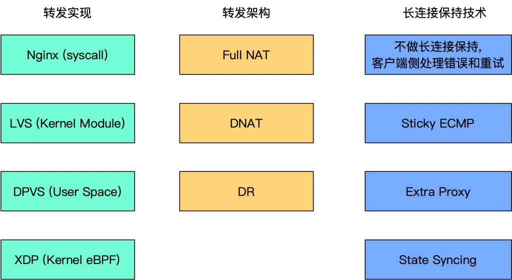

[javascript 中优雅创建并初始化数组](https://darkyzhou.net/articles/js-array-creation)

> 读这篇内容之前，一直都是用 `Array.from({ length: N })` 的方式创建数组，读完才知道为什么这样创建方式会好（优雅、高效）
>
> 底层原因：V8 对于带洞数组的性能可能劣于紧密数组，所以尽可能创建紧密数组
>
> 不过，“尽管这项事实可能会随着 V8 引擎的不断优化变得越来越难以在生产环境中发生。如果你创建的数组都很小，或者不关心性能问题，那么你还是可以继续坚持自己最喜欢的方法。”

[Dan 的 'The Two Reacts'](https://overreacted.io/the-two-reacts/)

> 一篇抛砖引玉的 blog，两个 react（client side 和 server side）。主要还是在抽象的讲 ssr with RSC 吧，后面还会有更深入的 blog...

[react 状态管理库 unstated-next](https://github.com/jamiebuilds/unstated-next)

> 目前团队中大量使用的 react 状态管理，非常小，源码非常简单，只是对 React context 进行了 API 封装
>
> BTW 这个作者还是 react-loadable、[the-super-tiny-compiler](https://github.com/jamiebuilds/the-super-tiny-compiler) 的作者，非常大佬！

[CSS 方案新轮子 style x](https://stylexjs.com/docs/learn/thinking-in-stylex/)

> 不是一个新框架，而是一套 css 范式（css in js），一套编译时的方案，框架无关
>
> 目的是提供更好的 css 书写 api，类型，Readability & maintainability & Predictable
>
> meta 开源的。

【好文】[You Dont Know TypeScript](https://github.com/darkyzhou/You-Might-Not-Know-TypeScript)

> 我司员工深度 TS 好文，介绍了很多有用的 TS 技巧，适合进阶学习

[ChatGPT 对话交互为什么用 EventSource](https://juejin.cn/post/7246955055109210149?searchId=20231121104446F4330D16F78C127044C6)

> `Websocket`v.s.`EventSource`
>
> `EventSource`专注于服务器向客户端主动推送事件的模型，这对于`ChatGPT`对话非常适用。`ChatGPT`通常是作为一个长期运行的服务，当有新的回复可用时，服务器可以主动推送给客户端，而不需要客户端频繁发送请求。
>
> ChatGPT 是通过自己重写方法来发起 POST 请求的，微软官方提供了这个[库](https://github.com/Azure/fetch-event-source)

[Building A JavaScript Testing Framework 动手做一个 js 测试框架](https://cpojer.net/posts/building-a-javascript-testing-framework)

> 在前端摸爬滚打几年，说实话单测没怎么研究过，借着这篇文章入门一下，动手写一个小测试框架
>
> 文章介绍了如何构建一个可用的 js 测试框架（参照的是 [Jest](https://jestjs.io/)）
>
> 前言先说一下 jest，他不仅是一个测试框架，而且还为搭建测试框架提供了多达 50 多个 package 的工具库
>
> 一个测试框架关键的几个步骤：
>
> 1. 高效的获取所有的测试文件（`xxx.test.ts`）
>    1. 可以用 `glob` 实现，or 直接使用 `jest-haste-map`，更好的配置使用、爬取整个项目、做了缓存、支持 watch
> 2. 并发执行所有测试
>    1. 用 nodejs worker or `jest-worker`，使用不同的 cpu 核
>    2. 在 worker 脚本中读取测试文件的 code，直接 eval 执行，收集测试结果
> 3. 使用断言框架（describe、`expect(1).toBe(1)`）
>    1. 这里其实比较 tricky，还记得我们写测试用例的时候，`describe`、`it`、`expect` 这些变量都是全局直接可用的，这其实就是独立提供了一个 js 运行上下文，也就是上面提到的 worker 的脚本环境
>    2. 使用 `expect` 库，也是 jest 的套件
>    3. `jest-circus` 提供了 `describe`，`it` 等方法
> 4. 每个测试独立上下文环境（全局变量/单例对象不互相影响）
>    1. Node 的 [`vm`](https://nodejs.org/api/vm.html) module 能提供代码沙箱环境的能力
>    2. Jest uses the [`jest-environment-node`](https://github.com/facebook/jest/tree/master/packages/jest-environment-node) package to provide a Node.js-like environment for tests.
>    3. 模拟 `require` 的实现
>
> 当然，这是最简单的测试框架（并还是基于 jest 提供的套件），一个好用测试框架也包含许多好用的功能
>
> [源码地址](https://github.com/cpojer/best-test-framework)

【好文】[漫谈四层负载均衡](https://www.kawabangga.com/posts/5301)

> 非常不错的一片文章，篇幅比较长，内容涵盖负载均衡、四层/七层技术、在负载均衡中的长链接保持、转发架构、负载均衡吞吐最大化、...
>
> 对于负载均衡，网络，服务实例的理解又深了一点
>
> recap：7 层网络模型
>
> 负载均衡：业务体量增大、复杂起来之后，部署的服务实例肯定不止一台，那么如何将流量均匀/合理的分配到各个服务实例上，就需要负载均衡服务器这一层来进行流量分配和转发。文中提到几种方式，DNS 回复多个 IP 地址（服务发现）、反向代理 ECMP Equal Cost Multi-Paths
>
> 七层/四层？：
>
> - 七层负载均衡：通过解析完整的网络包（到最后一层应用层）来决定如何进行流量的分配
> - 四层：只解析到第四层，消耗的性能和资源更少
>
> 一个七层的 LB（load balance）够不够？为什么在七层之前还要再加一个四层的
>
> - 是可以。四层的优势在于，它的工作更少，所以速度更快。
>
> **建议完整阅读，涵盖很多知识点，而且还挺有意思，找个空闲的下午，泡杯咖啡/茶**
>
> 
>
> BTW，真想有机会实践一下，毕竟纸上得来终觉浅。。。

[部署 Django 项目为什么需要 Nginx uWsgi 这种东西](https://www.kawabangga.com/posts/2941)

> 依旧是上一篇大佬（捕蛇者说的主持人之一！）的文章，几年前刚开始写 web，就用的 python 的服务端 http 框架，主要是 flask，django 也用过。部署的时候也不是很明白，就按照教程操作安装 uwsgi、nginx，用 uwsgi 启动服务应用，再用 nginx 来将接口代理到 uwsgi 的端口来实现对公网 ip 的暴露。
>
> 分层部署：
>
> - Django/Flask 只是 http 框架，更聚焦业务实现
> - 动态网站问世的时候，就出现了 CGI 协议。注意这是一个协议，定义了 HTTP 服务器如何通过后端的应用获取动态内容。可以简单的理解成 HTTP 服务器通过 CGI 协议调用后端应用吧！WSGI 可以理解成 Python 的 CGI。uWSGI 和 Gunicorn 是这种 WSGI 的一些实现。
> - Nginx 是通用的 web 服务器，专业，feature 多（不多赘述了）

[ts-pattern](https://github.com/gvergnaud/ts-pattern)

> TypeScript 的模式匹配库，减少 `if else` 面条代码，让代码更简洁、可读性更高
>
> - 所有数据类型支持
> - TypeScript 支持
> - **Exhaustiveness checking**，可穷尽所有 case 分支，by `.exhasutive()`
>   - 会比 `switch case` 中写 `never` 赋值更加方便
> - tiny 2kb
>
> 便捷的 APIs：
>
> - `P.select()`
> - `P.not()`
> - `P.when()`
> - `P._`
>
> Functional Language 中的 [pattern matching](https://stackoverflow.com/questions/2502354/what-is-pattern-matching-in-functional-languages)

[纯 CSS HSL Picker](https://codepen.io/shuding/pen/bGZgZvK)

> 出自 shuding
>
> 纯 CSS 实现，非常惊艳，太无敌了
>
> BTW 通过 HTML 标签 [`input type="color"`](https://developer.mozilla.org/en-US/docs/Web/HTML/Element/input/color) 也可以实现
