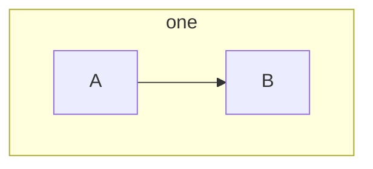
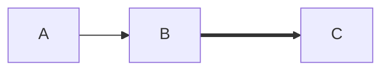
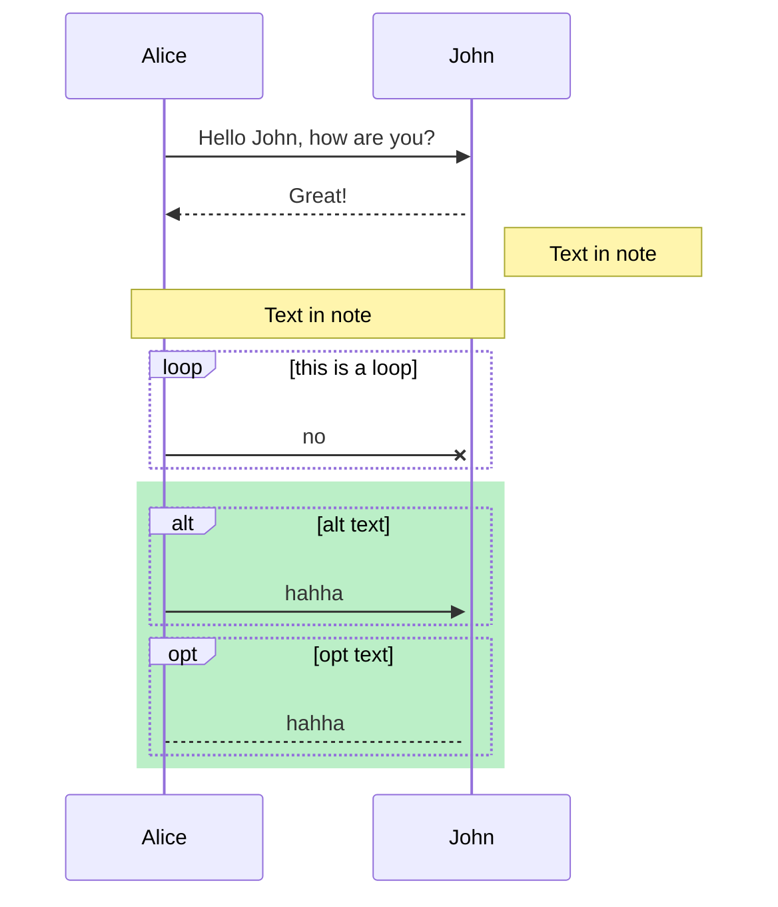
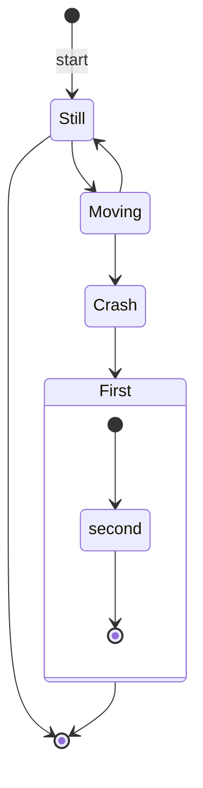
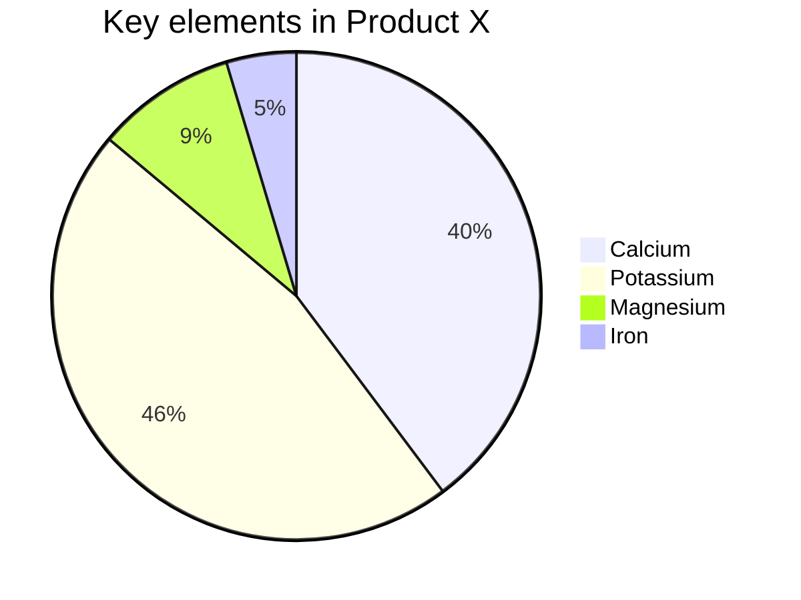
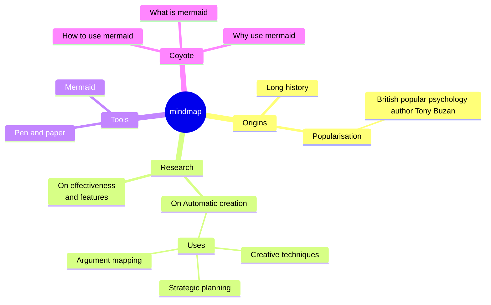

# typora with Mermaid

知乎教程：https://zhuanlan.zhihu.com/p/172635547

Mermaid-js: [github](https://github.com/mermaid-js/mermaid)、[官方文档](https://mermaid-js.github.io/mermaid/#/)

在 Typora 上画各种图？显然 typora 编辑器没那么强大的功能（拖拖拽拽），内部是集成了 mermaid-js 来实现的。

### Mermaid-js

> Mermaid is a Javascript based diagramming and charting tool that uses Markdown-inspired text definitions and a renderer to create and modify complex diagrams. The main purpose of Mermaid is to help documentation catch up with development.

js based，所以在有 webview 的地方都能集成，很多基于 markdown 的 blog 模板方案中都集成了。

目标：Mermaid addresses this problem by cutting the time, effort and tooling that is required to **create modifiable diagrams and charts**, for smarter and more reusable content.

通过编程的方式来制作图表，如何使用我们直接看在 typora 中的表现吧，具体的语法和样例在官方文档。

Mermaid 支持几乎所有的图表

- [Flowchart](https://mermaid-js.github.io/mermaid/#/flowchart)
- [Sequence diagram](https://mermaid-js.github.io/mermaid/#/sequenceDiagram)
- [Class Diagram](https://mermaid-js.github.io/mermaid/#/classDiagram)
- [State Diagram](https://mermaid-js.github.io/mermaid/#/stateDiagram)
- [Entity Relationship Diagram](https://mermaid-js.github.io/mermaid/#/entityRelationshipDiagram)
- [User Journey](https://mermaid-js.github.io/mermaid/#/user-journey)
- [Gantt](https://mermaid-js.github.io/mermaid/#/gantt)
- [Pie Chart](https://mermaid-js.github.io/mermaid/#/pie)

#### 基本语法

注释 `%% comment`

变量用空格分开

### Mermaid in Typora

输入 **```mermaid** 然后敲击回车，即可初始化一张空白图。

#### 流程图

> 关注节点类型、联系

`graph <direction>`

direction:

- TB - top to bottom
- TD - top-down/ same as top to bottom
- BT - bottom to top
- RL - right to left
- LR - left to right

Node：

- `id[text]`

- 节点的样式（矩形、椭圆...）通过 text 的括号组合决定

连接线：

- 箭头、粗细、样式
- 文字
- 连接方式

看下面的例子吧～

```mermaid
graph LR %% TB: top -> bottom TD: top -> down LR: left -> right
	A([text in node shape]) --> B((yesok))
	A ==> D>looks like]
	D -.->|text| C[(Database)]
	B -.-> C --- E{rhombus} ---|text on link| F %% or -- xxx ---
	B ----> E & F %% 简写重复的连接
	linkStyle 1 stroke:#ff2234,stroke-width:5px,color:blue;  %% link 没有 id 所以通过他出现的 index 来定制样式（0开始）
	linkStyle 5 stroke:#3344fe,stroke-width:2px,color:blue;
	style A fill:#bbf,stroke:#f66,stroke-width:2px,color:#fff,stroke-dasharray: 5 5 %% 定制 node 的样式可以用 id
```

subgraph



interaction

让 node 有交互的能力，执行一段 js 或者打开链接



附上在 html 中引入的例子

```html
<body>
  <div class="mermaid">
    graph LR; A-->B; click A callback "Tooltip" click B "http://www.github.com"
    "This is a link"
  </div>

  <script>
    var callback = function () {
      alert("A callback was triggered");
    };
    var config = {
      startOnLoad: true,
      flowchart: {
        useMaxWidth: true,
        htmlLabels: true,
        curve: "cardinal",
      },
      securityLevel: "loose",
    };

    mermaid.initialize(config);
  </script>
</body>
```

#### 时序图

`sequenceDiagram`

participant：理解为对话者吧

message：`[Actor][Arrow][Actor]:Message text`

Arrow：`-->`, `->`, `--x`

activate：激活一段时间（typora 中好像失效了）

Notes：可以控制 note 出现的位置

loop：展示循环体

alt & opt：标记展示子图

Background Highlighting：背景高亮，通过 rect 来配背景色



#### 状态图

> 描述系统有限状态变化

`stateDiagram-v2`

State：复杂一点的命名 `state "This is a state description" as s2`

start & end：`[*]`

composite state：嵌套 state



#### 饼图

`pie`



#### Mindmaps

[typora 1.5 支持](https://support.typora.io/What's-New-1.5/)，很棒啊，用 mermaid 就很符合直觉


