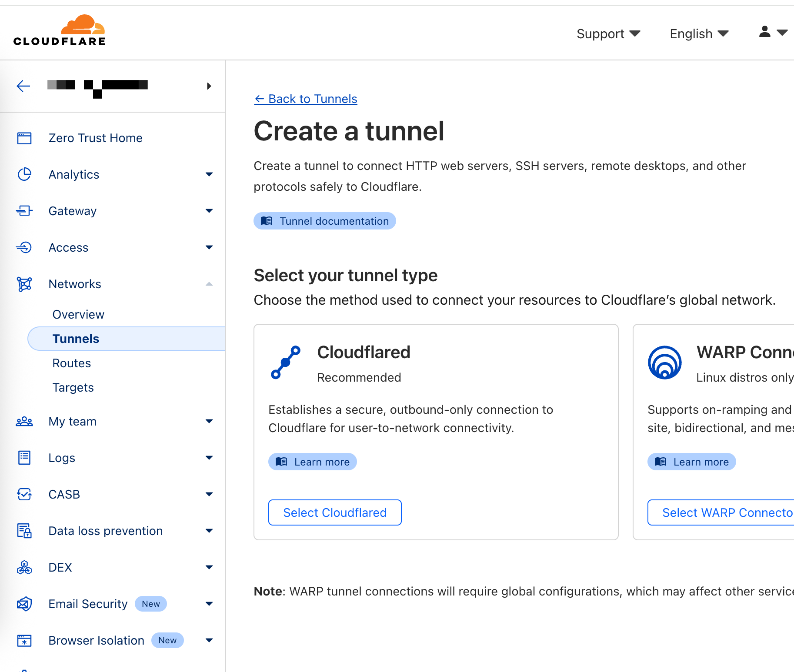
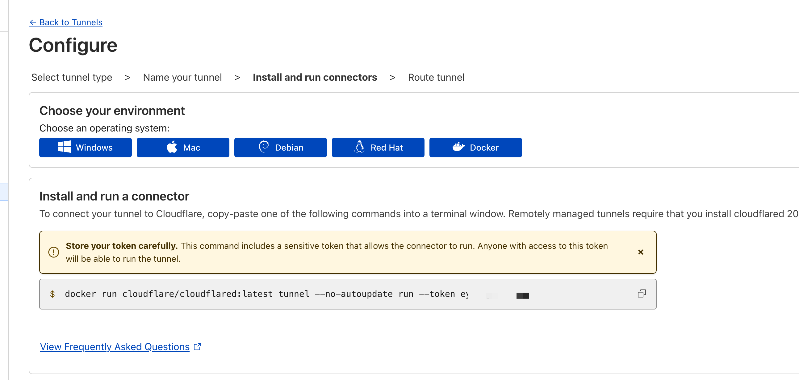
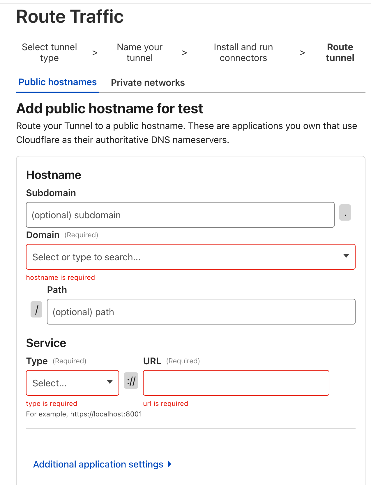
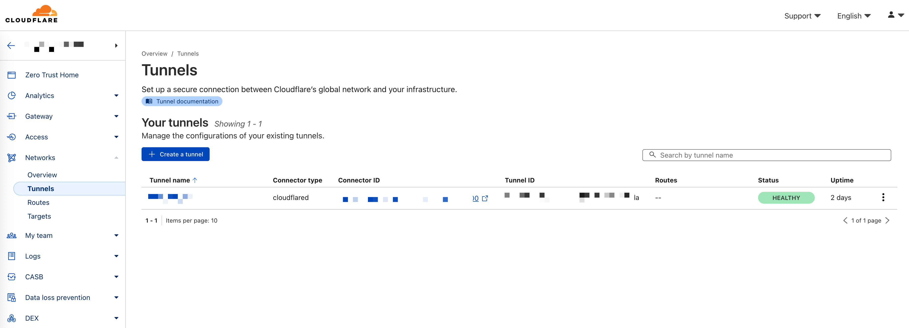
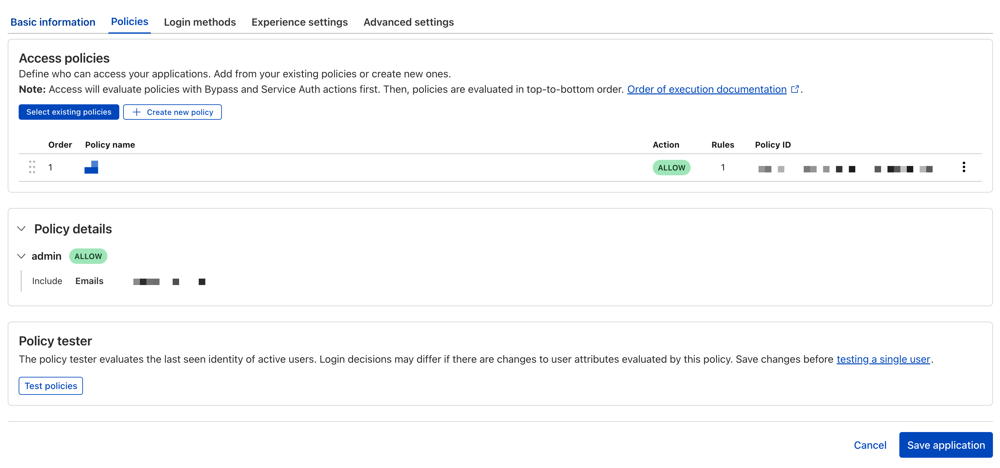
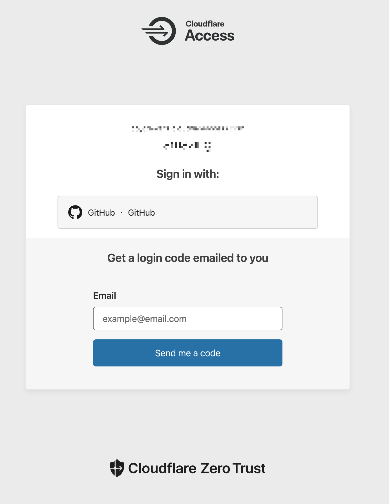
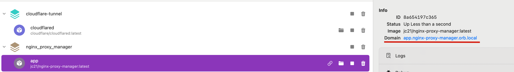

# 低成本实现内网穿透

## TL;DL

记录一下使用 mac mini 作为家庭服务器，结合 nginx proxy manager(npm)、docker(orbstack)、cloudflare 实现的内网穿透方案，在外也能上网回家。

同时，新增的自托管服务可以通过 npm 轻松管理，无需频繁设置 cloudflare。

## Prerequisite

> 所需的硬件支持：mac mini
>
> 所需的软件支持：
>
> - [OrbStack](https://github.com/orbstack/orbstack)
> - [NginxProxyManager](https://github.com/NginxProxyManager/nginx-proxy-manager) (npm)
> - 自己在 mac mini 上部署的 docker 服务
> - 科学上网
>
> 所需的服务支持：
>
> - Cloudflare：Zerotrust

## 1. 注册 Cloudflare 的 Zero Trust

这一步还挺多教程的，随便贴[一个](https://surge.tel/13/2116/)

注意：个人使用的话，free plan 的 50 个 seat 足够了（zerotrust 登录成功一个 user 就算一个），免费不要钱

最好再买一个域名，便宜的就行，就自己用，用来绑定域名的 CNAME 记录到 Cloudflare 的 tunnel，可以直接在 CF 买，联动体验会比较好。

## 2. 启动 NginxProxyManager 服务

前提是 Orbstack 是启动了的，具体教程看官网吧，很简单

npm 的部署直接参考[官方教程](https://nginxproxymanager.com/guide/)，进入 `127.0.0.1:81` 的 UI 界面进行帐号密码的更新，本地 localhost 的 80 端口即有一个 nginx 反向代理的服务在跑了，稍后我们再配置 npm 所需代理的你自己的服务。

同时也可以在 Orbstack 中看到容器实例

## 3. 创建 Cloudflare 的 tunnel

这一步是将 mac mini 的本机 80 端口交给 cloudflare 来暴露到互联网可访问

在 Networks -> Tunnels 中创建一个 tunnel



选择 Cloudflared，选择 docker connector，会给到一个 unique token



此时可以通过 docker compose 来跑在 Orbstack，在自己的目录下建立一个 `docker-compose.yml`

```yaml
services:
  cloudflared:
    image: cloudflare/cloudflared:latest
    container_name: cloudflared
    restart: unless-stopped
    command: tunnel run
    environment:
      - TUNNEL_TOKEN=<把你自己的 token 写这里>
    volumes:
      - ./config:/etc/cloudflared
    network_mode: "host"
```

接着运行 `docker-compose up -d`，可以在 Orbstack 中看到你的这个服务了。

接着回到 CF 进行下一步，填写公网域名，**在 subdomain 可以随便先写一个值，后面还需要改成同配符 `*`**。Service 写你的 npm 服务即可 `http` 协议，`localhost:80`（感谢 cloudflare 的 tunnel 是可以暴露本机的 80 端口的）

**但是有些情况可能就不太能配成通配符了，npm 代理的所有请求可能都需要是 http/tcp，对于 ssh 回家的连接，就需要单独配置域名了。CF 只对一级子域名提供 https 支持，所以 `ssh.xxx.domain.com` 这样也不太能实现。不过配置 CF 和 npm proxy 也不繁琐**

如果是 CF 买到域名，会自动创建一条 Record，将这个 subdomain 指向你的 cloudflare tunnel 的服务地址。



保存后 tunnel 创建成功，HEALTHY 状态



## 4. 修改 DNS 记录

回到你的 Cloudflare 首页（注意不是 zero trust 主页），找到你的域名，从 Quick actions 可以进到 DNS 配置，找到这条指向 tunnel 服务的 CNAME 的记录，将 name 改成通配符 `*`（Cloudflare 的域名是可以这样的）

再回到 tunnel，进入 edit 页，将 subdomain 也改成 `*`

_如果是其他家的域名，可以直接尝试设置 `_` 作为 CNAME 和 subdomain，不用来来回回跳转，这里只是偷懒想让 cf 自己帮我创建 CNAME Record。\*

## 5. 连接到 Zero Trust

在 Access -> Applications 中新建一个 application，选择 self-hosted，设置名称和会话时间后，增加一条 public hostname，选择刚才注册的域名，subdomain 也填写 `*`

创建完成之后，可以回到这个应用，为其增加一个 policy，来限制可访问你站点的用户。比如我这里的一条 policy，只限制了邮箱是我自己的，那他会对应上 Login methods 中的登录方式（one-time PIN 或者 github）只能限制这个邮箱登录成功。

登录方式可以在 Zero Trust -> Settings 的最下方增加，有对应教程提示，这里就不展开了。



完成后，第一次访问你的任意子域名 `any.domain.name`，就会进入到认证界面



## 6. 托管子服务

上面的步骤都完成后，我们就已经完成了从外网到内网的通路，同时还包含了 CF ZeroTrust 提供的安全能力，同时，我们也做到了任意二级域名的访问都会走到 mac mini 上的 npm 服务（nginx）

现在就只需要配置我们的服务到 npm 的反向代理即可。

非常简单，首先进到 `localhost:81` 的 npm 管理界面，在 Proxy Hosts 中增加一条记录

1. 域名，写你想配置的子域名，比如 `blog.domain.name`，根域名就是你配置 tunnel 所绑定的
2. 协议选择 http，hostname 和 IP 要注意了，如果其他的服务也是在当前主机上部署的，直觉上我们会直接用 localhost + 端口去访问，但这样跑不通，因为 npm 也是在一个容器内，他访问 localhost 或者 127.0.0.1 就是访问自己，结果会落到自己的健康检测，并不会走到预期上我们部署的服务

   **不过 Orbstack 提供了非常好用的 [feature](https://docs.orbstack.dev/docker/domains)，会给部署的服务提供一个域名，可以直接在服务上看到**

   

   这样，我们只需要将你想部署的服务的域名拿到，填写到 npm 的域名即可，端口默认是 80，可以开启 cache assets，ws 等

3. 不需要开 SSL，因为 cf 已经帮我们做了
4. 保存后，npm 上就多了一条记录，可以访问域名试试，登录过 zerotrust 后，看看是否走到了你所需要部署的服务

OK，后续要增加服务就只需要修改 npm 的代理策略即可。

## 小结

至此，我们已经可以将本机的服务对外暴露了，并且能灵活配置不同子域名，并能通过 cf 的 zerotrust 进行安全防护。当然这个方案可能不是最优的，传输效率可能会慢。但成本较低，操作性也高。

提示：cf 在国内的网络可能不太能走通，最好还都是走科学上网
