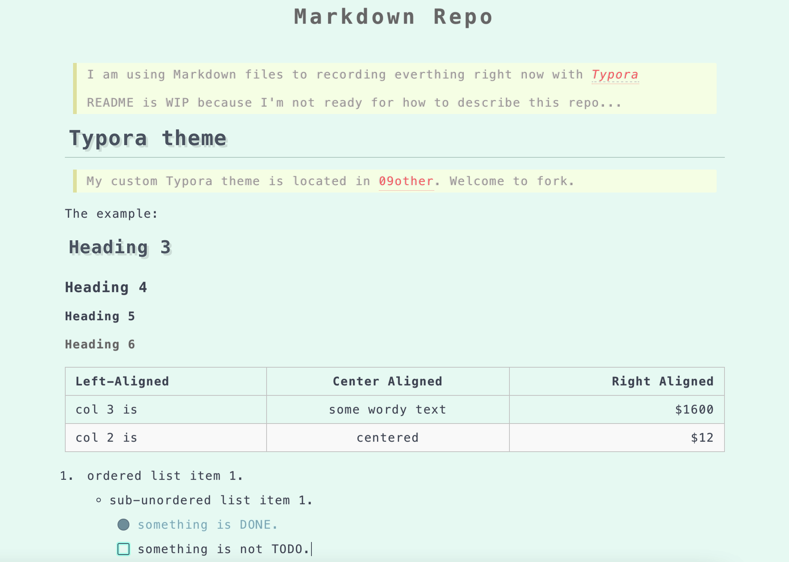

# Markdown Repo

> I am using Markdown files to record everything right now in both _[Typora](https://typora.io/)_ and _[Obsidian](https://obsidian.md/)_.
>
> README is WIP because I'm not ready for how to describe this repo...

## 🎉 [Doc Site](https://portfolio.coyotedemon.xyz/)

> See more details in [project design](./12project/doc_site_portfolio/index.md)

Some parts of this repo are synchronized(every push) to [_my portfolio site_](https://portfolio.coyotedemon.xyz/), an online doc site for better reading and content retrieval!

I m still beautifying and enrich the content of the site. And thanks to [Nextra](https://github.com/shuding/nextra) and [Nextjs](https://nextjs.org/) for rich features, great DX and UX.

## 📝 Typora theme

> My custom Typora theme is located in [09other](./09other/typora_themes). Welcome to fork.

The example:

