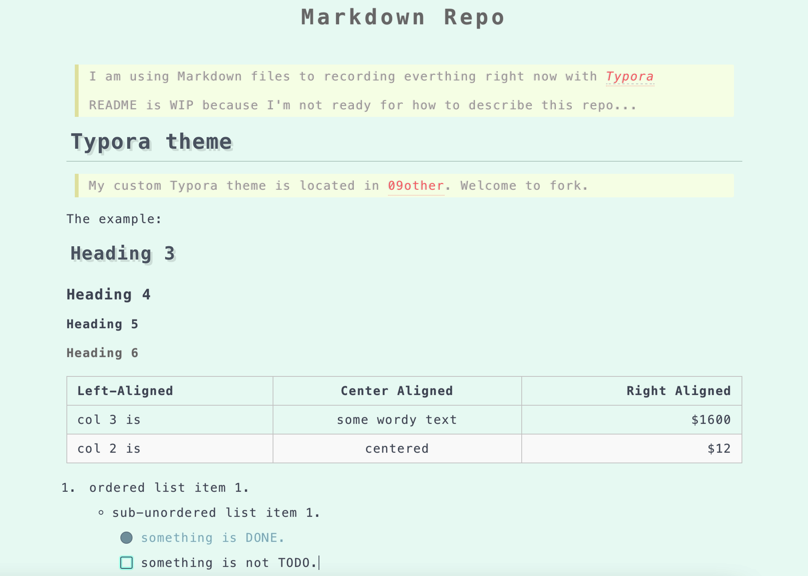

# Markdown Repo

> I am using Markdown files to recording everthing right now with *[Typora](https://typora.io/)*
>
> README is WIP because I'm not ready for how to describe this repo...

## Typora theme

> My custom Typora theme is located in [09other](./09other/typora_themes). Welcome to fork.

The example:

